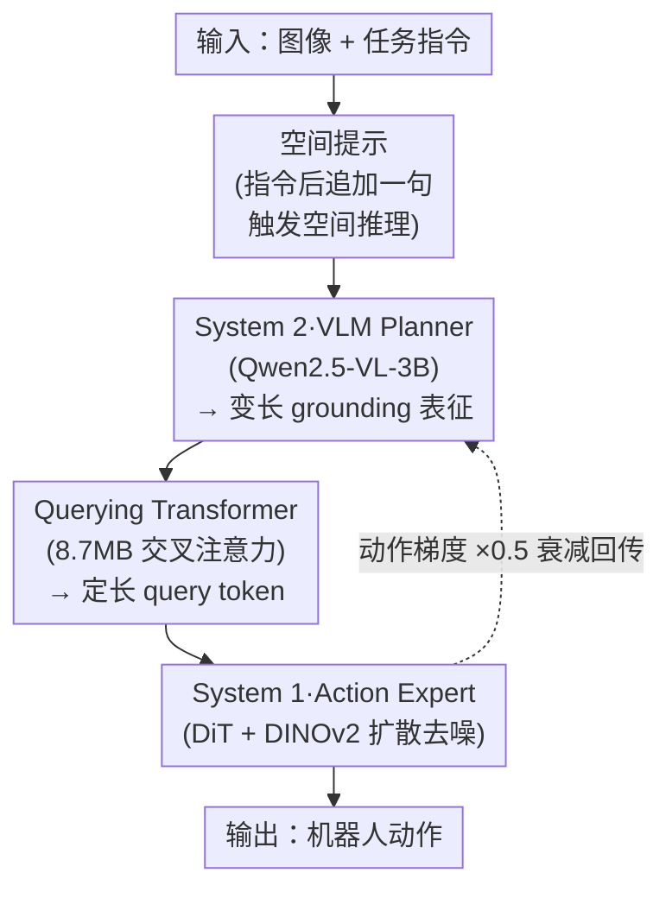

# ST4VLA: Spatially Guided Training for Vision-Language-Action Models

**会议**: ICLR 2026  
**arXiv**: [2602.10109](https://arxiv.org/abs/2602.10109)  
**代码**: [https://internrobotics.github.io/internvla-m1.github.io](https://internrobotics.github.io/internvla-m1.github.io)  
**领域**: 机器人  
**关键词**: Vision-Language-Action, 空间引导训练, 双系统架构, 扩散策略, 机器人操控  

## 一句话总结

提出 ST4VLA，通过两阶段空间引导训练（spatial grounding pre-training + spatially guided action post-training），将 VLM 的空间先验显式注入 VLA 策略学习，在 SimplerEnv 上将 Google Robot 成功率从 66.1% 提升至 84.6%，WidowX 从 54.7% 提升至 73.2%，达到 SOTA。

## 研究背景与动机

**VLM → VLA 的核心鸿沟**：大规模视觉-语言模型在多模态理解上表现优异，但直接迁移到具身控制时，需要将文本指令转化为低层电机动作，文本-动作对在标准 VLM 数据中极度稀缺。

**空间先验的重要性**：物体识别、affordance 定位、视觉轨迹推理、相对位置感知等空间先验是机器人操控的可迁移通用知识，但现有方法未能有效利用。

**层级系统的局限**：传统层级式方法（如使用 SAM/DINO 外接 foundation model）依赖规则化任务分解和手工设计的规划启发式，难以自动扩展到复杂多样任务。

**端到端 VLA 的过拟合问题**：数据驱动的 VLA（如 OpenVLA、π₀）直接从预训练 VLM 微调学习控制，但容易过拟合低层运动模式，未能充分利用空间先验。

**朴素共训练方法的梯度冲突**：作者实验发现，直接将空间数据与动作数据联合训练（vanilla co-training）会导致空间感知与动作学习目标之间的梯度方向不一致（PSS 仅 0.25），引起不稳定震荡。

**空间先验在微调后坍塌**：直接将 VLM 微调为 VLA 后，RefCOCO-g 性能在 20k 步内急剧下降至近随机水平，说明动作训练会严重破坏已有空间表征。

## 方法详解

### 整体框架

ST4VLA 是一个基于 Qwen2.5-VL-3B 的双系统 VLA：System 2（VLM Planner）作为"慢而可靠"的多模态推理器，捕获空间与语义先验、负责高层规划；System 1（Action Expert）是一个轻量扩散 Transformer（DiT）配 DINOv2 视觉编码器，负责具身特定的快速运动控制。一次推理里，图像和任务指令先被追加一句**空间提示**唤醒 VLM 的空间感知，VLM 据此吐出变长的空间 grounding 表征，经一个仅 8.7MB 的 **Querying Transformer** 压成定长 query token 作为条件信号灌进 Action Expert，由后者扩散去噪出机器人动作；训练时动作损失会沿这条链反传回 VLM，**梯度衰减**负责把这股梯度按比例缩小，保护 VLM 已有的语义能力不被动作目标冲垮。整套流程再叠加两阶段训练（先空间 grounding 预训练、后空间引导动作后训练），把 VLM 里现成的空间知识平滑地灌进策略学习。

### 关键设计

**1. 空间提示：用一句追加文本唤醒预训练学到的空间感知**

直接把动作数据丢给 VLM 微调时，模型容易只盯着低层运动模式，预训练阶段攒下的空间能力被晾在一边。空间提示（Spatial Prompting）的做法极其轻量——在动作后训练时，于原始任务指令后面追加一句空间提示。例如指令 "store all toys into the toy box" 被扩展为 "Identify all relevant toys and their spatial relationships to the container."，更通用的写法是 "Figure out how to execute it, then locate the key object needed"。这句提示显式触发 VLM 走一遍空间推理，产出带空间线索的 latent grounding embeddings，相当于在动作生成前先给策略递上一份"物体在哪、彼此什么关系"的备忘，从而强化语义到运动的对齐，且不需要任何额外的中间表示生成模块。

**2. Querying Transformer：把变长空间表征压成定长 query 喂给动作模块**

VLM Planner 输出的是变长的 latent spatial grounding embeddings，而扩散动作头需要固定形状的条件输入，二者无法直接对接。作者用一个 $k$ 层交叉注意力模块充当转接器：让一组可学习的 query tokens 去 cross-attend VLM 的变长 grounding embeddings，把它们汇聚成固定数量的 token 再送进 Action Expert。这个模块整体只有 8.7MB，几乎不增加参数量，却让"慢系统"的空间推理结果能稳定地作为"快系统"的条件信号，避免了把整段 VLM 输出硬塞进 DiT 带来的接口错配。

**3. 梯度衰减：让动作目标别把 VLM 的语义能力学坏**

联合训练时，Action Expert 的动作损失会沿 Querying Transformer 反传回 VLM——实验发现这股梯度（Gradient Decay 针对的就是它）若不加约束，会和空间感知目标方向打架（vanilla co-train 时梯度一致性 PSS 仅 0.25），把 VLM 已有的空间表征冲垮（RefCOCO-g 在 20k 步内掉到近随机）。作者在 Querying Transformer 处插入一个梯度衰减因子（取 0.5），把反传到 VLM 的梯度按比例缩小：既保留了端到端联合优化的好处，又给 VLM 的语义推理能力留出保护层。配合空间引导后，PSS 从 0.25 升到 0.42，空间先验不再坍塌。

### 损失函数 / 训练策略

训练分两阶段。**Stage 1 空间 grounding 预训练**把 web 级视觉-语言 grounding 数据（RefCOCO、LLaVA-OneVision）和机器人特定数据集（RoboRefIt、A0、ST4VLA Data）统一成 QA 格式，用标准 SFT 训练 bounding box 检测、affordance 识别、轨迹预测，目标是先建立既通用又贴近机器人任务的空间表征。**Stage 2 空间引导动作后训练**把动作数据与空间 grounding 数据联合优化：VLM Planner 在图像-prompt 对上用自回归 next-token prediction loss（含空间 grounding 目标）更新，对动作数据则注入空间提示来增强语义-运动对齐；Action Expert 用 DiT 的扩散去噪损失学策略。两路监督联合反向，梯度衰减负责在反传时保护 VLM 参数不被动作目标带偏。

## 实验关键数据

### 主实验：SimplerEnv Benchmark

| 模型 | Google Robot VM | Google Robot VA | WidowX VM |
|------|----------------|----------------|-----------|
| RT-2-X | 46.3 | 54.4 | - |
| OpenVLA | 34.3 | 39.3 | 4.2 |
| CogACT | 74.8 | 61.3 | 51.3 |
| SpatialVLA | 75.1 | 70.7 | 42.7 |
| π₀ | 58.8 | 54.8 | 27.1 |
| GR00T N1.5 | 35.2 | 44.5 | 61.9 |
| Vanilla VLA | 66.1 | 63.5 | 54.7 |
| **ST4VLA** | **84.6** | **75.9** | **73.2** |

ST4VLA 在三个设定上全面 SOTA：
- Google Robot VM 比次优 CogACT 高 **+9.8%**
- Google Robot VA 比次优 SpatialVLA 高 **+5.2%**
- WidowX VM 比次优 GR00T N1.5 高 **+11.3%**

### 消融实验：训练策略对比

| 训练策略 | Google Robot VM/VA | WidowX VM | RefCOCO-g IoU@0.5 |
|---------|-------------------|-----------|-------------------|
| Vanilla VLA | 66.1/63.5 | 54.7 | 崩塌（近随机） |
| Vanilla Co-train | 70.2/66.5 | 61.1 | 47.1 |
| +Spatially Guided | 78.8/70.0 | 67.4 | 68.1 |
| +Spatially Pretrained (ST4VLA) | 84.6/75.9 | 73.2 | 71.2 |

- 空间预训练 + 空间引导共训练的叠加效果显著
- 梯度 PSS 从 vanilla co-train 的 0.25 提升至 spatially guided 的 0.42

### 真实世界 Pick-and-Place 泛化

| 模型 | In-dist. | 新实例 | 相似干扰 | 新背景 | 未见位置 | 未见方向 | 属性指令 | 空间指令 | 平均 |
|------|---------|-------|---------|-------|---------|---------|---------|---------|------|
| π₀ | 45 | 32 | 25 | 27 | 18 | 32 | 37 | 31 | 31 |
| GR00T N1.5 | 78 | 46 | 40 | 47 | 20 | 40 | 59 | 53 | 48 |
| **ST4VLA** | **92** | **62** | **49** | **63** | **52** | **72** | **73** | **61** | **65** |

ST4VLA 在所有 8 个泛化维度全面领先，平均成功率 65% vs GR00T 48% vs π₀ 31%。

### 长时序操控

在桌面整理、抽屉收纳、三明治制作等长时序任务上，ST4VLA 在分布内、物理干扰、任务重规划三个设定下均优于 GR00T N1.5 和 π₀，展现了双系统框架的任务分解和动态适应能力。

### 关键发现

1. 空间预训练是最关键的单一改进（VM +13.4%），空间提示在此基础上进一步增益
2. 梯度对齐分析（PSS）首次量化了空间与动作优化目标的一致性
3. 未见物体位置/方向的泛化提升尤为显著（位置 52% vs 20%/18%），说明空间先验有效提供了泛化基础

## 亮点与洞察

1. **空间先验坍塌现象的首次系统分析**：通过 RefCOCO-g 跟踪和 PSS 梯度对齐指标，清晰展示了 naive VLA 微调导致空间先验丧失的机制，并给出定量解释。
2. **空间提示的简洁有效性**：仅通过在指令后追加简单文本提示，即可显著提升空间-动作对齐，无需复杂的中间表示生成或额外模块。
3. **双系统双监督设计优雅**：System 1/2 的类比清晰，Querying Transformer 仅 8.7MB 极轻量，梯度衰减机制简单但关键。
4. **评估全面且具挑战性**：涵盖仿真基准、200 任务大规模 pick-and-place、真实世界 8 维泛化评估、长时序操控，评估设计具有说服力。
5. **统一框架的扩展性**：空间 grounding 预训练的数据来源广泛（web-scale + robot-specific），训练流程可复用到不同具身形态。

## 局限性

1. **VLM backbone 固定为 Qwen2.5-VL-3B**：3B 参数相对较小，未验证更大模型（7B/72B）能否进一步提升效果或突破天花板。
2. **空间提示的设计偏手工**：虽然有效，但空间提示模板固定，未探索自动化提示生成或自适应提示策略。
3. **实验平台有限**：主要在 Franka 单臂机器人上验证，未涉及灵巧手、双臂、移动操控等更复杂具身形态。
4. **推理效率**：双系统架构（VLM + DiT + DINOv2）的推理延迟和实时性未分析，是否满足实际部署要求存疑。
5. **与 π₀ 的数据公平性**：π₀ 和 GR00T 使用了更大规模的预训练动作数据，直接比较不完全公平（尽管作者在 200 任务实验中做了对齐）。

## 相关工作

- **层级式机器人系统**：SayCan、Code as Policies 等依赖规则任务分解，灵活性不足
- **端到端 VLA**：RT-2、OpenVLA、π₀、CogACT 直接学动作但忽略空间先验
- **空间推理 VLA**：SpatialVLA 引入空间表示但无空间提示引导；Magma 有空间预训练但无空间引导后训练
- **显式推理 VLA**：ECOT（文本规划）、CoT-VLA（视觉链式思维）、OneTwoVLA（交替思考/执行）
- **本文定位**：ST4VLA 统一了空间预训练和空间引导后训练，通过梯度对齐实现端到端优化，不依赖显式中间表示

## 评分

- 新颖性: ⭐⭐⭐⭐ （空间提示 + 梯度对齐的组合思路新颖，PSS 分析有理论洞察）
- 实验充分度: ⭐⭐⭐⭐⭐ （仿真/真实/大规模/长时序/泛化多维度全面评估）
- 写作质量: ⭐⭐⭐⭐ （结构清晰，motivation 到方法再到实验逻辑通畅）
- 价值: ⭐⭐⭐⭐ （空间引导训练范式对 VLA 社区有重要参考价值，但需验证更多具身形态的适用性）

<!-- RELATED:START -->

## 相关论文

- [\[ICLR 2026\] MemoryVLA: Perceptual-Cognitive Memory in Vision-Language-Action Models for Robotic Manipulation](memoryvla_perceptual-cognitive_memory_in_vision-language-action_models_for_robot.md)
- [\[CVPR 2026\] QuantVLA: Scale-Calibrated Post-Training Quantization for Vision-Language-Action Models](../../CVPR2026/robotics/quantvla_scale-calibrated_post-training_quantization_for_vision-language-action_.md)
- [\[ICLR 2026\] From Spatial to Actions: Grounding Vision-Language-Action Model in Spatial Foundation Priors](from_spatial_to_actions_grounding_vision-language-action_model_in_spatial_founda.md)
- [\[ICLR 2026\] TwinVLA: Data-Efficient Bimanual Manipulation with Twin Single-Arm Vision-Language-Action Models](twinvla_data-efficient_bimanual_manipulation_with_twin_single-arm_vision-languag.md)
- [\[CVPR 2026\] MoEActok: A MoE-based Action Tokenizer for Vision-Language-Action Models](../../CVPR2026/robotics/moeactok_a_moe-based_action_tokenizer_for_vision-language-action_models.md)

<!-- RELATED:END -->
