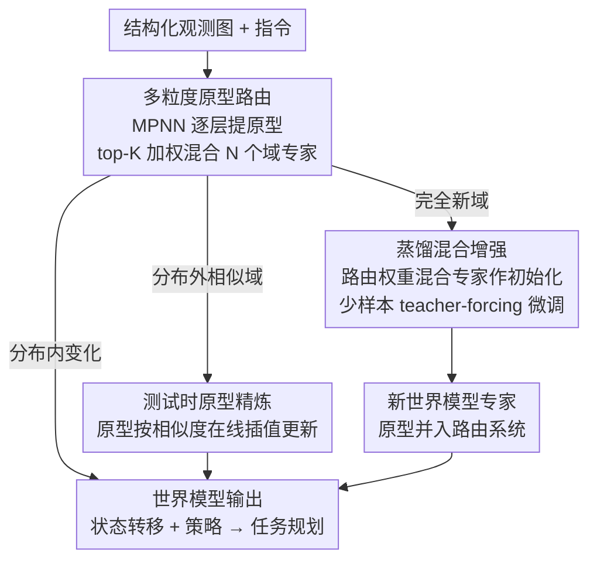

# Test-Time Mixture of World Models for Embodied Agents in Dynamic Environments

**会议**: ICLR 2026  
**arXiv**: [2601.22647](https://arxiv.org/abs/2601.22647)  
**领域**: 机器人 / 具身智能

## 评价

⭐⭐⭐⭐

这篇论文将 MoE 的静态路由推广为**测试时可训练的路由**——这一概念迁移本身很有价值。三个技术组件（多粒度原型路由、测试时精炼、蒸馏增强）形成了"即时适应 → 在线优化 → 长期扩展"的完整闭环，覆盖了部署后遇到的从相似域到全新域的不同适应需求。实验覆盖三个仿真基准 + 真实 Franka 机器人，零样本场景平均 SR 提升 27%，说服力强。主要局限在于 (1) 依赖结构化图观测，给定原始像素输入需要额外感知模块；(2) 底层 LLM 规模较小（Llama-3.2-1B/3B），性能天花板可能较低。

---

## 背景与动机

基于语言模型的具身智能体正快速落地于家庭、工厂、虚拟环境等场景。现有代表方案包括代码驱动策略（Code as Policies）、奖励引导（Language to Rewards）、LLM+领域模型（SayCanPay）和上下文学习（LLM-Planner）。然而这些方法面临一个**根本矛盾**：

> 真实部署环境在时间和空间上持续变化，但智能体的能力在训练后即被冻结。适应新域的唯一途径是全量重训练（计算与数据代价高昂），或上下文学习（推理时上下文窗口膨胀）。

MoE 架构虽然通过专家模块实现了结构化模块性，但其路由函数在训练后固定，无法在部署后重新配置专家组合。TMoW 的核心洞察是：**让路由函数在测试时可更新**——不改变专家权重本身，而是改变"谁被选中、以什么比例混合"。

---

## 方法

### 整体框架

TMoW 在基座模型 $M$ 上以 LoRA 形式挂载 $N$ 个领域适配器 $\{m_j\}_{j=1}^N$，每个适配器是一个域的世界模型（状态转移 + 策略）。智能体每收到一帧结构化观测和指令，先由一个 MPNN 图处理器逐层提取**多粒度原型**，每层独立用原型与当前嵌入的相似度计算路由分数、选 top-K 专家加权混合输出——这就是 TMoW 的"路由器"。与传统 MoE 不同，这套路由不在训练后冻结，而是在测试时随域的陌生程度走两条不同的更新路径：遇到分布外但仍相关的相似域，就在线**精炼原型**、组合出新的专家配比；遇到完全没见过的新域，就用路由权重**蒸馏混合**出一个全新专家并入系统。三个机制因此覆盖了"分布内变化 → 分布外相似域 → 完全新域"的整条适应谱，全程不改专家权重本身、无需重训练。

### 关键设计

**1. 多粒度原型路由：让"谁被选中"匹配到合适粒度的域知识**

传统 MoE 用单一全局表征做路由，但具身场景里"这个抽屉能不能打开"是物体级问题、"这是厨房还是卧室"是场景级问题，单粒度匹配会丢信息。TMoW 让 MPNN 在观测图 $\mathcal{G}^{(o)}$ 上逐层聚合邻居，每层 $l$ 的原型由 mini-batch 内所有观测取期望得到 $\boldsymbol{p}_j^{(l)} = \underset{(i,\vec{\tau})\in\mathcal{B}}{\mathbb{E}} \underset{(o,\cdot,\cdot)\in\vec{\tau}}{\mathbb{E}} [ f^{(l)}(\mathcal{G}^{(o)}, i) ]$，于是浅层原型编码局部物体可达性、深层原型编码全局场景结构。关键是聚合时用了上下文感知边矩阵 $\tilde{\boldsymbol{E}}^{(l)} = (\boldsymbol{A}+\boldsymbol{I}) \odot \boldsymbol{R} \odot f_\text{adj}^{(l)}(\boldsymbol{H}^{(l-1)}, i)$，其中调整函数 $f_\text{adj}$ 通过交叉注意力（观测节点特征与指令嵌入做 QK 交互）让指令动态调节邻居聚合，使路由对"当前任务关心什么"敏感。最终每层路由分数取当前输入嵌入 $\mathcal{E}^{(l)}$ 与各原型的余弦相似度，再 top-K 稀疏化、softmax 归一化得到混合权重 $\bar{w}_j^{(l)} = \text{softmax}(\text{top}_K(\text{sim}(\mathcal{E}^{(l)}, \boldsymbol{p}_j^{(l)})/\tau))$。这天然形成"浅层高熵、多专家共享物体知识，深层低熵、专家特化场景结构"的分工，比单粒度路由更能对上域。

**2. 测试时原型精炼：在线挖出已有世界模型里没用上的知识碎片**

遇到没见过但仍与已有域相关的新环境时，固定原型会把这个域误判为最近的某个旧域、用错专家组合。TMoW 让原型随交互中获得的嵌入 $\mathcal{E}^{(l)}$ 在线更新：$\bar{\boldsymbol{p}}_j^{(l)} = (1 - \alpha s_j) \boldsymbol{p}_j^{(l)} + \alpha s_j \Delta \boldsymbol{p}_j^{(l)}$，其中 $s_j = \text{sim}(\mathcal{E}^{(l)}, \boldsymbol{p}_j^{(l)})$ 是该原型与新域的相似度、$\alpha$ 是精炼率，精炼项 $\Delta \boldsymbol{p}_j^{(l)} = \sum_{k=1}^N \bar{r}_{j,k}^{(l)} \boldsymbol{p}_k^{(l)}$ 是所有原型按彼此相似度加权的插值。直觉上，越像新域的原型被挪动越多，挪动方向取自其他原型的"邻域共识"，效果是把原型空间往新域所在的高频区域密集化、扩展覆盖，让路由器组合出此前从未被激活的专家配比，相当于从已有世界模型里拼出新知识。这一步只增加约 43ms 延迟，不动专家权重。

**3. 蒸馏混合增强：少样本下从已有专家蒸出一个全新世界模型**

当新环境与所有已见域都差得很远、精炼也救不回来时，就得真正长出一个新专家，但从零训练既慢又费数据。TMoW 用路由权重把已有适配器加权混合作为初始化，再在少样本示范 $\mathcal{D}'$ 上用 teacher-forcing 损失微调：$m'^{(l)} = \sum_{j=1}^N \bar{w}_j^{(l)} m_j^{(l)} - \eta \nabla_{m'^{(l)}} [ \mathbb{E}_{(\cdot,\vec{\tau}')\in\mathcal{D}'} \mathcal{L}_\text{TF}(M \oplus m', \vec{\tau}') ]$。新模型的原型同样从这批少样本数据里提取，和已有原型一起纳入路由系统，框架结构不变。由于初始化已经携带了跨域共享知识，相比从零训练数据需求减少 40%，1-shot 就能起效。

---

## 实验

### 实验设置

- **环境**: VirtualHome（78 任务×20 场景）、ALFWorld（6 任务类别×4 场景）、RLBench（4 任务×6 场景）、真实 Franka Research 3 机器人
- **基线**: ZSP（零样本）、LLM+FT（全量微调）、LLM-Planner（上下文学习）、FLARE（环境感知重规划）、SayCanPay（启发式代价规划）
- **模型**: TMoW 用 Llama-3.2-1B，基线中 ZSP/LLM-Planner/FLARE/SayCanPay-Say 用 Llama-3.2-3B
- **指标**: SR（成功率↑）、PS（完成步数↓）

### 零样本适应（未见域）

| 方法 | VirtualHome SR↑ | VirtualHome PS↓ | ALFWorld SR↑ | ALFWorld PS↓ | RLBench SR↑ | RLBench PS↓ |
|------|:-:|:-:|:-:|:-:|:-:|:-:|
| ZSP | 7.32% | 28.22 | 2.08% | 49.68 | 10.42% | 18.73 |
| LLM+FT | 44.24% | 21.00 | 39.61% | 41.24 | 15.63% | 17.44 |
| LLM-Planner | 36.05% | 22.93 | 8.46% | 43.54 | 19.79% | 17.19 |
| FLARE | 40.07% | 22.57 | 11.31% | 42.85 | 34.37% | 11.37 |
| SayCanPay | 49.53% | 18.55 | 42.04% | 40.64 | 38.54% | 10.76 |
| **TMoW** | **80.16%** | **13.20** | **68.83%** | **37.44** | **62.75%** | **8.95** |

三个基准平均 SR 提升 **27.21%**（vs 最强基线 SayCanPay），PS 减少 **14.81%**。在真实 Franka 机器人上 SR 达 74.64%（SayCanPay 仅 7.80%，FLARE 36.04%），差距更加悬殊。TMoW 用 1B 模型超越了使用 3B 模型的所有基线，说明结构化适应比单纯增大模型更有效。

### 少样本扩展（VirtualHome 未见域）

| 方法 | 1-shot SR↑ | 1-shot PS↓ | 5-shot SR↑ | 5-shot PS↓ |
|------|:-:|:-:|:-:|:-:|
| LLM+FT | 50.46% | 19.51 | 54.36% | 18.55 |
| LLM-Planner | 40.97% | 22.07 | 43.61% | 21.06 |
| FLARE | 42.17% | 22.19 | 46.64% | 20.67 |
| SayCanPay | 54.98% | 17.77 | 58.88% | 16.92 |
| **TMoW** | **81.56%** | **13.20** | **83.61%** | **12.04** |

蒸馏增强使 TMoW 平均 SR 达 82.59%，超越最强基线 25.66%。值得注意的是 TMoW 的 1-shot 已比所有基线的 5-shot 更好，说明蒸馏初始化极大降低了数据需求。

### 消融与分析

| 变体 | SR↑ | PS↓ | 分析 |
|------|:-:|:-:|------|
| TMoW-Object（仅局部特征） | 65.25% | 16.72 | 丢失全局场景结构导致 SR 下降 15% |
| TMoW-Scene（仅全局特征） | 8.74% | 27.38 | 无物体级匹配几乎等同随机 |
| TMoW-NoRefine（无精炼） | 73.30% | 14.85 | 精炼贡献约 7% SR |
| **TMoW** | **80.74%** | **13.12** | 完整框架 |
| TMoW-Scratch（从零训练） | 59.84% | 18.16 | 蒸馏初始化 vs 随机初始化 |
| **TMoW（蒸馏增强）** | **81.56%** | **13.20** | 蒸馏+微调显著优于从零训练 |

**Top-K 路由**: K=3 最优（80.16%），K=1 退化为单专家（65.43%），K=7 引入噪声（66.01%），呈倒 U 型曲线。

**层级路由熵**: 浅层高熵→深层低熵的趋势证实了"浅层共享物体知识、深层特化场景结构"的设计假设。精炼后各层熵普遍升高，表明路由器学会了从更多世界模型中提取知识碎片。

**持续扩展**: 随着新域的逐步加入，已有域性能不降反升（正向知识迁移），无灾难性遗忘现象。这得益于原型路由天然隔离各域适配器，新旧模型通过原型空间的扩展协同工作。

---

## 论文优缺点

**优点**:

- 将 MoE 的静态路由推广为测试时可训练路由，概念简洁但影响深远，为部署后持续适应开辟了不同于 ICL 和微调的"第三条路"
- 多粒度原型通过 MPNN 的层次聚合自然对应局部→全局语义梯度，设计与图结构的归纳偏置高度契合
- 三个机制在适应谱上互补：原型路由处理训练分布内变化、精炼处理分布外相似域、蒸馏增强处理完全新域
- 实验覆盖仿真+真实机器人，且用 1B 模型打败 3B 基线，证明结构化适应的高效性
- 蒸馏初始化效果突出（1-shot TMoW > 5-shot SayCanPay），实际部署价值高

**缺点**:

- 依赖结构化图观测（物体列表+关系），对纯视觉输入需额外感知模块，限制了端到端应用场景
- 底层 LLM 仅用 Llama-3.2-1B/3B，性能天花板较低；论文未讨论与更大模型的组合效果
- 精炼率 $\alpha$ 需手动设定且 $\alpha \geq 0.5$ 才有效，自适应调节机制缺失
- 多智能体等高度非平稳环境下，世界模型的预测准确性可能快速退化，论文仅在单智能体场景验证

<!-- RELATED:START -->

## 相关论文

- [\[CVPR 2026\] Test-Time Perturbation Tuning with Delayed Feedback for Vision-Language-Action Models](../../CVPR2026/robotics/test-time_perturbation_tuning_with_delayed_feedback_for_vision-language-action_m.md)
- [\[CVPR 2026\] Test-time Sparsity for Extreme Fast Action Diffusion](../../CVPR2026/robotics/test-time_sparsity_for_extreme_fast_action_diffusion.md)
- [\[ICLR 2026\] ExoPredicator: Learning Abstract Models of Dynamic Worlds for Robot Planning](exopredicator_learning_abstract_models_of_dynamic_worlds_for_robot_planning.md)
- [\[CVPR 2026\] Dexterous World Models](../../CVPR2026/robotics/dexterous_world_models.md)
- [\[ICCV 2025\] TesserAct: Learning 4D Embodied World Models](../../ICCV2025/robotics/learning_4d_embodied_world_models.md)

<!-- RELATED:END -->
