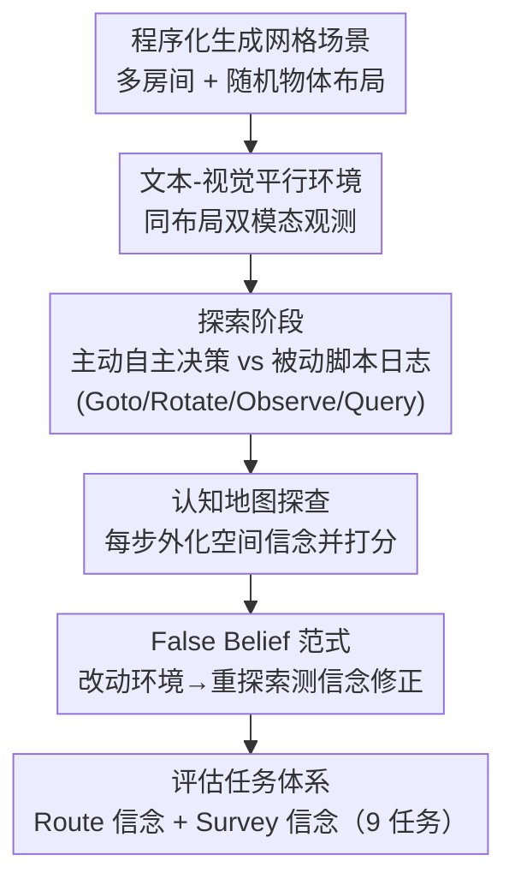

# Theory of Space: Can Foundation Models Construct Spatial Beliefs through Active Exploration?

**会议**: ICLR 2026  
**arXiv**: [2602.07055](https://arxiv.org/abs/2602.07055)  
**代码**: [GitHub](https://github.com/mll-lab-nu/Theory-of-Space)  
**领域**: 空间智能 / Embodied AI  
**关键词**: Theory of Space, active exploration, spatial belief, cognitive map, partial observability, belief inertia

## 一句话总结

提出Theory of Space框架，通过文本和视觉双环境中的主动探索、认知地图探查和False Belief范式，系统性评估基础模型构建和修正空间信念的能力，揭示了当前SOTA模型在主动-被动性能差距、探索效率和信念修正方面的关键失败模式。

## 研究背景与动机

**领域现状**：多模态基础模型（如GPT-5.2、Gemini-3 Pro）在被动的多模态感知和推理任务上表现出色。在空间智能领域，现有基准主要分两类：(1) **被动基准**（给定完整观测进行空间推理），如各种VQA、空间关系推理数据集；(2) **任务驱动基准**（如"找到红色椅子"），评估的是特定目标的完成情况。然而，空间智能的核心能力——在部分可观测环境中**主动、自主地获取信息并构建全局空间理解**——尚未被系统性研究。

**现有痛点**：现有基准无法回答关键问题："模型是否真正理解了空间？" 被动基准绕过了信息获取的挑战——模型不需要决定"接下来该看什么"。任务驱动基准将探索和推理耦合在一起，无法诊断失败的具体原因。更重要的是，没有方法直接"打开"模型的内部空间表示来检查它的空间信念质量——只能通过最终任务表现间接推断。

**核心矛盾**：认知科学研究表明，**主动探索**比被动接收相同信息能带来显著更好的空间理解。但基础模型是否具备这种主动探索能力？它们能否在不确定性下自主决定"该看哪里"，并将序列化的局部观测整合为全局一致的空间信念？

**本文目标** (1) 定义和形式化"Theory of Space"这一能力维度；(2) 构建一个可控的评估基准，解耦探索能力和推理能力；(3) 直接探查模型的内部空间信念质量而非仅看任务结果；(4) 测试模型在动态环境中修正空间信念的能力（对标Theory of Mind中的False Belief）。

**切入角度**：类比Theory of Mind（评估agent建模他人心理状态的能力），提出Theory of Space（评估agent建模未见空间结构的能力）。核心创新是**信念探查（Belief Probing）**——在探索过程中每一步要求模型外化其内部空间信念为认知地图，从而直接测量空间模型的质量，而非黑盒式地从任务表现推断。

**核心 idea**：通过认知地图探查和False Belief范式，直接评估基础模型主动构建和动态修正空间信念的能力。

## 方法详解

### 整体框架

Theory of Space 把"空间智能"重新定义成一个主动决策问题：Agent 不是被动接收完整观测，而要在部分可观测（partial observability）环境里自己决定"下一步看哪里"，并把一连串局部观测整合成全局一致的空间信念（spatial belief）。论文把这种能力拆成三个操作——**构建（Construct）**全局信念、环境变动后**修正（Revise）**信念、用信念去**利用（Exploit）**完成任务。整个基准分两个阶段：**探索阶段**里 Agent 通过移动、旋转、观察主动采集信息；**推理阶段**里基于已构建的信念回答 9 类空间问题。环境同时提供文本和视觉两套平行模式（同一布局），并设两种评估设置——主动（模型自主探索）与被动（喂给脚本代理生成的标准探索日志），用二者的性能差精确量化"探索"这一环到底拖了多少后腿。

### 关键设计

**1. 文本-视觉平行环境：把"看不懂图"和"空间推理差"两类失败拆开**

单一模态的评估有个老问题——模型答错了，你分不清是没看懂图还是脑子里算错了。本文的做法是在完全相同的布局上同时跑文本和视觉两套环境。环境本身是 $N \times M$ 网格上程序化生成的多房间室内场景，每个场景放 $n$ 个物体（带 2D 坐标和朝向），Agent 从随机位置出发，靠四种动作探索：Goto（移到某个可见物体）、Rotate（90°/180°/270° 旋转）、Observe（感知 90° 视野内的物体）、Query（拿到可见物体的绝对坐标）。**文本世界**把观测离散化成符号化的方向-距离描述（如"chair is front-left and near"），感知噪声被剥掉，剩下的就是纯空间推理；**视觉世界**则用 ThreeDWorld+Objaverse 渲染自我中心 RGB 图像，逼模型端到端地既感知又推理。因为两套环境共享同一布局，二者的性能差就精确量化了"视觉感知"这一环对空间理解的拖累有多大。

**2. 认知地图探查（Cognitive Map Probing）：打开黑箱直接量信念质量**

行为上的成功具有欺骗性——模型找到了椅子，可能只是运气好或恰好回忆对了，内部的空间信念其实一塌糊涂。所以本文不从任务结果反推，而是在探索的每一步都要求模型把当前的认知地图外化出来——即它对所有物体位置和朝向的估计——然后沿四个维度打分：(D2-1) **正确性**，与真实值在位置、方向、朝向上的复合准确度；(D2-2) **感知质量**，单步观测被转化为正确信息的准确率；(D2-3) **自追踪**，agent 对自身位置和朝向的建模准不准；(D2-4) **稳定性与局部-全局一致性**，已知信息会不会随时间退化、局部关系图和全局地图是否互相矛盾。此外还有 (D3) **不确定性建模**——给定已观测和未观测位置的候选集，看模型能否正确识别哪些区域还没看过（用 F1 分数衡量）。这套探查把评估从"能不能做对题"换成了"内部模型有多准"，从而支持逐维度的故障诊断。

**3. False Belief 范式与 Belief Inertia：测信念能不能被新证据推翻**

真实世界是动态的，物体会被挪走、环境会变，能否在重新探索后更新信念是空间智能的核心一环。本文借用 Theory of Mind 里经典的 False Belief 测试：等 agent 完成初始探索后，悄悄改动环境（移动或旋转某些物体），再让它重新探索并识别变化，用变化检测的 F1 分数来评分。正是在这里作者抓到了一个关键现象——**Belief Inertia（信念惯性）**：模型即便直接看到了新配置，仍固执地抱着旧的空间先验，没法用新的感觉证据去覆盖过时的信念，这个毛病在视觉模型里尤其严重。它说明当前模型的短板不只是"记不住"新信息，而是表示更新机制本身缺乏可塑性，旧信念会顽固抵抗新证据。

**4. Route/Survey 双层任务体系：把"会导航"和"懂全局"拆成两轴去测**

光有一个总分看不出模型到底强在哪、弱在哪。本文借认知科学里空间表示的发展规律（Siegel & White, Montello），把推理阶段的下游任务分成两层共 9 个：**Route 信念**是自我中心、沿路径逐步的理解，含成对方向-距离推断、视角采纳（perspective taking）、视角判定等；**Survey 信念**是俯瞰式的全局地图表示，含全局坐标映射、心理旋转（mental rotation）、位置↔视角互转（loc2view / view2loc）、动作↔视角互转（act2view / view2act）等。所有任务都用开放式问答而非选择题，避免模型靠选项猜中、压低知识泄露风险。这样一来 Route 和 Survey 的分差就能直接区分出"局部路径推理"和"全局空间抽象"哪一项才是某模型的真正短板。

## 实验关键数据

### 主动探索性能（视觉世界）

| 模型 | Avg步数 | Route任务均分 | Survey任务均分 | 总均分 |
|------|---------|--------------|---------------|--------|
| GPT-5.2 | 17.2 | 44.2 | 48.0 | **46.0** |
| Gemini-3 Pro | 13.6 | 52.1 | 62.8 | **57.3** |
| Claude-4.5 Sonnet | 19.6 | 24.9 | 34.2 | **29.6** |
| Qwen3-VL | 16.3 | 19.6 | 23.3 | **21.3** |
| 人类 | 9.8 | — | — | **96.4** |

### Active-Passive Gap（被动 vs 主动，视觉世界总均分）

| 模型 | 被动 | 主动 | 差距 |
|------|------|------|------|
| GPT-5.2 | 57.1 | 46.0 | **-11.1** |
| Gemini-3 Pro | 60.5 | 57.3 | **-3.2** |
| Claude-4.5 Sonnet | 43.1 | 29.6 | **-13.5** |
| Qwen3-VL | 24.9 | 21.3 | **-3.6** |

### 关键发现

- **Active-Passive Gap普遍存在**：所有模型在主动探索时性能都低于被动接收相同信息时。GPT-5.2从57.1降至46.0，Claude-4.5降幅最大（43.1→29.6）。这说明模型的探索策略本身就是瓶颈——它们不知道"该看什么"。
- **探索极度低效**：规则代理（Scout/Strategist）仅需约9步即可达到目标覆盖，而基础模型需≥14步且信念准确率并未更好。模型表现出高冗余探索——反复观察已知区域而忽略未知区域。
- **感知是初始瓶颈，稳定性是持续瓶颈**：认知地图探查揭示，视觉世界中感知准确率是第一道关卡（文本世界中几乎100%准确），但即使感知正确，全局信念仍因**稳定性不足**而随时间退化——已经正确获取的空间信息在后续步骤中被"遗忘"或"覆盖"。
- **Belief Inertia在视觉模型中尤为严重**：在False Belief测试中，文本世界的模型有一定的信念修正能力，但视觉世界的模型几乎完全无法覆盖旧信念——即使直接看到物体已经移位，输出的认知地图仍保留旧坐标。这揭示了当前模型在空间记忆可塑性上的根本缺陷。
- **文本-视觉差距巨大**：GPT-5.2在文本世界主动探索均分72.0，但视觉世界仅46.0，差距26个点。这量化了视觉感知对空间理解的巨大拖累。

## 亮点与洞察

- **Theory of Space的概念框架**：类比Theory of Mind提出Theory of Space，将"主动构建空间信念"定义为一种独立的能力维度。这个概念框架的价值超越了具体的实验结果——它为空间智能研究提供了一个长期使用的思考和评估范式。
- **信念探查的直接评估范式**：不再将模型当作黑箱，而是在每一步直接要求模型外化其内部信念。这种"打开黑箱"的评估思路可以迁移到其他认知能力的评估中（如因果推理、时间推理等），具有广泛的方法论影响。
- **Belief Inertia的发现**：这是一个重要的经验发现——模型不仅是"记不住"新信息，而是**旧信念会顽固地抵抗新证据**。这与认知科学中的确认偏差类似，揭示了当前基础模型在表示更新机制上的根本局限。
- **文本-视觉平行设计**：通过在完全相同的空间布局上运行文本和视觉实验，精确分离了"看不懂"和"想不明白"两类失败，为诊断和改进提供了清晰路线。

## 局限与展望

- **简化的网格世界**：实验环境是2D网格上的多房间布局，物体用离散坐标和基数方向表示。与真实3D环境的复杂性相比大幅简化，结论的迁移性需要验证。
- **仅评估单agent场景**：未考虑多agent协同探索和空间信念共享/对齐的场景，而这是多机器人系统的核心挑战。
- **开源模型表现极差**：GLM-4.6V和Qwen3-VL在视觉世界中的表现仅14-21分（人类96分），说明评估结果可能更多反映了模型的基础视觉空间感知能力不足，而非高层空间推理的瓶颈。
- **认知地图探查的格式依赖**：模型输出认知地图的质量可能受输出格式（JSON/坐标表）的影响，某些模型可能因格式理解差而被低估。

## 相关工作与启发

- **vs 被动空间推理基准（SpartQA等）**: 被动基准完全绕过了信息获取过程。Theory of Space的核心贡献在于将主动探索——"决定看什么"——纳入评估，揭示了被动推理能力无法预测主动探索表现。
- **vs 任务驱动导航基准（ALFRED、ObjectNav等）**: 这些基准评估特定任务完成率，无法诊断内部空间表示的质量。Theory of Space通过认知地图探查将评估从"做对事"转变为"想对了"。
- **vs Theory of Mind评估**: ToM测试他人心理状态建模，ToS测试物理空间结构建模。两者都强调"对不可直接观测的隐状态的推理"，但ToS聚焦于物理世界而非社会认知。

## 评分

- 新颖性: ⭐⭐⭐⭐⭐ 概念框架极具开创性，认知地图探查和Belief Inertia发现都是首创
- 实验充分度: ⭐⭐⭐⭐⭐ 6个SOTA模型、文本+视觉双环境、9种任务、5个评估维度、人类基线
- 写作质量: ⭐⭐⭐⭐ 框架清晰但论文较长，部分内容可精简
- 价值: ⭐⭐⭐⭐⭐ 为空间智能研究定义了新的评估范式，发现了基础模型的关键瓶颈

<!-- RELATED:START -->

## 相关论文

- [\[ICLR 2026\] From Spatial to Actions: Grounding Vision-Language-Action Model in Spatial Foundation Priors](from_spatial_to_actions_grounding_vision-language-action_model_in_spatial_founda.md)
- [\[ICML 2025\] SENSEI: Semantic Exploration Guided by Foundation Models to Learn Versatile World Models](../../ICML2025/robotics/sensei_semantic_exploration_guided_by_foundation_models_to_learn_versatile_world.md)
- [\[ICLR 2026\] REI-Bench: Can Embodied Agents Understand Vague Human Instructions in Task Planning?](rei-bench_can_embodied_agents_understand_vague_human_instructions_in_task_planni.md)
- [\[ICLR 2026\] APPLE: Toward General Active Perception via Reinforcement Learning](apple_toward_general_active_perception_via_reinforcement_learning.md)
- [\[ICLR 2026\] Scalable Exploration for High-Dimensional Continuous Control via Value-Guided Flow](scalable_exploration_for_high-dimensional_continuous_control_via_value-guided_fl.md)

<!-- RELATED:END -->
