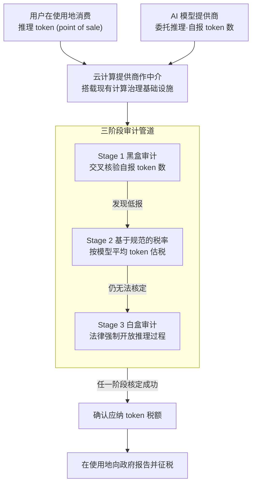

# Token Taxes: Mitigating AGI's Economic Risks

**会议**: ICLR 2026  
**arXiv**: [2603.04555](https://arxiv.org/abs/2603.04555)  
**代码**: 无  
**领域**: AI 治理 / 计算经济学  
**关键词**: AGI 治理, Token 税, 机器人税, 计算治理, 经济风险, AI 安全

## 一句话总结

提出 Token Tax（基于模型推理 token 使用量的附加税）作为缓解后 AGI 时代经济风险的一线治理工具——利用云计算提供商作为中介实施三阶段审计管道（黑盒 token 验证 → 基于规范的税率 → 白盒审计），相比传统机器人税具有两大独特优势：可通过现有计算治理基础设施执行，以及在 AI token 使用地而非模型托管地征收以缓解全球不平等。

## 研究背景与动机

**领域现状**：AI 安全研究长期聚焦于能力风险（superintelligence、alignment），对 AGI 带来的经济风险研究相对薄弱。然而，早期证据已显示 AI 暴露的早期职业角色失业率上升 16%（Brynjolfsson et al., 2025），历史上第一次工业革命的"恩格尔暂停期"（1790-1830）实际工资停滞 40 年——AGI 可能引发更严重的经济动荡。

**现有痛点**：AGI 发展威胁经济的三个维度：(1) **政府财政危机**——AI 替代劳动使最高税收来源（劳动税）萎缩，同时失业增加支出，双侧削弱公共财政；(2) **公民逐步边缘化（Gradual Disempowerment）**——当 AI 成为经济增长引擎，政府失去善待公民的激励，类似委内瑞拉等"食租国"的资源诅咒——靠石油而非劳动创收的国家，公民多陷于贫困；(3) **全球不平等加剧**——前沿 AI 芯片和模型公司高度集中在 "Compute North"（美国/中国/少数发达国家），"Compute South"（发展中国家）被迫租用计算资源，AGI 经济收益极不均衡。

**核心矛盾**：AGI 将在所有经济领域替代人类劳动——与以往自动化特定窄任务不同，AGI 跨行业替代意味着传统基于劳动的税收体系和社会契约将根本性崩溃。现有的"机器人税"提案（企业税/自动化税/取消投资减免）是基于企业的（firm-based），难以跨司法管辖区执行且无法惠及全球。

**本文目标**：设计一种可执行、基于使用量、能缓解全球不平等的 AGI 时代税收工具。

**切入角度**：现有 LLM API 已按 token 计费——Token 税作为计费的百分比附加，从技术实现和商业实践上都天然可行。云计算提供商已具备收集计算元数据和监督 AI 工作负载的能力（如 EU AI Act 和 Biden 行政令 14110 中的计算阈值监管），可直接作为税收中介。

**核心 idea**：在模型推理 token 的销售点征收使用税——可通过现有计算基础设施执行，在使用地而非托管地征收以实现全球公平。

## 方法详解

### 整体框架

Token 税本质上是对模型推理 token 加收的一笔使用税（usage-based surcharge），在销售点（point of sale）征收——以提供商计费的 token 成本为基数乘以一个百分比税率，例如 10% 税率作用于每 token $1 的服务即产生每 token $0.10 的 token 税。整套机制把云计算提供商放在 AI 模型提供商和政府之间的中介位置：用户在使用地消费 token，云提供商一边替模型提供商运行推理、收集 token 计费，一边通过一条三阶段审计管道核定应纳税额、再向政府报告并征税。

把这条收税链路拆开看，正好对应三个着力点——**在哪征**（在使用地征收）、**谁来征**（搭载现有计算治理基础设施、云提供商作中介）、**怎么防逃税**（三阶段审计管道）。三者也正是 Token 税相比传统机器人税（提高企业税率、征"自动化税"、取消自动化投资减免等 firm-based 方案）的根本区别所在：它是 usage-based 的，价值在 token 被使用的终端被精确捕获，与具体企业形态无关。下面三个关键设计按这条链路自上而下逐个展开。

### 关键设计

**1. 在使用地征收：让 Compute South 也能分到 AGI 经济的税收**

传统企业税在企业注册地征收，FLOP 税在计算设施所在地征收，两者都把税收留在了 AI 供应链高度集中的 Compute North（美国、中国及少数发达国家）。Token 税则在 token 被实际使用的地方（point of sale）征收，逻辑上类比增值税（VAT, Value-Added Tax）的消费地征收原则——任何使用 AI 服务的国家都能就本国消费拿到对应税收。这一点之所以重要，是因为芯片→训练→推理→API 的整条 AI 供应链都攥在少数国家手里，若只在供给侧征税，被迫租用算力的 Compute South 发展中国家会被完全挡在 AGI 经济利益之外；按使用地征收正是把税基从"谁造 AI"转向"谁用 AI"，从而把收益拉回消费国。

**2. 搭载现有计算治理基础设施：云提供商作中介，可执行性来自不必从零建制**

确定了在使用地征收后，下一个问题是谁有能力去征、去核账。一项政策工具能否落地，很大程度上取决于它依赖的执行基础设施是否已经存在。Token 税在这一点上占了便宜：EU AI Act 和 Biden 行政令 14110 已经引入了基于计算量的监管阈值，AWS、Azure、GCP 这类云超大规模提供商（hyperscaler）也早就在收集计算消耗和工作负载类型（推理还是预训练）的元数据。把这套能力扩展到 token 级的数据收集只是增量改造，而非另起炉灶——既不需要新设执行机构，也复用了 API 本就按 token 计费的商业实践，使得"云提供商作为 AI 模型提供商与政府之间的中介、充当记录者与验证者"这一前提在工程上立得住。

**3. 三阶段审计管道：堵住 AI 公司低报 token 膨胀利润的执行漏洞**

云提供商虽能作中介，但执行仍是整套方案最脆弱的环节——当前只有模型提供商能访问完整生成过程，第三方审计员只能看到输出，这种信息不对称让 AI 公司有动机隐瞒真实 token 数（比如藏起推理用的 thinking token）来虚增利润。论文用一条由轻到重、逐级升级的审计管道来压缩这个博弈空间。Stage 1 是黑盒 token 审计：法律要求云提供商收集 token 级使用数据，充当独立验证者，与 AI 公司自报的数字交叉核验。一旦发现低报，Stage 2 引入基于规范的税率（Norm Tax），借鉴挪威等食租国对付逃税的思路——审计员不必拿到真实数据，只需按每类模型的平均 token 使用量这一经验标准估税征收，仅靠黑盒访问就能让低报失去意义。剩余的操纵余地由 Stage 3 白盒审计兜底：从法律层面强制公司向第三方审计员开放生成过程信息，彻底锁死可篡改空间。三个阶段从低成本验证逐步走向高可信度核查，让执行成本和准确性之间留有调节空间，而不要求一步到位上最贵的手段。

## 实验关键数据

### Token Tax vs 替代方案的多维对比

| 维度 | Token Tax | FLOP Tax | 传统机器人税（企业税/自动化税） |
|------|-----------|----------|--------------------------|
| 税基 | 推理 token 使用量 | 浮点运算量 | 企业收入/资本投资 |
| 征收点 | AI 使用地（point of sale） | 计算设施所在地 | 企业注册地 |
| 全球公平性 | ✅ 有利于 Compute South | ❌ 有利于 Compute North | ❌ 有利于企业注册国 |
| 执行机制 | 云提供商 token 日志 + 三阶段审计 | 计算基础设施监控 | 企业财务审计 |
| 可规避性 | 需三阶段审计防低报 | 较难规避 | 转移定价/税基侵蚀可规避 |
| 与现有框架兼容 | ✅ API 按 token 计费已有 | ✅ EU AI Act 计算阈值已有 | ⚠️ 需重新定义"机器人" |
| 互补性 | 可与 FLOP Tax 组合 | 可与 Token Tax 组合 | 独立方案 |

### 后 AGI 三大经济风险的治理对策映射

| 经济风险 | 风险机制 | Token Tax 应对方式 |
|---------|---------|------------------|
| 政府财政危机 | AI 替代劳动 → 劳动税收萎缩 | 以 token 税补充财政收入，对齐所得税率恢复税收中性 |
| 公民逐步边缘化 | 政府不再依赖人类劳动 → 失去善待公民激励 | 使政府收入与 AI 使用量挂钩 → 维持对公民的回应性 |
| 全球不平等加剧 | Compute North 垄断 AI 基础设施 | 在使用地征收 → Compute South 也获得 AI 税收 |

### 主要反对论点与回应

| 反对论点 | 论文回应 |
|---------|---------|
| Token 税会抑制创新、促使 AI 企业迁移 | 建议通过 Agent-Based Modeling (ABM) 预测市场影响，LLM-based ABM 已成功模拟大规模社交互动 |
| FLOP 税优于 Token 税 | 两者并非互斥——最优框架可能是混合方案，FLOP 税捕获训练/计算端，Token 税捕获消费端 |
| AI 超级大国（美国/中国）可否决 Token 税 | 借鉴 GDPR/EU AI Act 经验——一个"意愿联盟"（如 EU）的区域协议比单国措施更难否决 |

### 关键发现

- Token 税的独特价值在于**同时**满足可执行性（现有计算治理基础设施）和使用地征收（缓解全球不平等）——现有替代方案最多满足其一
- 数字服务税（DSTs）在欧洲的实施经验表明，即使面对美国贸易压力，区域协调的消费地征税方案仍可推行
- 隐藏推理 token（thinking tokens）的出现使审计更复杂（Sun et al., 2025 发现可以检测隐藏 token 的存在），norm-based 税率作为后备方案尤为重要
- 私有部署（on-premise inference）是 Token 税的主要执行盲区——企业在自有硬件上运行模型时绕过了云计算中介

## 亮点与洞察

- **将 AI 安全从纯技术风险扩展到经济风险**：填补了 AI 治理研究中"经济风险"相对于"能力风险"的注意力失衡——社会不稳定可能先于技术失控到来
- **"Compute North vs Compute South" 框架**：简洁而有力地揭示 AGI 时代的地缘经济格局——先进计算高度集中在少数国家，全球不平等将因 AGI 进一步加剧
- **"食租国"类比的启发性**：委内瑞拉/沙特等靠资源而非劳动创收的国家，公民生活在贫困中——AGI 替代劳动后，所有国家都面临成为"AI食租国"的风险
- **三阶段审计管道的工程务实性**：从低成本黑盒验证逐步升级到白盒审计，每阶段都有单独的可行性——不要求一步到位
- **Token 税 + FLOP 税的互补视角**：论文不排斥竞争方案，而是指出二者可组合——训练端 FLOP 税 + 推理端 Token 税 = 全生命周期覆盖

## 局限与展望

- **缺乏定量分析**：纯政策论文，未提供经济建模、模拟实验或最优税率估算——建议的 ABM 研究停留在提议阶段
- **私有部署盲区**：企业在自有硬件运行模型时完全绕过云计算中介——Token 税的执行依赖云中间商，私有部署场景无解
- **忽略开源模型**：开源模型用户可在任何设备运行推理，无 API 调用记录——Token 税基本无法覆盖
- **政治可行性分析不足**：虽援引 GDPR 先例，但 AI 税收涉及的经济利益和地缘政治博弈远比数据隐私复杂（AI 直接关联国家竞争力和军事能力）
- **对推理定义的模糊性**：未明确 token 的定义——不同模型架构（dense vs MoE, 自回归 vs 扩散）的"token"概念差异巨大
- **假设云计算集中化趋势持续**：如果边缘推理或去中心化计算兴起，云中间商的监督能力将被削弱

## 相关工作与启发

- **vs 机器人税（Abbott & Bogenschneider, 2018）**：传统机器人税是 firm-based（企业注册地征收），Token 税是 usage-based（使用地征收）——在全球公平性维度有本质区别
- **vs FLOP 税**：FLOP 税侧重计算供给端（训练和推理基础设施），Token 税侧重消费端（API 调用）——两者互补而非互斥
- **vs 渐进式 AI 边缘化理论（Kulveit et al., 2025）**：Gradual Disempowerment 描述了风险机制，Token 税提供了一种可操作的政策应对
- **vs 计算治理框架（Sastry et al., 2024）**：Token 税搭载现有计算治理基础设施但聚焦推理端而非训练端——补充了该框架在消费侧的空白
- **启发**：Token 税的"point of sale" 征收思路值得推广——任何 AI-as-a-Service 的输出端（不只是 token）都可能成为征税点

## 评分

- 新颖性: ⭐⭐⭐⭐ 首次系统提出 Token Tax 概念并设计可执行的三阶段审计方案，将 AI 治理从能力风险扩展到经济风险
- 实验充分度: ⭐⭐ 纯政策分析论文，无量化实验或模拟验证，建议的 ABM 未执行
- 写作质量: ⭐⭐⭐⭐ 论证结构清晰，三大风险→两大优势→三阶段审计→三个反对论点的逻辑链完整
- 价值: ⭐⭐⭐⭐ 在 AI 治理领域提出了具有实际政策指导意义的框架，但缺乏定量支撑限制了说服力

<!-- RELATED:START -->

## 相关论文

- [\[ECCV 2024\] An Economic Framework for 6-DoF Grasp Detection](../../ECCV2024/robotics/an_economic_framework_for_6-dof_grasp_detection.md)
- [\[ICCV 2025\] Resolving Token-Space Gradient Conflicts: Token Space Manipulation for Transformer-Based Multi-Task Learning](../../ICCV2025/robotics/resolving_token-space_gradient_conflicts_token_space_manipulation_for_transforme.md)
- [\[CVPR 2025\] Mitigating the Human-Robot Domain Discrepancy in Visual Pre-training for Robotic Manipulation](../../CVPR2025/robotics/mitigating_the_human-robot_domain_discrepancy_in_visual_pre-training_for_robotic.md)
- [\[AAAI 2026\] TTF-VLA: Temporal Token Fusion via Pixel-Attention Integration for Vision-Language-Action Models](../../AAAI2026/robotics/ttf-vla_temporal_token_fusion_via_pixel-attention_integratio.md)
- [\[ICCV 2025\] Moto: Latent Motion Token as the Bridging Language for Learning Robot Manipulation from Videos](../../ICCV2025/robotics/moto_latent_motion_token_as_the_bridging_language_for_learning_robot_manipulatio.md)

<!-- RELATED:END -->
