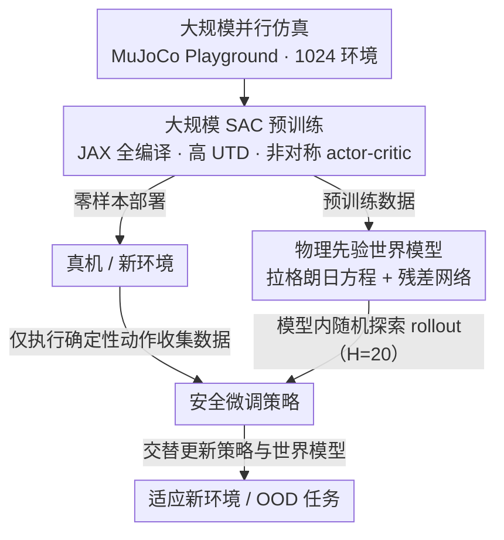

# Towards Bridging the Gap between Large-Scale Pretraining and Efficient Finetuning for Humanoid Control

**会议**: ICLR 2026  
**arXiv**: [2601.21363](https://arxiv.org/abs/2601.21363)  
**代码**: [https://lift-humanoid.github.io](https://lift-humanoid.github.io)  
**领域**: 强化学习  
**关键词**: 人形机器人控制, 大规模预训练, 高效微调, SAC, 物理先验世界模型, 仿真到现实

## 一句话总结
LIFT提出预训练-微调三阶段框架：(i) 大规模并行SAC预训练实现零样本部署；(ii) 基于拉格朗日动力学的物理先验世界模型离线预训练；(iii) 确定性动作执行+世界模型内随机探索的高效微调，在Booster T1和Unitree G1人形机器人上验证了从仿真到真实世界的全流程。

## 研究背景与动机

**领域现状**：PPO因大规模并行GPU仿真的鲁棒收敛成为人形机器人控制的主流方法，可实现零样本部署。但on-policy方法的低样本效率限制了安全适应新环境的能力。

**现有痛点**：(1) 直接用off-policy方法做大规模并行训练关注不足；(2) 微调时随机探索可能损坏执行器或导致不安全状态，对支撑面小的人形机器人尤其危险；(3) 从头训练model-based方法耗时极长且容易陷入局部最优。

**核心矛盾**：大规模预训练需要on-policy方法的稳定性和并行效率，而高效微调需要off-policy方法的样本效率和model-based方法的数据高效性。

**本文目标**：如何统一预训练和微调阶段的算法选择，同时保证安全性和效率？

**切入角度**：以SAC为统一backbone，预训练阶段用高UTD大批量并行训练，微调阶段将随机探索限制在世界模型内，环境中只执行确定性动作。

**核心 idea**：SAC贯穿预训练-微调全流程，物理先验世界模型桥接仿真与真实，确定性执行+模型内探索实现安全高效微调。

## 方法详解

### 整体框架
LIFT 分三阶段，核心思路是「预训练阶段吃满 GPU 并行换 wall-clock 效率，微调阶段靠世界模型换样本效率，全程用同一个 SAC 做骨架」：(i) 基于 JAX 的大规模 SAC 预训练（1024 并行环境，高 UTD=10），在 MuJoCo Playground 中快速收敛、可零样本部署到真机；(ii) 用预训练阶段产生的数据离线训练物理先验世界模型（physics-informed world model）；(iii) 在新环境中只执行确定性动作收集数据、把随机探索全部关进世界模型生成合成轨迹，交替微调策略和世界模型，安全地适应新环境与分布外（out-of-distribution, OOD）任务。

### 关键设计

**1. 大规模 SAC 预训练：让 off-policy 方法也能吃满 GPU 并行**

PPO 之所以成为人形控制主流，靠的是大规模并行仿真带来的稳定收敛；但它 on-policy、样本效率低，微调阶段难以安全适应新环境。LIFT 想用 SAC 这种 off-policy 方法顶上来，难点在于把 SAC 也跑到与 PPO 可比的 wall-clock 效率。做法是用 JAX 把整个 SAC 全编译，固定 tensor 形状以触发高效的 OP fusion，从而在 1024 个并行环境里做大批量更新（batch=1024）和高 UTD（update-to-data ratio = 10）而不引入额外通信开销。网络上采用 asymmetric actor-critic——actor 只接收本体感知状态 $s_t$（部署时可得），critic 接收带特权信息的状态 $s_t^p$（仿真中可得）。选 SAC 而不是 PPO 还有一层考虑：它的 off-policy 性质天然能和后面的 model-based 微调拼接，而其状态依赖的随机策略在世界模型 rollout 里能提供更丰富的探索多样性。

**2. 物理先验世界模型：把已知的刚体动力学交还给方程，只让网络学未知项**

纯神经网络世界模型在有限数据下泛化差，常常给出物理上不合理的预测，进而让 critic 损失爆炸。LIFT 改用混合模型：骨架交给拉格朗日方程

$$M(q_t)\ddot{q_t} + C(q_t,\dot{q_t}) + G(q_t) = B\tau_t + J^\top F^e_t + \tau^d_t$$

其中惯性矩阵 $M$、科里奥利项 $C$、重力项 $G$、驱动映射 $B$ 都由机器人几何/惯性参数确定，是已知量；只把难以建模的接触力和耗散项 $J^\top F^e_t + \tau^d_t$ 留给残差网络 $\tau_\phi(s_t,a_t)$ 去逼近。训练用带方差的高斯负对数似然，对特权状态的一步预测误差按预测方差加权：

$$\mathcal{L}_\phi = \frac{1}{B}\sum_{b=1}^{B}\big((\hat{s}^p_{b,t+\Delta t} - s^p_{b,t+\Delta t})^2 \odot \exp(-\log\sigma^2_{b,t}) + \log\sigma^2_{b,t}\big)$$

这样世界模型继承了刚体动力学的归纳偏置，在数据稀少时也能给出物理自洽的 rollout，避免污染 critic。

**3. 安全微调策略：环境里只走确定性动作，随机探索全部关进世界模型**

人形机器人支撑面小，单支撑相位对扰动极度敏感，直接在真机或新环境里做随机探索很可能损坏执行器甚至摔倒。LIFT 把探索与执行解耦：在真实环境中只执行策略的确定性动作（action mean）来收集数据，所有随机探索都搬到世界模型内部进行——从 replay buffer 采样初始状态，在世界模型里自回归展开 $H_{wm}=20$ 步合成轨迹，用这些轨迹训练 actor-critic。rollout 还带安全重置：一旦基座高度、速度、姿态角或关节状态越过预设阈值就立即终止该条轨迹。策略和世界模型交替更新，使得真机侧始终保持安全的确定性行为，而样本效率由模型内探索补足。

### 损失函数 / 训练策略
- 预训练：标准SAC目标 + Optuna超参搜索（约10小时），Booster T1训练时间从7小时降至30分钟
- 世界模型：高斯负对数似然损失，端到端梯度通过归一化、坐标变换、PD控制器和Euler积分反传
- 微调：多epoch自回归训练增强样本效率，长度2-4的自回归损失稳定学习

## 实验关键数据

### 预训练实验（6个人形任务）
- LIFT在所有flat terrain任务上达到与PPO/FastTD3可比的peak return
- 在rough terrain上更快稳定在peak性能
- 单GPU（RTX 4090）30分钟内完成Booster T1预训练

### 微调实验（Brax环境，8个seed）

| 场景 | LIFT | SAC | PPO | FastTD3 | SSRL |
|------|------|-----|-----|---------|------|
| In-Distribution (0.6 m/s) | ✓ 收敛 | 发散 | 初始还行后崩溃 | 强振荡后崩溃 | 有收敛迹象但不达标 |
| Long-Tail (1.0 m/s) | ✓ 收敛 | 发散 | 崩溃 | 崩溃 | 不收敛 |
| OOD (1.5 m/s) | ✓ 收敛 | 发散 | 崩溃 | 崩溃 | 不收敛 |

微调仅需 $4 \times 10^4$ 环境步（约800秒在线交互时间）。

### 消融实验

| 配置 | 结果 |
|------|------|
| 完整LIFT（SAC预训练+WM预训练） | 4×10⁴步内收敛到目标速度 |
| 去掉WM预训练 | 仍能收敛但明显慢 |
| 去掉SAC+WM预训练（=SSRL） | 只学会站立，几乎零前进速度 |
| MBPO ensemble替代物理先验WM | 不收敛，critic损失爆炸 |

### 真实世界微调
- 从80-590秒真实数据收集后，机器人展现更直立的姿态、更平滑的步态和更稳定的前进速度
- 限制：依赖Vicon动捕估计基座高度，IMU积分有漂移

## 亮点与洞察
- **统一backbone的优势**：SAC贯穿预训练到微调避免了算法切换导致的目标不一致和遗忘
- **物理先验的关键性**：消融实验定量证明纯神经网络世界模型在有限数据下完全无法工作，物理先验提供了必要的泛化归纳偏置
- **安全探索范式**：确定性执行+模型内随机探索是一个可推广的范式，对任何需要安全微调的机器人系统都有参考价值
- **工程贡献**：从SSRL代码中发现并修正了状态映射错误，增加基座高度到特权状态——对人形机器人是关键的

## 局限与展望
- 当前仅使用本体感知观测，不支持视觉输入
- 真实世界微调依赖外部运动捕捉系统和IMU积分
- 微调pipeline是同步的（数据收集→训练），异步pipeline可显著提高效率
- 动作修正可能unbounded（vs ASAP的delta-action方法）

## 相关工作与启发
- **vs PPO**: PPO在确定性数据收集+有限数据下逐渐退化崩溃，不适合微调场景
- **vs SSRL**: LIFT本质是SSRL的预训练增强版，验证了从头训练model-based在人形上不可行
- **vs FastTD3**: FastTD3虽实现了大规模off-policy训练，但缺乏微调验证和sim-to-real
- **vs DreamerV3**: Dreamer使用latent world model+learned reward，在确定性数据收集下不稳定

## 评分
- 新颖性: ⭐⭐⭐⭐ 预训练-微调框架结合物理先验世界模型，针对人形机器人的系统性解决方案
- 实验充分度: ⭐⭐⭐⭐⭐ 仿真+真实、多平台（T1/G1）、多场景（in/out分布）、详细消融
- 写作质量: ⭐⭐⭐⭐ 问题动机清晰，消融设计合理，但文章较长
- 价值: ⭐⭐⭐⭐⭐ 提供了完整的开源pipeline，对人形机器人学习社区有直接实用价值

<!-- RELATED:START -->

## 相关论文

- [\[ICLR 2026\] RoboCasa365: A Large-Scale Simulation Framework for Training and Benchmarking Generalist Robots](robocasa365_a_large-scale_simulation_framework_for_training_and_benchmarking_gen.md)
- [\[ICLR 2026\] Rethinking Policy Diversity in Ensemble Policy Gradient in Large-Scale Reinforcement Learning](rethinking_policy_diversity_in_ensemble_policy_gradient_in_large-scale_reinforce.md)
- [\[CVPR 2026\] Bridging the 2D-3D Gap: A Hierarchical Semantic-Geometric Map for Vision Language Navigation](../../CVPR2026/robotics/bridging_the_2d-3d_gap_a_hierarchical_semantic-geometric_map_for_vision_language.md)
- [\[CVPR 2026\] DynBridge: Bridging Imagination and Control through Interaction Dynamics for Robot Manipulation](../../CVPR2026/robotics/dynbridge_bridging_imagination_and_control_through_interaction_dynamics_for_robo.md)
- [\[CVPR 2026\] Iterative Closed-Loop Motion Synthesis for Scaling the Capabilities of Humanoid Control](../../CVPR2026/robotics/iterative_closed-loop_motion_synthesis_for_scaling_the_capabilities_of_humanoid_.md)

<!-- RELATED:END -->
