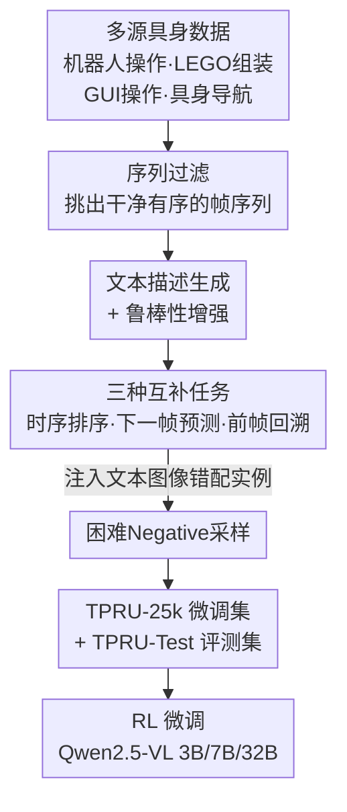

# TPRU: Advancing Temporal and Procedural Understanding in Large Multimodal Models

**会议**: ICLR 2026  
**arXiv**: [2602.18884](https://arxiv.org/abs/2602.18884)  
**代码**: [https://github.com/Stephen-gzk/TPRU/](https://github.com/Stephen-gzk/TPRU/)  
**领域**: 强化学习 / 多模态大模型  
**关键词**: 时序理解, 程序性推理, 多图像理解, 强化学习微调, MLLM, 具身AI

## 一句话总结
TPRU构建了大规模多图像时序理解数据集（24,750个QA对、126,000张图像），覆盖机器人操作、GUI导航等4个具身场景的3种互补任务（时序排序、下一帧预测、前帧回溯），并通过强化学习微调使7B模型在时序理解上超越GPT-4o。

## 研究背景与动机

**领域现状**：MLLM在单图像任务上表现优异，但小型可部署模型在理解时序和程序性图像序列方面存在严重缺陷。这一能力差距是具身AI部署（机器人、导航、指令执行）的关键瓶颈。

**现有痛点**：(1) 训练范式系统性失败——现有数据集将多图像视为无序集合，忽略了"理解图像集"和"理解图像序列"的关键区别；(2) 社区的响应是创建evaluation-only的benchmark反复确认失败，而非解决根本原因（缺少大规模真实世界序列训练数据）。

**核心矛盾**：资源受限的边缘设备无法部署数百亿参数模型，但小模型在程序性理解上的不足使其无法用于具身场景。这是"模型规模"还是"训练数据"的问题？

**本文目标**：(1) 提供大规模、结构化的时序理解训练集填补训练-测试gap；(2) 验证小型模型通过正确的数据和训练方法能否达到大模型级别的时序理解。

**切入角度**：从4个具身场景采集真实序列数据，设计3种互补任务覆盖时序推理的不同方面，引入困难negative samples迫使模型主动验证而非被动观察。

**核心 idea**：通过结构化数据+RL训练使小模型获得超越大模型的时序程序性理解能力，证明这非规模固有限制而是训练挑战。

## 方法详解

### 整体框架
TPRU 要解决的是小模型读不懂"图像序列"的问题——现有数据把多图像当成无序集合，模型自然学不到时间方向。整套方案落到两个产物：TPRU-25k（微调集，24,750 样本）和 TPRU-Test（461 个人工标注评测样本）。数据从 4 个真实具身场景采集（**多源具身数据**）后，经过一条流水线：先做序列过滤挑出干净、有序的帧序列，再为每段序列生成文本描述并做鲁棒性增强，最后把序列翻译成**三种互补任务**的问答样本，并在其中注入**困难 Negative 采样**逼模型真看图；产出的数据集最终用强化学习（RL）微调 Qwen2.5-VL。下面三个设计分别对应"数据从哪来""学什么任务""怎么逼模型真正看图"。

### 关键设计

**1. 多源具身数据：让时序理解是通用能力而非单一领域的套路**

如果只用一个场景的序列，模型很容易记住该领域的固定模式而不是真正理解时间顺序。TPRU 因此横跨 4 个互不相干的具身场景采集真实序列：机器人操作取自 ShareRobot 的 planning 任务视频帧采样；LEGO 组装用 36 个高质量定格动画视频，画面无运动模糊、每一步状态清晰可辨；GUI 操作来自 GUI Odyssey 的 4 步截图序列；具身导航则取 Habitat 模拟环境里的有序视觉观察。四类场景的动态规律差异很大（机械臂轨迹、积木堆叠、界面跳转、空间移动），同时训练才能逼模型抽出跨场景共享的时序推理能力。

**2. 三种互补任务：从前向、后向、全局三个角度逼出程序性理解**

单一任务只能覆盖时序推理的一个侧面，TPRU 用三个任务把它拼全。**时序排序（Temporal Ordering）**把帧序列打乱，要求模型依据文本描述恢复正确排列，考的是对完整时间线的把握；**下一帧预测（Next-Frame Prediction）**给定第 1、2、4 帧，让模型从候选中选出正确的第 3 帧，且干扰项专门取自相似场景，相当于让 agent 预判一个动作的后果；**前帧回溯（Previous-Frame Review）**反过来给定后 3 帧，要求从候选中选出正确的初始帧，对应理解一个程序的前提条件和事件溯源。前向预测、后向回溯加全局排序三者叠加，才能把"序列是怎么一步步演化的"这种结构化动态理解逼出来。

**3. 困难 Negative 采样：用故意错配的样本逼模型真看图、不靠文本先验猜**

模型常见的偷懒方式是只读文本提示、不认真看图就猜答案。为堵住这条路，TPRU 故意构造文本与图像不匹配的实例——例如文本说"拿起叉子"，配的却是"放下刀"的图像，此时正确答案是 "None of the choices provided"。模型必须显式地做一次跨模态验证（图里到底发生了什么 vs 文本声称发生了什么），发现对不上才能答对。这一步直接针对幻觉和过度依赖文本先验的毛病。

### 训练策略
用强化学习（RL）微调 Qwen2.5-VL（3B/7B/32B 三档规模），目标集中在提升资源受限小模型的时序推理能力。RL 的具体训练细节与奖励设计见论文附录。

## 实验关键数据

### TPRU-Test 主实验

| 模型 | 参数量 | 准确率 |
|------|--------|--------|
| Qwen2.5-VL-7B (base) | 7B | 50.33% |
| **TPRU-7B** | **7B** | **75.70%** |
| GPT-4o | 闭源 | <75.70% |
| Qwen2.5-VL-72B | 72B | - |
| Gemini-2.5-Flash | 闭源 | - |

TPRU-7B比base版本提升25.37个百分点，显著超越GPT-4o。

### MuirBench 评测

| 模型 | Overall |
|------|---------|
| Qwen2.5-VL-7B (base) | 58.35% |
| **TPRU-7B** | 提升显著 |
| **TPRU-32B** | **68.42%** |
| GPT-4o | 68.00% |
| Qwen2.5-VL-72B | 69.35% |

TPRU-32B超越GPT-4o，接近72B模型水平。Ordering类别提升特别显著。

### LEGO-Puzzles评测
TPRU-7B在LEGO-Puzzles上展现了对多步计划和程序性推理的实质性提升。

### 关键发现
- 时序推理差距不是模型规模的固有限制，而是可以通过针对性数据和RL训练解决的挑战
- 三种任务的互补性至关重要——消融实验显示去掉任何一种任务都会降低性能
- Negative样本对防止幻觉和过度依赖文本先验至关重要
- RL微调比SFT在这类任务上更有效

## 亮点与洞察
- **训练-评测统一**：打破了"创建benchmark→确认失败→再创建benchmark"的循环，同时提供训练数据和评测工具
- **小模型逆袭大模型**：7B模型超越GPT-4o的结果颠覆了"时序理解需要大模型"的假设
- **实用导向设计**：数据来源于真实具身场景而非合成数据，任务设计直接对应agent能力需求
- **RL训练范式**：证明了RL在提升MLLM推理能力方面的有效性，超越传统SFT

## 局限与展望
- TPRU-25k虽然多样但规模相对可再扩展
- 当前聚焦于3-4帧短序列，更长序列的程序性理解有待探索
- 视频理解与多帧图像理解的联系和区别需要进一步研究
- RL训练的reward设计可能有更好的方案

## 相关工作与启发
- **vs Mantis-Instruct/LLaVA-NeXT-Interleave**: 这些数据集将多图像视为无序集合，缺乏系统性的时序结构
- **vs MuirBench/LEGO-Puzzles**: 这些仅是评测benchmark，TPRU同时提供训练数据填补gap
- **vs Jigsaw-R1/MiCo**: 这些用程序化生成的puzzle训练空间推理，TPRU用真实场景训练时序推理

## 评分
- 新颖性: ⭐⭐⭐⭐ 数据集设计和三任务框架有创新，RL+时序理解的结合有价值
- 实验充分度: ⭐⭐⭐⭐⭐ 多基准(TPRU/MuirBench/LEGO)、多模型规模、多方法对比
- 写作质量: ⭐⭐⭐⭐ 动机清晰，Pipeline图设计好，但数据集描述略冗长
- 价值: ⭐⭐⭐⭐⭐ 对具身AI和可部署MLLM有直接价值，数据集和代码开源

<!-- RELATED:START -->

## 相关论文

- [\[CVPR 2026\] Multi-SpatialMLLM: Multi-Frame Spatial Understanding with Multi-Modal Large Language Models](../../CVPR2026/robotics/multi-spatialmllm_multi-frame_spatial_understanding_with_multi-modal_large_langu.md)
- [\[ICLR 2026\] RoboCasa365: A Large-Scale Simulation Framework for Training and Benchmarking Generalist Robots](robocasa365_a_large-scale_simulation_framework_for_training_and_benchmarking_gen.md)
- [\[ICLR 2026\] Rethinking Policy Diversity in Ensemble Policy Gradient in Large-Scale Reinforcement Learning](rethinking_policy_diversity_in_ensemble_policy_gradient_in_large-scale_reinforce.md)
- [\[ICLR 2026\] Towards Bridging the Gap between Large-Scale Pretraining and Efficient Finetuning for Humanoid Control](towards_bridging_the_gap_between_large-scale_pretraining_and_efficient_finetunin.md)
- [\[ICML 2026\] Embodied Task Planning via Graph-Informed Action Generation with Large Language Models](../../ICML2026/robotics/embodied_task_planning_via_graph-informed_action_generation_with_large_language_.md)

<!-- RELATED:END -->
