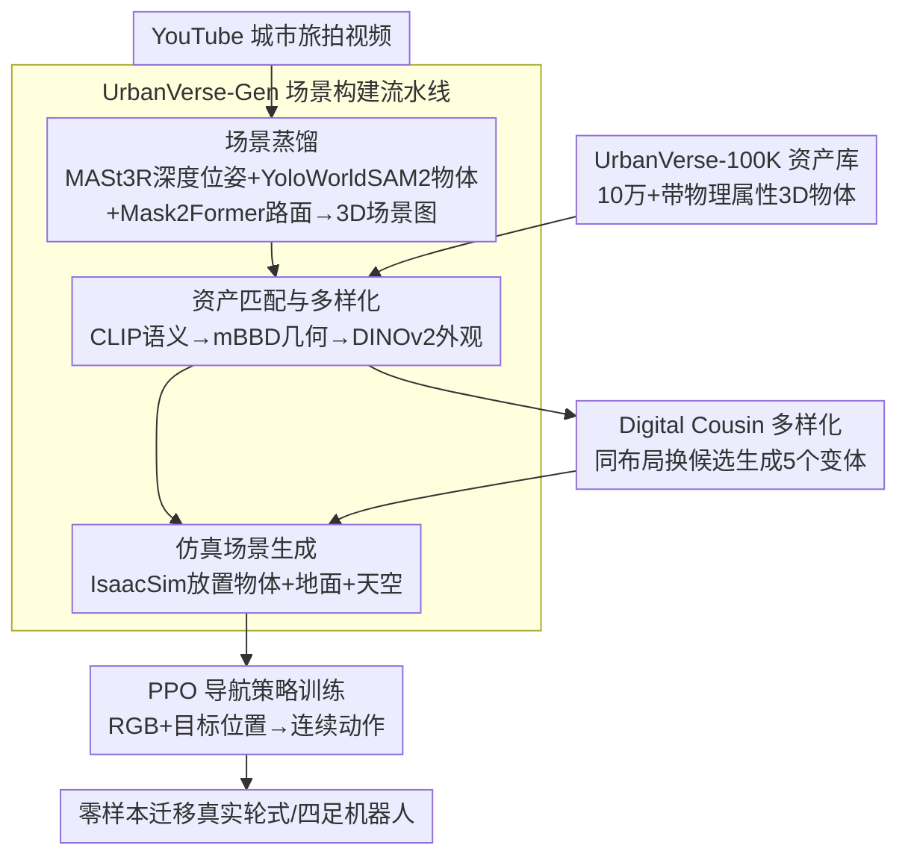

# UrbanVerse: Scaling Urban Simulation by Watching City-Tour Videos

**会议**: ICLR 2026  
**arXiv**: [2510.15018](https://arxiv.org/abs/2510.15018)  
**代码**: [urbanverseproject.github.io](https://urbanverseproject.github.io/)  
**领域**: 机器人学 / 仿真  
**关键词**: 城市仿真, real-to-sim, 具身智能, 3D资产库, 导航策略

## 一句话总结
UrbanVerse是一个数据驱动的real-to-sim系统，将众包城市旅拍视频转化为物理感知的交互式仿真场景，包含10万+标注3D资产和自动场景构建流水线，在IsaacSim中生成160个高质量场景，训练的PPO导航策略在真实世界零样本转移中成功率达89.7%，完成337m长距离任务仅需2次人工干预。

## 研究背景与动机
城市空间中的具身AI智体（如配送机器人、四足机器人）正在快速发展。训练这类智体需要大量多样化的高保真城市环境，但现有仿真方案存在根本性矛盾：

- **手工制作场景**: 如CARLA仅有15个场景，不可扩展，人力成本高
- **程序化生成场景**: 如MetaUrban/UrbanSim使用硬编码规则，产生的场景偏离真实世界分布（如随机停放的滑板车不符合真实parking模式）
- **被动真实数据**: 如城市旅拍视频有丰富的多样性，但缺乏动作标签和交互性
- **3D重建方法**: 如3DGS可从视频重建场景，但产出的是静态纹理网格，无语义和物理属性

核心矛盾：规模与真实感的矛盾。简单增加数量（程序化生成）不能带来泛化——如果场景不忠实反映真实世界分布，数量再多也无效。

UrbanVerse的核心idea：**从真实城市旅拍视频中提取场景语义和布局，用高质量3D资产实例化为物理可交互的仿真场景**——"digital cousin"范式。这结合了真实数据的多样性和仿真的交互性。

## 方法详解

### 整体框架
UrbanVerse由两大支柱支撑：一是 UrbanVerse-100K，一座标注了物理属性的10万+城市3D资产库；二是 UrbanVerse-Gen，一条把YouTube城市旅拍视频转成IsaacSim中物理可交互仿真场景的自动流水线。前者提供"积木"，后者负责"按真实视频的样子搭出场景"——先从一段视频里蒸馏出物体/地面/天空的三类节点，再从资产库检索匹配的"近亲"实例摆进IsaacSim，并借digital cousin在同一布局下批量造外观各异的变体，最终在这些仿真场景里训练出能零样本迁移到真车真狗的导航策略。

### 关键设计

**1. UrbanVerse-100K资产库：解决3D积木的质量与规模瓶颈**

城市仿真要忠实，第一步得有足够多、足够干净、还带物理属性的3D物体。本文从Objaverse的80万嘈杂资产出发，用三阶段半自动流水线把它清洗成可用资产库。先是资产筛选，10名标注员在Three.js查看器里花3周逐个过目，剔除破损网格、缺纹理、纸片状、尺度异常等8类质量问题，留下15.8万件可用资产；再是城市本体构建，以OpenStreetMap的标签结构为骨架，融合ADE20K、Cityscapes等数据集的类别，建成3层、667个叶类别的城市语义本体，让"消防栓""路灯""长椅"各有归属；最后是属性标注，用GPT-4.1对每件资产的缩略图加4个旋转快照打33个属性标签（语义、可供性，以及质量、摩擦力等物理量），整批API成本仅 $1,334。成品库含102,530个GLB物体、288个PBR地面材质、306个HDRI天空图——既覆盖了城市里能见到的几乎所有静物，又因为带物理属性而能直接丢进IsaacSim做碰撞与受力，这是后面所有场景生成的弹药库。

**2. UrbanVerse-Gen场景构建流水线：把一段视频蒸馏成可交互场景**

有了积木，关键是怎么照着真实视频把它们摆对位置。本文先定义统一的3D城市场景图 $\mathcal{V} = \langle\mathcal{O}, \mathcal{G}, \mathcal{S}\rangle$，分别表示物体、地面、天空三类节点，再用三阶段把视频灌进这张图。场景蒸馏阶段从视频里同时抠出语义和3D布局：MASt3R估计度量深度与相机位姿，YoloWorld+SAM2做开放词汇物体解析，Mask2Former分出路面与人行道，跨帧融合后得到一批持久物体节点，每个节点记录类别、质心、3D包围盒、朝向和外观裁切。资产匹配与多样化阶段为每个节点从100K库里检索 $k_{cousin}$ 个候选，走"CLIP语义匹配 → 包围盒几何过滤（mBBD）→ DINOv2外观排序"三道筛，地面则用像素MSE挑PBR材质、天空用HSV直方图挑HDRI。最后的仿真场景生成阶段在UrbanSim（IsaacSim）里把这些落地：拟合地面平面并贴材质，套上HDRI天空，再按质心对齐、碰撞检测、物理属性赋值逐个放置物体。整条链路无需人工建模，输入一段旅拍、输出一座能跑物理的城市。

**3. Digital Cousin多样化：在同一布局下批量造"近亲"场景**

仅按视频复刻还不够，策略容易过拟合到具体外观。本文借"digital cousin"思路，让同一段视频生成 $k_{cousin}=5$ 个布局一致、外观各异的变体——做法很直接：在资产匹配那一步为每个节点保留多个候选，换一套候选就换一身"皮肤"，长椅还是那张长椅但款式不同，路面纹理也随之变化。这样得到的是布局内多样性，和不同视频带来的布局间多样性互补，相当于在不改变场景语义结构的前提下免费扩增数据，显著增强策略对外观扰动的泛化。

**4. PPO导航策略训练：在生成场景里学到可迁移的环境理解**

最终目标是把场景库变成能用的导航策略。本文用Actor-Critic架构在连续动作空间上跑PPO，观测是135×240的RGB图像加目标相对位置，经3层CNN编码器（通道[16,32,64]）和3层MLP（隐层128）输出动作。奖励把"到达（+2000）、碰撞（-200）、粗细两级位置跟踪、速度"几项叠在一起，引导智体既快又稳地靠近目标。训练时每次加载16个场景、每100个episode换一批，靠场景的高频轮换逼策略学到通用的环境理解而非记住某张地图。

### 损失函数 / 训练策略
PPO优化，学习率 1e-4（自适应），$\gamma=0.99$，GAE $\tau=0.95$，PPO clip $\epsilon=0.2$，KL阈值0.01，熵系数0.002，共1500 epoch，在单张L40S GPU上混合精度训练。

## 实验关键数据

### 主实验
**场景构建保真度** (KITTI-360, 45序列, 平均198.7m)：

| SfM | 场景解析器 | 类别(%) | 资产(%) | 距离(m) | 朝向(°) | 体积(m³) | mAP25 |
|-----|----------|---------|---------|---------|---------|---------|-------|
| MASt3R | YoWorldSAM2 | **93.1** | **75.1** | **1.4** | 19.8 | **0.8** | **28.2** |
| VGGT | YoWorldSAM2 | 91.5 | 70.6 | 2.1 | 20.1 | 1.3 | 9.4 |

**CraftBench泛化测试** (10个艺术家设计场景)：

| 方法 | SR(%) | CT | RC(%) |
|------|------|-----|-------|
| MBRA | 35.6 | 25.6 | 52.9 |
| S2E | 33.1 | 27.7 | 55.7 |
| PPO-UrbanSim | 9.1 | 31.5 | 19.4 |
| **PPO-UrbanVerse** | **41.9** | 35.5 | **62.4** |

**零样本Sim-to-Real** (16个真实城市场景)：

| 方法 | 轮式SR(%) | 四足SR(%) |
|------|----------|----------|
| NoMad | 33.3 | 37.5 |
| S2E | 47.9 | 58.6 |
| PPO-UrbanSim | 18.8 | 18.8 |
| **PPO-UrbanVerse** | **77.1** | **89.7** |

### 消融实验

| 配置 | 关键指标 | 说明 |
|------|---------|------|
| 1 layout → 32 layouts | SR: 低→41.9% | 场景数量scaling power law成立 |
| 1 cousin → 5 cousins | SR: 低→更高 | 布局内多样性也很重要 |
| UrbanVerse vs PG场景 | 人类评分3.58 vs 2.9/5 | 70%以上用户偏好UrbanVerse |
| 预训练+目标场景微调 | SR: 0%→80% | Real-to-sim-to-real闭环有效 |

### 关键发现
- **Scaling power law存在**: 场景数量和digital cousin数量与性能之间呈幂律关系，线性拟合R²高
- **真实分布至关重要**: 同等数量的程序化生成场景几乎无法提升泛化（PG曲线平坦）
- **PPO-UrbanVerse超越导航基础模型**: 简单PPO策略在UrbanVerse场景上训练，超越了NoMad、CityWalker等大规模预训练的视觉导航基础模型
- **零样本迁移极其strong**: 四足Go2在真实世界达到89.7%成功率，超越S2E +31.1%
- **337m长距离任务**: 仅2次人工干预完成公共街道上的长距离导航任务
- **人类评价**: UrbanVerse自动生成的场景获评3.58/5，而艺术家手工场景4.08/5，差距不大

## 亮点与洞察
- **完整的pipeline**: 从视频采集→资产库构建→场景生成→策略训练→真实世界部署，形成闭环
- **10万级资产库**: 解决了3D资产的质量和规模问题，这是独立的重要贡献
- **Scaling law的发现**: 在具身AI领域验证了data scaling law的存在，为"更多场景=更好策略"提供了定量证据
- **两类机器人验证**: 同一策略在轮式和四足上都有效，说明学到的是环境理解而非特定运动学
- **24国160场景**: 跨文化、跨地理的多样性是真实世界泛化的关键
- **Real-to-sim-to-real闭环**: 针对已知部署环境，拍一段视频→生成仿真→微调策略→部署，实用价值极高

## 局限与展望
- Digital cousin仍与真实场景有gap——资产替换不可能完美匹配原始物体
- 朝向误差(19.8°)仍较大，对精确导航可能有影响
- 仅使用PPO，未探索更先进的强化学习算法
- 仅评估了导航任务，操作(manipulation)任务未涉及
- 场景动态性不足——没有行人、车辆等动态障碍物的运动
- HDRI天空图提供的光照是静态的，无法模拟时间推移
- 依赖YouTube视频的CreativeCommons授权，数据来源受限

## 相关工作与启发
- **Digital Cousins (Dai et al., 2024)**: 室内场景的多变体生成，UrbanVerse将此扩展到大规模室外城市场景
- **MetaUrban / UrbanSim (Wu et al., 2025)**: UrbanVerse的仿真平台基础，本文解决了其程序化生成的局限性
- **ViNT / NoMad (Shah et al., 2023; Sridhar et al., 2024)**: 视觉导航基础模型，但基于被动数据训练，缺乏交互式学习
- **S2E (He et al., 2025)**: 在仿真中训练绕障策略并迁移到真实世界，但场景规模和多样性不如UrbanVerse
- **Data Scaling Laws (Lin et al., 2025)**: 模仿学习的数据扩展法则，UrbanVerse在RL+仿真场景中发现了类似规律
- 启发：众包视频是一种几乎无限的仿真素材来源，值得在其他领域（如室内、工厂）推广

## 评分
- 新颖性: ⭐⭐⭐⭐⭐
- 实验充分度: ⭐⭐⭐⭐⭐
- 写作质量: ⭐⭐⭐⭐⭐
- 价值: ⭐⭐⭐⭐⭐

<!-- RELATED:START -->

## 相关论文

- [\[CVPR 2025\] CityWalker: Learning Embodied Urban Navigation from Web-Scale Videos](../../CVPR2025/robotics/citywalker_learning_embodied_urban_navigation_from_web-scale_videos.md)
- [\[NeurIPS 2025\] Spatial Understanding from Videos: Structured Prompts Meet Simulation Data](../../NeurIPS2025/robotics/spatial_understanding_from_videos_structured_prompts_meet_simulation_data.md)
- [\[ICLR 2026\] RoboCasa365: A Large-Scale Simulation Framework for Training and Benchmarking Generalist Robots](robocasa365_a_large-scale_simulation_framework_for_training_and_benchmarking_gen.md)
- [\[ICLR 2026\] D2E: Scaling Vision-Action Pretraining on Desktop Data for Transfer to Embodied AI](d2e_scaling_vision-action_pretraining_on_desktop_data_for_transfer_to_embodied_a.md)
- [\[CVPR 2026\] AURA: Multi-modal Shared Autonomy for Urban Navigation](../../CVPR2026/robotics/aura_multi-modal_shared_autonomy_for_urban_navigation.md)

<!-- RELATED:END -->
