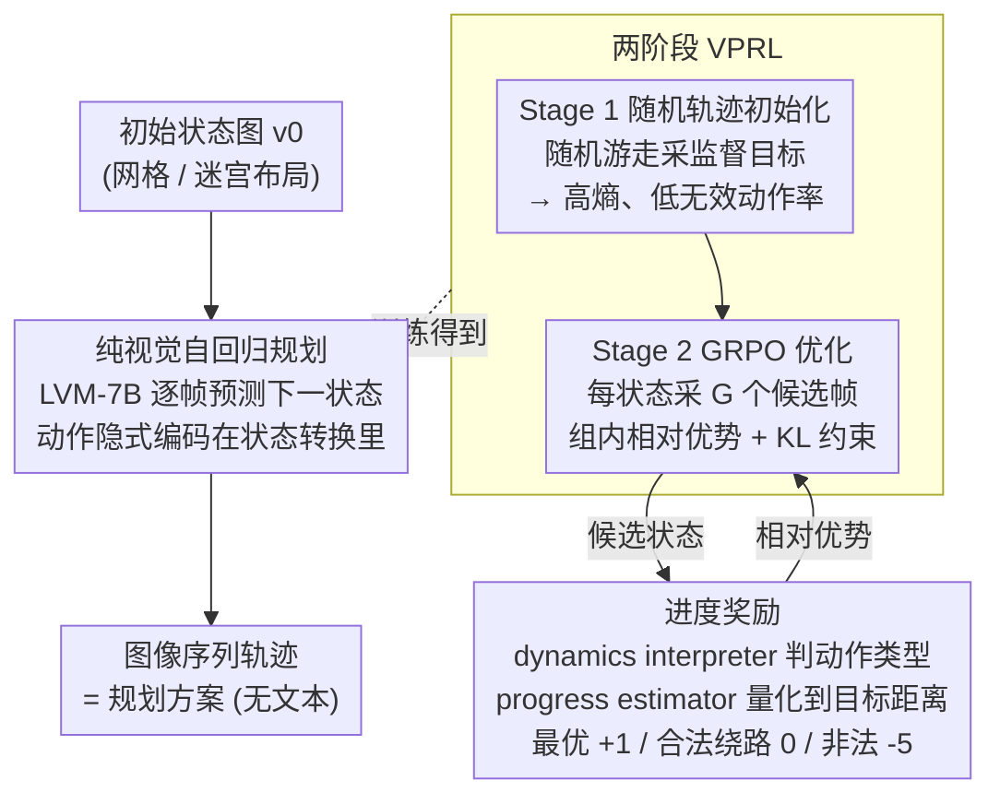

# Visual Planning: Let's Think Only with Images

**会议**: ICLR 2026 Oral  
**arXiv**: [2505.11409](https://arxiv.org/abs/2505.11409)  
**代码**: [GitHub](https://github.com/yix8/VisualPlanning)  
**领域**: 机器人  
**关键词**: 视觉规划, 纯图像推理, 大视觉模型, GRPO, 强化学习, 导航

## 一句话总结

提出Visual Planning——首个纯视觉推理范式：规划过程完全由图像序列表达（无文本中介），用Large Vision Model自回归生成逐步状态图像；引入VPRL两阶段RL框架（随机轨迹初始化探索+GRPO进度奖励优化），在FrozenLake/Maze/MiniBehavior三个导航任务上平均EM超越文本推理方法27%，证明"vision-first"任务中图像推理远优于文本推理。

## 研究背景与动机

**领域现状**：LLM/MLLM在推理中取得巨大进展，但所有推理过程均在文本空间进行——即使输入包含图像，也先将视觉信息描述为文本再推理。认知科学的Dual Coding Theory指出人类认知同时拥有语言和非语言两个独立通道，空间任务中视觉想象比语言更高效。

**现有痛点**：
   - (1) 空间/几何任务中，视觉信息→文本描述→丢失关键空间特征，造成modality gap
   - (2) Visual Sketchpad等方法用工具生成辅助视觉，但推理决策仍在文本空间完成
   - (3) MVoT生成可视化辅助文本推理，但本质仍是文本驱动的tool-use范式
   - (4) 尚无真正的纯视觉推理范式——所有现有方法最终都依赖文本做决策

**切入角度**：彻底去除文本中介→规划=图像序列→每张图代表一个环境状态→动作隐式编码在状态转换中→用纯视觉数据训练的LVM避免语言干扰。

**RL的动机**：RL已在文本推理中展现出显著优于SFT的泛化能力（DeepSeek-R1），但从未被应用于图像生成式推理/规划场景。

**SFT的不足**：监督学习（VPFT）仅模仿训练分布中的轨迹，缺乏对多样action的探索，容易过拟合且无法从错误中学习。

**评估挑战**：视觉输出是高维稀疏的，不像文本token可以直接评判对错，需要设计专门的dynamics interpreter和progress estimator来评估生成图像是否代表有意义的规划进展。

## 方法详解

### 整体框架

这篇论文想回答一个问题：在空间规划任务（走迷宫、网格导航）里，把推理过程完全放在图像空间、不经任何文本中介，会不会比"先把图像描述成文字再推理"更强。它的做法是把"规划"重新定义成图像序列生成：给定初始状态图 $v_0$，一个仅在图像/视频上预训练的大视觉模型（Large Vision Model，LVM-7B，训练时零文本数据）自回归地一步步画出后续状态图，整条轨迹 $\hat{\mathcal{T}} = (\hat{v}_1, \ldots, \hat{v}_n)$ 就是规划方案——动作（往哪走）隐式藏在相邻两帧的变化里，全程不输出一个文字。

光让模型会"画下一帧"还不够，得让它画出**通向目标的合法**下一帧，这靠一套两阶段强化学习框架 VPRL（Visual Planning via RL）来训：Stage 1 先用随机轨迹把策略初始化成一个"会动、且保持充分探索"的模型，Stage 2 再用 GRPO 配合一个**进度奖励**，把它优化成"专挑通向目标的合法动作"的规划器。其中进度奖励负责把每一帧画得好不好翻译成可优化的标量信号，是连接"画图"和"规划"的关键一环。

### 关键设计

**1. 纯视觉自回归规划：把动作藏进状态转换里**

空间规划任务的状态本就是空间布局，用文字描述坐标既冗长又容易错——论文统计发现约 25.7% 的坐标/布局描述与真实环境对不上，这个 modality gap 正是文本推理在此类任务上吃亏的根源。Visual Planning 干脆让模型在图像空间里直接预测"下一帧"，每一步条件依赖全部历史状态 $\hat{v}_i \sim \pi_\theta(v_i \mid v_0, \hat{v}_1, \ldots, \hat{v}_{i-1})$，"往哪走"这个动作隐式编码在相邻状态图的变化里，不需要显式输出任何符号。backbone 特意选只在图像/视频上预训练、完全没碰过文字的 LVM-7B，是为了切断"语言能力"这个 confound——只有这样，"纯视觉推理是否真的更强"的结论才不会被模型自带的文本能力污染。

**2. 两阶段 VPRL：先喂饱探索能力，再上 RL**

一个反直觉的坑是：直接拿监督学好的模型（VPFT，用最优轨迹做 teacher-forcing）当 RL 初始策略，探索会立刻崩溃——训练后模型 entropy 迅速趋零，对同一状态采样出的候选动作几乎一模一样，于是组内候选拿到的奖励全相同、相对优势全是零，GRPO 根本没有梯度可更新。Stage 1 专门解决这点：不学最优轨迹，而是在环境里**随机游走**收集轨迹，每步从所有合法的下一状态里**随机采样一个**当监督目标，最小化

$$\mathcal{L}_{\text{VPFT}}(\theta) = -\mathbb{E}_{(v_{\leq i}, \tilde{v}_{i+1})} \left[\log \pi_\theta(\tilde{v}_{i+1} \mid v_{\leq i})\right]$$

训出来的模型 entropy 接近均匀随机规划器、无效动作率又低，正好给 Stage 2 留足探索空间。Stage 2 在此基础上对每个状态采 $G$ 个候选下一帧，按奖励算组内相对优势 $A^{(k)}$，用带 KL 约束的 GRPO 目标更新策略：

$$\mathcal{J}_{\text{VPRL}}(\theta) = \mathbb{E}\left[ \frac{1}{G}\sum_{k=1}^{G} \min\left(\rho^{(k)} A^{(k)},\; \text{clip}(\rho^{(k)}, 1-\epsilon, 1+\epsilon) A^{(k)}\right) - \beta D_{\text{KL}}(\pi_\theta \| \pi_{\text{ref}}) \right]$$

消融证实改进几乎全部来自 Stage 2，但没有 Stage 1 撑起探索，Stage 2 就无从优化——两个阶段缺一不可。

**3. 进度奖励：用环境语义给"画出来的状态"打分**

视觉输出是高维稀疏的，没法像文本 token 那样逐位匹配对错，所以 Stage 2 的相对优势需要一个环境级别的语义信号来计算。论文为此引入两个组件：dynamics interpreter $\mathcal{D}$ 解析相邻两帧对应的动作类型（论文实现为规则解析，也可换成 dynamics 模型或神经判别器），progress estimator $P$ 用 BFS 预先算出每个格点到目标的剩余步数。两者把每个候选状态分成三档给奖励：

$$r(v_i, \hat{v}_{i+1}^{(k)}) = \alpha_{\text{opt}} \cdot \mathbb{I}[\mathcal{D}(\cdot) \in \mathcal{A}_{\text{opt}}] + \alpha_{\text{nopt}} \cdot \mathbb{I}[\mathcal{D}(\cdot) \in \mathcal{A}_{\text{nopt}}] + \alpha_{\text{inv}} \cdot \mathbb{I}[\mathcal{D}(\cdot) \in \mathcal{E}_{\text{inv}}]$$

三档系数分别是：让到目标距离变小的最优动作 $\alpha_{\text{opt}}=1$、合法但没前进的绕路动作 $\alpha_{\text{nopt}}=0$、穿墙等非法动作 $\alpha_{\text{inv}}=-5$。这样既鼓励朝目标前进、又容忍合法绕路、还对非法状态重罚，把策略牢牢约束在合法动作空间里找最短路径。

## 实验关键数据

### 表1: 主实验——各方法在三个导航任务上的表现

| 方法 | 输入→输出 | FrozenLake EM | FrozenLake PR | Maze EM | Maze PR | MiniBehavior EM | MiniBehavior PR | 平均EM | 平均PR |
|------|-----------|-------------|-------------|---------|---------|----------------|----------------|--------|--------|
| Gemini 2.0 Flash Direct | 图+文→文 | 21.2 | 47.6 | 8.3 | 31.4 | 0.7 | 29.8 | 10.1 | 36.3 |
| Gemini 2.0 Flash CoT | 图+文→文 | 27.6 | 52.5 | 6.9 | 29.8 | 4.0 | 31.2 | 12.8 | 37.8 |
| Gemini 2.5 Pro (think) | 图+文→文 | 72.0 | 85.0 | 21.5 | 35.5 | 37.6 | 59.9 | 43.7 | 60.1 |
| Qwen2.5-VL Direct | 图+文→文 | 1.2 | 15.0 | 0.6 | 14.5 | 0.3 | 9.8 | 0.7 | 13.1 |
| Qwen2.5-VL CoT | 图+文→文 | 8.2 | 29.1 | 2.3 | 15.2 | 0.5 | 14.7 | 3.7 | 19.7 |
| Qwen2.5-VL SFT | 图+文→文 | 68.6 | 84.4 | 60.9 | 70.3 | 31.3 | 56.1 | 53.6 | 69.9 |
| LVM VPFT (ours) | 图→图 | 75.4 | 79.5 | 59.0 | 64.0 | 33.8 | 52.2 | 56.1 | 65.2 |
| **LVM VPRL (ours)** | **图→图** | **91.6** | **93.2** | **74.5** | **77.6** | **75.8** | **83.8** | **80.6** | **84.9** |

### 表2: 文本规划变体在FrozenLake上的对比

| 方法 | EM (%) | PR (%) |
|------|--------|--------|
| Qwen2.5-VL SFT Direct | 68.6 | 84.4 |
| Qwen2.5-VL SFT w/ Coordinates | 74.4 | 82.7 |
| Qwen2.5-VL SFT w/ ASCII | 73.1 | 83.4 |
| Qwen2.5-VL GRPO w/ VPRL reward | 54.4 | 69.9 |
| Qwen2.5-VL GRPO w/ PR metric reward | 60.1 | 74.3 |

发现：文本规划即使加入坐标/ASCII等增强表示，RL也无法超越SFT基线→证明瓶颈在modality gap而非训练方法。

## 关键发现

1. **视觉规划全面碾压文本推理**：VPRL平均EM 80.6% vs 文本SFT最佳 53.6%（+27%），在MiniBehavior上差距最大（75.8% vs 31.3%），说明任务越复杂视觉推理优势越大。

2. **文本RL在多模态输入下失效**：与纯文本domain不同，RL用于文本+图像输入的规划任务反而不如SFT（54.4% vs 68.6%），瓶颈在于视觉信息→文本grounding的modality gap，约25%的布局描述与真实不匹配。

3. **随机初始化是RL成功的关键**：VPFT的entropy训练后趋近零导致探索崩溃；Stage 1随机轨迹初始化使entropy接近均匀分布且无效动作率低，为Stage 2 RL提供充分的探索空间。

4. **VPRL大幅减少无效动作**：失败轨迹中包含无效动作的比例——VPFT为61%~78%，VPRL降低至少24%，说明VPRL有效约束模型在合法动作空间内规划。

5. **VPRL在复杂度缩放时更鲁棒**：FrozenLake从3×3到6×6，Gemini 2.5 Pro EM从98%跌至38.8%，而VPRL从97.6%仅降至82.4%，展现出更平缓的性能曲线。

## 亮点

- **"首个纯视觉推理"**：之前所有"视觉推理"工作最终都在文本空间决策，Visual Planning真正实现了全程图像空间推理——人类画草图解空间题的AI版本。
- **首次将RL应用于图像生成式规划**：将DeepSeek-R1的RL→推理成功范式从文本跨模态迁移到图像生成，开辟全新研究方向。
- **Dual Coding Theory的计算验证**：Paivio假设视觉和语言是独立推理通道，本文首次在计算实验层面证实这一认知科学假说。
- **两阶段设计精巧合理**：Stage 1随机初始化解决RL探索问题的方案简洁有效，比直接VPFT初始化好得多。

## 局限性

1. **任务范围有限**：仅验证了三个grid-based导航任务（FrozenLake/Maze/MiniBehavior），尚未扩展到连续空间、3D环境、或真实机器人场景。
2. **环境约束依赖规则解析**：dynamics interpreter和progress estimator目前基于规则（而非学习），限制了向复杂/未知环境的推广。
3. **图像分辨率和复杂度有限**：当前环境图像为简单grid渲染，对于真实场景的高分辨率复杂图像的可扩展性未知。
4. **训练成本未充分讨论**：两阶段RL+GRPO的训练开销、采样效率等关键工程问题缺乏详细分析。
5. **与语言的互补性未探索**：论文将视觉规划定位为文本推理的替代而非补充，但实际中两种模态的融合可能更优。

## 相关工作对比

### vs Visual Sketchpad (Hu et al., 2024)
Visual Sketchpad用外部工具生成草图/可视化辅助MLLM推理，但**推理决策仍完全在文本空间**——视觉只是辅助展示。Visual Planning则完全在图像空间推理，无文本参与，是根本性的范式转变。

### vs MVoT (Li et al., 2025)
MVoT为每个文本推理步生成可视化，但本质上仍是"文本推理+视觉tool-use"：模型先在文本中决定action，再自调用生成可视化验证。Visual Planning不需要文本决策环节，action隐式编码在图像状态转换中，从根本上消除modality gap。

### vs Action-conditional Generative Models (Hafner et al., 2019; Ha & Schmidhuber, 2018)
世界模型（如Dreamer）学习状态转换动力学用于model-based RL，但它们**不执行规划**——需要耦合外部planner。VPRL则是一个自包含的holistic planner，将规划内化于视觉生成流程中，无需外部规划器。

## 评分

- **新颖性**: ⭐⭐⭐⭐⭐ 纯视觉推理范式+VPRL框架均属首创，GRPO首次用于图像生成式规划
- **实验充分度**: ⭐⭐⭐⭐ 3个导航任务+难度缩放+消融+误差分析全面，但任务类型偏窄
- **写作质量**: ⭐⭐⭐⭐⭐ 认知科学动机清晰，范式对比直观，公式和图表规范
- **价值**: ⭐⭐⭐⭐⭐ 开辟纯视觉推理新方向，对多模态推理社区有重要启发意义

<!-- RELATED:START -->

## 相关论文

- [\[ICLR 2026\] Sparse Imagination for Efficient Visual World Model Planning](sparse_imagination_for_efficient_visual_world_model_planning.md)
- [\[CVPR 2026\] Instance-level Visual Active Tracking with Occlusion-Aware Planning](../../CVPR2026/robotics/instance-level_visual_active_tracking_with_occlusion-aware_planning.md)
- [\[CVPR 2026\] ForeAct: Steering Your VLA with Efficient Visual Foresight Planning](../../CVPR2026/robotics/foreact_steering_your_vla_with_efficient_visual_foresight_planning.md)
- [\[NeurIPS 2025\] ThinkAct: Vision-Language-Action Reasoning via Reinforced Visual Latent Planning](../../NeurIPS2025/robotics/thinkact_vision-language-action_reasoning_via_reinforced_visual_latent_planning.md)
- [\[CVPR 2026\] Progress-Think: Semantic Progress Reasoning for Vision-Language Navigation](../../CVPR2026/robotics/progress-think_semantic_progress_reasoning_for_vision-language_navigation.md)

<!-- RELATED:END -->
