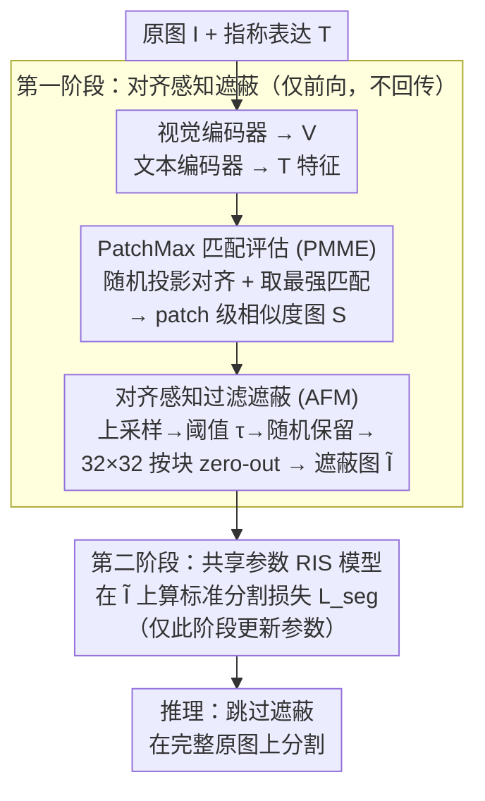

# AMLRIS: Alignment-aware Masked Learning for Referring Image Segmentation

**会议**: ICLR 2026  
**arXiv**: [2602.22740](https://arxiv.org/abs/2602.22740)  
**代码**: [GitHub](https://github.com/pipashu1/AMLRIS)  
**领域**: 图像分割  
**关键词**: referring image segmentation, vision-language alignment, masked learning, cross-modal similarity  

## 一句话总结
提出对齐感知遮蔽学习(AML)策略，通过量化视觉-语言 patch 级对齐度并过滤低对齐像素，让 RIS 模型在训练时聚焦可靠区域，无需架构改动即在 RefCOCO 全部 8 个 split 上达到 SOTA。

## 背景与动机

**领域现状**：指称图像分割(referring image segmentation, RIS)要根据一句自然语言表达(如"离人最近的长颈鹿")精准分割出图中目标对象，核心依赖视觉与语言在像素/patch 级的精细对齐。主流方法(LAVT/CARIS/DETRIS)沿着"分别编码视觉与文本特征，再用越来越复杂的融合模块对齐"这条路走。

**现有痛点**：这类方法隐含假设"图中所有区域都同等重要"，对**全部像素**施加分割损失。但 RIS 每个样本通常只标注一个目标，监督信号本就稀疏；在密集损失下，与表达无关区域回传的梯度会主导训练，模型容易过拟合到无关区域。数据增强路线(翻转/颜色抖动)又会破坏指称表达的语义一致性——翻转让"在左边"失效，颜色抖动让"红衣女子"失真。

**核心思路**：与其用更复杂的融合去建模所有关系，本文反其道而行——先把"对不上表达"的区域剔除出去。在优化前量化每个 patch 与表达的对齐度，把弱对齐像素从监督信号里遮掉，让模型只在"看得懂、对得上"的可靠区域回传梯度。

## 方法详解

### 整体框架

AMLRIS 不改动任何 RIS 模型结构，只在训练时套一个"对齐感知遮蔽"的两阶段前向、且两阶段共享同一套参数。**第一阶段（仅前向、不回传）**：把原图 $I$ 和指称表达 $T$ 送进视觉/文本编码器，由 PatchMax 匹配评估(PMME)算出 patch 级的视觉-语言相似度图，再由对齐感知过滤遮蔽(AFM)把相似度低的区域翻译成一张图像遮蔽，对原图 zero-out 得到遮蔽图 $\tilde{I}$。**第二阶段**：把 $\tilde{I}$ 和 $T$ 再喂回同一套参数的 RIS 模型，用标准分割损失正常训练、只有这一阶段更新参数。换言之，模型始终只在"对得上表达"的像素上回传梯度。推理时遮蔽阶段被完全跳过，模型在完整原图上工作，因此零部署开销。

### 关键设计

**1. PatchMax 匹配评估(PMME)：用随机投影量化每个 patch 与表达的对齐度**

RIS 没有 patch 级对齐标签，无法直接知道哪些像素真正回应了表达；更麻烦的是视觉、文本骨干常非联合预训练、输出维度不一致，连相似度都没法直接算。PMME 先把视觉特征 $V$ 和文本特征 $T$ 做 $\ell_2$ 归一化，再用两个随机高斯矩阵 $W_i,W_t$ 把它们投影到同一个 $D_a$ 维公共空间，对齐维度的同时算相似度。用**随机投影而非可学习层**是关键：由 Johnson-Lindenstrauss 引理(论文给了 block-diagonal 投影下保持内积的定理)保证随机投影能高概率近似保持跨模态内积与角度结构，因此对齐度量有数学依据、无需额外训练、也不引入可学习偏置。投影后按列做 SoftMax 归一化得相似度，每个 patch 不取平均、而是取它与**最强匹配** token 的最大相似度（即"PatchMax"）——一个像素只要与表达中某个词高度对应就应判为强对齐，取最大比取均值更能反映这种局部命中。

**2. 对齐感知过滤遮蔽(AFM)：把弱对齐 patch 翻译成图像层面的遮蔽**

有了 patch 级对齐分数后，需要落到像素并决定遮蔽哪些区域。AFM 先把相似度图双线性上采样到像素级（顺带把对齐分数传播到邻域、增强空间一致性），再用阈值 $\tau$ 把低于阈值的像素收进弱对齐候选集；为避免过度过滤把潜在有用区域全删掉，弱对齐像素并非全遮，而是按 dropout 比例 $\rho$ 随机保留一部分。最后以 $B^h\times B^w$（实现取 $32\times32$）的块为单位聚合：用 max 算子做"任一像素弱对齐就整块遮蔽"的保守策略

$$M_{\text{block}}^{(p,q)}=\max_{(m,n)\in\mathcal{B}^{(p,q)}}\mathbb{I}\big[(m,n)\in\mathcal{P}_{\text{selected}}\big],\quad \tilde{I}=I\odot(1-M_{\text{block}})$$

并对输入图像直接 zero-out。按块而非按像素遮蔽，是为了让被屏蔽区域成片、避免破碎的椒盐式遮蔽干扰卷积感受野；代价是粗粒度块在小目标场景下可能误覆盖目标本身。

### 损失函数 / 训练策略

损失仍是基线 RIS 模型自带的标准分割损失 $\mathcal{L}_{seg}$，**不引入任何额外正则或对齐损失项**——AML 的全部作用都体现在"在哪些像素上算这个损失"，而非改写损失本身。两阶段前向共享同一套参数、第一阶段只前向不回传，整体只比基线 CARIS 多约 $4.9\%$ 显存和 $17.2\%$ 训练时间，换来推理时零开销。

## 实验关键数据

### 主实验（mIoU）

| 方法 | RefCOCO val | testA | testB | RefCOCO+ val | testA | testB | RefCOCOg val | test | Avg |
|------|-------------|-------|-------|--------------|-------|-------|--------------|------|-----|
| LAVT | 74.46 | 76.89 | 70.94 | 65.81 | 70.97 | 59.23 | 63.34 | 63.62 | 68.0 |
| CGFormer | 76.93 | 78.70 | 73.32 | 68.56 | 73.76 | 61.72 | 67.57 | 67.83 | 71.1 |
| CARIS* | 76.77 | 79.03 | 74.56 | 69.33 | 74.51 | 62.69 | 68.87 | 68.51 | 71.8 |
| MagNet | 77.43 | 79.43 | 74.11 | 70.10 | 74.50 | 63.59 | 68.53 | 69.15 | 72.1 |
| **AMLRIS** | **77.89** | **79.53** | **74.99** | **71.33** | **75.61** | **64.61** | **69.24** | **69.73** | **72.9** |

### 消融实验

| 配置 | RefCOCO val mIoU | 说明 |
|------|-----------------|------|
| CARIS 基线 | 76.77 | 无遮蔽 |
| +随机遮蔽（Random Mask） | 76.92 | 随机遮蔽效果微弱 |
| +PMME+AFM (完整 AML) | **77.89** | 对齐感知遮蔽有效 |
| AML 集成到 DETRIS | 75.64→76.12 | 跨架构一致提升 |
| AML 集成到 ReLA | +0.5-1.0 | 同样有效 |

### 跨数据集鲁棒性

| 扰动场景 | CARIS baseline | AMLRIS |
|---------|---------------|--------|
| 标准评估 | 69.33 | **71.33** |
| 遮挡 | 65.1 | **68.4** |
| 噪声 | 64.8 | **67.9** |
| 模糊 | 66.2 | **69.1** |
| 色彩变换 | 67.5 | **70.2** |

### 关键发现
- 全部 8 个 split 均达到 SOTA，平均 mIoU 72.9（+0.8 vs MagNet）
- oIoU 指标同样全面最优，RefCOCO+ val 达 67.37（+1.83 vs CARIS）
- 随机遮蔽几乎无效（+0.15），证明对齐感知的遮蔽选择是关键
- 在遮挡/噪声等扰动场景下优势更加明显（+3.1-3.3），表明模型学到了更鲁棒的对齐特征
- 额外开销很小：仅增加 4.9% 显存和 17.2% 训练时间，推理时完全无开销（遮蔽阶段被跳过）
- 可无缝集成到 DETRIS/CARIS/ReLA 等多种 RIS 框架

## 亮点与洞察
- **即插即用训练策略**：不修改模型架构、不增加推理成本——纯训练阶段的改进，部署零代价
- **理论保证**：用 Johnson-Lindenstrauss 引理严格证明随机投影保持跨模态内积，对齐度量有数学依据
- **反直觉有效性**：训练时从未见过完整图像（总有部分被遮蔽），但推理时在完整图像上表现更好——说明过滤弱对齐区域确实消除了误导性梯度
- **PatchMax 匹配策略**：每个 patch 取与最强匹配 token 的相似度，比平均匹配更能反映局部对齐质量

## 局限与展望
- 阈值 $\tau=0.4$ 和 dropout 比例 $\rho=0.25$ 需要手动调节，不同数据集可能需要不同设置
- 随机投影的对齐度量基于初始特征相似度，可能遗漏深层语义对齐（训练后期特征空间变化）
- 两阶段前向带来 17.2% 训练时间增加，在大规模数据上可能成为瓶颈
- 仅在 RefCOCO 系列评估，未验证在开放词汇/大规模/更复杂场景下的泛化性
- Block 粒度遮蔽（32×32）可能在小目标场景下误覆盖目标区域

## 相关工作与启发
- **vs CARIS/LAVT/DETRIS**：本文 baseline 和对比方法，通过融合架构提升对齐，但都用全像素损失——AML 从优化信号角度创新
- **vs MaskRIS/NeMo/MagNet**：数据增强路线的 RIS 改进，但仍对全像素施加损失；AML 直接抑制低质量梯度
- **vs CRIS**：基于 CLIP 的像素级适配方法，在预训练特征空间做对齐；AML 可在任意 backbone 上使用

## 评分
- 新颖性: ⭐⭐⭐⭐ 对齐感知遮蔽思路简洁新颖，PatchMax + JL 投影有理论支撑
- 实验充分度: ⭐⭐⭐⭐ 全 split SOTA + 鲁棒性评估 + 跨架构验证 + 消融完整
- 写作质量: ⭐⭐⭐⭐ 理论推导清晰，算法伪代码完整
- 价值: ⭐⭐⭐⭐ 通用训练策略，可即插即用到现有 RIS 方法中

<!-- RELATED:START -->

## 相关论文

- [\[CVPR 2026\] Phrase-Instance Alignment for Generalized Referring Segmentation](../../CVPR2026/segmentation/phrase-instance_alignment_for_generalized_referring_segmentation.md)
- [\[CVPR 2026\] SARMAE: Masked Autoencoder for SAR Representation Learning](../../CVPR2026/segmentation/sarmae_masked_autoencoder_for_sar_representation_learning.md)
- [\[CVPR 2026\] InterRVOS: Interaction-Aware Referring Video Object Segmentation](../../CVPR2026/segmentation/interrvos_interaction-aware_referring_video_object_segmentation.md)
- [\[ICLR 2026\] Efficient-SAM2: Accelerating SAM2 with Object-Aware Visual Encoding and Memory Retrieval](efficient-sam2_accelerating_sam2_with_object-aware_visual_encoding_and_memory_re.md)
- [\[AAAI 2026\] RS2-SAM2: Customized SAM2 for Referring Remote Sensing Image Segmentation](../../AAAI2026/segmentation/rs2-sam2_customized_sam2_for_referring_remote_sensing_image_segmentation.md)

<!-- RELATED:END -->
