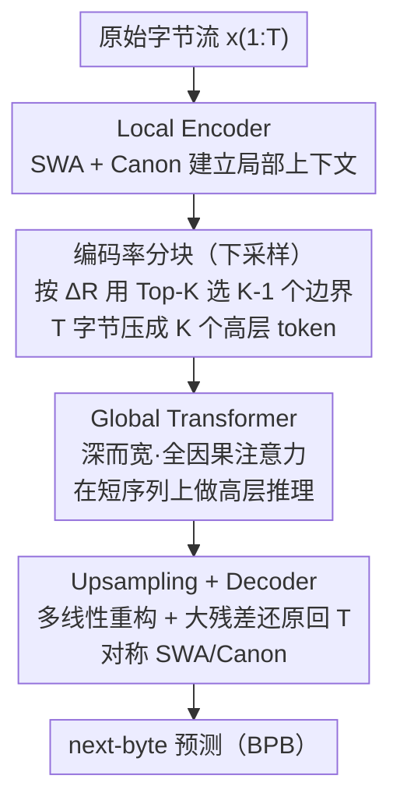

# ByteFlow: Language Modeling through Adaptive Byte Compression without a Tokenizer

**会议**: ICLR 2026  
**arXiv**: [2603.03583](https://arxiv.org/abs/2603.03583)  
**代码**: 未公开  
**领域**: NLP / tokenizer-free LM（被分到 segmentation 分区）  
**关键词**: byte-level LM, tokenizer-free, coding rate, hierarchical architecture, self-tokenization  

## 一句话总结
提出 ByteFlow Net，一种无需分词器的分层字节级语言模型，利用信息论中的编码率(coding rate)自适应地将原始字节流压缩为语义单元，在预训练损失和下游任务上超越 BPE 基线和已有字节级架构。

## 背景与动机

**领域现状**：现代 LLM 都建立在固定的 BPE 分词器之上，分词器一旦训练完成，模型就只能在这个固定粒度上操作。

**现有痛点**：固定分词会在计数、算术、结构化数据、多语言等场景下暴露脆弱甚至反直觉的行为；更根本的问题是，分词是整条流水线里唯一不可学习的阶段，它把语言建模从端到端切成了两截。已有的无分词方案各有短板——纯字节级模型（如 MambaByte）序列动辄数千、全注意力计算昂贵；启发式分块（固定步长、空格边界）带着很强的人为归纳偏置；动态分块方法（如 BLT 用预训练熵模型加全局阈值）需要多阶段训练，并非真正端到端。

**核心矛盾**：要让模型自己学会"在哪里切分"，就得有一个既有原则、又能在线决定边界的准则，同时还不能破坏静态计算图（否则 batch 内长度抖动会导致显存分配不一致甚至 OOM）。

**本文目标**：提出一个完全端到端、无需任何分词器或熵模型的分层字节级语言模型，用信息论中的编码率自适应地把原始字节压缩成语义单元，并把绝大部分算力集中在压缩后的短序列上。

## 方法详解

### 整体框架

ByteFlow Net 想解决的是"分词器写死了建模粒度"这件事：与其依赖外部分词器，不如让模型自己在线决定把原始字节切在哪里。它是一条五阶段的分层流水线——原始字节先经 Local Encoder 做字节级上下文化，再由编码率分块（即下采样 Downsampling）把 $T$ 个字节压缩成 $K \ll T$ 个高层 token，交给又深又宽的 Global Transformer 做语义级推理，最后通过 Upsampling 还原回字节粒度、由结构对称的 Decoder 做 next-byte 预测。贯穿始终的核心思想有两条：一是把绝大部分算力集中在压缩后的短序列上，而字节级的进出两端始终保持轻量；二是分块边界不靠固定步长或空格等启发式，而用信息论中的编码率在线决定哪些位置信息量最大、值得被提升为高层 token。

### 关键设计

**1. Local Encoder：用极低开销在字节级建立局部上下文**

字节序列动辄数千，直接做全注意力的 $O(T^2)$ 代价无法承受，所以 Local Encoder 用一个浅而窄的 Transformer，把注意力限制在滑动窗口（sliding-window attention，SWA）内，复杂度降到 $O(T \cdot w_{local})$。但 SWA 单独用有个连通性硬伤——信息要跨越整段序列，理论上需要堆 $T/w_{local}$ 层才能让每个字节看到彼此，对长序列意味着极深的编码器和不稳定的训练。为此每层额外插入一个 Canon Layer（Allen-Zhu, 2025），本质是一个 kernel=4 的因果一维卷积

$$Canon(h_t) = w_0 \odot h_t + w_1 \odot h_{t-1} + w_2 \odot h_{t-2} + w_3 \odot h_{t-3}$$

它以接近零的参数和算力补足相邻字节的混合，让浅层网络也能快速形成可靠的局部表征，供下一步分块使用。

**2. 编码率分块：用编码率把"该在哪里切"变成信息论优化**

这是全文的核心创新，也对应框架图里的下采样这一步。给定 Local Encoder 输出的字节特征，定义其有损编码率（lossy coding rate）

$$R_\varepsilon(h_{1:T}) = \frac{1}{2} \log \det\!\Big(I + \frac{d_{local}}{\varepsilon^2} h_{1:T} h_{1:T}^\top\Big)$$

其中 $\varepsilon^2$ 是控制灵敏度的噪声方差。这个量度量这组特征在表示空间里张开了多少独立方向，编码率越大说明承载的信息越多。在此之上算每个位置的边际编码率 $\Delta R_t = R_\varepsilon(h_{1:t}) - R_\varepsilon(h_{1:t-1})$，即第 $t$ 个字节相对前文带来的信息增益——增益大的位置正是语义自然断点，应当被提升为高层 token。具体做法：先固定第 1 个位置（BOS），再从 $t\in\{2,\dots,T\}$ 中挑出 $\Delta R_t$ 最大的 $K-1$ 个位置、按时间排序得到 $K$ 个边界。作者特意用 **Top-K** 选最大的若干 $\Delta R_t$，而不是设一个全局阈值，原因有二：阈值是个难调又难解释的"magic number"；更关键的是阈值会让每条样本切出不定数量的 chunk，导致 ragged tensor、显存分配抖动甚至 OOM，而 Top-K 固定输出长度 $K$、维持静态计算图。直观上模型学到的边界也很合理——把它对每个字符打的编码率分数画出来，词首字母和关键实体的分数明显更高，词内可预测的字符分数更低，等于自动找到了信息密集点。这样一来，"算力该花在哪些位置"就被表述成一个有原则的信息编码成本问题，而不是拍脑袋的归纳偏置。

**3. Global Transformer：把算力集中到压缩后的短序列做高层推理**

分块后序列长度从 $T$ 降到 $K$，于是可以负担一个又深（$G$ 层）又宽（$d_{global} \gg d_{local}$）的全因果注意力 Transformer $g_{1:K} = \text{Transformer}_{global}(z_{1:K})$ 来建模高层语义。由于 $K \ll T$，这一段虽然承担了主要计算量（$\approx O(G \cdot K^2 \cdot d_{global}^2)$），绝对开销却远小于在原始字节上做同等深度的注意力——分层设计的意义正在于此：把模型容量花在最该花的抽象层面，而进出两端的字节处理保持轻量。

**4. Upsampling + Decoder：把全局语义还原回字节并预测下一字节**

上采样要把 $K$ 个全局 token 还原回 $T$ 个字节位置。作者用多线性重构（multi-linear reconstruction）：每个字节位置依据它在所属 chunk 内的相对位置落入某个 bin（默认 $B=16$ 个 bin，bin 间共享参数以压低开销），选用对应的投影矩阵 $W_{bin(t)}$ 把全局表示映射回字节粒度，再通过一个大的残差连接 $s_t = h_t + \tilde{s}_t$ 把 Local Encoder 的局部细节与全局上采样信息加在一起，缓解压缩带来的信息损失。Decoder 在结构上与 Local Encoder 完全对称（同样是 SWA + Canon），在还原后的字节序列上做 next-byte 预测。

### 损失函数 / 训练策略

训练用标准的下一字节交叉熵，按字节归一化为 Bits-Per-Byte (BPB) 以便和不同分词粒度的模型公平比较。优化器为 AdamW，学习率 1e-3，梯度裁剪 1.0，batch size 8，序列长度按 8192→3200→8192 调度，在 FineWeb-Edu-100B（约 500B 字节）上预训练。

## 实验关键数据

### 主实验

| 模型 (1.3B, 500B tokens) | HellaSwag | WinoGrande | BoolQ | PIQA | ARC-e | ARC-c | Avg |
|---|---|---|---|---|---|---|---|
| LLaMA (BPE) | 54.12 | 53.74 | 73.26 | 70.43 | 72.38 | 36.95 | 60.15 |
| MambaByte | 49.21 | 52.97 | 72.48 | 69.67 | 71.53 | 36.42 | 58.71 |
| SpaceByte | 48.76 | 53.15 | 72.04 | 69.18 | 71.12 | 36.05 | 58.38 |
| AU-Net | 50.34 | 54.12 | 73.85 | 74.87 | 72.91 | 37.43 | 60.59 |
| **ByteFlow Net** | **55.42** | **56.93** | **76.48** | **74.25** | **75.87** | **40.36** | **63.19** |

### 消融实验

| 分块策略 | BPB | Avg Score | 说明 |
|---------|-----|-----------|------|
| 固定步长 | 0.75 | 57.2 | MegaByte 风格 |
| 空格分词 | 0.73 | 58.4 | SpaceByte 风格 |
| 余弦相似度 | 0.71 | 60.1 | H-Net 风格 |
| **编码率 (ByteFlow)** | **0.68** | **63.2** | 信息论驱动最优 |

### 关键发现
- ByteFlow 在 1.3B 规模上不仅超越所有字节级方法，还超越 BPE 基线 LLaMA（+3.04 平均分）
- Scaling 行为优越：从 600M→1.3B 的提升幅度大于其他方法
- 编码率分块在消融中大幅优于启发式分块（+3-6 分），证明信息论驱动的分割确实产生了更好的语义单元
- Top-K 选择策略保证了训练时内存分配一致，避免了动态分块方法的 OOM 问题

## 亮点与洞察
- **原则性分块**：编码率是一个有理论基础的信息度量——不是"感觉这里应该切"而是"信息论告诉我们这里应该切"
- **完全端到端**：无需预训练分词器或熵模型，整个流水线从字节到预测一体化
- **计算效率**：通过分层设计将大部分 FLOPs 分配给处理压缩表示的 Global Transformer，字节级处理保持轻量
- **流形保持**：作者分析发现编码率目标独有地保持了数据表示的几何结构（latent manifold），避免了其他分块方法的碎片化问题

## 局限与展望
- 仅在学术规模（≤1.3B, 500B tokens）验证，与工业级 BPE LLM 的差距在大规模下能否缩窄仍未知
- 只在 FineWeb-Edu 上预训练，多语言/代码/结构化数据等场景的表现待验证
- 编码率计算涉及 log det 运算（$O(T^3)$ 或近似），实际训练开销和近似误差未详细量化
- 下游评估仅覆盖 6 个零样本任务，缺少 MMLU/GSM8K 等更全面的评估
- Top-K 固定分块率可能不是所有输入的最优选择——信息密集的段落和冗余段落可能需要不同的压缩比

## 相关工作与启发
- **vs MegaByte/SpaceByte/AU-Net**：启发式分块方法，固定步长或空格边界；ByteFlow 的编码率分块是首个有原则性的方案
- **vs BLT**：BLT 用预训练熵模型做动态分块+全局阈值，是两阶段非端到端方案；ByteFlow 完全端到端
- **vs H-Net**（并行工作）：用余弦相似度做自适应分块；ByteFlow 用信息论编码率，保持了更好的流形几何
- **vs MambaByte**：纯字节级 SSM 模型，无分层结构；ByteFlow 分层设计效率更高

## 评分
- 新颖性: ⭐⭐⭐⭐⭐ 编码率驱动的自分割方案在理论和实践上都很优雅
- 实验充分度: ⭐⭐⭐ 规模较小（≤1.3B），下游 benchmark 有限，期待更大规模验证
- 写作质量: ⭐⭐⭐⭐ 清晰系统，理论动机阐述充分
- 价值: ⭐⭐⭐⭐ 无分词器 LM 方向的重要进展，可能改变语言模型的基础范式

<!-- RELATED:START -->

## 相关论文

- [\[CVPR 2026\] Masked Representation Modeling for Domain-Adaptive Segmentation](../../CVPR2026/segmentation/mrm_masked_representation_modeling_domain_adaptive.md)
- [\[ECCV 2024\] GiT: Towards Generalist Vision Transformer through Universal Language Interface](../../ECCV2024/segmentation/git_towards_generalist_vision_transformer_through_universal_language_interface.md)
- [\[CVPR 2026\] Exploring the Underwater World Segmentation without Extra Training](../../CVPR2026/segmentation/exploring_the_underwater_world_segmentation_without_extra_training.md)
- [\[CVPR 2026\] Direct Segmentation without Logits Optimization for Training-Free Open-Vocabulary Semantic Segmentation](../../CVPR2026/segmentation/direct_segmentation_without_logits_optimization_for_training-free_open-vocabular.md)
- [\[CVPR 2026\] Mixture of Prototypes for Test-time Adaptive Segmentation](../../CVPR2026/segmentation/mixture_of_prototypes_for_test-time_adaptive_segmentation.md)

<!-- RELATED:END -->
