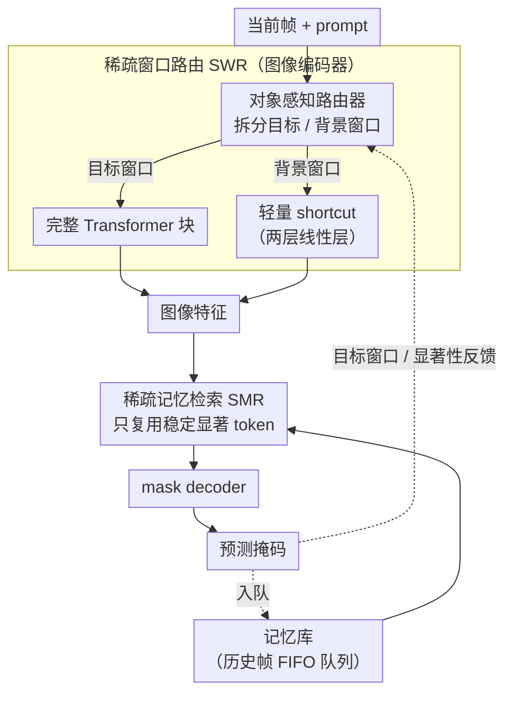

# Efficient-SAM2: Accelerating SAM2 with Object-Aware Visual Encoding and Memory Retrieval

**会议**: ICLR 2026  
**arXiv**: [2602.08224](https://arxiv.org/abs/2602.08224)  
**代码**: [GitHub](https://github.com/jingjing0419/Efficient-SAM2)  
**领域**: 视频分割 / 模型加速  
**关键词**: SAM2, video object segmentation, post-training acceleration, sparse window routing, memory compression  

## 一句话总结
发现 SAM2 存在类似生物视觉的稀疏感知模式（解码器聚焦前景但编码器广泛计算、记忆帧中仅少量 token 有效且显著性时间一致），据此提出 Efficient-SAM2，通过对象感知的稀疏窗口路由（SWR）和稀疏记忆检索（SMR）消除冗余计算，在 SAM2.1-L 上实现 1.68× 端到端加速且仅损失 1% 精度。

## 研究背景与动机

**领域现状**：SAM2 凭借流式记忆机制在视频目标分割（VOS）中取得了卓越性能，但大规模视觉 backbone 和逐帧记忆交互带来的计算开销极高，无法满足实时视频处理需求

**现有加速方案的局限**：EdgeTAM 通过蒸馏轻量模型+空间感知器压缩记忆来实现边缘级效率，但训练成本高且性能下降明显；ToMe 等通用 token merge 方法与 SAM2 的分层窗口注意力架构不兼容，在分割任务上精度严重劣化

**核心观察——稀疏感知模式**：作者通过可视化注意力矩阵发现两个关键冗余来源：
   - **编码器-解码器注意力不一致**：mask decoder 的 prompt-to-image 注意力高度集中在前景目标和潜在干扰物上，而上游 image encoder 不知道 prompt 兴趣，注意力分布广泛，产生大量对背景的无用计算
   - **记忆帧的时间一致性稀疏**：在记忆注意力中，同一记忆帧在被不同查询帧反复调用时，注意力集中在相同的少数 token 上（余弦相似度接近1），完全没必要每次重新计算全 token

**切入角度**：不修改 SAM2 架构，利用其自身的稀疏性完成后训练加速，最大化兼容性和部署便利性

## 方法详解

### 整体框架
Efficient-SAM2 不改动 SAM2 的网络结构，而是顺着它自身暴露出的稀疏感知模式，对两大延迟瓶颈分别动刀。视频逐帧流式处理，每帧先过图像编码器、再做记忆注意力、最后由 mask decoder 出掩码。瓶颈一在编码器：它对 prompt 兴趣一无所知、全图均匀计算，而下游 decoder 其实只关心前景——稀疏窗口路由（SWR）据此把背景窗口甩给一条轻量旁路，只对目标窗口跑完整 Transformer。瓶颈二在记忆注意力：同一记忆帧被反复调用时注意力总落在相同的少数 token 上——稀疏记忆检索（SMR）据此只让这批时间上稳定的显著 token 参与计算。两个模块各管一段、互相独立、可叠加，且都走后训练加速路线，几乎不重训原模型。decoder 的预测掩码还会反哺下一帧：既圈定 SWR 的目标窗口，又入队成为 SMR 的记忆帧。

### 关键设计

**1. 稀疏窗口路由 SWR：让编码器只算前景窗口**

编码器的痛点是它对 prompt 一无所知、全图均匀计算，而下游 decoder 的注意力其实高度集中在前景目标和干扰物上，背景上的算力基本白费。SWR 用一个对象感知路由器把当前帧拆成「目标相关」与「背景」两类窗口，只对前者跑完整 Transformer 块。目标窗口取并集 $\mathcal{W}_{obj} = \mathcal{W}_{pred} \cup \mathcal{W}_{salient}$：$\mathcal{W}_{pred}$ 来自前一帧候选预测掩码的 OR 结果所覆盖区域，并做膨胀（dilation）防止目标快速移动时越出窗口；$\mathcal{W}_{salient}$ 是抗干扰兜底——当跟踪置信度 $s_{obj}$ 低于阈值（$\theta_{obj}=5$）时，从前一帧 decoder 的交叉注意力里挑出累积显著性超阈值的窗口补进来，保证目标被遮挡或重现后还能重新锁定。背景窗口则被路由到极轻的 shortcut 旁路，仅两层线性层，参数量约 $d^2+2d$，相比完整块的 $12d^2+13d$ 几乎可忽略——这正是加速的来源：算力被腾给真正要紧的前景。

**2. 稀疏记忆检索 SMR：记忆帧只复用稳定的显著 token**

记忆注意力的冗余在于同一记忆帧被不同查询帧反复调用时，注意力总落在几乎相同的少数 token 上（首次回忆与后续的余弦相似度接近 1），每次重算全 token 纯属浪费。SMR 抓住这个时间一致性：记忆帧 $M_{t-1}$ 首次参与注意力时，在每层 $l$ 按平均注意力权重 $A_{t-1}^l$ 取 Top-$\lfloor(1-s)K\rfloor$ 个 token 当作显著性模式 $S_{t-1}^l$，存入 FIFO 检索队列；之后 $m+1$ 个时间步直接复用这份缓存，只让这些显著 token 参与计算。每层复杂度因此从 $O((m+1)NKd)$ 降到 $O(2NKd + (m-1)Nkd)$，其中 $k=\lfloor(1-s)K\rfloor \ll K$。稀疏率取 $s=0.95$（每帧只留 5% token），提示帧和最新帧保持完整不裁剪，整体稀疏率约 0.68——这套检索完全免训练，靠的就是"显著性模式跨帧稳定"这一观察。

### 损失函数 / 训练策略
SWR 的 shortcut 分支用重建损失 $\mathcal{L} = \|F_M^s - F_M^t\|_2^2$ 对齐其输出与原始记忆条件特征。重建目标特意选记忆条件特征而非原始编码特征或 decoder 特征——前者保留了适度背景信息供 shortcut 学习，又不会像 decoder 那样对背景强抑制导致分支学不到东西。整个训练只用 SA-V 训练集里 30 个无标签样本，在 A6000 上约 1 小时即可完成；SMR 则无需任何训练。

## 实验关键数据

### 主实验（SAM2.1-B+, Δt=1）

| 方法 | 加速模块 | SA-V test J&F | 加速比 |
|------|---------|---------------|--------|
| SAM2.1-B+ 原始 | - | 77.7 | 1.00× |
| ToMe | 编码器 | 55.3 | 1.36× |
| ALGM | 编码器 | 71.9 | 1.05× |
| **SWR (ours)** | 编码器 | **75.0** | **1.69×** |
| MemPool | 记忆 | 72.3 | 2.14× |
| SMR-random | 记忆 | 76.7 | 1.73× |
| **SMR (ours)** | 记忆 | **77.8** | **1.82×** |
| EdgeTAM (蒸馏) | 两者 | 72.1 | 1.63× |
| **Efficient-SAM2** | 两者 | **75.5** | **1.74×** |

### SAM2.1-L 模型结果

| 方法 | SA-V test J&F | DAVIS 2017 | 端到端加速 |
|------|---------------|------------|----------|
| 原始 | 79.2 | 89.9 | 1.00× |
| SWR | 77.5 | 89.7 | 1.83× |
| SMR | 79.3 | 89.9 | 1.78× |
| **SWR+SMR** | **78.2** | **89.5** | **1.68×** |

### 关键发现
- SWR 在编码器加速方面远超所有 token merge 方法（ToMe 56.4 vs SWR 75.0），因为窗口级路由与 SAM2 窗口注意力天然匹配
- SMR 在 95% 稀疏率下几乎无损（77.8 vs 77.7），验证了记忆帧显著性的时间一致性假设
- 在 DAVIS 2017 上 Efficient-SAM2 几乎无性能下降（89.3 vs 89.7），但在更具挑战性的 SA-V 和 MOSE 上有 1-3 点下降
- 对比 EdgeTAM：Efficient-SAM2 不需要大规模重训练，性能更高（75.5 vs 72.1），但加速略多（1.74× vs 1.63×）

## 亮点与洞察
- **后训练加速范式**：无需端到端重训练，仅需 30 个样本 1 小时训练 shortcut 分支，极大降低部署门槛
- **从稀疏感知模式出发**的设计思路精妙——不是强制裁剪模型，而是顺应模型自身行为消除冗余
- SMR 的首次回忆缓存+复用策略巧妙利用了时间一致性，设计极其简洁且几乎无开销
- SWR 利用解码器的注意力显著性反馈指导编码器的计算分配——跨模块信息复用的良好示范

## 局限与展望
- SWR 依赖前一帧预测质量估计目标窗口，跟踪失败或目标快速运动时可能级联恶化
- 稀疏率 $s=0.95$ 和置信度阈值 $\theta_{obj}=5$ 均为手工设定，自适应调整可能带来进一步提升
- 仅在半监督 VOS 设置下验证，交互式分割和多目标追踪场景的适用性未知
- shortcut 分支极为轻量，在复杂动态背景中可能丢失重要信息

## 相关工作与启发
- **vs EdgeTAM**：蒸馏法需全量训练，本文后训练加速更灵活、性能更优
- **vs ToMe/ALGM**：通用 ViT 加速方法在 SAM2 的窗口注意力架构上失效，本文窗口级路由是更合适的粒度
- **vs MemPool**：简单池化压缩记忆会损失细粒度信息（72.3），SMR 的选择性保留策略更精准（77.8）

## 评分
- 新颖性: ⭐⭐⭐⭐ 从 SAM2 稀疏感知模式出发设计针对性加速方案，角度独到
- 实验充分度: ⭐⭐⭐⭐ 4 个 VOS 基准 + 两种模型规模 + 完整消融 + 多种基线对比
- 写作质量: ⭐⭐⭐⭐ 观察-方案对应清晰，图示直观
- 价值: ⭐⭐⭐⭐⭐ 实用性极强，后训练加速 SAM2 有广泛工业需求

<!-- RELATED:START -->

## 相关论文

- [\[CVPR 2025\] A Distractor-Aware Memory for Visual Object Tracking with SAM2](../../CVPR2025/segmentation/a_distractor-aware_memory_for_visual_object_tracking_with_sam2.md)
- [\[AAAI 2026\] RS2-SAM2: Customized SAM2 for Referring Remote Sensing Image Segmentation](../../AAAI2026/segmentation/rs2-sam2_customized_sam2_for_referring_remote_sensing_image_segmentation.md)
- [\[ICLR 2026\] AMLRIS: Alignment-aware Masked Learning for Referring Image Segmentation](amlris_alignment-aware_masked_learning_for_referring_image_segmentation.md)
- [\[CVPR 2026\] V²-SAM: Marrying SAM2 with Multi-Prompt Experts for Cross-View Object Correspondence](../../CVPR2026/segmentation/v2-sam_marrying_sam2_with_multi-prompt_experts_for_cross-view_object_corresponde.md)
- [\[NeurIPS 2025\] SANSA: Unleashing the Hidden Semantics in SAM2 for Few-Shot Segmentation](../../NeurIPS2025/segmentation/sansa_unleashing_the_hidden_semantics_in_sam2_for_few-shot_segmentation.md)

<!-- RELATED:END -->
