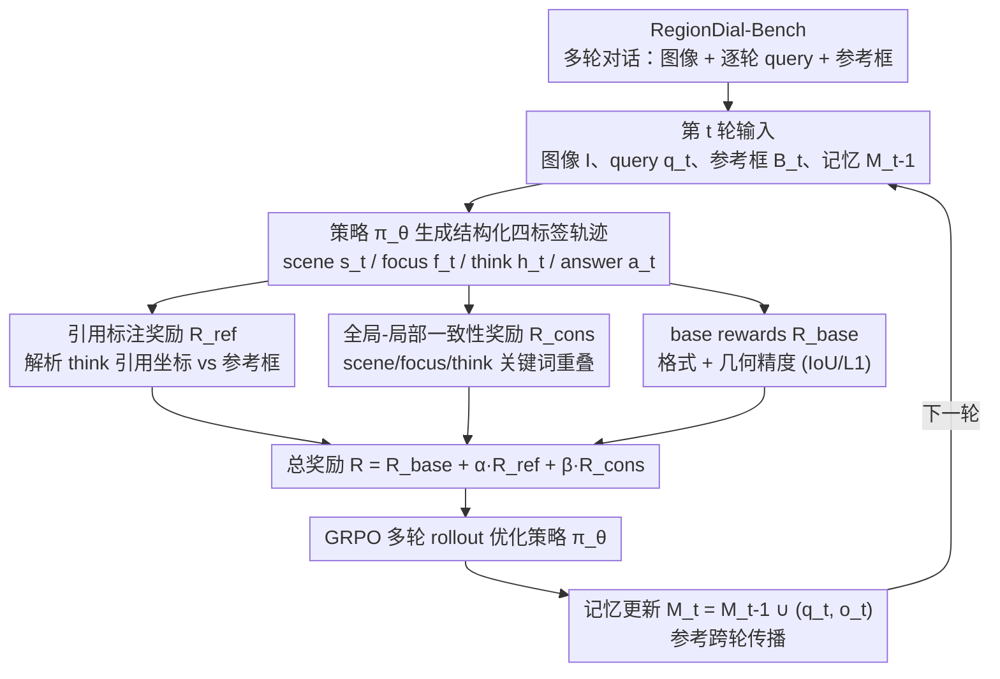

# RegionReasoner: Region-Grounded Multi-Round Visual Reasoning

**会议**: ICLR 2026  
**arXiv**: [2602.03733](https://arxiv.org/abs/2602.03733)  
**代码**: [RegionReasoner](https://github.com/wenfangsun/RegionReasoner)  
**领域**: 图像分割  
**关键词**: multi-round reasoning, region grounding, reinforcement-learning, GRPO, VLM, referring segmentation

## 一句话总结
提出 RegionReasoner，一个基于强化学习的多轮视觉推理框架，通过引用标注奖励和全局-局部一致性奖励，使推理轨迹必须显式引用参考区域坐标并保持语义连贯，在新构建的 RegionDial-Bench 上显著提升多轮定位和分割精度。

## 背景与动机

现有 VLM 的视觉推理大多停留在单步或纯文本空间。VisionReasoner 给出了单轮的结构化推理范式（带 format + geometry 的 base rewards），但不会把区域引用跨轮传播；SegLLM 支持多轮交互式分割，却没有可验证的推理轨迹、也没有 RL 学习信号。把单轮推理朴素地堆叠成多轮会暴露两个硬伤：一是引用传播脆弱——模型不被要求显式引用前几轮给定的参考框，导致信用分配模糊、坐标幻觉难以检测；二是奖励只作用在最终框/点和标签合法性上，对“推理过程本身”几乎没有约束，随着对话轮数加深，全局场景描述与局部证据之间会发生语义漂移。

更现实的障碍在评测：多轮推理一直缺少能逐轮、可验证地度量定位精度与一致性的基准，使得“引用传播能力”和“误差累积”这两件最该被观测的事无从量化。RegionReasoner 正是冲着这两个缺口——可验证的多轮推理 + 配套基准——来设计的。

## 方法详解

### 整体框架

RegionReasoner 把多轮指代定位/分割重新表述成一个可验证的强化学习问题。每一轮，策略 $\pi_\theta$ 在图像 $I$、当前查询 $q_t$、（可选的）参考框集合 $\mathcal{B}_t^{ref}$ 与对话记忆 $\mathcal{M}_{t-1}$ 的条件下，产出一条由 `<scene>`、`<focus>`、`<think>`、`<answer>` 四个标签块组成的结构化轨迹，其中 `<answer>` 用 JSON 直接给出检测的 bbox 或分割的 point_2d，无需任务专用头。这条轨迹一旦生成，就被三路奖励同时打分：引用标注奖励 $R_{ref}$ 检查 `<think>` 里引用的坐标是否真落在参考框上、一致性奖励 $R_{cons}$ 检查 scene/focus/think 三者语义是否自洽、base rewards 检查格式与几何精度；三者加权成总奖励后由 GRPO 优化策略。每轮结束把 $(q_t, o_t)$ 写回记忆 $\mathcal{M}_t$，参考框得以跨轮传播，下一轮在此基础上继续推理。

整套设计要让推理不再是“自说自话的文本”，而是必须显式落在历史参考坐标上、且与全局/局部描述对齐，从而遏制随轮数增长而累积的坐标幻觉与语义漂移。例如查询“在左边那个 R1 后面”“挨着 R2 的那个”，模型必须先在 `<think>` 里复述出 R1/R2 的坐标、再据此定位，引用因此能稳定地从早轮传到后轮。

### 关键设计

**1. 结构化四标签输出：把“看哪里、想什么、答什么”拆成可解析的轨迹**

朴素堆叠单轮推理时，跨轮的区域引用容易丢失、推理内容也无法审计。RegionReasoner 要求每轮按固定顺序生成 `<scene>`（全局场景）、`<focus>`（绑定到某个参考框的局部描述，可选）、`<think>`（推理过程，需显式引用坐标与空间关系）、`<answer>`（JSON 输出：检测用 bbox、分割用 point_2d）。检测与分割共用这套无任务专用头的格式——结构有效性和几何精度归到 `<answer>`、定位忠实度与全局-局部一致性归到 `<think>`，形成一个可联合优化的闭环。推理时用约束解码强制标签 schema 与 `<answer>` 的 JSON 合法、防止无标签内容漏进答案，而 scene/focus/think 仍允许自由语言。这样“推理”被暴露成可自动解析的对象，给后面两个奖励提供可计算的抓手。

**2. 引用标注奖励 $R_{ref}$：逼模型“说看了哪个区域就真的看那个区域”**

多轮场景里最致命的是坐标幻觉——`<think>` 凭空捏造一个参考框。该设计把从 `<think>` 解析出的引用坐标集合 $\mathcal{S}(h_t)$ 与本轮要求的参考框 $\mathcal{B}_t^{ref}$ 比对，正确引用给正分、一旦出现集合外（幻觉）坐标就乘上惩罚系数 $\eta=0.5$：

$$R_{ref}(t) = \lambda\,\mathrm{kw}(h_t) + \mu\,\frac{|\mathcal{S}(h_t) \cap \mathcal{B}_t^{ref}|}{\max(|\mathcal{S}(h_t)|,\,1)}, \quad \lambda=\mu=1.0$$

（本轮无参考框时直接给 $R_{ref}=1$，最终裁剪到 $[0,2]$。）于是每个结论都有可追溯的空间证据、信用分配精确，引用得以稳定跨轮传播，区域复用与修正也更可靠；消融显示单加该奖励就把 RefCOCO+ 平均 AP 从 74.8 抬到 77.5。

**3. 全局-局部一致性奖励 $R_{cons}$：防止场景、局部与推理三者语义漂移**

当空间线索较弱时，`<scene>`/`<focus>`/`<think>` 可能各说各话。该设计用一个确定性流程从三者抽取关键词集合（小写化、去停用词、词形还原、名词/物体过滤），计算 `<think>` 对 `<scene>`、`<focus>` 的非对称重叠 $\mathrm{Ov}(\cdot,\cdot)$，再叠加一项手工的空间/比较/定位词先验 $\ell(h_t)$（如 left/right/inside/overlap/next to，封顶 1）：

$$R_{cons}(t) = w_s\,\mathrm{Ov}(s_t, h_t) + w_f\,\mathbb{1}[\mathcal{B}_t^{ref} \neq \varnothing]\,\mathrm{Ov}(f_t, h_t) + w_\ell\,\ell(h_t)$$

关键在于把对齐点放在 `<think>` 上、而不是只在最终答案处纠偏，因此能给出更细粒度的 RL 信号。它与引用奖励互补——引用奖励管“看对地方”、一致性奖励管“想得自洽”——两者联合时 AP 进一步升到 80.7。

**4. RegionDial-Bench：首个同时覆盖检测与分割的多轮推理基准**

多轮推理一直缺少能逐轮、可验证地度量精度与一致性的评测集。作者从 RefCOCO+/RefCOCOg 把同图的多个指代表达拼成对话、并改写后续轮使其显式引用前面已定位的框，得到 RefCOCO+ Multi-turn（715 图 / 2355 轮）与 RefCOCOg（1580 图 / 4405 轮）。训练对话用真值参考传播、测试对话用模型预测的参考（早轮错误会沿对话传播），既支持检测的 AP50 也支持分割的 gIoU，并按轮次拆开评估，使引用传播能力和误差累积在第 5/6/7 轮被清晰地观测到。

### 损失函数 / 训练策略

策略用 GRPO（比 PPO 更适合大模型 RL 微调）在多轮 rollout 上优化，每轮总奖励为 $R(t) = R_{base}(t) + \alpha\,R_{ref}(t) + \beta\,R_{cons}(t)$，其中 base rewards 含 Thinking/Answer Format、Non-Repeat、Bboxes IoU/L1、Points L1，各分量归一化到 $[0,2]$，episode 回报为 $\sum_t R(t)$。模型以 Qwen2.5-VL-7B 初始化，在 4×H100 上训练约 10 小时即可收敛。

## 实验关键数据

### 7 轮检测（RefCOCO+ Multi-turn, AP↑）

| 方法 | R1 | R2 | R3 | R4 | R5 | R6 | R7 | Avg |
|------|-----|-----|-----|-----|-----|-----|-----|-----|
| Qwen2.5-VL-7B | 65.5 | 49.0 | 48.1 | 36.5 | 30.0 | 38.2 | 25.9 | 49.9 |
| Seg-Zero-7B | 90.5 | 71.2 | 73.6 | 59.6 | 48.8 | 58.2 | 48.2 | 73.1 |
| VisionReasoner-7B | 88.3 | 74.7 | 75.8 | 64.2 | 56.3 | 57.3 | 47.0 | 74.8 |
| **RegionReasoner-7B** | 89.3 | **83.2** | **81.6** | **69.6** | **61.9** | **69.1** | **64.7** | **80.7** |

### 7 轮分割（RefCOCO+ Multi-turn, gIoU↑）

| 方法 | R1 | R2 | R3 | R4 | R5 | R6 | R7 | Avg |
|------|-----|-----|-----|-----|-----|-----|-----|-----|
| Seg-Zero-7B | 78.6 | 62.8 | 64.0 | 51.6 | 42.4 | 50.8 | 46.7 | 64.0 |
| SegLLM-7B | 71.1 | 71.7 | 70.4 | 58.7 | 41.9 | 39.2 | 30.3 | 60.7 |
| VisionReasoner-7B | 75.6 | 65.0 | 65.9 | 54.9 | 46.6 | 48.9 | 40.8 | 64.3 |
| **RegionReasoner-7B** | 76.4 | **73.1** | **72.0** | **58.8** | **51.3** | **59.4** | **54.6** | **69.6** |

### 消融实验

| 奖励配置 | RefCOCO+ AP Avg | RefCOCOg gIoU Avg | 说明 |
|---------|----------------|-------------------|------|
| 仅 base rewards | 74.8 | 64.3 | VisionReasoner 基线 |
| +引用奖励 $R_{ref}$ | 77.5 | 66.8 | 减少坐标幻觉 |
| +一致性奖励 $R_{cons}$ | 76.9 | 66.2 | 稳定弱空间场景 |
| **+两者联合** | **80.7** | **69.6** | 互补效果最佳 |

### 关键发现
- **后续轮次优势最大**：R5/R6/R7 上检测 AP 提升 +5.6/+11.8/+17.7 vs VisionReasoner——表明引用传播和一致性约束有效遏制了误差累积
- 两种奖励互补：引用奖励主要减少坐标幻觉和改善区域复用/修正；一致性奖励在弱空间线索的场景中稳定推理语义
- SegLLM 在 R1-R3 表现不错但 R7 急剧退化（30.3 gIoU），没有结构化推理轨迹导致长对话失控
- 4×H100 训练约 10 小时完成，推理使用约束解码保证格式有效性

## 亮点与洞察
- **可验证推理轨迹**：推理中的 bbox 引用可被自动解析和审计——每个结论都有可追溯的空间证据
- **两个奖励信号精准互补**：引用奖励确保"说了什么区域就真的看了那个区域"，一致性奖励确保"场景描述、局部描述和推理三者语义一致"
- **多轮稳定性**：性能衰减显著小于所有基线，RegionReasoner 在 R7 仍保持 64.7 AP（VisionReasoner 仅 47.0）
- **统一检测和分割**：无任务特定头，检测用 bbox JSON、分割用 point_2d JSON，同一框架同一训练
- **RegionDial-Bench**：首个同时覆盖检测和分割的多轮推理基准，支持逐轮评估和参考传播

## 局限与展望
- 基准规模较小（RefCOCO+ 仅 715 图/2355 轮），更大规模和更多样场景的泛化性待验证
- 关键词匹配方式（lemma + 停用词移除 + 名词过滤）较粗糙，在语义丰富但词汇多样的场景中可能遗漏真实一致性
- 仅在 7B 规模验证，更大模型（如 72B）可能不需要如此结构化的约束即可实现多轮稳定推理
- 约束解码增加推理复杂度，JSON 格式和标签模式的强制执行可能限制生成灵活性
- 空间关系的词汇先验（left/right/inside/overlap 等）是手工定义的，覆盖度可能不足

## 相关工作与启发
- **vs VisionReasoner**：单轮结构化推理的强基线；RegionReasoner 扩展多轮但继承其 tag 结构和 base rewards
- **vs SegLLM**：多轮分割交互，有对话式监督但无显式推理轨迹、无 RL 信号——本文补齐了可验证性和学习信号两个缺口
- **vs Vision-R1/VLM-R1/Pixel Reasoner**：RL 增强 VLM 推理的并行工作，但都是单轮；RegionReasoner 是多轮 + 区域标记
- **vs GRPO**：采用的策略优化算法，与 PPO 相比更适合大模型的 RL 微调

## 评分
- 新颖性: ⭐⭐⭐⭐ 引用标注推理 + 全局-局部一致性奖励的组合方案新颖实用
- 实验充分度: ⭐⭐⭐⭐ 检测+分割 + 逐轮精细分析 + 消融 + 多基线对比
- 写作质量: ⭐⭐⭐⭐ 形式化完整，流水线描述清晰
- 价值: ⭐⭐⭐⭐ 多轮视觉推理的新方向，基准和方法都有独立贡献

<!-- RELATED:START -->

## 相关论文

- [\[ACL 2026\] AnchorSeg: Language Grounded Query Banks for Reasoning Segmentation](../../ACL2026/segmentation/anchorseg_language_grounded_query_banks_for_reasoning_segmentation.md)
- [\[ICCV 2025\] VEGGIE: Instructional Editing and Reasoning Video Concepts with Grounded Generation](../../ICCV2025/segmentation/veggie_instructional_editing_and_reasoning_video_concepts_with_grounded_generati.md)
- [\[CVPR 2026\] Towards Context-Aware Image Anonymization with Multi-Agent Reasoning](../../CVPR2026/segmentation/towards_context-aware_image_anonymization_with_multi-agent_reasoning.md)
- [\[ICCV 2025\] Region-based Cluster Discrimination for Visual Representation Learning](../../ICCV2025/segmentation/region-based_cluster_discrimination_for_visual_representation_learning.md)
- [\[ICML 2025\] unMORE: Unsupervised Multi-Object Segmentation via Center-Boundary Reasoning](../../ICML2025/segmentation/unmore_unsupervised_multi-object_segmentation_via_center-boundary_reasoning.md)

<!-- RELATED:END -->
