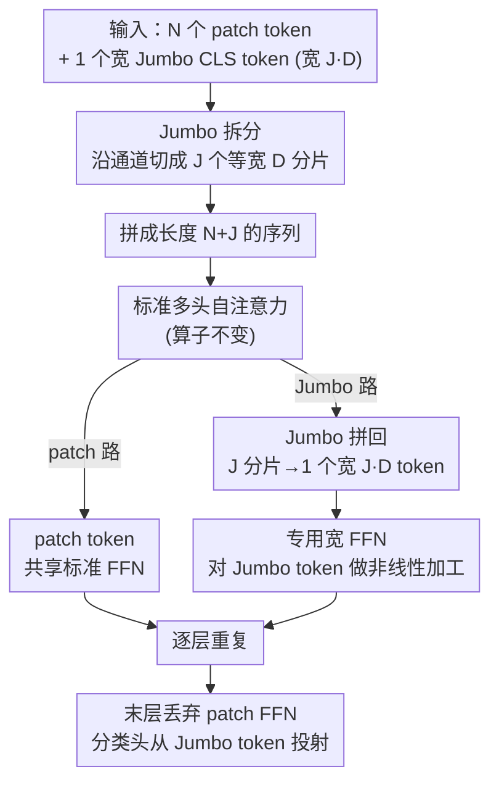

# Thicker and Quicker: A Jumbo Token for Fast Plain Vision Transformers

**会议**: ICLR 2026  
**arXiv**: [2502.15021](https://arxiv.org/abs/2502.15021)  
**代码**: 无  
**领域**: 图像分割  
**关键词**: Vision Transformer, CLS Token, 高效架构, Registers, 时间序列, ImageNet

## 一句话总结

本文提出 Jumbo 方法：将 ViT 的 CLS token 扩展为 $J$ 倍宽度，在注意力前拆分为 $J$ 个与 patch 等宽的 token 参与自注意力，注意力后重新拼接并经过专用的宽 FFN 处理——以极低的计算开销显著增加全局建模容量，使 plain ViT 在高速推理场景下超越专用高效架构（EfficientViT、SHViT、MobileNetV4），同时保留 ViT 的所有架构优势。

## 研究背景与动机

Vision Transformer 具有简洁、灵活和高效的优势：支持 token dropping（关键于 SOTA 自监督学习算法）、轻松适配多模态数据、可直接受益于 FlashAttention 等内核优化。但在高速推理（tiny/nano 尺寸）场景下，plain ViT 的性能远不如 EfficientViT、SHViT 等专用高效架构。

**核心症结**：在标准设置（224×224 图像、16×16 patch）下，196 个 patch token 加 1 个 CLS token 意味着仅 1/197 的模型容量用于全局信息聚合——显然不够。Darcet et al. (2024) 发现 ViT 会"劫持"部分 patch token 作为 pseudo-CLS token，并提出 Registers 作为额外全局 token 来缓解这一问题。

但 Registers 的局限在于：全局 token 之间仅通过注意力交互——注意力本质上是信息搬运机制（加权线性组合），表达能力有限。缺乏的是 FFN 提供的非线性函数建模能力。

**关键洞察**：将全局 token 拼接后送入一个宽 FFN，就能用非线性函数处理全局特征，而成本几乎可忽略——因为只处理一个 token。

## 方法详解

### 整体框架

Jumbo 要解决的问题很具体：tiny/nano 这种窄 ViT 里，全局信息只能挤在 1 个 CLS token 里聚合，容量严重不够，所以在高速推理场景被专用高效架构甩开。Jumbo 的思路是把这个唯一的全局 token "加宽"，但又不破坏 attention-only、non-hierarchical 的 plain ViT 形态。

整套流程只动三处、patch token 那一路几乎照旧。每一层里，先把宽度为 $J \cdot D$ 的 Jumbo CLS token 沿通道维拆成 $J$ 个与 patch 等宽（$D$）的分片，和 $N$ 个 patch token 拼成长度 $(N+J)$ 的序列，喂进**标准**多头自注意力；注意力出来后再把这 $J$ 个分片抽回、沿通道拼成一个宽 token；最后 patch token 走共享的标准 FFN、Jumbo token 走一个独立的宽 FFN。逐层重复，末层丢掉 patch FFN，分类头直接从 Jumbo token 投射。

### 关键设计

**1. Jumbo CLS token 的拆—拼往返：用极少 token 换出巨大的全局容量**

标准 ViT 在 224×224、16×16 patch 设置下只有 1 个 CLS token 参与全局聚合，即仅 $1/197$ 的容量用于全局信息——这是窄 ViT 的核心瓶颈。Jumbo 初始化一个可学习的宽 token $\mathbf{x}_{\text{Jumbo}} \in \mathbb{R}^{J \cdot D}$，进自注意力前沿特征维度切成 $J$ 个宽度为 $D$ 的分片，和 $N$ 个 patch token 拼成长度 $(N+J)$ 的序列，于是它能以"等宽 token"的身份正常参与标准多头自注意力，不需要改任何注意力算子。注意力算完后再把这 $J$ 个分片从序列里抽出来、沿通道维拼回 $\mathbb{R}^{1 \times J \cdot D}$，恢复成单个加宽 token。妙处在于：全局信息聚合的"宽度"被放大了 $J$ 倍，而序列里多出来的 token 数只增加了 $J$ 个（图中 SPLIT→序列、CONCAT 这一往返）。

**2. 专用宽 FFN：补上 Register 缺的非线性建模**

Darcet 等人的 Registers 也加了额外全局 token，但这些 token 之间只靠注意力交互，而注意力本质是加权线性组合（信息搬运），缺的恰是 FFN 那种非线性函数建模能力。Jumbo 给重组后的宽 token 配一个宽度为 $J \cdot D$ 的独立 FFN，patch token 仍走共享的标准 FFN，两路互不干扰。这样全局特征第一次被一个真正的非线性函数加工，而不只是被搬运——这正是 Jumbo 相对 Register 的关键增量。末层的 patch FFN 被直接丢弃，因为分类头是从 Jumbo token 投射的，patch 那一路最后一次变换用不上。

**3. 近乎免费的开销：宽 FFN 只算一个 token**

ViT 一层的计算量几乎完全由 patch 数 $N$ 和 patch 宽度 $D$ 决定。多塞 $J=6$ 个分片，注意力序列从 $N$ 变成 $(N+J)$，而 $N=196$，FLOP 增量可忽略；宽 FFN 虽然参数翻倍，但它只处理单个 token，对总 FLOP 的贡献同样微乎其微。于是 Jumbo 用接近零的吞吐量代价换来成倍的全局建模容量，这正是它能在高速场景跑赢 EfficientViT、SHViT、MobileNetV4 等专用高效架构的根因。

**4. 宽度何时最值钱：两条假说 + 跨模态迁移**

为什么"加宽"在某些情形增益巨大、某些情形几乎为零？作者提出两条可证伪的假说统一解释：patch width 越窄（模型越小），网络对全局容量越"饥渴"，Jumbo 增益越大（假说 1）；输出维度越高（类别越多越复杂），越需要额外宽度去存储和推理更多概念，增益也越大（假说 2）。这两条都在实验里被验证（见下）。同一逻辑还说明 Jumbo 不是视觉特化的 trick：把它直接套到时间序列的 PatchTST 上——1D 序列 patch 化后照样加一个宽 Jumbo CLS token，无需任何架构改动即可迁移，体现了 plain transformer "一个 token 加宽"这一手段的普适性。

### 损失函数 / 训练策略

- **ImageNet-1K**：function matching (知识蒸馏)，128×128 px 训练 400 epoch + 224×224 px 微调 20 epoch
- 教师：DeiT-III base (85.7%) 和 large (87.0%)
- AdamW 优化器，学习率 {1e-3, 3e-3}，1024 batch size
- 数据增强：mixup $\alpha=0.8$, cutmix $\alpha=1$, 3-Augment / AutoAugment
- **ImageNet-21K**：直接训练 50 epoch，使用 token dropping（90% 线性降到 10%）节省训练成本
- **时间序列**：PatchTST 框架，12 种超参组合网格搜索（4 个学习率 × 3 个 dropout）

## 实验关键数据

### 主实验——ImageNet-1K 高速场景

| 模型 | 大小 | 吞吐量 (imgs/s) | ImageNet-Val Top-1 | ImageNet-v2 Top-1 |
|------|------|-----------|----------------|-------------|
| ViT+Registers | nano (D=128) | 105.9K | 53.6 | 42.4 |
| ViT+Jumbo | nano (D=128) | 101.7K | **68.8** (+15.2) | **55.1** |
| ViT+Registers | tiny (D=192) | 52.2K | 68.8 | 55.9 |
| ViT+Jumbo | tiny (D=192) | 56.5K | **73.0** (+4.2) | **59.4** |
| EfficientViT-B1 | — | 38.7K | 72.8 | 60.4 |
| SHViT-S3 | — | 70.4K | 71.2 | 58.6 |
| MobileNetV4-conv-medium | — | 54.5K | 73.3 | 60.6 |

* Jumbo nano 超过 Registers tiny 的速度，且精度相当

### ImageNet-21K（10450 类）

| 模型 | 尺寸 | 吞吐量 | Top-1 |
|------|------|-------|-------|
| ViT+Registers | small | 8.4K | 41.48 |
| **ViT+Jumbo** | small | 8.0K | **44.95** (+3.4) |
| ViT+Registers | base | 3.6K | 46.31 |
| **ViT+Jumbo** | base | 3.2K | **47.28** (+1.0) |

### 时间序列分类（PatchTST 框架）

| 变体 | 单变量 Best Rank | 多变量 Best Rank |
|------|-----------|-----------|
| PatchTST | 2.0 | 2.1 |
| PatchTST+Registers | 2.5 | 2.1 |
| **PatchTST+Jumbo** | **1.5** | **1.6** |

### 消融实验

| Patch Width | Jumbo $J$ | Inner FFN mult | Throughput (128px) | IN-Val Top-1 |
|------------|-------|-------------|-----------|-------------|
| 192 | 2 | 2 | 71.6K | 70.0 |
| 192 | 4 | 4 | 64.9K | 72.2 |
| 192 | 6 | 4 | 56.5K | **73.0** |
| 384 | 6 | 4 | 19.5K | **78.3** |

### 关键发现

- **假说 1 得到验证**：Jumbo 增益随 patch width 递减而递增——nano (+13.5%) > tiny (+3.2%) > small (~0%)
- **假说 2 得到验证**：在 ImageNet-21K (10450 类) 上，即使 ViT-small 也能获得 +3.4% 提升，而 ImageNet-1K (1000 类) 上 small 无增益
- **参数量问题及解决方案**：$J=6$ 的 ViT-base Jumbo 参数量从 25.7M 增至 55M，但通过层间权重共享可降至 88.3M→88.8M（+LoRA），精度几乎不变
- **plain ViT 首次在高速场景追平/超越专用高效架构**：ViT+Jumbo 是首个 attention-only + non-hierarchical 就能竞争的架构

## 亮点与洞察

- 极其简洁的改动带来显著效果——两次 split、两次 concat 加一个独立 FFN，增加的代码不超过 10 行
- 保留了 plain ViT 的所有优势：token dropping（兼容 MAE, I-JEPA 等 SSL）、多模态支持、FlashAttention 兼容
- "宽度不足是窄 ViT 的核心瓶颈"这一洞察非常有价值——Registers 只增加了全局容量的线性部分，Jumbo 补充了非线性部分
- 实验设计的公平性值得称道：所有模型使用相同训练流程（同一教师、同一超参网格），避免了"配方差异 vs 架构差异"的混淆
- 从图像无缝迁移到时间序列的示范表明 Jumbo 是通用方法而非视觉特化

## 局限与展望

- ViT-small 在 ImageNet-1K 上无增益——方法并非万灵药
- 参数量增加可观（$J=6$ 时约 2 倍），虽有层间共享+LoRA 解决方案但增加了实现复杂度
- $J=6$ 的 ViT-base 在 ImageNet-21K 上因显存限制只能用 $J=3$
- 未测试大规模预训练（CLIP、DINOv2 等）和目标检测/分割下游任务
- 仅用知识蒸馏训练，未验证从头训练（不用教师）时 Jumbo 的效果
- 与 Hiera 等分层架构缺乏直接对比（虽然设计哲学不同）

## 相关工作与启发

- Darcet et al. (ICLR 2024) ViT+Registers 是直接前置工作——Jumbo 可视为"带非线性的超级 Register"
- Hiera (Ryali et al., 2023) 从另一个方向简化分层 ViT——用 pooling 替代卷积
- PatchTST (Nie et al., 2023) 展示了 plain transformer 在时间序列中的竞争力
- 启发：CLIP 等视觉-语言框架的 ViT 编码器需要建模 50K+ 词汇，Jumbo 在这种高输出维度场景有望获得更大收益

## 评分
- 新颖性: ⭐⭐⭐⭐
- 实验充分度: ⭐⭐⭐⭐⭐
- 写作质量: ⭐⭐⭐⭐⭐
- 价值: ⭐⭐⭐⭐⭐

<!-- RELATED:START -->

## 相关论文

- [\[ICLR 2026\] Revisiting \[CLS\] and Patch Token Interaction in Vision Transformers](revisiting_cls_and_patch_token_interaction_in_vision_transformers.md)
- [\[CVPR 2026\] MPM: Mutual Pair Merging for Efficient Vision Transformers](../../CVPR2026/segmentation/mpm_mutual_pair_merging_for_efficient_vision_transformers.md)
- [\[ICLR 2026\] Locality-Attending Vision Transformer](locality-attending_vision_transformer.md)
- [\[NeurIPS 2025\] Vision Transformers with Self-Distilled Registers](../../NeurIPS2025/segmentation/vision_transformers_with_self-distilled_registers.md)
- [\[CVPR 2026\] The Missing Point in Vision Transformers for Universal Image Segmentation](../../CVPR2026/segmentation/the_missing_point_in_vision_transformers_for_universal_image_segmentation.md)

<!-- RELATED:END -->
