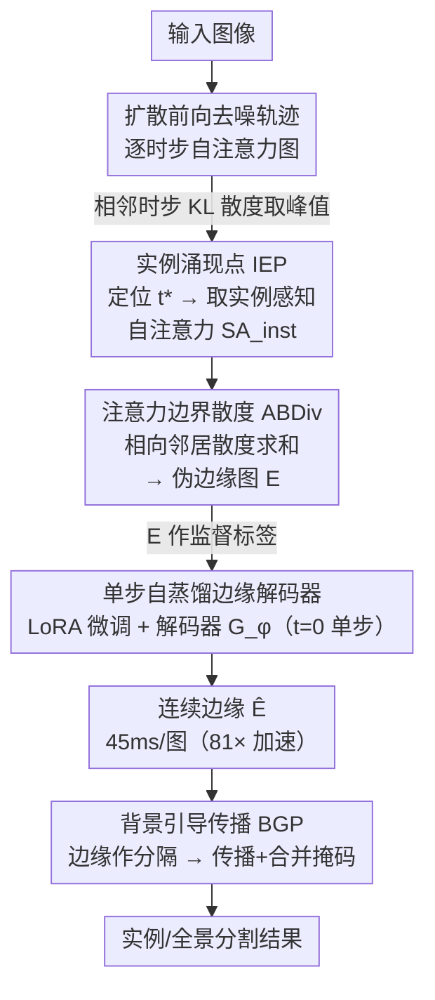

# TRACE: Your Diffusion Model is Secretly an Instance Edge Detector

**会议**: ICLR 2026 Oral  
**arXiv**: [2503.07982](https://arxiv.org/abs/2503.07982)  
**代码**: [项目页面](https://shjo-april.github.io/TRACE)  
**领域**: 实例分割 / 全景分割  
**关键词**: 扩散模型, 实例边缘, 自注意力, IEP, 无监督分割

## 一句话总结

发现文本到图像扩散模型的自注意力在去噪过程中存在一个"实例涌现点"（IEP），在该时刻自注意力在物体边界呈现剧烈散度变化。TRACE通过IEP定位+ABDiv边缘提取+单步蒸馏，以81×推理加速生成高质量实例边缘，无需任何实例标注即可将无监督实例分割提升+5.1 AP，tag监督全景分割超越点监督方法+1.7 PQ。

## 研究背景与动机

**领域现状**: 实例和全景分割长期依赖密集标注（mask/box/point），成本高且标注者间不一致。无监督方案（MaskCut等）聚类ViT语义特征，但ViT针对跨图像语义相似性而非图内实例分离进行优化，常合并邻近同类物体或割裂单一实例。弱监督方案需要至少点标注来区分实例。

**现有痛点**: (1) 无监督方法依赖自监督ViT特征，但这些特征在Instance层面不足——合并邻近同类物体是根本性问题；(2) 深度估计辅助方案（CutS3D）在相似深度的邻近物体上失效；(3) tag级弱监督已在语义分割上逼近全监督精度（VOC上99%），但从语义到全景的跨越仍然需要点或box标注。

**核心矛盾**: 语义特征擅长"知道是什么"但不擅长"分清谁和谁"——实例分离需要完全不同的信号来源。

**本文目标**: 寻找一种无需标注的实例级信号源来补充语义特征的实例分离能力。

**切入角度**: 扩散模型在去噪过程中从噪声→实例结构→语义内容渐进演变——在特定时步，自注意力短暂但清晰地编码了实例边界。

**核心 idea**: 扩散模型的自注意力是隐藏的实例边缘标注器——跨边界的注意力分布剧烈散度变化就是实例边界信号。

## 方法详解

### 整体框架

TRACE 要解决的问题是：在完全没有实例标注的前提下，从预训练的文本到图像扩散模型里"读出"实例边界，用来补足语义特征"知道是什么、却分不清谁和谁"的短板。整条流水线这样转：先让一张图走一遍扩散前向去噪，沿去噪轨迹监控自注意力图的逐步变化，在实例结构最显著的那一刻——实例涌现点（Instance Emergence Point, IEP）——取出实例感知的自注意力 $SA_{\text{inst}}$；接着用注意力边界散度（Attention Boundary Divergence, ABDiv）把这张注意力图就地转成伪边缘图 $E$，整个过程不训练也不聚类；最后把这套"扫一遍去噪轨迹"的多步流程蒸馏成单步前向——训练时拿 $E$ 当监督标签，用 LoRA 微调扩散 backbone 并训练一个边缘解码器 $\mathcal{G}_\phi$，推理时在 $t=0$ 单步前向就能直接输出连续边缘。产出的实例边缘最后作为边界先验，通过背景引导传播（Background-Guided Propagation, BGP）集成进下游的实例/全景分割。

### 关键设计

**1. 实例涌现点 IEP：在去噪轨迹上找出实例结构最显著的那一步**

语义特征"知道是什么却分不清谁是谁"，而扩散模型去噪时会从噪声→实例结构→语义内容逐步演变，关键是要找到实例边界最清晰的那个瞬间。TRACE 沿去噪轨迹逐步比较相邻时步的自注意力图，用 KL 散度衡量两者的差异，取散度峰值对应的时步作为 IEP：

$$t^* = \arg\max_t D_{\text{KL}}(SA(X_{t_{\text{prev}}}) \| SA(X_t))$$

去噪早期注意力几乎全是噪声、中期突然涌现实例边界（散度在此达到峰值）、后期又收敛到稳定的语义，IEP 精确卡在"实例→语义"这个过渡拐点上。实现上步长固定为 100 就能得到稳定结果。这里用 KL 散度而非 L2/L1，是因为它对概率分布之间的细微差异更敏感——换成 L2 定位的时步，最终 APmk 会从 9.4 掉到 3.8（低 5.6 个点）。

**2. 注意力边界散度 ABDiv：不训练、不聚类，直接从注意力的几何里读出边缘**

拿到 IEP 时步的实例感知自注意力 $SA_{\text{inst}}$ 后，需要把它转成边缘图。ABDiv 对每个像素 $(i,j)$ 比较它上下、左右两对相向邻居的注意力分布差异，求和作为该点的边界强度：

$$\text{ABDiv}(SA)_{i,j} = D_{\text{KL}}(SA_{i+1,j} \| SA_{i-1,j}) + D_{\text{KL}}(SA_{i,j+1} \| SA_{i,j-1})$$

同一实例内部相邻像素的注意力分布彼此相似，散度很小；一旦跨过实例边界，分布会突变，散度随之飙高，于是边界自然浮现。整个过程完全非参数化，不需要任何训练或聚类，纯靠注意力分布的几何属性就能提取边界信号。

**3. 单步自蒸馏边缘解码器：把多步推理压成一次前向，顺带补齐断裂的边缘**

IEP+ABDiv 虽然有效，但每张图要扫一遍去噪轨迹、约 3.7 秒，太慢。TRACE 把 ABDiv 产出的伪边缘图 $E$ 当作监督标签——$>\mu+\sigma$ 记为正、$<\mu-\sigma$ 记为负、中间的不确定区域直接 mask 掉——然后在 $t=0$ 时对扩散 backbone 做 LoRA 微调，并训练一个轻量边缘解码器 $\mathcal{G}_\phi$，使其单步前向就能预测边缘。训练损失同时带上重建项：

$$\mathcal{L} = \|I-\hat{I}\|^2 + \text{DiceLoss}(E, \hat{E})$$

其中重建损失起到稳定训练、补全断裂边缘的作用。蒸馏后推理从 3.7 秒降到 45ms/图（81× 加速），而且预测出的边缘比原始 ABDiv 更连续、更完整。最终边缘再通过 Background-Guided Propagation 集成进下游分割。

### 损失函数 / 训练策略

蒸馏训练：DiceLoss（边缘预测）+ L2重建损失，不确定像素排除在外。仅在COCO训练集上训练，LoRA微调扩散backbone。推理时单次前向即可，默认backbone为SD3.5-L。

## 实验关键数据

### 主实验

无监督实例分割（COCO 2014，APmk）：

| 方法 | VOC AP | COCO 2014 AP | COCO 2017 AP |
|------|:------:|:------------:|:------------:|
| MaskCut* | 5.8 | 3.0 | 2.3 |
| + TRACE | **9.7** | **7.9** | **7.5** |
| ProMerge* | 5.0 | 3.1 | 2.5 |
| + TRACE | **9.4** | **8.2** | **7.8** |
| CutLER* | 11.2 | 8.9 | 8.7 |
| + CutS3D (深度) | - | 10.9 | 10.7 |
| + TRACE | **14.8** | **13.1** | **12.8** |

弱监督全景分割（VOC 2012 PQ）：

| 方法 | 监督类型 | VOC PQ | COCO PQ |
|------|:-------:|:------:|:-------:|
| Mask2Former* | 全mask | 73.6 | 51.9 |
| EPLD | 点标注 | 56.6 | 34.2 |
| EPLD (Swin-L) | 点标注 | 68.5 | 41.0 |
| DHR+TRACE | **tag标签** | **56.9** | **32.8** |
| DHR+TRACE (Swin-L) | **tag标签** | **69.8** | **43.1** |

### 消融实验

组件消融（COCO 2014, ProMerge baseline, APmk）：

| 配置 | APmk | 说明 |
|------|:----:|------|
| Baseline | 3.1 | 无TRACE |
| + ABDiv (语义步) | 3.2 | 语义时步的ABDiv几乎无效 |
| + IEP + ABDiv | 4.8 | IEP定位正确时步→有效 |
| + IEP + ABDiv + 蒸馏 | **8.2** | 蒸馏补全断裂边缘↑↑ |

扩散 vs 非扩散backbone对比：

| Backbone | 类型 | 参数 | APmk |
|----------|:----:|:----:|:----:|
| DINOv2-G | 非扩散 | 1.1B | 2.6 |
| Qwen2.5-VL | 非扩散 | 72B | 4.1 |
| PixArt-α | 扩散 | 0.6B | 7.1 |
| SD3.5-L | 扩散 | 8.1B | 8.2 |
| FLUX.1 | 扩散 | 12B | 8.3 |

### 关键发现

1. **扩散模型独有优势**: 0.6B的PixArt-α（APmk 7.1）完胜72B的Qwen2.5-VL（4.1），实例边缘是生成模型特有的先验
2. **蒸馏不仅加速还提升质量**: 推理从3.7s降至45ms，边缘更连续完整
3. **tag监督超越点监督**: DHR+TRACE（仅tag）在VOC上PQ 69.8 > EPLD（点标注）68.5
4. **传统边缘检测器完全不适用**: Canny仅1.2 APmk vs TRACE 9.4——因为传统检测器找的是灰度变化而非实例边界

## 亮点与洞察

- **"去噪过程中存在实例涌现点"这一发现**: 自注意力从噪声→实例→语义的阶段性过渡是全新的观察
- **非参数边缘提取**: ABDiv无需任何训练或标签，纯粹利用注意力分布的几何属性
- **model-agnostic**: IEP在5种扩散backbone上的最优时步高度一致
- **级联应用价值**: 与MaskCut/CutLER/ProMerge/DHR等即插即用组合

## 局限与展望

- 依赖扩散模型的自注意力，对非扩散架构不适用已被实验证实
- IEP搜索仍需多步前向传播（~3s/图），虽然蒸馏后不再需要
- 仅在SD3.5-L上蒸馏，不同backbone可能需要重新蒸馏
- 小物体和遮挡严重场景的边缘质量有待评估
- 当前仅static图像，视频场景下的时序一致性未探索

## 相关工作与启发

- **vs MaskCut/CutLER**: 基于DINO特征聚类——无法分离同类邻近物体；TRACE的实例边缘直接解决这一核心问题
- **vs CutS3D**: 用深度估计辅助实例分离——在相似深度时失效；TRACE不依赖深度，COCO上高2.2 AP
- **vs DiffCut/DiffSeg**: 用扩散注意力做语义分割（固定时步）——TRACE发现IEP比固定时步有效得多
- **启发**: 生成模型蕴含的结构先验远超人们预期——自注意力不仅仅"知道往哪看"，还"知道边界在哪"

## 评分

- 新颖性: ⭐⭐⭐⭐⭐ IEP+ABDiv的发现极具新意，扩散模型作为实例边缘标注器是全新视角
- 实验充分度: ⭐⭐⭐⭐⭐ 无监督+弱监督双赛道、10种backbone对比、完整消融、多基准验证
- 写作质量: ⭐⭐⭐⭐⭐ 叙事流畅，图示出色，每个设计选择都有数据支撑
- 价值: ⭐⭐⭐⭐⭐ 对无监督/弱监督分割有范式性贡献，tag监督超越点监督的结果影响深远

<!-- RELATED:START -->

## 相关论文

- [\[CVPR 2026\] VidEoMT: Your ViT is Secretly Also a Video Segmentation Model](../../CVPR2026/segmentation/videomt_your_vit_is_secretly_also_a_video_segmentation_model.md)
- [\[CVPR 2025\] Your ViT is Secretly an Image Segmentation Model](../../CVPR2025/segmentation/your_vit_is_secretly_an_image_segmentation_model.md)
- [\[CVPR 2026\] Unsupervised Multi-Scale Segmentation of 3D Subcellular World with Stable Diffusion Foundation Model](../../CVPR2026/segmentation/unsupervised_multi-scale_segmentation_of_3d_subcellular_world_with_stable_diffus.md)
- [\[ICLR 2026\] Universal Multi-Domain Translation via Diffusion Routers](universal_multi-domain_translation_via_diffusion_routers.md)
- [\[ICML 2025\] FeatSharp: Your Vision Model Features, Sharper](../../ICML2025/segmentation/featsharp_your_vision_model_features_sharper.md)

<!-- RELATED:END -->
