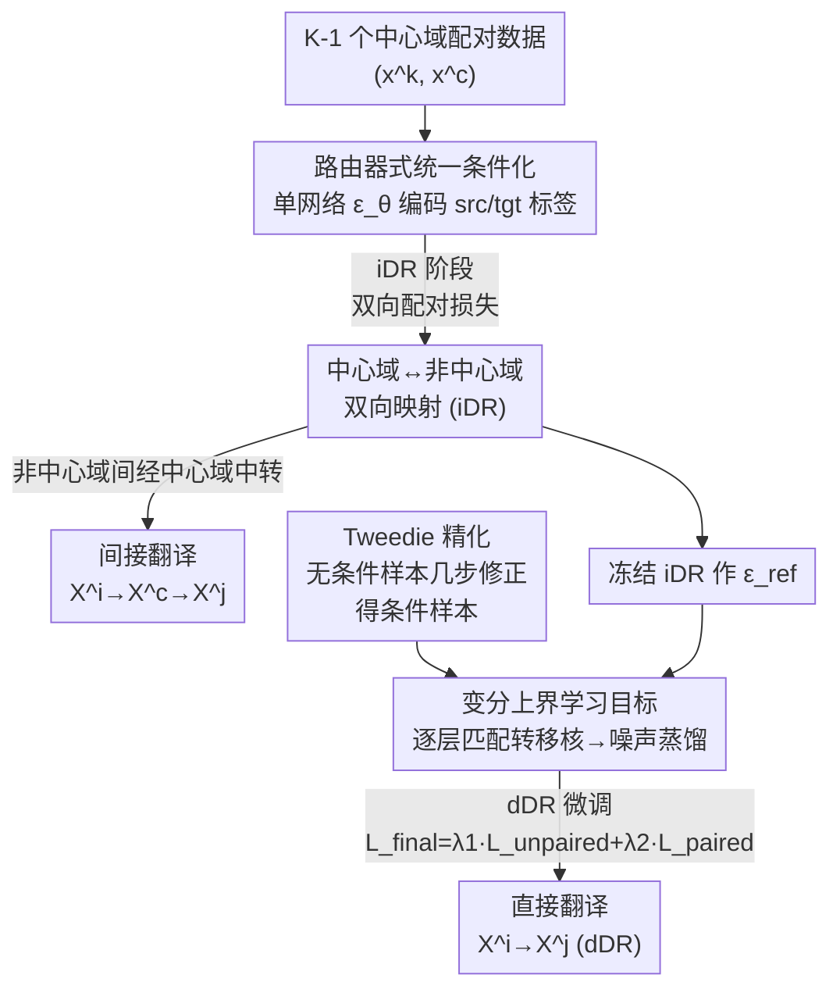

# Universal Multi-Domain Translation via Diffusion Routers

**会议**: ICLR 2026  
**arXiv**: [2510.03252](https://arxiv.org/abs/2510.03252)  
**代码**: 无  
**领域**: 图像分割  
**关键词**: Multi-Domain Translation, Diffusion Models, Diffusion Router, Tweedie Refinement, Universal Translation

## 一句话总结

提出 Diffusion Router (DR)，用单个噪声预测网络通过 source/target 域标签条件化实现所有跨域映射，支持通过中心域的间接翻译和基于变分上界目标 + Tweedie 精化的直接非中心域翻译，在三个大规模 UMDT 基准上达到 SOTA。

## 研究背景与动机

**领域现状**：多域翻译（MDT）旨在学习多个域之间的映射关系，广泛应用于图像到图像翻译、图像描述生成、文本到语音合成等领域。现有 MDT 方法分为两类范式：(1) 在全对齐多元组上训练（随域数增长难以扩展）；(2) 通过共享中心域的配对数据训练（仅支持中心域与非中心域之间的翻译）。

**现有痛点**：
1. **全对齐元组范式**：$K$ 个域需要 $K$-元组对齐数据，随域数增长收集成本呈指数增长
2. **中心域范式**：仅支持中心域 $\leftrightarrow$ 非中心域的翻译，非中心域之间的跨域翻译（如 sketch $\leftrightarrow$ segmentation）无法直接实现
3. **模型可扩展性**：为每对域训练独立模型需要 $2(K-1)$ 个模型，域数增多时不可行
4. **间接翻译的质量损失**：通过中心域中转的两阶段采样计算昂贵且对中间采样质量敏感

**核心矛盾**：实际应用中完全对齐的多域数据稀缺，但与中心域的配对数据相对丰富（如 image-text、text-audio 各自有大量配对数据）。如何在仅有 $K-1$ 个配对数据集的条件下实现任意域对之间的翻译？

**本文方案**：形式化 Universal Multi-Domain Translation (UMDT) 问题——用 $K-1$ 个与中心域的配对数据实现 $K$ 个域之间的任意翻译。提出 Diffusion Router (DR)，借鉴网络路由器的 source/destination 寻址思想，用单个噪声预测网络 $\epsilon_\theta(x_t^{tgt}, t, x^{src}, tgt, src)$ 处理所有翻译方向。

## 方法详解

### 整体框架

在 UMDT 设置下有 $K$ 个域 $X^1, \ldots, X^K$ 共享一个中心域 $X^c$，但训练数据只有 $K-1$ 个与中心域的配对数据集 $\mathcal{D}_{k,c}=\{(x^k, x^c)\}$。Diffusion Router 先用单个噪声预测网络学好所有「中心域 $\leftrightarrow$ 非中心域」的双向映射（间接翻译 iDR），非中心域之间靠经过中心域中转完成；再在此基础上微调出「非中心域 $\to$ 非中心域」的直接映射（直接翻译 dDR），把中转省掉。整套流程分两段：第一段在配对数据上训出「路由器式统一条件化」网络得到 iDR，第二段冻结 iDR 当参考、靠「变分上界学习目标」蒸馏出 dDR，其中训练所需的条件样本由「Tweedie 精化」高效生成。

### 关键设计

**1. 路由器式统一条件化：用一个网络覆盖所有翻译方向**

UMDT 的核心扩展性难题是，若为每个方向单独建模，$K$ 个域要训练 $2(K-1)$ 个模型，域一多就不可行。DR 借鉴网络路由器「源地址/目标地址」的寻址思路，把 source 与 target 两个域标签直接编码进噪声预测网络 $\epsilon_\theta(x_t^{tgt}, t, x^{src}, tgt, src)$，于是同一套权重通过切换标签就能走遍所有翻译路径。iDR 阶段在配对数据上以双向噪声预测损失训练，$\zeta$ 平衡两个方向的权重：$\mathcal{L}_{paired}(\theta) = \mathbb{E}_{(x^k, x^c)} \big[ \zeta \|\epsilon_\theta(x_t^k, t, x^c, k, c) - \epsilon\|_2^2 + (1-\zeta)\|\epsilon_\theta(x_t^c, t, x^k, c, k) - \epsilon\|_2^2 \big]$。这一设计把模型数量从 $O(K)$ 压到 1，并且不限于星形拓扑，可自然推广到带多个中心域的生成树结构。

**2. 变分上界学习目标：让直接翻译能在没有配对数据时学起来**

要把 $X^i \to X^j$ 这种无配对方向也训出来，最自然的想法是匹配以中心域为参考的分布 $p_{ref}(x^j|x^c)$，但直接优化它有两个拦路虎——需要从 $p(x'^c|x^i)$ 采样代价高，且 $p(x^j|x'^c)$ 没有闭式解无法评估。本文把原始 KL 散度沿扩散链分解，得到一个由各时间步转移核 KL 之和构成的变分上界：$\mathbb{E}_{\mathcal{D}_{i,c}}[D_{KL}(p_{ref}(x^j|x^c)\|p_\theta(x^j|x^i))] \le \sum_{t=1}^T \mathbb{E}[D_{KL}(p_{ref}(x_{t-1}^j|x_t^j, x^c)\|p_\theta(x_{t-1}^j|x_t^j, x^i))]$。逐层匹配转移核绕开了端到端的两次采样，再经标准重参数化就化简成一个干净的噪声蒸馏损失 $\mathcal{L}_{unpaired}(\theta) = \mathbb{E}[\|\epsilon_\theta(x_t^j, t, x^i, j, i) - \epsilon_{ref}(x_t^j, t, x^c, j, c)\|_2^2]$，其中 $\epsilon_{ref}$ 是冻结的预训练 iDR 网络，相当于让直接路径去模仿「经过中心域」的参考路径。最终用 $\mathcal{L}_{final} = \lambda_1 \mathcal{L}_{unpaired} + \lambda_2 \mathcal{L}_{paired}$ 联合训练，$\lambda_2$ 那一项把旧的配对映射拉住，避免微调把已学好的中心域翻译忘掉。

**3. Tweedie 精化：把训练时的条件采样从几十步压到几步**

上面的损失要从条件分布 $p_{ref}(x_t^j|x^c)$ 采样，常规做法得从时间 $T$ 一路去噪到 $t$，每次梯度更新都背着这笔开销。作者提出 Tweedie 精化，改为从无条件样本出发做轻量迭代修正：$x_{t,(n+1)}^j = x_{t,(n)}^j + \sigma_t(\epsilon - \epsilon_\theta(x_{t,(n)}^j, t, x^c, j, c))$，初始 $x_{t,(0)}^j$ 直接从无条件边缘 $p_{ref}(x_t^j)$ 抽，再用网络对中心域条件 $x^c$ 的预测残差逐步把它「拽」向条件分布。实验里 $n\le 7$ 步就够，等价于把整段去噪轨迹换成局部几步精化。它和已有精化技术的区别在于：目标是把无条件样本转成条件样本（而非把离群样本拉回边缘分布），用在训练阶段而非推理阶段，因而具有不同的数学形式。

## 实验结果

### 主实验

在三个新构建的 UMDT 基准上评估，对比 StarGAN（GAN）、Rectified Flow（flow）、UniDiffuser（diffusion）基线。

**Shoes-UMDT (FID↓, 格式: A←B / A→B)**：

| 方法 | Edge↔Shoe | Gray↔Shoe | Edge↔Gray |
|------|:---:|:---:|:---:|
| StarGAN | 9.92/20.18 | 19.73/42.61 | 18.64/27.41 |
| Rectified Flow | 2.88/30.92 | 3.75/43.38 | 20.14/18.83 |
| UniDiffuser | 2.98/11.94 | 2.72/4.40 | 4.81/12.26 |
| iDR | **1.66/5.15** | **0.53/1.60** | 1.85/5.48 |
| dDR | 2.01/5.76 | 0.57/1.69 | **2.74/6.51** |

**COCO-UMDT-Star (FID↓)**：

| 方法 | Ske↔Color | Seg↔Color | Depth↔Color | Ske↔Seg | Ske↔Depth | Seg↔Depth |
|------|:---:|:---:|:---:|:---:|:---:|:---:|
| Rectified Flow | 23.18/80.80 | 54.00/142.15 | 17.32/112.64 | 64.47/75.58 | 78.41/28.69 | 79.20/35.53 |
| UniDiffuser | 15.39/40.93 | 35.81/89.58 | 12.64/59.72 | 39.62/38.44 | 28.12/15.72 | 38.39/23.41 |
| iDR | **10.72/21.73** | **21.64/29.28** | **7.25/24.19** | 22.77/22.96 | **17.88/8.63** | **23.19/12.00** |
| dDR | 10.12/20.94 | 21.23/28.32 | 7.00/23.20 | **26.73/23.64** | 20.75/9.42 | 24.91/14.87 |

DR 在中心域翻译上全面优于基线，在无配对数据的非中心域翻译（棕色标记）上也展现出竞争力的直接翻译能力。iDR 的间接翻译在大多数情况下优于 dDR 的直接翻译，说明中间表示的质量很高。

### 消融实验

**Tweedie 精化步数消融 (Faces-UMDT-Latent)**：

| 精化步数 $n$ | Ske→Face FID↓ | Face→Ske FID↓ | Seg→Face FID↓ |
|:---:|:---:|:---:|:---:|
| 0 | 基线（无精化） | — | — |
| 1 | 显著改善 | 显著改善 | 显著改善 |
| 3 | 进一步提升 | 进一步提升 | 进一步提升 |
| 5 | 接近最优 | 接近最优 | 接近最优 |
| 7 | **最优** | **最优** | **最优** |

Tweedie 精化从 $n=0$ 开始逐步将无条件样本转化为条件样本，仅需 3-5 步即可获得显著改善，大幅降低了训练时的采样成本。

**从头训练 vs. 微调（dDR 学习策略）**：微调预训练 iDR 的效果优于从头训练，验证了两阶段策略的有效性。从头训练也可通过将 $\epsilon_{ref}$ 视为在线冻结网络实现，但收敛速度较慢。

## 论文评价

### 优点

1. **问题定义实用**：UMDT 捕捉了多模态翻译中"枢纽域+稀疏配对"的真实场景，远比全对齐假设更现实
2. **架构设计优雅**：路由器思想将 $O(K^2)$ 个模型压缩为 1 个网络，扩展性极强
3. **理论推导严谨**：变分上界目标和条件独立性假设有完整的数学推导
4. **Tweedie 精化创新**：解决了训练时条件采样的效率瓶颈
5. **自建三个 UMDT 基准**：为新问题定义提供了标准化评估平台

### 不足

1. 条件独立性假设 $X^i \perp X^j | X^c$ 在实际中可能不完全成立，限制了间接翻译质量
2. 实验主要在图像域内翻译，未验证真正的跨模态（如 image↔text↔audio）场景
3. dDR 在直接翻译上并不总是优于 iDR 的间接翻译，直接映射的优势有待更多分析

## 评分

⭐⭐⭐⭐ — 问题定义新颖实用，方法设计清晰且理论完备，Tweedie 精化是亮眼的技术贡献，但跨模态验证和条件独立假设的讨论可以更充分。

<!-- RELATED:START -->

## 相关论文

- [\[CVPR 2025\] Universal Domain Adaptation for Semantic Segmentation](../../CVPR2025/segmentation/universal_domain_adaptation_for_semantic_segmentation.md)
- [\[CVPR 2026\] Unsupervised Multi-Scale Segmentation of 3D Subcellular World with Stable Diffusion Foundation Model](../../CVPR2026/segmentation/unsupervised_multi-scale_segmentation_of_3d_subcellular_world_with_stable_diffus.md)
- [\[ICLR 2026\] VIRTUE: Visual-Interactive Text-Image Universal Embedder](virtue_visual-interactive_text-image_universal_embedder.md)
- [\[ICLR 2026\] TRACE: Your Diffusion Model is Secretly an Instance Edge Detector](trace_your_diffusion_model_is_secretly_an_instance_edge_detector.md)
- [\[CVPR 2026\] Cross-Domain Few-Shot Segmentation via Multi-view Progressive Adaptation](../../CVPR2026/segmentation/cross-domain_few-shot_segmentation_via_multi-view_progressive_adaptation.md)

<!-- RELATED:END -->
