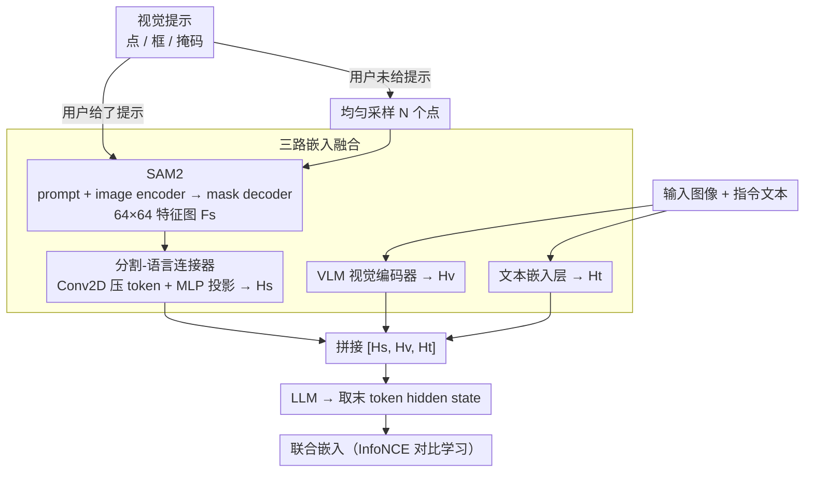

# VIRTUE: Visual-Interactive Text-Image Universal Embedder

**会议**: ICLR 2026  
**arXiv**: [2510.00523](https://arxiv.org/abs/2510.00523)  
**代码**: [GitHub](https://github.com/sony/virtue)  
**领域**: 图像分割（多模态嵌入/视觉交互）  
**关键词**: visual prompt, embedding model, SAM2, VLM, visual-interactive, retrieval

## 一句话总结

提出 VIRTUE，将分割模型 SAM2 与 VLM 结合构建视觉交互式通用嵌入器，支持用户通过点/框/掩码指定兴趣区域产生实体级+全局级联合嵌入，并构建百万级 SCaR 基准评估视觉交互检索能力，在 36 个 MMEB 任务（+3.1%-8.5%）和 5 个 SCaR 任务（+15.2%-20.3%）上均达到 SOTA。

## 研究背景与动机

**嵌入模型的交互局限**：现有 VLM 嵌入模型（VLM2Vec/GME/LamRA）仅支持文本指令交互，缺乏视觉交互能力（点/框/掩码等 visual prompt）

**视觉提示的价值**：在生成模型中已广泛使用（SAM、GroundingDINO），但嵌入模型尚未探索。视觉提示可提供精确空间定位用于细粒度理解

**裁剪的不足**：直觉的 ROI 裁剪方案会丢失全局场景上下文——"桌上的沙拉叉"裁剪后失去"桌"的信息，导致在需要组合推理的检索中失败

**同一图像不同实体需求**：同一图像中的狗和猫需要不同嵌入，但整体嵌入无法区分

**缺乏评估基准**：没有评估视觉交互嵌入能力的公开基准

## 方法详解

### 整体框架

VIRTUE 要解决的是嵌入模型"只能听文字、不能看圈选"的问题：让用户用点/框/掩码圈出感兴趣的实体，模型给出既认得这个实体、又记得整张图场景的嵌入。整体怎么转——一张图配上视觉提示先进分割模型 SAM2（点/框/掩码若用户没给，就自动均匀采点替代），SAM2 输出实体级的分割特征，经一个分割-语言连接器投影成分割嵌入 $H_s$；与此并行，整张图进 VLM（Qwen2-VL）的视觉编码器得到全局视觉嵌入 $H_v$，指令文本进文本嵌入层得到 $H_t$。三路嵌入拼成 $[H_s, H_v, H_t]$ 一起送进 LLM，取最后一个 token 的 hidden state 作为联合嵌入，用 InfoNCE 做对比学习。这样实体级的精确定位和整图的场景上下文都不丢。

### 关键设计

**1. 三路嵌入融合：让实体级信号与全局上下文共存**

现有 VLM 嵌入模型只能吃文本指令，圈出局部 ROI 的直觉做法是裁剪图像，但裁掉"桌上的沙拉叉"也就裁掉了"桌"，组合检索随之失败。VIRTUE 改用三路并行：分割嵌入 $H_s$ 由 SAM2 的 prompt encoder 处理视觉提示、image encoder 处理整图，再由 mask decoder 生成 $64\times64$ 特征图 $F_s = f(E_p(P), E_i(I))$，最后过分割-语言连接器（Conv2D 压成若干 token、MLP 投影到 LLM 维度 $d$），编码"这个实体是什么"；视觉嵌入 $H_v$ 来自 VLM 的 vision encoder，保留整图全局上下文；文本嵌入 $H_t$ 由 LLM 文本嵌入层处理指令。三者拼接成 $[H_s, H_v, H_t]$ 一起进 LLM，使同一张图里的狗和猫能因为不同的视觉提示而得到不同嵌入，又不必牺牲背景信息——这正是裁剪方案做不到的。

**2. 无视觉提示时的自动采样：让交互模型在传统任务上也不掉队**

大量 MMEB 检索任务并不提供视觉提示，若分割分支闲置就浪费了实体级能力。VIRTUE 在没有用户提示时均匀采样 $N$ 个点作为替代输入喂给 SAM2 的 prompt encoder，借助其自动分割能力提取多实体级特征图。这相当于把 SAM2 当成一个结构化先验，即便在非交互场景也能给出实体级线索，因此在传统 MMEB 任务上仍带来 3.1%–8.5% 的提升，而不是只在交互任务上才有用。

**3. SCaR 基准：补上视觉交互检索的评测空白**

视觉交互嵌入此前没有公开基准，难以衡量"圈出实体后能否检索到对应描述"。SCaR（Segmentation-and-Scene Caption Retrieval）的任务设定是：给定图像加一个 ROI 边界框作为查询，检索描述该实体在全局场景中的标题，数据取自 RefCOCO+/RefCOCOg/VisualGenome/COCO-Stuff/ADE20K 五个数据集（先统一转成 COCO 格式、每图最多取 5 个对象），规模为 957K 训练 + 47K 评估样本。难点在干扰项质量——对每个样本，GPT-4V 按"对象、关系、场景"三种元素之一替换标题生成 9 个干扰项（而非随机负样本），再经启发式规则 + GPT-4V 验证 + 人工审查的多阶段过滤，确保负样本既贴近又确实错误，避免检索任务被廉价负样本拉低区分度。

### 损失函数 / 训练策略

拼接后的 $[H_s, H_v, H_t]$ 过 LLM 取最后 token 的 hidden state，做 InfoNCE 对比学习。为控制成本，SAM2 与 vision encoder 全程冻结，只训练 LoRA（rank=8）和从头初始化的分割-语言连接器，在 20 个 MMEB 训练集上以 batch size 1024 训练。

## 实验关键数据

### MMEB Overall (36 tasks)

| 模型 | 参数 | IND | OOD | Overall |
|------|------|-----|-----|---------|
| VLM2Vec-2B | 2B | 60.7 | 57.3 | 59.7 |
| **VIRTUE-2B** | 2B | **69.7** | **58.8** | **64.8** |
| VLM2Vec-7B | 7B | 71.4 | 58.1 | 65.5 |
| UniME-7B | 7B | 68.4 | 57.9 | 66.6 |
| **VIRTUE-7B** | 7B | **74.4** | **61.4** | **68.6** |

### SCaR (5 visual-interactive tasks)

| 模型 | RefCOCOg | RefCOCO+ | COCO-Stuff | VG | ADE20K |
|------|---------|----------|-----------|-----|--------|
| VLM2Vec-7B | 56.2 | 52.1 | 45.3 | 42.8 | 38.1 |
| **VIRTUE-7B** | **75.1** | **70.8** | **62.5** | **59.4** | **55.9** |

### 消融实验

| 配置 | MMEB Overall | SCaR Avg | 说明 |
|------|-------------|---------|------|
| 无分割嵌入 | 65.5 | 52.1 | VLM2Vec 基线 |
| + 裁剪 ROI | 65.8 | 54.3 | 裁剪帮助有限 |
| + 全SAM2特征 | 67.1 | 63.2 | 实体级信息有效 |
| **+ 完整 VIRTUE** | **68.6** | **68.2** | 最佳 |

### 关键发现

- 分割嵌入在非交互场景下（均匀采样点）也提供实体级信息增益
- 即使在传统 MMEB 任务（无视觉提示）上也有 3.1%-8.5% 提升
- SAM2 作为结构化先验比裁剪更精确地捕捉实体语义（避免包含背景、跨实体等问题）

## 亮点与洞察

- **新交互范式**：首次将视觉提示（点/框/掩码）引入嵌入模型，定义了全新问题空间
- **SCaR 基准**：百万级数据 + GPT-4V 生成高质量干扰项 + 多阶段过滤，是可靠的评估工具
- **兼顾通用性**：无视觉提示时自动采样点策略保证了在传统任务上的竞争力
- **实用性强**：SAM2 冻结 + LoRA 微调，训练成本可控

## 局限与展望

- SAM2 增加推理计算开销（额外的分割前向传播）
- SCaR 仅评估 I2T 检索，未覆盖 I2I 视觉交互场景
- 均匀采样点的自动策略可能不是最优的实体发现方式（可考虑自动目标检测驱动）
- 分割-语言连接器需从头训练，增加了训练复杂度

## 相关工作与启发

- **VLM2Vec/GME/LamRA**：VLM 嵌入模型基线，仅支持文本交互
- **CLIP/SigLIP/OpenCLIP**：双塔嵌入模型，全局匹配无区域感知
- **SAM2**：作为实体级特征提取器被引入嵌入学习

## 评分

- 新颖性: ⭐⭐⭐⭐⭐ 视觉交互嵌入 = 全新问题定义 + 新基准
- 实验充分度: ⭐⭐⭐⭐⭐ 36+5 任务 + 大量消融 + 两种规模模型
- 写作质量: ⭐⭐⭐⭐ 清晰系统，基准构建过程透明
- 价值: ⭐⭐⭐⭐⭐ 开辟视觉交互嵌入新方向 + 高质量基准

<!-- RELATED:START -->

## 相关论文

- [\[CVPR 2026\] The Missing Point in Vision Transformers for Universal Image Segmentation](../../CVPR2026/segmentation/the_missing_point_in_vision_transformers_for_universal_image_segmentation.md)
- [\[CVPR 2026\] Live Interactive Training for Video Segmentation](../../CVPR2026/segmentation/live_interactive_training_for_video_segmentation.md)
- [\[ICLR 2026\] Universal Multi-Domain Translation via Diffusion Routers](universal_multi-domain_translation_via_diffusion_routers.md)
- [\[CVPR 2026\] PrAda: Few-Shot Visual Adaptation for Text-Prompted Segmentation](../../CVPR2026/segmentation/prada_few-shot_visual_adaptation_for_text-prompted_segmentation.md)
- [\[ICCV 2025\] TAViS: Text-bridged Audio-Visual Segmentation with Foundation Models](../../ICCV2025/segmentation/tavis_text-bridged_audio-visual_segmentation_with_foundation_models.md)

<!-- RELATED:END -->
