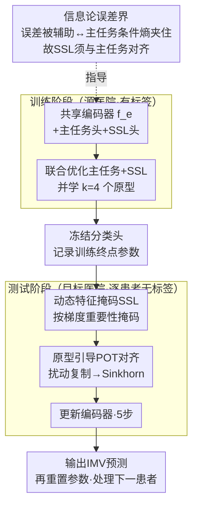

# Adaptive Test-Time Training for Predicting Need for Invasive Mechanical Ventilation in Multi-Center Cohorts

**会议**: ICLR 2026  
**arXiv**: [2512.06652](https://arxiv.org/abs/2512.06652)  
**代码**: 待公开  
**领域**: 医学图像 / EHR临床预测  
**关键词**: 测试时训练, 域迁移, 有创机械通气预测, 动态特征掩码, 部分最优传输  

## 一句话总结
提出AdaTTT框架，通过动态特征感知self-supervised学习（自适应掩码策略）和原型引导的部分最优传输对齐，在ICU多中心EHR数据上实现鲁棒的测试时适应，用于提前24小时预测有创机械通气需求。

## 研究背景与动机

**领域现状**：ICU中有创机械通气（IMV）预测对及时临床干预至关重要，基于EHR的ML模型（如VentNet、Composer）已展现潜力，但跨院系部署面临严重的域迁移问题。

**现有痛点**：不同医院的患者群体、临床流程、EHR系统差异导致分布偏移，模型AUC跨院跌幅可达12%。已有方法要么需要目标域标注数据进行微调，要么计算成本高，不适合实时临床部署。

**核心矛盾**：Test-Time Training (TTT) 能在推理阶段无标签适应，但现有TTT方法直接套用到EHR场景有三个问题：(a) 小批量（单次就诊）下BN统计不稳定；(b) EHR特征重要性高度不均匀，随机掩码的SSL任务无法对齐主任务；(c) 实例级SSL更新易过拟合噪声样本。

**本文目标**：设计一个专为EHR-TTT场景优化的框架，让SSL辅助任务与主任务高度对齐，同时防止测试时过拟合。

**切入角度**：从信息论角度推导测试时预测误差的上下界（Theorem 2），证明误差受辅助任务与主任务的条件不确定性 $H(Y_m'|Y_s')$ 约束——为设计高对齐度SSL任务提供了理论指导。

**核心 idea**：用动态特征重要性驱动的自适应掩码让SSL与临床预测任务紧密对齐，加上原型+部分最优传输在测试时做柔性分布匹配。

## 方法详解

### 整体框架
AdaTTT要解决的是：一个在源医院训练好的IMV预测模型，部署到别的医院时因分布偏移而掉点，但目标医院没有标签、也来不及微调。它的做法是给模型挂一个自监督（SSL）辅助任务，让模型在推理时对着每个新患者就地做几步无标签更新，再出预测。整个网络由共享编码器 $f_e$、主任务分类头 $h_c$ 和SSL头 $h_s$ 三部分组成：训练阶段三者联合优化（主任务损失 + SSL损失 + 原型学习损失），测试阶段冻结分类头、只让SSL损失加上一项最优传输（OT）对齐损失去更新编码器，每个样本更新5步后做预测，预测完立刻把参数重置回训练终点，再处理下一个患者。论文的两条主线——什么样的SSL任务才有用、测试时怎么柔性对齐分布——分别由下面的动态掩码和原型OT回答，而这两者都源自一个信息论分析。

### 关键设计

**1. 信息论误差界：把"SSL要设计成什么样"变成一个可推导的问题**

TTT的核心赌注是"优化辅助任务能带动主任务变好"，但这个赌注什么时候成立、什么时候反而有害，过去靠经验。本文先假设测试时主任务标签 $Y_m'$、表示 $Z'$、SSL标签 $Y_s'$ 构成马尔科夫链 $Y_s' \to Z' \to Y_m'$，由Lemma 1得 $I(Z';Y_m') \geq I(Y_s';Y_m')$，再由Theorem 2推出测试预测误差 $p(e)$ 的上下界：

$$H_{\text{err}}^{-1}\big(H(Y_m'|Y_s')\big) \leq p(e) \leq \tfrac{1}{2}H(Y_m'|Y_s')$$

这条界把设计目标讲死了：误差被条件熵 $H(Y_m'|Y_s')$ 夹住，所以SSL任务要尽量让"知道SSL标签就几乎知道主任务标签"，即两者高度相关；同时它也是一个警告——过度拟合测试域上的辅助任务分布会让模型偏离主任务，反而有害。后面的动态掩码正是为了把这个条件熵压低而设计的。

**2. 动态特征掩码SSL：让自监督任务盯着对临床预测真正重要的特征**

EHR的特征重要性高度不均匀（呼吸率这类信号和某个边缘实验室指标对IMV预测的贡献天差地别），如果像标准TTT那样随机掩码，模型会把宝贵的适应容量浪费在不相关特征上，自监督和主任务也就对不齐——这恰好是上一条界要避免的高条件熵情形。本文用两个前置任务（特征重建 + 掩码特征建模），关键在掩码概率不再均匀，而是按特征对主任务的梯度重要性动态分配。每个特征 $j$ 的重要性用输入梯度乘以特征值的绝对值在样本上平均估计：

$$I_j = \frac{1}{n_s}\sum_n \left| \frac{\partial Y_m^{(n)}}{\partial x_j^{(n)}} \cdot x_j^{(n)} \right|$$

归一化后得到掩码概率 $p_{m,j}$，越重要的特征越容易被掩码，逼模型去重建这些关键信号。整个调度分两阶段：warmup 期用一个固定的先验掩码（重要性来自一个预训练好的呼吸衰竭模型），等模型自身可靠后再切换到由它自己的梯度重要性实时更新。

**3. 原型引导的部分最优传输对齐：测试时把单个患者柔性贴到训练分布上**

测试时一次只来一个患者（单就诊、小批量），直接做分布匹配既不稳又容易把这个样本强行拉向不相关的群体。AdaTTT先在训练阶段学 $k=4$ 个原型来概括源分布的几个模式，原型学习损失为 $\mathcal{L}_{\text{proto}} = \|z_i - p_{\mathcal{A}(z_i)}\|_2^2$（$\mathcal{A}(z_i)$ 是分配给 $z_i$ 的最近原型），并加一项均衡正则避免原型坍缩。测试时不用刚性的全量OT，而是用部分最优传输（POT）——只要求测试样本和相关的原型子集匹配。实现上有个巧办法：把单个测试表示 $z'$ 扰动复制成 $k$ 份（扰动方差取自原型间方差，从而保持合理的分布跨度），就能把POT转写成标准OT，直接用Sinkhorn求解，对齐损失即 $\sum_{i,j} \gamma_{ij}C_{ij}$。相比传统OT假设源-目标完全对齐的刚性，部分匹配让测试样本只贴向真正相关的原型，避免被无关模式带偏。

### 训练策略
- 训练阶段联合损失：$\mathcal{L} = \sum_i [\mathcal{L}_{\text{main}} + \mathcal{L}_{\text{ssl}} + \lambda_{\text{proto}}\mathcal{L}_{\text{proto}}] + \lambda_{\text{reg}}\mathcal{L}_{\text{reg}}$
- 测试时每个输入做5步梯度更新，更新完后重置编码器参数（reset protocol）
- Sinkhorn算法求解OT，熵正则化 $\varepsilon=0.1$，最多1000次迭代

## 实验关键数据

### 主实验
在3个测试队列上与9种基线对比（AUC，20次独立运行均值±标准误差）：

| 方法 | Site A | Site B | MIMIC-IV |
|------|--------|--------|----------|
| TEST (无适应) | 84.01 | 83.75 | 75.28 |
| TTT | 82.55±0.09 | 82.81±0.05 | 76.45±0.07 |
| TTT++ | 82.50±0.06 | 82.85±0.10 | 76.24±0.08 |
| SAR | 84.30±0.04 | 83.20±0.10 | 75.72±0.04 |
| CoTTA | 83.12±0.02 | 83.81±0.04 | 76.60±0.05 |
| **AdaTTT (Ours)** | **85.02±0.05** | **84.10±0.05** | **77.17±0.08** |

Brier score方面AdaTTT同样最佳（Site A: 0.086, Site B: 0.085, MIMIC-IV: 0.106）。

### 消融实验

| 配置 | Site A AUC | Site B AUC | MIMIC-IV AUC |
|------|-----------|-----------|-------------|
| PriTTT (仅动态掩码) | 84.61 | 83.98 | 76.84 |
| DynTTT (仅OT对齐) | 84.54 | 83.84 | 76.79 |
| AdaTTT (完整) | **85.02** | **84.10** | **77.17** |

### 关键发现
- 标准TTT和TTT++在EHR上反而**低于**无适应基线（Site A: 82.55 vs 84.01），说明EHR场景需要特殊设计的TTT方法
- 动态掩码和OT对齐各自独立贡献约0.5-1%的AUC提升，组合获得最佳且最稳定的效果
- 每个测试样本仅需5步梯度更新，单步平均0.29s，原型大小从4增到16几乎不影响运行时间
- 顺序更新（不重置参数）在长期部署中性能退化，说明reset protocol对防止漂移至关重要

## 亮点与洞察
- **信息论指导设计**：Theorem 2将TTT的设计问题形式化为"最小化辅助-主任务条件熵"，这个理论框架可以指导其他TTT/TTA方法的辅助任务设计
- **领域特定的设计智慧**：认识到EHR的特征重要性高度不均匀，用梯度重要性驱动掩码概率——这个简单想法非常有效且易于实现
- **部分OT替代全OT**：通过扰动副本将POT转为标准OT的trick既巧妙又实用，避免了专门实现POT求解器

## 局限与展望
- 实验规模偏小（MIMIC-IV降采样至~2000个encounters），且阳性率仅5-15%，类不平衡较严重
- 仅验证了binary分类（IMV/非IMV），模型泛化到多级预测或其他临床任务的能力未知
- 原型数量 $k=4$ 的选择依据不足，对大规模异质患者群体是否足够得探讨
- 对条件偏移 $p(Y|X)$ 的鲁棒性不足（如临床实践模式变化导致的标签偏移）
- reset protocol意味着无法利用之前患者的适应信息，长期部署中的知识积累问题未解决

## 相关工作与启发
- **vs TTT/TTT++**: 标准TTT用固定SSL任务，AdaTTT用动态特征感知SSL——在EHR场景前者甚至不如不适应
- **vs TENT**: TENT的熵最小化在单instance小batch下不稳定且可能产生过度自信的错误预测
- **vs SAR**: SAR的sharpness-aware更新在Site A接近AdaTTT但在其他数据集不稳定，且依赖BN层
- **vs T3A**: 仅调分类器无法修复表示空间的域偏移

## 评分
- 新颖性: ⭐⭐⭐⭐ 信息论界+动态掩码+POT的组合有创意，但技术组件本身较常规
- 实验充分度: ⭐⭐⭐⭐ 多站点评估+消融+敏感性分析较完整，但数据集规模有限
- 写作质量: ⭐⭐⭐⭐ 理论推导清晰，临床动机阐述充分
- 价值: ⭐⭐⭐⭐ 解决了TTT在EHR场景的实际痛点，对临床ML部署有直接指导意义

<!-- RELATED:START -->

## 相关论文

- [\[ICLR 2026\] Test-Time Efficient Pretrained Model Portfolios for Time Series Forecasting](test-time_efficient_pretrained_model_portfolios_for_time_series_forecasting.md)
- [\[ICML 2025\] Test-Time Training Provably Improves Transformers as In-Context Learners](../../ICML2025/self_supervised/test-time_training_provably_improves_transformers_as_in-context_learners.md)
- [\[ICLR 2026\] Fly-CL: A Fly-Inspired Framework for Enhancing Efficient Decorrelation and Reduced Training Time in Pre-trained Model-based Continual Representation Learning](fly-cl_a_fly-inspired_framework_for_enhancing_efficient_decorrelation_and_reduce.md)
- [\[ECCV 2024\] Adaptive Multi-head Contrastive Learning](../../ECCV2024/self_supervised/adaptive_multihead_contrastive_learning.md)
- [\[ICML 2026\] Mitigating Label Shift in Tabular In-Context Learning via Test-Time Posterior Adjustment](../../ICML2026/self_supervised/mitigating_label_shift_in_tabular_in-context_learning_via_test-time_posterior_ad.md)

<!-- RELATED:END -->
