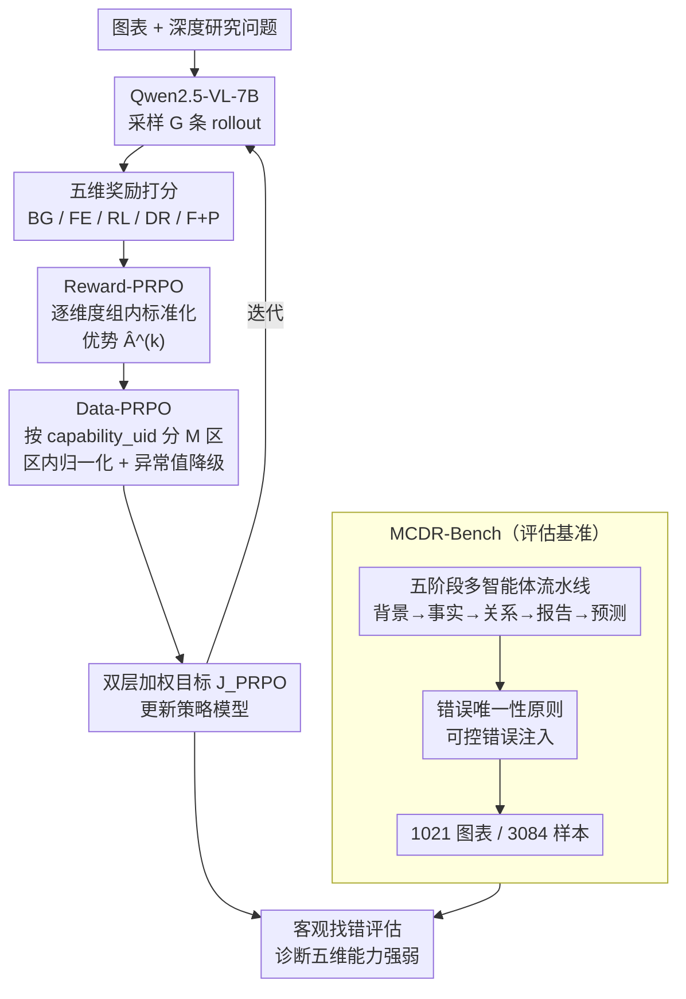

# Chart Deep Research in LVLMs via Parallel Relative Policy Optimization

**会议**: ICLR2026  
**arXiv**: [2603.06677](https://arxiv.org/abs/2603.06677)  
**代码**: 待确认  
**领域**: 其他  
**关键词**: chart understanding, deep research, RLHF, policy optimization, benchmark

## 一句话总结
提出 PRPO（Parallel Relative Policy Optimization），通过在奖励维度和数据类型两个层面做并行解耦优化，解决 GRPO 在多维奖励信号干扰和异构数据梯度冲突下的训练瓶颈；同时构建 MCDR-Bench，基于"错误唯一性原则"将主观生成评估转化为客观错误识别，实现图表深度研究能力的量化评估。

## 研究背景与动机

**领域现状**：图表理解已从简单数据提取发展到推理分析。现有方法（ChartQA、PlotQA 等）主要处理浅层任务——视觉识别、事实问答，而真正的"深度研究"（趋势分析、因果推理、战略建议）能力严重不足。

**现有痛点**：(a) **训练瓶颈**——图表深度研究需要同时掌握背景知识整合、事实提取、关系构建、深度推理、预测规划等多维能力，但 GRPO 将多维奖励压缩为单一标量导致信号干扰和互相抵消；异构数据的梯度冲突导致简单任务主导训练。(b) **评估瓶颈**——现有 benchmark 只评估事实 QA，无法评估端到端的分析推理能力；主观生成任务的标注成本高、答案多样性大。

**核心矛盾**：多维能力协同发展 vs 单一优化目标的冲突——GRPO 将所有维度奖励 aggregation 为一个标量，压缩了方差、削弱了优化信号的区分力，无法实现各维度能力的均衡发展。

**本文目标** (a) 如何在多维奖励和异构数据下实现均衡训练？(b) 如何客观评估图表深度研究能力？

**切入角度**：将"并行"思想引入策略优化——奖励维度并行优化 + 数据能力分区并行优化——解耦冲突源头。评估端引入可控错误注入，将主观生成转为客观分类。

**核心 idea**：在 GRPO 基础上做两层并行解耦（Reward-PRPO 分解奖励维度 + Data-PRPO 分区数据类型），消除多维训练中的信号干扰和梯度冲突。

## 方法详解

### 整体框架
PRPO 的目标是让一个 7B 视觉语言模型同时学会图表深度研究的五种能力——背景知识整合、事实提取、关系构建、深度推理、预测规划。难点在于 GRPO 把这五维奖励压成一个标量、又把难度悬殊的样本混在一起归一化，结果是信号互相抵消、简单任务主导梯度。PRPO 把"并行解耦"分别打进这两处：在奖励侧用 Reward-PRPO 让每个维度各自算 advantage，在数据侧用 Data-PRPO 让每种能力的样本在自己的分区里归一化，最后双层加权汇成统一目标。配套的 MCDR-Bench 则换一个角度解决评估难题——把"给主观报告打分"改成"在被注入一处错误的报告里找错"，让端到端分析能力变成可客观判定的分类任务。

### 关键设计

**1. Reward-PRPO：让每个奖励维度保留自己的优化信号**

GRPO 的做法是把五维奖励先加成一个标量 $R_i = \sum_k R_i^{(k)}$ 再算 advantage，于是某个维度上的优势会被另一个维度上的劣势抵消，模型收到的是一个被平均掉的、区分力很弱的梯度。Reward-PRPO 把这一步拆开：对 $K$ 个奖励维度分别做组内标准化 $\hat{A}_i^{(k)} = (R_i^{(k)} - \bar{R}^{(k)}) / \sigma^{(k)}$，每个维度先各自得到干净的优势估计，再按权重组合成目标

$$J_{\text{Reward-PRPO}} = \sum_{k=1}^K \lambda_k \, \mathbb{E}\big[\cdots L_{\text{clip}}(r_{i,t}, \hat{A}_i^{(k)})\big]$$

这样模型能在"背景知识""推理深度"等每一维上分别收到独立的提升信号，而不是被一个压缩后的总分牵着走。

**2. Data-PRPO：让难度悬殊的样本在各自的尺度里竞争**

第二个冲突来自数据。简单的视觉识别和复杂的因果推理，奖励分布的均值和方差差得很远；如果用全局统计量归一化，高方差的简单任务就会主导梯度，复杂任务的信号被淹没。Data-PRPO 引入 capability_uid 把样本按能力切成 $M$ 个分区 $\{P(Q^{(m)})\}_{m=1}^M$，每个分区只用分区内的统计量做归一化 $\hat{A}_i^{(m)} = (R_i - \bar{R}^{(m)}) / \sigma^{(m)}$，于是每种能力类型只跟同类样本比较、在自己的尺度内竞争。为了防止离群样本把分区统计带偏，它还加了一道异常值降级：迭代检测 $|\hat{A}_i^{(t)}| > \tau$ 的样本，把它们从分区里摘出来、降级成 rollout-level 的单独优化——分区不是硬切，而是带个体兜底的软分区。

**3. MCDR-Bench：把主观生成评估改造成客观找错**

深度研究报告是开放生成，直接打分既费标注又难复现。MCDR-Bench 绕开这点，分两个阶段构建。Phase 1 用五阶段多智能体流水线产出高质量标注——背景获取→事实提取→关系构建→深度研究报告→预测规划，再加人工审核；Phase 2 依据"错误唯一性原则"在正确报告里做可控错误注入，每份只埋一处已知错误，把任务从"写得好不好"变成"能不能找出那一处错"。这是客观可判定的，且因为错误被精确绑定到某个能力维度，还能直接诊断模型在哪一维上薄弱。最终得到 1,021 张高复杂度图表、3,084 个高难度样本，覆盖前述 5 个能力维度。

### 损失函数 / 训练策略
两层解耦合并成统一的 PRPO 目标：对分区 $m$ 与奖励维度 $k$，advantage 在"分区内 + 维度内"双重标准化 $\hat{A}_i^{(k,m)} = (R_i^{(k)} - \bar{R}^{(k,m)}) / \sigma^{(k,m)}$，总目标是双层加权求和

$$J_{\text{PRPO}} = \sum_m \lambda_m \sum_k \lambda_k \, \mathbb{E}\big[\cdots L_{\text{clip}}(r_{i,t}, \hat{A}_i^{(k,m)})\big]$$

训练基座为 Qwen2.5-VL-7B-Instruct。

## 实验关键数据

### 主实验（MCDR-Bench）

| 模型 | BG | FE | RL | DR | F/P | Overall |
|------|-----|-----|-----|-----|-----|---------|
| GPT-4o | 27.2 | 21.9 | 41.0 | 47.5 | 60.0 | 35.8 |
| Claude-3.7 Sonnet | 68.8 | 57.3 | 89.5 | 85.0 | 87.0 | 75.0 |
| Gemini-2.5-Pro | 81.2 | 87.3 | 91.4 | 93.8 | 93.0 | **89.3** |
| Qwen2.5-VL-7B (base) | 23.4 | 39.4 | 51.0 | 37.6 | 45.6 | 40.0 |
| + GRPO | 41.2 | 51.7 | 75.4 | 66.1 | 77.4 | 61.7 |
| + PRPO | **50.7** | **61.4** | **81.8** | **72.8** | **84.0** | **69.6** |
| + PRPO Think | **62.9** | **65.2** | **88.9** | **80.9** | **87.2** | **76.3** |

### 消融实验（ChartQAPRO 交叉验证）

| 配置 | Factoid | MCQ | Conv. | FactChk | Hypo. | Overall |
|------|---------|-----|-------|---------|-------|---------|
| Qwen2.5-VL-7B base | 27.5 | 37.9 | 55.2 | 46.7 | 44.4 | 36.3 |
| + ChartReasoner-GRPO | - | - | - | - | - | 40.0 |
| + PRPO | **36.2** | **50.5** | 49.6 | **53.3** | **53.7** | **43.0** |

### 关键发现
- **PRPO 全面超越 GRPO**：在 MCDR-Bench 上 PRPO 比 GRPO 高 +7.91%（直接）和 +13.26%（Think），5 个维度全面提升
- **Think 模式放大收益**：PRPO + Think 比 PRPO 直接模式再提 +6.64%，说明 PRPO 训练出的模型在 chain-of-thought 推理下释放更多潜力
- **7B 模型逼近商用大模型**：PRPO Think 的 76.3% 已超过 Claude-3.7 Sonnet 的 75.0%，接近 Gemini-2.5-Pro（仅差 13 分），而模型小 10-100 倍
- **跨 benchmark 泛化**：在 ChartQAPRO 上 PRPO 也比 GRPO 高 +6.64%，说明不是对 MCDR-Bench 过拟合
- **FE（事实提取）维度提升最大**：从 39.4 → 61.4（+22.0），说明 PRPO 的分维度优化对信息提取能力帮助最显著

## 亮点与洞察
- **"并行解耦"是处理多维优化冲突的通用思路**：Reward-PRPO 在奖励维度解耦、Data-PRPO 在数据类型解耦——这个设计哲学可以迁移到任何多目标 RL 场景（如代码生成的正确性 vs 效率 vs 安全性）
- **错误注入评估范式巧妙**：将主观生成转为客观分类——既降低了标注成本，又实现精细诊断。这个评估思路可以推广到任何长文本生成任务（如 RAG 准确性、报告质量）
- **异常值降级机制实用**：Data-PRPO 不是硬分区，检测到不适合当前分区的样本会自动降级为个体优化——兼顾了分区效率和个体公平

## 局限与展望
- **基座模型单一**：所有实验基于 Qwen2.5-VL-7B。在更大模型（72B+）或不同架构上效果未验证
- **能力分区需人工定义**：Data-PRPO 的 capability_uid 需要预定义能力类别，自动发现能力分区是改进方向
- **奖励维度权重 $\lambda_k$ 的选择**：论文未详细讨论权重敏感性。自适应调整维度权重（如基于各维度收敛速度）可能进一步提升
- **仅图表领域**：PRPO 的并行优化思想是通用的，但实验仅限图表——值得在通用 VLM 多任务训练中验证

## 相关工作与启发
- **vs GRPO/DAPO**：GRPO 用 group-level 归一化但单一奖励标量。DAPO 解决 entropy collapse 但没处理多维冲突。PRPO 的核心新增是"双层并行"——维度+数据类型
- **vs ChartReasoner**：ChartReasoner 用 SFT+GRPO 做结构化推理。PRPO 不改推理结构，只改优化策略——更轻量、更通用
- **vs PPO/DPO**：PPO 需要额外 value model，DPO 避免 reward model 但对多维奖励不自然。PRPO 在 GRPO 框架内原生支持多维度

## 评分
- 新颖性: ⭐⭐⭐⭐ 并行解耦训练 + 错误注入评估的双创新，但 Reward-PRPO 本质是标准多目标优化分解
- 实验充分度: ⭐⭐⭐⭐ MCDR-Bench + ChartQAPRO 双验证，对比商用和开源模型全面，但缺少更多基座模型实验
- 写作质量: ⭐⭐⭐⭐ 问题分析清晰，数学推导严谨，但 Section 3-4 结构略重
- 价值: ⭐⭐⭐⭐ PRPO 的并行优化思想对多维 RLHF 训练有通用参考价值，MCDR-Bench 填补图表深度研究评估空白

<!-- RELATED:START -->

## 相关论文

- [\[NeurIPS 2025\] M-GRPO: Stabilizing Self-Supervised Reinforcement Learning for Large Language Models with Momentum-Anchored Policy Optimization](../../NeurIPS2025/self_supervised/m-grpo_stabilizing_self-supervised_reinforcement_learning_for_multimodal_underst.md)
- [\[CVPR 2026\] Scaling Parallel Sequence Models to Vision Foundation Models](../../CVPR2026/self_supervised/scaling_parallel_sequence_models_to_vision_foundation_models.md)
- [\[AAAI 2026\] FedGRPO: Privately Optimizing Foundation Models with Group-Relative Rewards from Domain Clients](../../AAAI2026/self_supervised/fedgrpo_privately_optimizing_foundation_models_with_group-relative_rewards_from_.md)
- [\[CVPR 2026\] Beyond Myopic Alignment: Lookahead Optimization for Online Class-Incremental Learning](../../CVPR2026/self_supervised/beyond_myopic_alignment_lookahead_optimization_for_online_class-incremental_lear.md)
- [\[NeurIPS 2025\] Continuous Subspace Optimization for Continual Learning (CoSO)](../../NeurIPS2025/self_supervised/continuous_subspace_optimization_for_continual_learning.md)

<!-- RELATED:END -->
