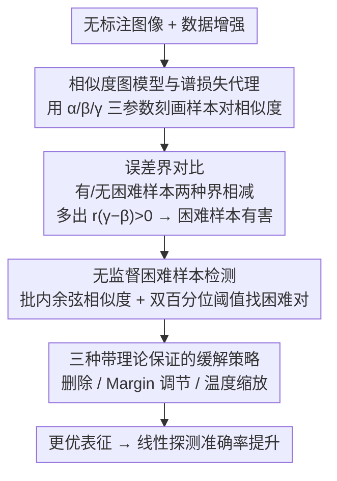

# Difficult Examples Hurt Unsupervised Contrastive Learning: A Theoretical Perspective

**会议**: ICLR 2026 Oral  
**arXiv**: [2501.01317](https://arxiv.org/abs/2501.01317)  
**代码**: 未公开  
**领域**: 自监督学习 / 对比学习 / 理论分析  
**关键词**: 对比学习, 困难样本, 相似度图模型, 温度缩放, 理论界

## 一句话总结
通过相似度图模型理论分析严格证明"困难样本"（跨类高相似度样本对）会损害无监督对比学习性能——困难样本使泛化误差界严格恶化，提出删除困难样本、调节 margin 和温度缩放三种理论指导的缓解策略，在 TinyImageNet 上带来高达 10.42% 的线性探测准确率提升。这一发现是反直觉的：深度学习中通常"更多数据更好"，但对比学习中精心移除困难样本反而有益。

## 研究背景与动机
**领域现状**：对比学习（SimCLR, MoCo）在无监督表征学习中非常成功，但性能在不同数据集上差异巨大，缺乏理论解释。Joshi & Mirzasoleiman (2023) 发现困难样本在对比学习中贡献最少但未注意到性能提升的可能。

**现有痛点**：困难负样本（与正样本很相似但来自不同类别）在监督对比学习中被视为有益的（提供更强梯度），但在无监督对比学习中的影响不清楚。无监督设定下没有标签来区分"困难正样本"和"困难负样本"。

**核心矛盾**：深度学习模型通常训练数据越多越好（更低的采样误差），但作者发现对比学习中移除部分样本反而提升性能——这是反直觉的。

**本文目标**：理论解释为什么困难样本伤害无监督对比学习性能，并提供改善方案。

**核心 idea**：通过相似度图模型严格证明，跨类困难样本的存在增加了线性探测误差的泛化界，应该被特殊处理（删除、加 margin 或温度缩放）。

## 方法详解

### 整体框架
本文不提出新网络，而是建立一套相似度图模型，把"困难样本"形式化为跨类高相似度的样本对，再用谱对比学习损失的泛化误差界严格证明它们会让线性探测误差变差，并由此推出删除、margin、温度缩放三种带理论保证的缓解策略，外加一个无监督的困难样本检测器把这些策略真正用起来。整套分析的逻辑链是：用三个相似度参数刻画数据并换成可分析的谱损失 → 推导含/不含困难样本两种误差界并相减，得出"困难样本有害"的结论 → 从界的形式反推如何修正，并设计一个不依赖标签的检测器找出困难对、施加修正。

### 关键设计

**1. 相似度图模型与谱损失代理：把"困难"写进可分析的理论框架**

对比学习性能在不同数据集上差异巨大却缺乏解释，根源在于此前的增强图理论把所有异类样本一视同仁。本文扩展 HaoChen et al. (2021) 的增强图，用三个参数建模任意样本对的增强相似度：同类相似度 $\alpha$ 最大，远离决策边界的简单异类相似度 $\beta$ 最小，靠近决策边界的困难异类相似度 $\gamma$ 居中，满足自然关系 $\beta < \gamma < \alpha < 1$。困难样本因此被精确定义为相似度落在 $\gamma$ 附近的跨类对；为贴近真实数据，模型还允许加随机扰动放松假设 $\tilde{a}_{ij} = a_{ij} + \epsilon \cdot \varepsilon_{ij}$，使结论不依赖于严格的三值结构。

光有数据模型还推不动，因为 InfoNCE 直接分析困难。本文同步把损失换成 HaoChen et al. (2021) 的谱对比损失 $\mathcal{L}_{\text{Spec}}(f) = -2 \cdot \mathbb{E}_{x,x^+}[f(x)^\top f(x^+)] + \mathbb{E}_{x,x'}[(f(x)^\top f(x'))^2]$ 作为可分析的代理。这一替换之所以成立，是因为谱损失与 InfoNCE 在总体极小值处等价，又与矩阵分解损失 $\|\bar{A} - FF^\top\|_F^2$ 等价，从而把对比学习的泛化分析转化为对相似度矩阵 $\bar{A}$ 做谱分解的问题，便于直接套用矩阵扰动工具推导误差界。数据模型 + 谱损失代理合起来，才让"困难样本如何影响泛化"成为一个能算的问题。

**2. 误差界对比：严格证明困难样本有害**

有了可分析的框架，核心一步是分别推导有无困难样本时的线性探测误差界并相减。不含困难样本时误差界为 $\mathcal{E}_{w.o.} \leq \frac{4\delta}{1 - \frac{1-\alpha}{(1-\alpha)+n\alpha+nr\beta}} + 8\delta$；一旦引入困难样本，分母里会多出一项正比于 $r(\gamma-\beta)$ 的成分，由于 $\gamma > \beta$ 这一项严格为正，直接把误差界推高。更进一步，$\gamma - \beta$ 越大（困难样本越"困难"）恶化越严重——这正是反直觉结论的理论根据：更多样本本应降低采样误差，但若新增的是困难样本，泛化界反而变差。这一对比是后面所有缓解策略的出发点：要让界变小，就得设法削掉 $r(\gamma-\beta)$ 这一项。

**3. 三种带理论保证的缓解策略：从界的形式反推修正**

既然误差恶化来自 $r(\gamma-\beta)$，三种策略分别针对它的不同因子下手。删除困难样本直接移除困难集 $\mathbb{D}_d$ 中的对，当 $\gamma - \beta$ 足够大、或困难样本数 $n_d$ 足够小时误差界严格改善；Margin 调节对困难对在损失里加正 margin，等价于从相似度矩阵 $\bar{A}$ 里减去一个 margin 矩阵 $\bar{M}$，取值越大对应越"困难"的对（$m \propto \gamma - \beta$），恰好把困难对的额外相似度抵消、使误差界恢复到无困难样本的水平；温度缩放对困难对单独用一个温度参数压低其相似度贡献，在困难样本数受控时同样让误差界严格改善。后两者相比删除更平滑，不损失样本量。关键是，margin / 温度的具体取值全部由误差界推导而来，因此是理论直接指导超参，而非经验调参。

**4. 无监督困难样本检测：不需标签也不需预训练模型**

要把上述策略落地，必须先在无标签条件下找出困难对，否则理论无法应用。本文利用投影头之前的特征在批内的余弦相似度 $s_{ij}$ 来检测：用两个百分位阈值划定困难区间，指示器为 $p_{i,j} = \mathbf{1}[Sim_{posLow} \leq s_{ij} < Sim_{posHigh}]$。上界 $posHigh \approx 1/(r+1)$ 由粗略类别数 $r+1$ 决定，这个数只需简单聚类得到、无需精确；下界 $posLow$ 可取接近 100%，因为多纳入一些样本并不损害性能。该检测器不依赖任何预训练模型或额外前向计算，且对阈值不敏感——在 CIFAR-100 上 $posHigh$ 在 10%–30% 区间内效果都稳定，正是它让"删除 / Margin / 温度"这三种纯理论策略变成可直接训练的流程。

## 实验关键数据

### 主实验

| 数据集 | 基线 SimCLR | + 移除困难样本 | + Margin | + 温度 | + 组合 |
|--------|------------|-------------|---------|--------|--------|
| CIFAR-10 | 87.73% | +0.52% | +0.68% | +0.40% | +1.15% |
| CIFAR-100 | 59.95% | +2.91% | +1.28% | +1.12% | +2.91% |
| STL-10 | 82.18% | +1.13% | +0.96% | +0.60% | +1.52% |
| TinyImageNet | 69.58% | **+10.42%** | +6.28% | +4.53% | **+10.42%** |
| ImageNet-1K | 37.62% | +1.36% | +0.82% | +0.68% | +1.36% |

### 混合图像验证实验

| 数据集 | 原始 | 10%-Mixed | 20%-Mixed | 移除混合 |
|--------|------|-----------|-----------|----------|
| CIFAR-10 | 基线 | -1.5% | -3.2% | +0.5% |

### 关键发现
- **困难样本比例越高的数据集提升越显著**：TinyImageNet 有更多跨类相似样本（+10.42%），ImageNet-1K 比例低（+1.36%）
- 三种策略可组合使用，一般效果叠加——但在困难样本比例已低的数据集上组合无额外增益
- 温度缩放和 margin 调节比删除样本更平滑——不损失样本量
- 混合图像实验直观验证了理论：人为增加困难样本（混合图像）降低性能，移除后恢复

## 亮点与洞察
- **理论驱动的实践改进**：从误差界推导出的 margin 公式 $m \propto (\gamma - \beta)$ 直接指导了超参数设置
- **解释了跨数据集性能差异**：困难样本比例是解释不同数据集上对比学习性能差异的关键因素
- **反直觉但有理论支撑**："更少数据反而更好"在深度学习中罕见——本文提供了严格的理论解释
- **检测机制极其简单**：不需要标签、不需要预训练模型、不需要额外计算——仅用批内余弦相似度

## 局限与展望
- 相似度图模型假设了简单的三类相似度结构（$\alpha, \beta, \gamma$），真实数据的相似度分布更连续复杂
- 困难样本的检测在纯无监督下仍需粗略的类别数估计（$r+1$），虽然不严格依赖
- 仅在 SimCLR 框架上验证——MoCo、BYOL、DINO 等其他框架的适用性待探索
- 理论基于谱损失而非 InfoNCE——虽然两者极小值等价，但训练过程中的行为可能不同
- 在大规模数据（如完整 ImageNet）上的提升有限（+1.36%），说明困难样本比例在大数据中自然稀释

## 相关工作与启发
- **vs HaoChen et al. (2021) 谱对比学习理论**：他们建立了增强图理论框架，本文在此基础上引入困难样本建模——是理论的自然延伸
- **vs Joshi & Mirzasoleiman (2023) SAS**：他们首次发现困难样本在对比学习中贡献最少但未注意性能提升；本文将"提升"作为核心发现并提供理论解释
- **vs 困难负样本挖掘**：监督对比学习中困难负样本是有益的（提供更强梯度），本文证明在无监督对比学习中恰好相反——困难样本有害
- **启发**：这一发现提示所有使用对比学习的自监督方法（包括 CLIP 等多模态方法）都应重新审视其对困难样本的处理策略

## 评分
- 新颖性: ⭐⭐⭐⭐ 理论分析清晰且有实践指导，反直觉发现有价值
- 实验充分度: ⭐⭐⭐⭐ 五个数据集 + 三种策略 + 混合图像验证
- 写作质量: ⭐⭐⭐⭐⭐ 理论推导严谨，行文逻辑清晰
- 价值: ⭐⭐⭐⭐ 对对比学习的理论理解有实质贡献

<!-- RELATED:START -->

## 相关论文

- [\[AAAI 2026\] Improving Sustainability of Adversarial Examples in Class-Incremental Learning](../../AAAI2026/self_supervised/improving_sustainability_of_adversarial_examples_in_class-incremental_learning.md)
- [\[ICLR 2026\] Maximizing Incremental Information Entropy for Contrastive Learning](maximizing_incremental_information_entropy_for_contrastive_learning.md)
- [\[CVPR 2026\] UniGeoCLIP: Unified Geospatial Contrastive Learning](../../CVPR2026/self_supervised/unigeoclip_geospatial_contrastive.md)
- [\[NeurIPS 2025\] Self-Supervised Contrastive Learning is Approximately Supervised Contrastive Learning](../../NeurIPS2025/self_supervised/self-supervised_contrastive_learning_is_approximately_supervised_contrastive_lea.md)
- [\[NeurIPS 2025\] Adv-SSL: Adversarial Self-Supervised Representation Learning with Theoretical Guarantees](../../NeurIPS2025/self_supervised/adv-ssl_adversarial_self-supervised_representation_learning_with_theoretical_gua.md)

<!-- RELATED:END -->
