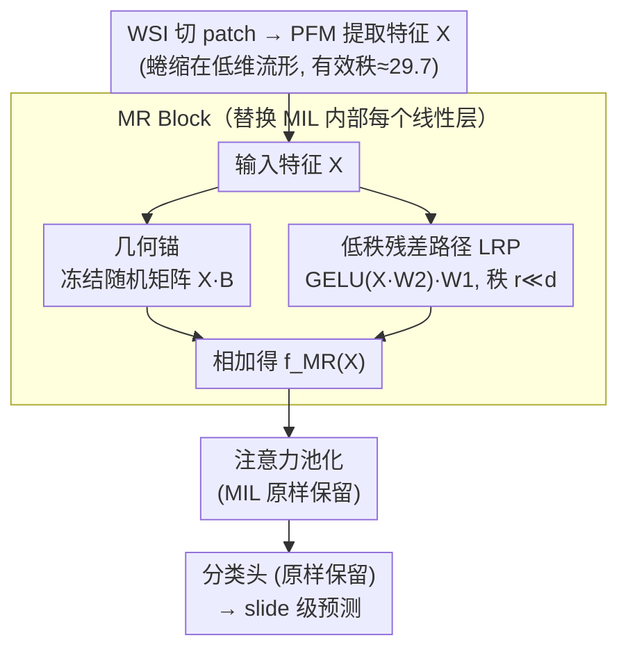

# Exploiting Low-Dimensional Manifold of Features for Few-Shot Whole Slide Image Classification

**会议**: ICLR 2026  
**arXiv**: [2505.15504](https://arxiv.org/abs/2505.15504)  
**代码**: [GitHub](https://github.com/BearCleverProud/MR-Block)  
**领域**: 医学图像/病理学  
**关键词**: 全切片图像, 少样本分类, 流形保持, 随机投影, 低秩残差

## 一句话总结
发现病理基础模型特征具有低维流形几何结构（有效秩仅29.7/512维），而线性层会破坏这种结构导致少样本过拟合，提出即插即用的MR Block（冻结随机矩阵做几何锚+低秩残差路径做任务适配）在少样本WSI分类上达到SOTA。

## 研究背景与动机

**领域现状**：全切片图像(WSI)分类采用多实例学习(MIL)范式——将巨像素级WSI切割为patch后用注意力池化得到slide级表示。病理基础模型(PFM)如CONCH、UNI提供了强大的patch特征。

**现有痛点**：少样本WSI分类严重过拟合。论文论证这不仅是数据不足问题，更是几何问题——PFM特征位于低维弯曲流形上（有效秩29.7≪512维），而MIL模型中无处不在的线性层是"几何无感知"的，会扭曲这种脆弱的流形结构。

**核心矛盾**：切线空间分析实证表明，训练过的线性层严重扭曲流形曲率（相对于原始特征），而过拟合与这种几何扭曲正相关。

**切入角度**：随机投影理论保证固定随机矩阵近似保持欧氏距离和局部测地结构。用它做"几何锚"，只让低秩残差路径做微小的任务适配。

## 方法详解

### 整体框架
论文要解决的是少样本WSI分类的过拟合，而切入点是一个几何观察：病理基础模型(PFM)的patch特征并不铺满整个512维空间，而是蜷缩在一个有效秩仅29.7的低维弯曲流形上；MIL模型里那些"几何无感知"的线性层一旦被少样本训练，就会把这个脆弱的流形结构扭曲掉。MR Block的思路是把每一处内部线性层换成一个双路结构——一条冻结的随机投影路负责"锚住"原始几何，一条可训练的低秩残差路只在必要时做微小的任务适配。整体变换写作

$$f_{\text{MR}}(\mathbf{X}) = \text{GELU}(\mathbf{X}\mathbf{W}_2)\mathbf{W}_1 + \mathbf{X}\mathbf{B}$$

其中 $\mathbf{B}$ 是冻结的随机矩阵（几何锚），$\mathbf{W}_2 \in \mathbb{R}^{d_0 \times r}$、$\mathbf{W}_1 \in \mathbb{R}^{r \times d_1}$ 是可训练的低秩残差，秩 $r \ll \min(d_0, d_1)$。除内部线性层被替换外，MIL 的注意力池化与分类头都保持原样。此外论文还配了一套流形分析工具（有效秩、切线漂移），既用来论证"线性层破坏几何"的动机，也用来诊断 MR Block 是否真的守住了流形。

### 关键设计

**1. 几何锚：用冻结随机矩阵"免费"保住流形结构**

针对的痛点是普通线性层会扭曲流形曲率。MR Block 里的 $\mathbf{B}$ 用 Kaiming 均匀分布初始化后就冻结，全程不参与训练。这么做的底气来自随机投影理论（Johnson–Lindenstrauss 引理）：一个固定的随机矩阵能以高概率近似保持成对欧氏距离和局部测地结构，相当于免费拿到一个"几何保持"的变换，而不用专门学一个复杂模块去维护它。论文用 t-SNE 可视化和切线空间分析实证验证了这一点——经过随机矩阵后的特征，聚类拓扑和流形曲率基本不变，而经过训练线性层的特征曲率被明显拉扯。

**2. 低秩残差路径(LRP)：把任务适配限制在内在维度内、且默认不动几何**

光有几何锚就只是个随机投影，没有任务信息。LRP 是一条可训练的瓶颈通路 $\mathbf{X} \to \text{GELU}(\mathbf{X}\mathbf{W}_2) \to \mathbf{W}_1$，关键是瓶颈秩 $r$ 被刻意设得很小、去匹配特征本身的低有效秩，这样它学到的只是"从随机投影到正确分类"之间那点残差，而不会膨胀成又一个破坏流形的满秩线性层。更妙的是初始化 $\mathbf{W}_1 = \mathbf{0}$：训练起步时整条残差路输出为零，$f_{\text{MR}} = \mathbf{X}\mathbf{B}$ 退化成纯随机投影，几何完全没被碰过；只有当改善分类目标确实需要时，LRP 才逐步激活。于是适配是"从保几何的起点往外走一小步"，而不是从头学一个可能跑偏的变换。

**3. 流形分析工具：把"几何被不被破坏"量化成可测指标**

这套工具既是论文论证动机的证据，也是验证 MR Block 有效的诊断手段。谱分析这一支从特征的 Gram 矩阵特征值算 von Neumann 熵 $S$，再得有效秩 $R_{\text{eff}} = \exp(S)$，用它度量特征实际占用的维度（PFM 特征算出来只有约 29.7）。切线空间分析这一支则在特征上建 k-NN 图、对每个邻域做局部 PCA 来估计局部切空间，从而测量经过某个变换前后的流形曲率变化（切线漂移）。两者合起来定量地证明：MR Block 前后流形几何基本守恒，而普通线性层会显著抬高曲率、且这种扭曲与过拟合正相关。

### 损失函数 / 训练策略
训练用标准交叉熵损失，没有额外正则项——LRP 的零初始化本身就提供了足够的隐式正则。只替换 MIL 模型内部的线性层，分类器头仍保留原始线性层。可训练参数量为 $r(d_0 + d_1) < d_0 d_1$，比被替换的满秩线性层更省。

## 实验关键数据

### 主实验
CONCH 特征 + 多种 MIL 模型，few-shot (k=1,2,4)。下表给出 ABMIL 基线在三个数据集上的 AUC，换上 MR Block 后均稳定提升（具体增益见原文）：

| 数据集 | 指标 | ABMIL 基线 | 加 MR Block |
|--------|------|-----------|-------------|
| Camelyon16 | AUC | 53.6 | 提升（具体见原文） |
| NSCLC | AUC | 82.9 | 提升（具体见原文） |
| RCC | AUC | 96.0 | 提升（具体见原文） |

### 消融实验

| 配置 | 性能 | 说明 |
|------|------|------|
| 完整MR Block | 最优 | 几何锚 + LRP |
| 仅LRP (无随机矩阵) | 下降 | 仍有流形扭曲 |
| 仅随机矩阵 (无LRP) | 中等 | 保持几何但缺少任务适配 |
| 普通线性层 | 最差 | 严重流形扭曲 |

### 关键发现
- MR Block以更少参数达到SOTA——因为低秩瓶颈匹配了特征的内在维度
- 各种MIL模型（ABMIL、Transformer、图网络）换上MR Block都有提升，证明通用性
- 切线空间分析定量展示了MR Block如何平衡几何保持和任务适配
- 多样性噪声帮助不大——LRP的零初始化已提供足够的正则

## 亮点与洞察
- **过拟合的几何视角**：将少样本过拟合从"数据不够"重新定义为"流形被破坏"，这个视角新颖且有实证支持。
- **随机矩阵的巧妙使用**：不是学一个复杂的几何保持模块，而是利用随机投影理论的"免费"保证。冻结随机矩阵作为几何锚，简单但理论有基础。
- **与LoRA的本质区别**：虽然结构上类似LoRA，但动机完全不同——LoRA减少微调参数，MR Block保持流形几何。低秩源于特征的低有效秩，不是参数压缩。

## 局限与展望
- 几何指标（有效秩、切线漂移）仅作为诊断工具，不能直接预测性能增益
- 秩 $r$ 需要调参，虽然与有效秩有直观关联但未自动化
- 仅在病理图像上验证，自然图像/卫星图像等其他医学影像域未探索
- 冻结随机矩阵的初始化分布选择缺乏深入消融

## 相关工作与启发
- **vs 标准MIL(ABMIL/TransMIL)**: 它们使用几何无感知的线性层，MR Block是即插即用的升级
- **vs LoRA**: 共享低秩结构但动机不同——MR Block关注流形保持而非参数效率
- **vs Prototypical Networks**: MR替换内部层，Prototype替换分类头，二者正交可组合

## 评分
- 新颖性: ⭐⭐⭐⭐⭐ 从流形几何角度诊断和解决少样本过拟合，视角独特
- 实验充分度: ⭐⭐⭐⭐ 多数据集、多MIL框架、详细消融和几何分析
- 写作质量: ⭐⭐⭐⭐⭐ 动机链条清晰，可视化精彩
- 价值: ⭐⭐⭐⭐ 对少样本病理分析有直接实用价值

<!-- RELATED:START -->

## 相关论文

- [\[CVPR 2026\] From Few-way to Many-way: Rethinking Few-shot Fine-grained Image Classification](../../CVPR2026/self_supervised/from_few-way_to_many-way_rethinking_few-shot_fine-grained_image_classification.md)
- [\[CVPR 2026\] Graph Attention Prototypical Network for Robust Few-Shot Classification](../../CVPR2026/self_supervised/graph_attention_prototypical_network_for_robust_few-shot_classification.md)
- [\[CVPR 2025\] Few-Shot Implicit Function Generation via Equivariance](../../CVPR2025/self_supervised/few-shot_implicit_function_generation_via_equivariance.md)
- [\[CVPR 2026\] Quantized Residuals to Continuous Prompts for Few-Shot Class Incremental Learning in Vision-Language Models](../../CVPR2026/self_supervised/quantized_residuals_to_continuous_prompts_for_few-shot_class_incremental_learning.md)
- [\[CVPR 2026\] Few-Shot Hybrid Incremental Learning: Continually Learning under Data Scarcity and Task Uncertainty](../../CVPR2026/self_supervised/few-shot_hybrid_incremental_learningcontinually_learning_under_data_scarcity_and.md)

<!-- RELATED:END -->
