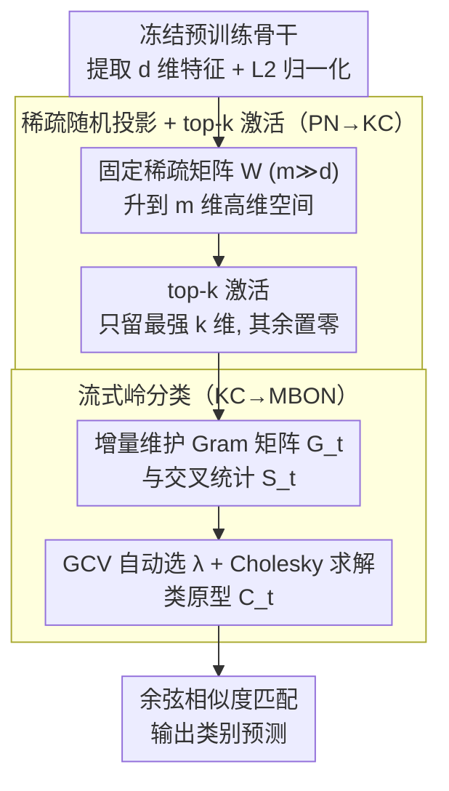

# Fly-CL: A Fly-Inspired Framework for Enhancing Efficient Decorrelation and Reduced Training Time in Pre-trained Model-based Continual Representation Learning

**会议**: ICLR 2026  
**arXiv**: [2510.16877](https://arxiv.org/abs/2510.16877)  
**代码**: [GitHub](https://github.com/gfyddha/Fly-CL)  
**领域**: 自监督学习 / 持续学习 / 生物启发  
**关键词**: continual learning, fly olfactory circuit, decorrelation, representation learning, prototype

## 一句话总结
受果蝇嗅觉回路启发，提出 Fly-CL 框架，通过稀疏随机投影+top-k操作+流式岭分类三阶段渐进去相关，在预训练模型持续学习中大幅降低训练时间的同时达到SOTA水平。

## 研究背景与动机

**领域现状**：使用冻结预训练模型的持续学习（CL）方法将参数更新重构为相似度匹配问题，通过类原型的余弦相似度做分类。主要有 prompt/adapter、混合模型、表征三类方法。

**现有痛点**：表征方法直接用冻结预训练特征计算类原型，但特征间存在严重的**多重共线性**（类原型间相关性高），导致余弦相似度判别力下降。现有解法（如 RanPAC 的矩阵求逆）计算代价高（$\mathcal{O}(lm^3)$），不适合低延迟场景。

**核心矛盾**：去相关（decorrelation）对分类精度至关重要，但高效的去相关方法缺乏。

**本文目标**：设计一种计算高效且有效的去相关框架。

**切入角度**：从果蝇嗅觉回路获得灵感——PN→KC 的稀疏扩展投影+KC→MBON 的降维投影构成了高效的去相关机制。

**核心 idea**：模拟果蝇嗅觉三阶段——稀疏随机扩展投影+top-k激活稀疏+流式岭回归分类——实现渐进去相关。

## 方法详解

### 整体框架
Fly-CL 要解决的是：用冻结预训练模型做持续学习时，类原型之间存在严重多重共线性，使余弦相似度判别力下降，而现有去相关手段（如矩阵求逆）又太慢。它的思路是照搬果蝇嗅觉回路的三级结构来做一次“升维去相关 + 高效分类”。整条流水线为：冻结骨干提取 $d$ 维特征并做 L2 归一化（对应 ORN/PN 的预处理），再用一个固定的稀疏随机矩阵把它投到远高于原维度的 $m$ 维空间（$m \gg d$）、随后用 top-$k$ 激活只保留最强的若干维形成稀疏编码（这一升维稀疏阶段对应 PN→KC），最后交给一个流式岭分类器在线学习类别权重、用余弦相似度匹配输出预测（对应 KC→MBON）。整个过程没有反向传播，新任务到来时只增量更新少量统计量。

### 关键设计

**1. 稀疏随机投影 + top-k 激活（对应 PN→KC）：把纠缠的低维特征拆开**

冻结特征之所以难分，是因为不同类的原型在 $d$ 维里高度相关。这里用一个固定稀疏矩阵 $\mathbf{W} \in \mathbb{R}^{m \times d}$ 把特征升到高维——每行只有 $p$ 个非零值、采自 $\mathcal{N}(0,1)$，因此投影本身就极省算力，复杂度从稠密投影的 $\mathcal{O}(mnd)$ 降到 $\mathcal{O}(mnp)$。升维之后再做 top-$k$，只保留响应最大的 $k$ 个分量、其余置零，模拟蘑菇体里赢者通吃式的稀疏激活，进一步压低维度间的相关性。两条理论结果支撑这套操作不会丢信息：Theorem 4.1 证明这种稀疏随机矩阵以 $1-o(1)$ 的概率保持满列秩（即升维可逆、不塌缩），Theorem 4.2 则给出 top-$k$ 带来的性能退化是有界的——当 $k=\Omega(m^\alpha)$ 时误差以多项式速度衰减，说明稀疏化在保住判别信息的前提下完成了去相关。

**2. 流式岭分类（对应 KC→MBON）：在高维稀疏空间里在线学一个抗共线性的分类器**

升维稀疏编码仍可能残留共线性，所以最终分类不用简单的原型余弦匹配，而是一个带 $\ell_2$ 正则的岭回归分类器，正则项正是用来压制残余共线性的。它以流式方式维护两个统计量：Gram 矩阵 $\mathbf{G}_t$ 和交叉统计 $\mathbf{S}_t$，分类器权重为

$$\mathbf{C}_t = (\mathbf{G}_t + \lambda\mathbf{I}_m)^{-1}\mathbf{S}_t.$$

正则强度 $\lambda$ 不靠手调，而用广义交叉验证（GCV）自动选最优值，以适应不同任务的异质性；求解则用 Cholesky 分解加速。相比 RanPAC 那种对全体数据反复求逆的做法（$\mathcal{O}(lm^3)$），这里把单步复杂度压到 $\mathcal{O}(n_t^2 m)$，这正是“训练时间大幅下降”的来源。

**3. 与果蝇嗅觉回路的生物学对应：三阶段并非比喻，而是逐级等价**

整套设计是对果蝇嗅觉通路的逐级映射，而非松散类比。PN→KC 这一级里，神经元的稀疏扩展投影加上赢者通吃抑制，恰好对应稀疏随机投影 + top-$k$；KC→MBON 这一级的 Hebbian 学习则与岭分类等价——论文在 Section 6 给出了二者的等价性证明。正是这层对应关系，让“升维稀疏 + 在线岭回归”这条流水线在生物学上有出处，也解释了为什么三阶段连起来能逐级去相关。

### 训练策略
全程无需反向传播，采用流式增量更新：每来一个新任务，只需把该任务样本累加进 Gram 矩阵 $\mathbf{G}_t$ 和交叉统计 $\mathbf{S}_t$，再重解一次岭分类器即可，不保存任何历史样本，天然契合低延迟、无回放的持续学习设定。

## 实验关键数据

### 主实验：Class Incremental Learning

| 方法 | CIFAR-100 (10步) | ImageNet-R (10步) | 训练时间↓ |
|------|------|------|------|
| SimpleCIL | 70.8 | 71.4 | 基线 |
| RanPAC | 76.4 | 78.6 | 慢 |
| Fly-CL | **76.5** | **78.8** | **快数倍** |

### 消融实验

| 配置 | 效果 | 说明 |
|------|------|------|
| 无随机投影 | 降低 | 多重共线性未解决 |
| 无top-k | 降低 | 噪声维度干扰 |
| 密集投影替代稀疏 | 相当但慢 | 稀疏不损信息 |
| 固定λ替代自适应GCV | 降低 | 任务异质性需要自适应 |

### 关键发现
- Pearson 相关系数热力图清晰显示三阶段去相关效果
- 训练时间大幅减少，性能与最强基线持平或超越
- 在不同预训练骨干上均有效，框架通用

## 亮点与洞察
- 生物启发极具创意——果蝇嗅觉回路的三阶段去相关完美对应 CL 中的多重共线性问题
- 理论分析扎实——两个定理分别证明稀疏投影的信息保持性和 top-k 退化界
- 实用性强——计算效率显著提升，适合边缘计算和实时场景

## 局限与展望
- top-k 中的 $k$ 值需要调参
- 投影矩阵是固定随机的，自适应学习可能进一步提升
- 仅验证了图像分类任务，其他模态待探索

## 相关工作与启发
- **vs RanPAC**: 也用随机投影但计算代价高，Fly-CL 通过稀疏+GCV 大幅降低复杂度
- **vs Prompt/Adapter方法**: 不依赖特定架构，通用性更强
- **vs 果蝇LSH (Dasgupta et al., 2017)**: 经典果蝇启发工作用于哈希，本文扩展到持续学习

## 评分
- 新颖性: ⭐⭐⭐⭐ 生物启发+理论分析+实用框架的有机结合
- 实验充分度: ⭐⭐⭐⭐ 多数据集、多骨干、全面消融
- 写作质量: ⭐⭐⭐⭐ 生物类比清晰，理论推导完整
- 价值: ⭐⭐⭐⭐ 为 CL 提供高效且有原则的解决方案

<!-- RELATED:START -->

## 相关论文

- [\[ICLR 2026\] Test-Time Efficient Pretrained Model Portfolios for Time Series Forecasting](test-time_efficient_pretrained_model_portfolios_for_time_series_forecasting.md)
- [\[ECCV 2024\] Efficient Image Pre-Training with Siamese Cropped Masked Autoencoders](../../ECCV2024/self_supervised/efficient_image_pre-training_with_siamese_cropped_masked_autoencoders.md)
- [\[ECCV 2024\] Revisiting Supervision for Continual Representation Learning](../../ECCV2024/self_supervised/revisiting_supervision_for_continual_representation_learning.md)
- [\[ICLR 2026\] Adaptive Test-Time Training for Predicting Need for Invasive Mechanical Ventilation in Multi-Center Cohorts](adaptive_test-time_training_for_predicting_need_for_invasive_mechanical_ventilat.md)
- [\[CVPR 2026\] Assignment-Driven Hash Learning in a Hyper-Semantic Space for On-the-Fly Category Discovery](../../CVPR2026/self_supervised/assignment-driven_hash_learning_in_a_hyper-semantic_space_for_on-the-fly_categor.md)

<!-- RELATED:END -->
