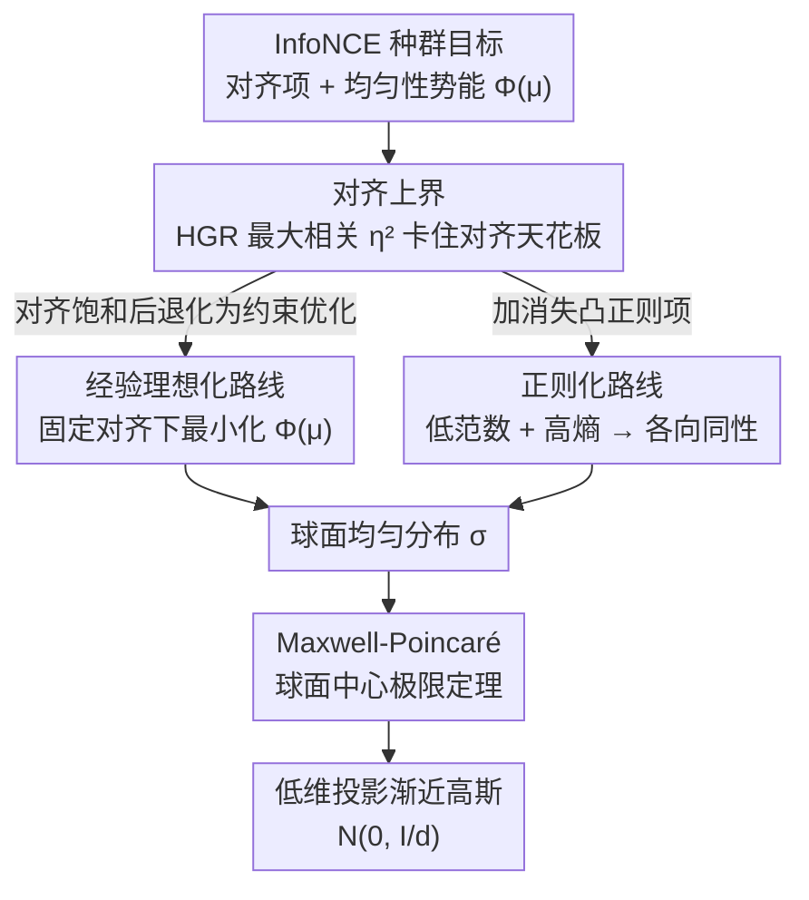

# InfoNCE Induces Gaussian Distribution

**会议**: ICLR 2026 Oral  
**arXiv**: [2602.24012](https://arxiv.org/abs/2602.24012)  
**代码**: 无  
**领域**: 自监督学习 / 对比学习 / 理论分析  
**关键词**: InfoNCE, contrastive learning, Gaussian distribution, uniformity, representation learning

## 一句话总结
从理论上证明 InfoNCE 损失函数在两种互补机制下会诱导表征趋向高斯分布：经验理想化路线（对齐+球面均匀性→高斯）和正则化路线（消失正则项→各向同性高斯），并在合成数据和 CIFAR-10 上验证。

## 研究背景与动机

**领域现状**：对比学习（SimCLR, MoCo, CLIP 等）用 InfoNCE 损失训练编码器，核心是在正对对齐和表征均匀性之间取得平衡。近期不少经验观察发现，训练出来的对比表征近似服从高斯分布。

**现有痛点**：虽然很多实际工作已经直接利用这种近似高斯性质（做分类、不确定性估计、异常检测），但一直缺乏理论解释——为什么偏偏是 InfoNCE 会把表征推成高斯结构？

**核心矛盾**：高斯假设被广泛使用，却没有理论支撑，等于在一个未经证明的前提上盖楼。

**本文目标**：从种群（population）层面解释 InfoNCE 为何产生高斯分布表征，给实践中的高斯假设补上理论地基。

**切入角度**：作者抓住一个经典数学事实——Maxwell-Poincaré 球面中心极限定理，即高维球面上均匀分布的固定维投影会趋向高斯。于是只要证明 InfoNCE 把表征推向球面均匀，高斯性就自然落地。

## 方法详解

### 整体框架

这篇论文不提新模型，而是从理论上回答"InfoNCE 为何诱导高斯表征"。分析的对象是 InfoNCE 的种群目标

$$\mathcal{L}(\mu,\pi) = -\alpha\, \mathbb{E}_{(u,v)\sim\pi}[u \cdot v] + \Phi(\mu),$$

其中第一项是把正对 $(u,v)$ 拉近的**对齐项**，第二项 $\Phi(\mu)=\mathbb{E}_{u}\log\mathbb{E}_{v}\exp(\alpha\,u\cdot v)$ 是惩罚表征扎堆、只依赖边际分布 $\mu$ 的**均匀性势能**。整篇证明的主线是：先量化对齐能被推到多紧，再证明在对齐饱和后 InfoNCE 实质上变成一个"球面均匀"优化问题，最后借 Maxwell-Poincaré 定理把"球面均匀"翻译成"投影高斯"。作者给出两条互补的路线——一条贴着训练动态（经验理想化），一条不依赖动态假设（正则化），殊途同归地落到同一个球面均匀分布 $\sigma$ 上，再统一接到那条经典定理。

### 关键设计

**1. 对齐上界（Proposition 1）：先框住对齐能走多远**

对齐项越大越好，但数据增强本身决定了正对不可能完全重合，所以对齐有天花板。作者引入一个增强温和度参数 $\eta_2 = \rho_m^2(X, X_0)$，其中 $\rho_m$ 是原始样本 $X_0$ 与其增强 $X$ 之间的 HGR（Hirschfeld–Gebelein–Rényi）最大相关系数。Proposition 1 证明对齐项被 $\eta_2$ 上界卡住：增强越温和、$\rho_m$ 越大，可达对齐越高；增强越激进，对齐天花板越低。这是首次用 HGR 最大相关来刻画对比学习里的对齐强度，把"增强强度"这一向来定性的因素变成了一个可量化的上界。

**2. 经验理想化路线：贴着训练动态走到球面均匀**

这条路线针对的痛点是——直接分析全局极小很难，于是退一步看训练后期的行为。一旦对齐项被推到上界附近（饱和），目标里的对齐部分基本是常数，InfoNCE 就退化成一个**带约束的纯均匀性优化**：在固定对齐水平下最小化均匀性势能 $\Phi(\mu)$。作者证明此时球面 $\mathbb{S}^{d-1}$ 上的均匀分布是唯一的最小化者。再把这个均匀分布喂给下面第 4 点的 Maxwell-Poincaré 定理，就得到表征的低维投影渐近高斯。这条路线的好处是直观——它直接对应"对齐先饱和、均匀性后收敛"的实际训练观察。

**3. 正则化路线：不依赖训练动态的种群层面证明**

经验路线要假设"对齐已经饱和"，依赖训练动态。为了去掉这个假设，作者给目标加一个消失的凸正则项（同时鼓励低范数和高熵），构造一个 $\epsilon$-正则化的种群目标。然后证明：当 $\epsilon \to 0$ 时，正则化问题的最小化者收敛到各向同性的球面均匀分布。这条路线完全在种群层面成立，不需要对优化轨迹做任何假设，因而比经验路线更一般；代价是引入了额外的正则项作为分析工具。两条路线落到同一个球面均匀分布，互相印证。

**4. Maxwell-Poincaré 球面中心极限定理：把球面均匀翻译成高斯**

这是连接"球面均匀"和"高斯"的核心桥梁，也是整篇论文借力的经典数学结果。定理说：当维度 $d$ 很大时，$\mathbb{S}^{d-1}$ 上均匀分布的任意 $k$ 维固定投影渐近服从

$$\mathcal{N}\!\Big(0, \tfrac{1}{d} I_k\Big).$$

前两条路线都证明了 InfoNCE 把表征推向球面均匀，于是这条定理直接接管：表征在任意低维子空间上的投影就趋向各向同性高斯。维度 $d$ 越高，这个渐近越准——这也正好解释了实验里"维度越大、高斯性越强"的现象。

## 实验关键数据

论文用三类诊断量化"高斯程度"：范数变异系数 $\mathrm{CV}=\mathrm{std}(\|z\|)/\mathrm{mean}(\|z\|)$（越小越说明范数集中在一层薄壳上）、Anderson-Darling（AD）检验（统计量 $<0.752$ 时无法拒绝正态）、D'Agostino-Pearson（DP）检验（$p>0.05$ 时无法拒绝正态）。后两项还报告"逐坐标合规率"。

### 合成数据 + CIFAR-10 高斯性诊断

| 设置 | CV ↓ | AD 均值 (<0.752) | AD 合规率 | DP 均值 (>0.05) | DP 合规率 | 高斯? |
|------|------|------------------|-----------|------------------|-----------|-------|
| 合成 Laplace（线性） | 0.08 | 0.38 | 100% | 0.49 | 100% | ✓ |
| 合成 GMM（线性） | 0.08 | 0.39 | 100% | 0.46 | 100% | ✓ |
| 合成 Binary（初始 E0） | 0.36 | 1.64 | 30% | 0.02 | 15% | ✗ |
| 合成 Binary（训练后 E100） | 0.09 | 0.42 | 97% | 0.46 | 98% | ✓ |
| CIFAR-10 监督（ResNet-18） | 0.50 | 3.30 | 6.2% | 0.041 | 3.9% | ✗ |
| CIFAR-10 对比（ResNet-18） | 0.09 | 0.43 | 96.1% | 0.39 | 94.5% | ✓ |

同架构（ResNet-18）、同初始化下只换训练目标：InfoNCE 把范数压到 CV≈0.09、逐坐标几乎全部通过正态检验，监督学习则范数发散、大部分坐标都被拒绝——说明高斯结构来自对比目标本身，而非数据或架构。

### 预训练大模型（MS-COCO）

| 模型 | 训练方式 | AD 均值 (<0.752) | DP 合规率 | 高斯? |
|------|---------|------------------|-----------|-------|
| ResNet-34 | 监督 | 10.01 | 0% | ✗ |
| DenseNet | 监督 | 2.98 | 49% | ✗ |
| DINO (ViT-B/32) | 自监督 | 0.44 | 99% | ✓ |
| CLIP 图像 (ViT-L/14) | 自监督 | 0.47 | 99.6% | ✓ |
| CLIP 文本 (ViT-L/14) | 自监督 | 0.53 | 99.4% | ✓ |

### 关键发现
- 对比（InfoNCE）训练的表征在合成数据、CIFAR-10、以及 CLIP / DINO 大模型上都呈现强的逐坐标高斯性与范数集中，监督训练的表征不是——高斯结构由训练目标决定
- 即便输入是强非高斯的（高斯混合、甚至离散二值），训练后表征也收敛到高斯；二值数据不存在到连续高斯的可逆映射，排除了"模型只是恢复了潜在高斯变量"的解释
- 维度 $d$ 与批量 $N$ 越大，范数 CV 越小、AD/DP 合规率越高，与渐近分析给出的偏差速率（投影偏离高斯 $O(d^{-1})$、经验最小值偏离种群最小值 $O(N^{-1/2})$）一致

## 亮点与洞察
- HGR 最大相关系数首次用于对比学习的对齐分析——可迁移到分析其他损失函数
- 两条分析路线互补：经验路线更直观，正则路线更一般
- 为实践中的高斯假设提供了原则性理论支撑

## 局限与展望
- 渐近结果（$d \to \infty$），有限维收敛速度分析缺失
- 正则化路线需要额外正则项
- 只分析了边际分布，没有讨论类条件分布
- 能否扩展到非对比自监督方法（BYOL、MAE）？

## 相关工作与启发
- **vs Wang & Isola (2020)**: 提出 alignment+uniformity 框架但没有推导分布形式
- **vs Baumann et al. (2024)**: 经验上利用高斯假设做分类，本文提供理论依据
- **vs Maxwell-Poincaré定理**: 经典数学结果，创新性地与对比学习理论连接

## 评分
- 新颖性: ⭐⭐⭐⭐⭐ 首次理论解释 InfoNCE 为何诱导高斯分布
- 实验充分度: ⭐⭐⭐⭐ 合成+真实数据多架构验证
- 写作质量: ⭐⭐⭐⭐⭐ 理论推导严谨，逻辑清晰
- 价值: ⭐⭐⭐⭐⭐ 为对比学习理论和实践提供重要基础

<!-- RELATED:START -->

## 相关论文

- [\[ICML 2026\] When Softmax Fails at the Top: Extreme Value Corrections for InfoNCE](../../ICML2026/self_supervised/when_softmax_fails_at_the_top_extreme_value_corrections_for_infonce.md)
- [\[NeurIPS 2025\] Asymptotic and Finite-Time Guarantees for Langevin-Based Temperature Annealing in InfoNCE](../../NeurIPS2025/self_supervised/asymptotic_and_finite-time_guarantees_for_langevin-based_temperature_annealing_i.md)
- [\[ICML 2026\] Understanding Self-Supervised Learning via Latent Distribution Matching](../../ICML2026/self_supervised/understanding_self-supervised_learning_via_latent_distribution_matching.md)
- [\[ECCV 2024\] FlowCon: Out-of-Distribution Detection using Flow-Based Contrastive Learning](../../ECCV2024/self_supervised/flowcon_out-of-distribution_detection_using_flow-based_contrastive_learning.md)
- [\[CVPR 2026\] GaussianMatch: Semi-Supervised Regression with Pseudo-Label Filtering via Multi-View Gaussian Consistency](../../CVPR2026/self_supervised/gaussianmatch_semi-supervised_regression_with_pseudo-label_filtering_via_multi-v.md)

<!-- RELATED:END -->
