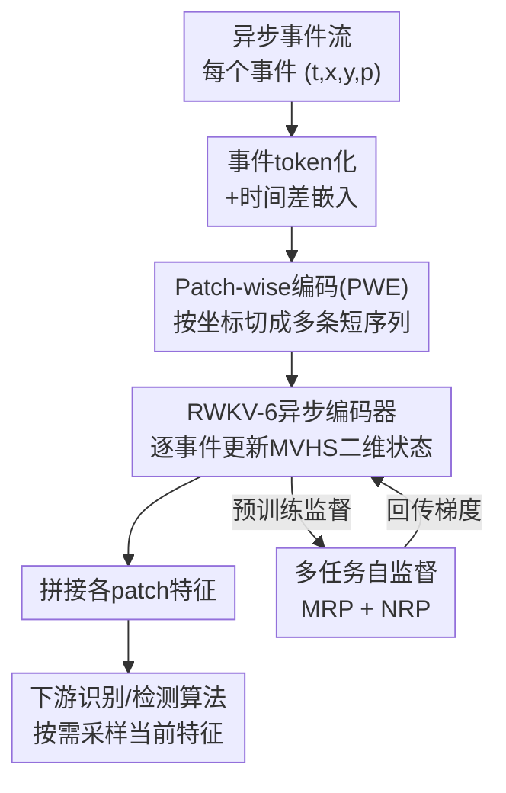

# Maximizing Asynchronicity in Event-based Neural Networks

**会议**: ICLR 2026  
**arXiv**: [2505.11165](https://arxiv.org/abs/2505.11165)  
**代码**: [github.com/haohq19/eva](https://github.com/haohq19/eva)  
**领域**: 事件相机/高效推理  
**关键词**: 事件相机, 异步处理, 线性注意力, 自监督学习, RWKV-6, A2S

## 一句话总结
提出EVA框架，将事件类比为语言token，用基于RWKV-6的线性注意力异步编码器实现逐事件特征更新，结合多表示预测(MRP)+下一表示预测(NRP)的自监督学习获得可泛化特征，首次在异步-同步(A2S)范式中成功完成高难度目标检测任务(Gen1数据集0.477 mAP)。

## 研究背景与动机

**事件相机的特性与挑战**：事件相机以高时间分辨率（最高1μs）、低延迟、低空间冗余输出异步稀疏事件流，但标准ML算法需要tensor-like输入，事件数据的异步稀疏特性与现有方法存在根本矛盾。

**A2S范式的出现**：异步到同步(Asynchronous-to-Synchronous, A2S)框架通过设计高效异步编码器逐事件更新tensor-like特征，再按需采样给下游同步ML算法，成功桥接了异步数据和同步算法的鸿沟。

**现有A2S方法的局限**：(1) 编码器表达力不足——ALERT-Transformer使用EventNet（基于点云），没有层次学习，仅能处理简单识别任务；(2) 端到端有监督学习导致特征任务特异，缺乏跨任务泛化能力；(3) 在复杂检测任务上，A2S方法远不如密集同步方法。

**事件与语言的类比洞察**：两者共有两个关键相似性——(i) 都以序列形式组织，(ii) 都以增量方式贡献信息（事件记录增量亮度变化，词汇增量构建语义）。这启发了将NLP中的线性注意力和自监督学习技术迁移到事件处理。

**事件与语言的关键差异**：(i) 信息密度不同——单个语言token有丰富语义，单个事件仅记录像素级亮度变化，需要聚合才有意义；(ii) 空间局部性——事件具有空间属性（像素坐标），语言没有。这两个差异指导了架构设计的调整方向。

**研究目标**：设计更有表达力的异步编码器 + 自监督学习方法，使A2S框架不仅超越先前A2S方法，还能首次成功应对高难度检测任务。

## 方法详解

### 整体框架

EVA（Event-as-lAnguage）把事件流当成语言序列来处理：原始事件先被token化并嵌入为向量，再按空间patch切成多条短序列（PWE），每条序列送入基于RWKV-6的异步线性注意力编码器，逐事件更新一份二维矩阵隐藏状态（MVHS）作为特征输出；各patch特征拼接后交给下游识别或检测算法。整个编码器不依赖下游标签，而由多表示预测（MRP）+下一表示预测（NRP）两个自监督任务驱动训练。推理时编码器随每个事件到来增量更新内部状态，下游算法在任意时刻按需采样当前特征即可——这正是异步到同步（A2S）范式"异步编码、同步下游"的实现。

### 关键设计

**1. 事件token化与时间差嵌入：把异步事件翻译成可学习的向量**

事件流要进编码器，首先得把每个事件 $e_i = (t_i, x_i, y_i, p_i)$ 变成向量 $\bm{x}_i \in \mathbb{R}^D$。空间上用双射映射 $\text{Tok}(x, y, p) = p \times H \times W + y \times W + x$ 把"坐标+极性"压成一个唯一token，词汇表大小为 $2 \times H \times W$，保证每个空间位置与极性的组合都对应一个独立可学习的embedding。时间维度则刻意不用绝对时间戳，而用相邻事件的时间差 $\Delta t_i = t_i - t_{i-1}$ 做正弦编码，最终嵌入取空间嵌入与时间嵌入之和。之所以用时间差，是因为事件相机长期运行时绝对时间戳会无界增长，直接编码会重蹈语言模型长度外推失败的覆辙；而时间差始终落在有限分布内，模型才能稳定泛化到任意时长的事件流。

**2. Patch-wise编码（PWE）：用事件的空间局部性换计算效率与分辨率无关性**

事件相比语言多了空间属性，EVA把这一点利用起来：对分辨率 $(H_{\text{sensor}}, W_{\text{sensor}})$ 的相机，按patch大小 $P$ 将事件按坐标切成 $H_{\text{sensor}} \times W_{\text{sensor}} / P^2$ 条独立序列，每个patch各跑一份编码器，特征拼接后再交给下游。这样单条序列变短、计算开销下降，模型规模随patch数进一步缩小，且各patch可并行。更关键的副产品是分辨率无关性——编码器只在固定大小的patch上训练，换一台不同分辨率的事件相机时无需重训即可直接用。

**3. 矩阵值隐藏状态（MVHS）作输出：用二维状态弥补单事件的低信息量**

单个事件只记录一个像素的亮度变化，信息密度远低于一个语言token，因此不能像传统编码器那样直接吐一维向量 $\bm{y} \in \mathbb{R}^{D}$。EVA改用RWKV-6线性注意力的二维矩阵隐藏状态 $\bm{S} \in \mathbb{R}^{N \times D_{\text{head}} \times D_{\text{head}}}$ 作为输出特征。RWKV-6的循环更新式 $\bm{S}_i = \text{diag}(\bm{w}_i) \bm{S}_{i-1} + \bm{k}_i \bm{v}_i^T$ 让隐藏状态天然累积了到当前为止的全局信息，正好补上单事件信息不足的短板。配合多头机制（每头维度 $D_{\text{head}} = D/N$），隐藏状态规模做到 $N \times D_{\text{head}} \times D_{\text{head}}$，在不加大模型宽度 $D$ 的前提下把特征容量扩展开来——相比用一维输出，模型规模可缩小约 $D_{\text{model}}/N$ 倍，既轻量适合实时推理，二维结构又方便学习细粒度空间特征。

**4. 多任务自监督学习（MRP+NRP）：不靠下游标签也能学到可迁移特征**

为摆脱端到端有监督导致的特征任务特异问题，EVA用两个自监督目标训练编码器。多表示预测（MRP）强制编码特征 $\mathcal{F}_i = \mathcal{M}_\theta(\{e_j\}_{j \leq i})$ 同时预测事件计数EC、时间面TS等多种手工表示，目标为 $\arg\max_{\theta, \Theta} \mathbb{E}_i \prod_{k=1}^{K} \textbf{Pr}(\mathcal{R}_i^k | \mathcal{F}_i; \theta_k)$；不同表示捕获事件信息的不同侧面，逼模型学出更全面、可泛化的特征。下一表示预测（NRP）则借鉴NLP的下一token预测，要求模型从当前特征预测未来时间窗 $\Delta T$ 内的表示，目标为 $\arg\max_{\theta, \Theta'} \mathbb{E}_i \prod_{k=1}^{K'} \textbf{Pr}(\mathcal{R}^k(\{e | t_i < t(e) \leq t_i + \Delta T\}) | \mathcal{F}_i; \theta_k')$；这迫使模型理解运动规律而非死记历史。两个任务都以聚合表示而非单个事件作为预测目标，因为单事件信息不足、噪声不可预测，用聚合量做监督信号更可靠。

## 实验关键数据

### DVS128-Gesture动作识别

| 模型 | 编码器参数量 | 分类器参数量 | MAC/事件 | 延迟 | SA | FVA |
|------|------------|------------|---------|------|-----|-----|
| ALERT-Tr. (+RM) | 1.41M | 13.96M | 1.22M | 5.8ms | 84.6% | 94.1% |
| ALERT-Tr. (+LMM) | 0.04M | 0.57M | 0.004M | 3.9ms | 72.6% | 89.2% |
| **EVA (+ResNet-14)** | **0.62M** | **2.83M** | **0.60M** | **14.7ms** | **92.9%** | **96.9%** |

### Gen1目标检测

| 模型 | 类型 | mAP (%) |
|------|------|---------|
| NVS-S | 端到端异步(A) | 8.6 |
| AEGNN | 端到端异步(A) | 14.5 |
| DAGr-L | 端到端异步(A) | 32.1 |
| FARSE-CNN | 端到端异步(A) | 30.0 |
| ASTMNet | 同步密集(S) | 46.7 |
| RVT-B | 同步密集(S) | 47.2 |
| GET | 同步密集(S) | 47.9 |
| **EVA (+RVT-B, D=128)** | **A2S** | **47.5** |
| **EVA-L (+RVT-B, D=192)** | **A2S** | **47.7** |

### 关键消融实验

| MVHS | 时间嵌入 | FVA | SA |
|------|---------|-----|-----|
| ✓ | ✓ | **98.1%** | **94.7%** |
| ✓ | ✗ | 87.8% | 81.1% |
| ✗ | ✓ | 97.4% | 94.1% |

### 关键发现

- **A2S范式首次攻克检测任务**：EVA在Gen1上达到47.7 mAP，超越同步SOTA方法RVT-B(47.2)，这是A2S方法首次在检测任务上取得竞争力结果。此前A2S方法仅能处理简单识别任务
- **MVHS显著提升特征表达力**：移除MVHS后SA从94.7%下降到94.1%（0.6%），而移除时间嵌入的负面影响更大（SA从94.7%下降到81.1%），表明时间建模对事件处理至关重要
- **MRP多表示互相促进学习**：仅学习EC一种表示时EC损失反而更大(0.701 vs 0.366)，说明学习多种表示之间存在正向迁移效应
- **NRP贡献独立于MRP**：移除NRP后FVA从98.1%降到96.8%，SA从94.7%降到94.4%，表明预测未来表示确实帮助模型学到超越简单记忆的知识
- **小patch带来更好效果**：patch大小从16增加到128时，FVA从98.1%降到97.4%，SA从94.7%降到89.3%，尽管大patch有更小的预训练损失（因为稀疏区域多）

## 亮点与洞察

- **事件-语言类比的系统化分析**：不是简单类比，而是系统分析了相似性（序列结构、增量信息）和差异性（信息密度、空间局部性），并据此做出针对性的架构调整——MVHS应对低信息密度，PWE应对空间局部性
- **RWKV-6在事件域的首次成功应用**：线性注意力的并行训练+循环推理天然匹配A2S范式的训练+推理需求，且RWKV-6的数据依赖衰减和门控机制适合连续动态数据
- **从1-D到2-D特征的范式转变**：用矩阵隐藏状态代替向量输出的思路新颖，在不增加模型宽度的前提下扩展表达力，且2-D结构与图像任务天然匹配
- **自监督特征的跨任务迁移**：在Gen1上预训练的编码器特征可直接用于N-Cars分类任务(96.3%准确率)，验证了特征的泛化能力

## 局限性

- **实时性在高分辨率场景受限**：Gen1的事件率(0.618M/s)已超过EVA-L的吞吐量(0.541M/s)，虽然PWE策略可缓解，但对更高分辨率的Gen3(1280×720)相机仍然存在挑战
- **自监督目标依赖手工表示**：MRP和NRP的监督信号来自EC、TS等手工设计的表示，这些表示本身可能丢失某些事件信息，限制了学习上限
- **仅在事件域验证**：尽管框架理论上通用，但实验仅在事件相机数据上验证，未探索其他异步序列数据（如神经尖峰）的适用性
- **编码器延迟较大**：由于层次学习架构，EVA的单事件推理延迟(14.7ms处理8192事件)高于ALERT-Tr.，虽然总处理时间更短

## 相关工作与启发

### vs ALERT-Transformer (Martin-Turrero et al., 2024)
先前最强的A2S方法，使用EventNet做异步编码。EVA在DVS128-Gesture上FVA提升2.8%(96.9% vs 94.1%)、SA提升8.3%(92.9% vs 84.6%)。更重要的是ALERT-Tr.从未在检测任务上取得结果，而EVA达到47.7 mAP。关键差异在于EVA用RWKV-6替代EventNet实现层次学习，MVHS扩展特征表达力。

### vs RVT-B (Gehrig & Scaramuzza, 2023)
同步密集方法的SOTA，在Gen1上达到47.2 mAP。EVA-L以47.7 mAP超越之，且EVA的输入特征通道数仅为6(vs RVT-B的20)。这表明A2S范式通过更好的异步编码器可以匹配甚至超越同步方法，同时保留了异步处理的低延迟优势。

### vs DAGr (Gehrig & Scaramuzza, 2024)
端到端异步图神经网络方法，Gen1上32.1 mAP。EVA的47.7 mAP大幅超越(+15.6)，说明A2S的"编码+密集下游"范式比纯异步方法更有效，因为后者受限于图方法在时间积累上的局限。

## 评分

| 维度 | 评分 | 理由 |
|------|------|------|
| 新颖性 | ⭐⭐⭐⭐ | 事件-语言类比的系统化分析及MVHS输出的设计思路新颖，但核心组件(RWKV-6、SSL)本身非新 |
| 技术深度 | ⭐⭐⭐⭐ | 架构设计有理有据，消融实验充分，从类比到架构调整的逻辑链条完整 |
| 实验充分度 | ⭐⭐⭐⭐ | 覆盖识别+检测+消融+timing分析，但缺乏更多数据集和更多下游任务的验证 |
| 工程价值 | ⭐⭐⭐⭐⭐ | A2S范式首次攻克检测任务，PWE支持任意分辨率，代码已开源，对事件相机实时应用有直接价值 |

<!-- RELATED:START -->

## 相关论文

- [\[AAAI 2026\] Spikingformer: A Key Foundation Model for Spiking Neural Networks](../../AAAI2026/self_supervised/spikingformer_a_key_foundation_model_for_spiking_neural_networks.md)
- [\[ICML 2026\] How 'Neural' is a Neural Foundation Model?](../../ICML2026/self_supervised/how_neural_is_a_neural_foundation_model.md)
- [\[ICLR 2026\] Maximizing Incremental Information Entropy for Contrastive Learning](maximizing_incremental_information_entropy_for_contrastive_learning.md)
- [\[CVPR 2026\] Scaling Dense Event-Stream Pretraining from Visual Foundation Models](../../CVPR2026/self_supervised/scaling_dense_event-stream_pretraining_from_visual_foundation_models.md)
- [\[CVPR 2026\] Weight Space Representation Learning via Neural Field Adaptation](../../CVPR2026/self_supervised/weight_space_representation_learning_via_neural_field_adaptation.md)

<!-- RELATED:END -->
