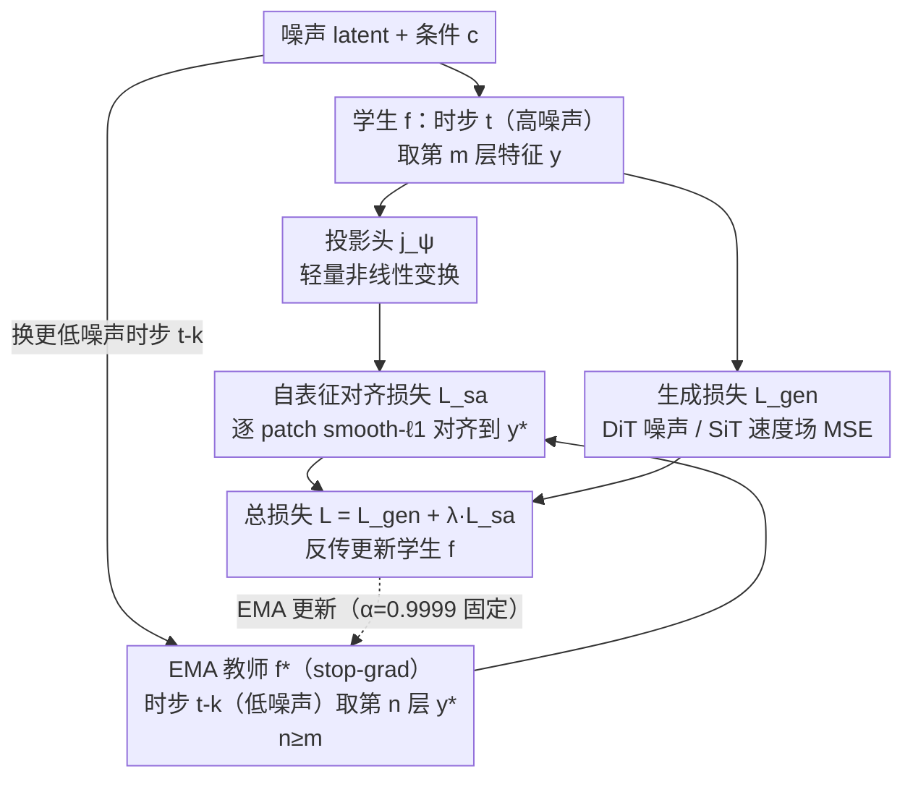

# No Other Representation Component Is Needed: Diffusion Transformers Can Provide Representation Guidance by Themselves

**会议**: ICLR2026  
**arXiv**: [2505.02831](https://arxiv.org/abs/2505.02831)  
**代码**: [https://github.com/vvvvvjdy/SRA](https://github.com/vvvvvjdy/SRA)  
**领域**: 自监督学习 / 图像生成  
**关键词**: 扩散Transformer, 自表征对齐, 自蒸馏, DiT/SiT加速训练, 内部表征引导

## 一句话总结

提出 Self-Representation Alignment (SRA)，发现扩散 Transformer 内部表征沿"层数增加 + 噪声降低"两个维度呈现从差到好的判别质量梯度，据此将学生网络早层高噪声表征对齐到 EMA 教师晚层低噪声表征，**完全不需要任何外部表征组件（DINOv2/CLIP/MAE）**，即可在 DiT 和 SiT 上大幅加速收敛并提升生成质量（SiT-XL/2 在 800 epoch 达到 FID 1.58，可比依赖 DINOv2 的 REPA）。

## 研究背景与动机

**领域现状**：扩散 Transformer（DiT、SiT）已成为图像生成的主流架构，凭借 Transformer 的可扩展性在 ImageNet 上取得了优异生成质量。近期一系列工作（MaskDiT、REPA、TREAD）证明：在扩散训练中额外引入**表征学习引导**，可以同时加速训练收敛和提升最终生成质量。

**现有痛点**：现有的表征引导方法都需要**外部组件**介入——MaskDiT/SD-DiT 在 DiT 训练中附加 MAE/IBOT 的判别损失（需要额外的重建分支和 masking 策略）；REPA 则直接依赖冻结的大规模预训练视觉编码器（DINOv2）来提供 patch 级对齐目标。这两种路线要么增加架构复杂性，要么在缺乏高质量预训练编码器的领域（如视频生成）难以适用。

**核心矛盾**：表征引导对扩散模型训练加速至关重要，但对外部组件的依赖成为扩展到新领域和新架构的瓶颈。一个关键问题浮现：**能否完全从扩散模型自身挖掘表征引导信号，彻底去掉外部依赖？**

**本文目标** (1) 验证扩散 Transformer 内部是否天然存在可利用的表征质量梯度；(2) 设计一种零外部依赖的自表征对齐方法来加速训练。

**切入角度**：与表征模型从干净图像出发提取特征不同，扩散模型以噪声输入逐步去噪——这意味着其内部过程本质上就是一个"从差到好"的判别过程。作者通过 PCA 可视化和线性探测对 SiT-XL/2 和 DiT-XL/2 进行系统分析，发现内部表征确实沿**层深度增加**和**噪声水平降低**两个维度呈现出质量递增趋势：浅层高噪声条件下的特征粗糙模糊，深层低噪声条件下的特征语义清晰。这一"从差到好"的内部过程恰好可以构成自监督对齐信号。

**核心 idea**：将学生网络早层高噪声时步的潜在表征，对齐到 EMA 教师网络晚层低噪声时步的潜在表征，利用模型**自身的表征质量梯度**完成自监督引导。

## 方法详解

### 整体框架

SRA 想解决的问题是：扩散 Transformer 要靠表征引导来加速收敛，但现有方法都得从外面搬一个 DINOv2/MAE 进来，难以迁移到没有强预训练编码器的领域。它的做法是把引导信号完全留在模型内部——在标准扩散生成训练（DiT 的噪声预测损失或 SiT 的速度场损失）之上，只附加一个**自表征对齐损失** $\mathcal{L}_{sa}$。

整个流程围绕两个网络转：可训练的**学生模型** $f$ 和由 EMA 缓慢复制学生权重得到的**教师模型** $f_*$。一张噪声 latent 进来后，学生在较高噪声时步 $t$ 处理它，取第 $m$ 层的输出特征过一个投影头；教师则在较低噪声时步 $t-k$ 处理同一目标，取更深的第 $n$ 层（$n \geq m$）输出特征。教师一侧加 stop-gradient，梯度只流经学生。把前者对齐到后者，就用模型自身"浅层高噪声差、深层低噪声好"的表征落差当成监督。训练结束后投影头直接丢弃，**推理架构和原始扩散 Transformer 一模一样**。

### 关键设计

**1. "从差到好"的内部表征梯度：先证明引导信号本来就在模型里**

整套方法立得住的前提，是扩散 Transformer 内部确实存在一条可利用的表征质量梯度，否则"自己引导自己"无从谈起。作者对预训练好的 SiT-XL/2 和 DiT-XL/2 做了系统体检：在不同层、不同噪声水平下取出 patch 特征，一边用 PCA 可视化看语义结构，一边用 ImageNet 线性探测量化判别能力。两个现象很清楚——第 3 层在高噪声下的特征几乎是随机的，到第 20 层在低噪声下却已经能干净地分出语义区域；线性探测准确率沿层深上升，在中深层（约第 20 层）见顶，之后因为模型转去生成高频细节才回落。这两条趋势在 DiT 和 SiT 上高度一致。结论很直接：模型内部本就有从弱到强的判别信号，没必要再从外部引一个编码器进来——这正是 SRA 的核心洞察。

**2. 自表征对齐损失（SRA Loss）：同时吃掉层间和时步间两个维度的落差**

有了梯度，接下来是把它变成可优化的目标。学生第 $m$ 层在时步 $t$ 的输出 $\mathbf{y} = f^m(\mathbf{x}_t, t, c)$ 先过一个轻量投影头 $j_\psi$，再去逼近教师第 $n$ 层在时步 $t-k$ 的输出 $\mathbf{y}_* = f_*^n(\mathbf{x}_{t-k}, t-k, c)$，逐 patch 最小化距离：

$$\mathcal{L}_{sa} = \mathbb{E}\left[\frac{1}{N}\sum_{i=1}^{N}\text{dist}(\mathbf{y}_*^{[i]}, j_\psi(\mathbf{y}^{[i]}))\right]$$

其中 dist 取 smooth-$\ell_1$。两个约束是关键：$m \leq n$ 让对齐沿层间从浅指向深，$k \geq 0$ 让它沿时步从高噪声指向低噪声——只有把这两个维度的质量差一起用上，引导信号才够强（消融里单维度明显更弱）。投影头不是摆设：直接拿学生特征硬对齐会破坏各层各时步原本负责的生成场域，加一层可训练变换相当于在不动主干的前提下做对齐。

**3. EMA 教师 + 零稳定性技巧：靠生成损失自己撑住，不坍塌**

对齐目标得稳定且越来越好，这件事交给 EMA 教师：参数按 $\zeta_t = \alpha \zeta_t + (1-\alpha)\zeta_s$ 缓慢跟随学生。值得注意的是，自监督里 BYOL/DINO 这套 EMA 自蒸馏通常要靠 cosine momentum schedule、centering、BN 一堆技巧防模式坍塌，而 SRA 把 $\alpha$ 固定在 0.9999 全程不动就能稳定训练，什么聚类约束、batch normalization、centering 都不加。作者的推测是：扩散模型的生成损失本身就提供了足够强的梯度信号，把训练钉在一个不会坍塌的位置上，所以那些防坍塌机制在这里是多余的。这让方法的超参负担和实现复杂度都降到很低。

### 损失函数 / 训练策略

总损失为生成损失和自对齐损失的加权和：$\mathcal{L} = \mathcal{L}_{gen} + \lambda \mathcal{L}_{sa}$，其中 $\lambda = 0.2$。生成损失对 DiT 是噪声预测 MSE，对 SiT 是速度场预测 MSE。默认对齐层配置：B 模型 $3 \to 8$，L 模型 $6 \to 16$，XL 模型 $8 \to 20$（SiT）/ $8 \to 16$（DiT）。时间偏移 $k$ 从 $[0, 0.2)$（SiT）或 $\lfloor[0, 200)\rfloor$（DiT）中随机采样。训练完全沿用 DiT/SiT 原始设置：AdamW、lr=1e-4、batch size 256、SD-VAE 提取 latent。

## 实验关键数据

### 主实验：ImageNet 256×256（CFG）

| 方法 | 外部依赖 | Epochs | FID↓ | sFID↓ | IS↑ | Pre.↑ | Rec.↑ |
|------|---------|--------|------|-------|-----|-------|-------|
| DiT-XL/2 | 无 | 1400 | 2.27 | 4.60 | 278.2 | 0.83 | 0.57 |
| SiT-XL/2 | 无 | 1400 | 2.06 | 4.50 | 270.3 | 0.82 | 0.59 |
| MaskDiT | MAE 损失 | 1600 | 2.28 | 5.67 | 276.6 | 0.80 | 0.61 |
| DiT + TREAD | MAE 损失 | 740 | 1.69 | 4.73 | 292.7 | 0.81 | 0.63 |
| SiT + REPA | DINOv2 | 800 | **1.42** | 4.70 | 305.7 | 0.80 | 0.65 |
| **SiT + SRA** | **无** | **400** | 1.85 | **4.50** | 297.2 | **0.82** | 0.61 |
| **SiT + SRA** | **无** | **800** | 1.58 | 4.65 | **311.4** | 0.80 | 0.63 |

SRA 在 400 epoch 就超越原始 SiT-XL 在 1400 epoch 的成绩；800 epoch 时 FID 1.58、IS 311.4，大幅超越 MaskDiT，接近 REPA 的 1.42，且**不依赖任何外部模型**。

### ImageNet 512×512 与 Text-to-Image

| 设置 | 方法 | FID↓ | IS↑ | PickScore↑ |
|------|------|------|-----|-----------|
| 512×512, 200 ep | SiT + REPA | **2.08** | 274.6 | - |
| 512×512, 200 ep | **SiT + SRA** | 2.17 | **279.3** | - |
| COCO T2I, 150K | MMDiT | 5.86 | - | 20.05 |
| COCO T2I, 150K | MMDiT + REPA | **4.60** | - | 20.88 |
| COCO T2I, 150K | **MMDiT + SRA** | 4.85 | - | **21.14** |

SRA 在高分辨率和文本到图像场景同样有效，512×512 上 IS 和 sFID 反超 REPA；COCO T2I 上 PickScore 最高。

### 组件消融实验（SiT-B/2, 400K iter, 无 CFG）

| 配置 | FID↓ | IS↑ | 说明 |
|------|------|-----|------|
| Baseline SiT-B/2 | 33.02 | 43.71 | 无 SRA |
| $3 \to 3$, 同层对齐 | 37.08 | 41.54 | 无层间差异信号，反而更差 |
| $3 \to 8$, $k=0$（固定同时步） | 31.07 | 47.32 | 只有层间梯度 |
| $3 \to 8$, $k \in [0,0.2)$ | **29.10** | **50.20** | 层间 + 时步间双重引导，最优 |
| $3 \to 8$, 无投影头 | 34.23 | 41.07 | 直接对齐破坏特征空间 |
| $3 \to 8$, 有投影头 | **29.10** | **50.20** | 投影头保护原始生成场域 |
| $\lambda=0.1$ | 30.65 | 48.31 | 对齐信号偏弱 |
| $\lambda=0.2$ | **29.10** | **50.20** | 最优平衡点 |
| $\lambda=0.4$ | 29.75 | 49.30 | 过强会轻微干扰生成 |

### 关键发现

- **层间+时步间缺一不可**：仅层间对齐（$k=0$）FID 31.07，加入时步偏移后跃升至 29.10；同层同时步对齐（$3 \to 3$）甚至劣于 baseline
- **投影头至关重要**：去掉投影头 FID 从 29.10 恶化到 34.23（比 baseline 还差），因为直接对齐会破坏各层原本负责的生成场域
- **教师表征质量与生成质量强相关**：线性探测准确率与 FID 呈现近似线性负相关，验证了"更好的表征引导 → 更好的生成"这一核心假设
- **SRA 的增益不饱和**：REPA 在约 200 epoch 后收益饱和（因为外部编码器质量固定），而 SRA 的 EMA 教师持续改善（线性探测从 200K iter 的 38.1% 提升到 800K iter 的 54.2%），因此可以提供越来越好的引导
- **模型越大，SRA 增益越显著**：从 B 到 L 到 XL，FID 相对改善比例递增，与自监督学习中的 scaling 规律一致

## 亮点与洞察

- **"从差到好"的双维度洞察极为优雅**：扩散模型天然具有从噪声到清晰的过程，层间表征同样从浅到深逐步精炼。将这两个维度的质量梯度统一利用，构成无需外部信号的自监督目标——这个洞察具有很强的通用性和可扩展性
- **极简设计哲学**：整个方法只增加一个投影头和一个 EMA 副本，不需要 masking、不需要额外编码器、不需要 SSL 中大量的稳定性技巧（centering、BN、动态 momentum），训练后投影头丢弃不影响推理。工程实现友好
- **对 REPA 的互补性**：REPA 早期收敛快但后期饱和（外部编码器信息用尽），SRA 早期稍慢但后期持续提升（教师不断变好）。论文暗示两者可以组合使用，先 REPA 快速启动再 SRA 持续优化

## 局限与展望

- **对齐层和时步偏移需要手动选择**：B/L/XL 不同尺寸需要各自适配层索引（如 $3 \to 8$ vs $8 \to 20$），论文给出了启发式原则但没有自动搜索机制
- **实验主要局限在 ImageNet 和 COCO**：缺乏在高分辨率（1024+）或大规模文本-图像数据上的验证。文本-图像实验只用了 150K iter 的 MMDiT 在 COCO2014 上的小规模设置
- **未验证视频生成场景**：作者明确指出受计算资源限制未做 text-to-video 实验，但论证了 SRA 在视频领域的概念可行性——视频领域缺乏强预训练编码器，恰好是 SRA 零外部依赖优势最大的场景
- **EMA 教师带来额外显存和计算开销**：需要维护完整模型副本并额外前向传播；论文附录给出了具体的训练速度和显存数据，但未深入讨论优化策略
- **理论理解不足**：为什么表征引导能加速生成训练？为什么层间+时步间的组合比单维度好得多？论文承认这些问题是 experiment-driven 的，缺乏理论分析

## 相关工作与启发

- **vs REPA**: REPA 用冻结的 DINOv2 做 patch-wise 对齐目标，在早期训练（<200 epoch）收敛极快，但后期引导饱和甚至有害（被 concurrent work 证实）。SRA 不依赖外部模型，EMA 教师持续改善，200 epoch 后仍能持续降低 FID。两者有明确的互补潜力
- **vs MaskDiT/SD-DiT/TREAD**: 这类方法引入 MAE/IBOT 判别损失或 token routing 策略，需要额外设计 masking 机制和辅助分支，架构侵入性强。SRA 不改变原始架构，更加即插即用
- **vs BYOL/DINO 自蒸馏**: SSL 中的 EMA 教师需要精心的稳定性设计（动态 momentum schedule、centering、BN）来防止模式坍塌。SRA 中固定 $\alpha=0.9999$ 即可稳定训练，可能是因为生成损失本身提供了足够强的梯度信号，自动防止坍塌——这一差异值得进一步研究

## 评分

- 新颖性: ⭐⭐⭐⭐ "从差到好"的双维度洞察新颖，但 EMA 教师的自蒸馏框架在 SSL 中已有广泛使用，SRA 是这一思路在扩散模型中的巧妙适配而非全新范式
- 实验充分度: ⭐⭐⭐⭐ 在 DiT/SiT 的 B/L/XL 三个尺寸、256/512 两个分辨率上全面验证，消融详尽；但缺乏大规模 T2I/T2V 实验
- 写作质量: ⭐⭐⭐⭐⭐ 动机推导自然流畅，经验分析→方法设计→实验验证的逻辑链条清晰完整，图表质量高
- 价值: ⭐⭐⭐⭐ 为扩散模型训练提供了简洁、零外部依赖的加速方案，尤其对缺乏强预训练编码器的领域（视频/3D）极具实用价值

<!-- RELATED:START -->

## 相关论文

- [\[CVPR 2026\] DiverseDiT: Towards Diverse Representation Learning in Diffusion Transformers](../../CVPR2026/self_supervised/diversedit_towards_diverse_representation_learning_in_diffusion_transformers.md)
- [\[ICML 2026\] FLAG: Foundation Model Representation with Latent Diffusion Alignment via Graph for Spatial Gene Expression Prediction](../../ICML2026/self_supervised/flag_foundation_model_representation_with_latent_diffusion_alignment_via_graph_f.md)
- [\[CVPR 2026\] Can You Learn to See Without Images? Procedural Warm-Up for Vision Transformers](../../CVPR2026/self_supervised/can_you_learn_to_see_without_images_procedural_warm-up_for_vision_transformers.md)
- [\[CVPR 2026\] Vision Transformers Need More Than Registers](../../CVPR2026/self_supervised/vision_transformers_need_more_than_registers.md)
- [\[AAAI 2026\] CATFormer: When Continual Learning Meets Spiking Transformers With Dynamic Thresholds](../../AAAI2026/self_supervised/catformer_when_continual_learning_meets_spiking_transformers_with_dynamic_thresh.md)

<!-- RELATED:END -->
