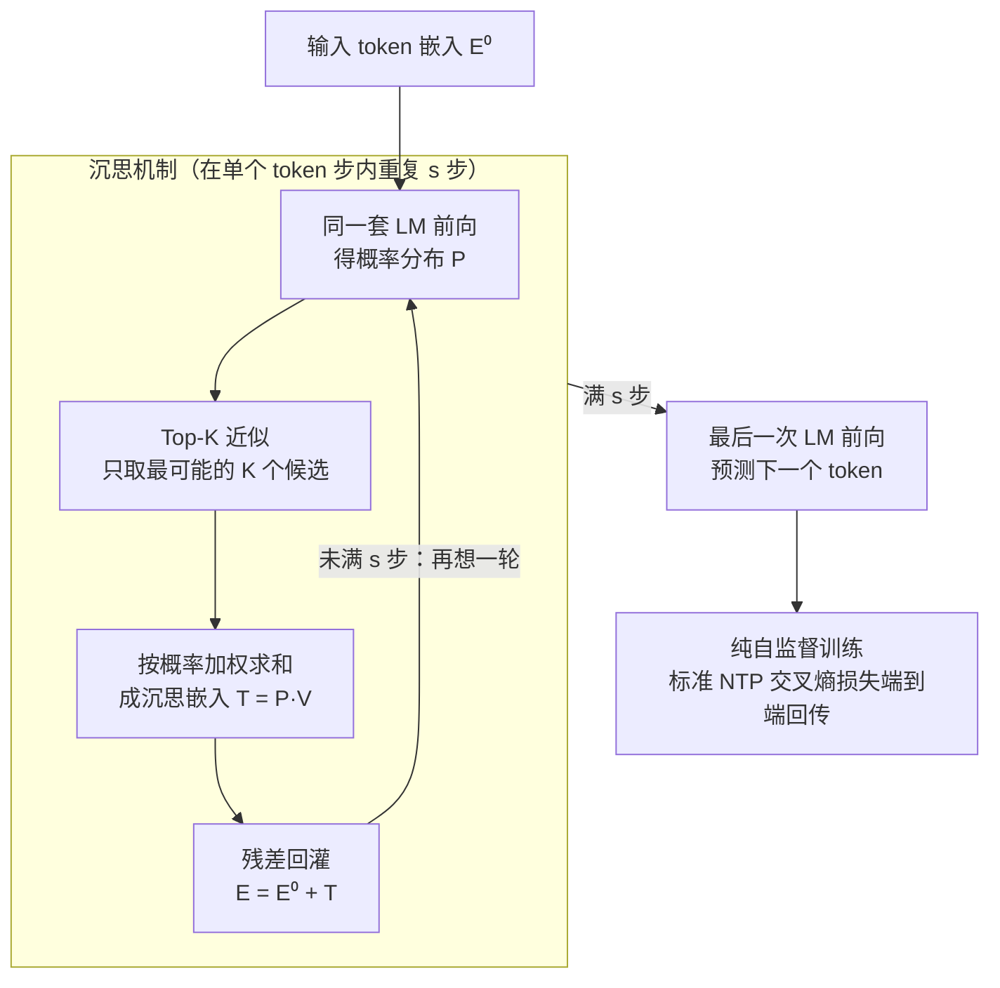

# PonderLM: Pretraining Language Models to Ponder in Continuous Space

**会议**: ICLR2026  
**arXiv**: [2505.20674](https://arxiv.org/abs/2505.20674)  
**代码**: 待确认  
**领域**: 自监督  
**关键词**: pondering, language model, continuous space, test-time compute, pretraining

## 一句话总结
提出 PonderLM，在预训练阶段引入"沉思"机制——将预测概率分布加权求和为连续嵌入后反复前向传播，无需标注数据或强化学习，使 2.8B 模型在 9 个下游任务上超越 6.9B 模型。

## 研究背景与动机

**领域现状**：提升模型能力的主流方法是扩大参数和数据规模，但面临数据耗尽、缩放饱和、通信开销等瓶颈。推理时缩放（CoT）也有限制：需要标注数据、强化学习，小模型难以受益。

**现有痛点**：CoT 在离散语言空间操作，受限于固定词表，且性能上界受基础预训练模型约束。

**核心矛盾**：需要更多计算来提升性能，但简单增加参数成本太高。

**本文目标** 在不增加参数的情况下，通过在单个 token 生成步内多次前向传播来提升性能。

**切入角度**：类比人类面对复杂问题会反复沉思，让模型在连续空间中"思考"。

**核心 idea**：将预测概率与词嵌入做加权和形成"沉思嵌入"，残差加到输入后再次前向传播，重复 $s$ 步。

## 方法详解

### 整体框架
PonderLM 把一次 token 生成拆成多轮"沉思"：模型先按标准方式吐出下一个 token 的概率分布，但不急着采样，而是把这个分布转成一个连续的"沉思嵌入"残差加回输入，再前向传播一次，如此重复 $s$ 步后才真正预测 token。整个过程没有引入新参数，多出来的只是同一套权重的若干次额外前向，相当于让模型在连续空间里反复斟酌当前位置该写什么。围绕这条主干有三处关键设计：**沉思机制**是回环本身（前向→概率→沉思嵌入→残差回灌）；**Top-K 近似**让每轮算沉思嵌入的开销可忽略；**纯自监督**保证整套机制只靠标准的下一词预测损失就能学会，不碰标注和强化学习。

### 关键设计

**1. 沉思机制：把"还没想好"的概率分布喂回模型继续想**

普通 LM 在每个位置算出 softmax 概率 $\mathbf{P}$ 后就直接挑词，离散采样这一步把分布里其它候选的信息全丢了。PonderLM 不丢：它用概率对整个词嵌入表做加权求和，得到沉思嵌入 $\mathbf{t} = \sum_i p_i \mathbf{e}_i$（矩阵形式 $\mathbf{T} = \mathbf{P}\mathbf{V}$，$\mathbf{V}$ 是嵌入矩阵），这个连续向量同时携带了所有候选 token 的相对置信度。再通过残差把它加回输入 $\mathbf{E}^1 = \mathbf{E}^0 + \mathbf{T}$，让下一轮前向能"看到"上一轮的初步猜测并加以修正。因为整条链路都是加权求和与残差这类可微操作，没有离散采样阻断梯度，所以能端到端用标准语言建模目标训练，模型自己学会怎么利用这些中间沉思来逼近正确答案。

**2. Top-K 近似：把全词表加权砍成只看最可能的几个**

直接对整张词表做加权求和的代价是 $\mathcal{O}(n|V|d)$，词表 $|V|$ 动辄几万，这一步会吃掉沉思带来的大半收益。PonderLM 观察到概率分布高度集中在少数 token 上，于是只取 top-$K$（实验取 $K=100$）个候选参与加权，把复杂度压到 $\mathcal{O}(nKd)$。消融显示 $K=100$ 已经接近全词表的效果，再加大 $K$ 几乎没有提升，说明被截断掉的长尾 token 本就贡献甚微，这一步几乎无损地把沉思的额外开销控制在可接受范围。

**3. 纯自监督：靠下一词预测就能学会沉思，不碰标注和 RL**

和 CoT、o1 这类需要标注推理链或强化学习信号的做法不同，PonderLM 的沉思能力完全长在标准的 next-token-prediction 损失上：把展开 $s$ 步沉思后的输出接到 NTP 目标，梯度自然会教会模型如何安排每一轮中间嵌入。实验中固定 $s=3$ 步在大规模语料上预训练即可。这种"零额外监督"的性质让方法几乎可以无缝套到任何现有预训练流程上，也是它能在 GPT-2、Pythia、LLaMA 三种架构上一致生效的原因。

## 实验关键数据

### 主实验

| 模型 | 参数量 | 训练数据 | 9任务平均 |
|------|--------|---------|---------|
| Pythia-6.9B | 6.9B | 300B tokens | 基线 |
| **PonderPythia-2.8B** | **2.8B** | **300B tokens** | **超越 6.9B** |
| TinyLlama-1.1B | 1.1B | 3T tokens | 基线 |
| **PonderPythia-1B** | **1B** | **300B tokens** | **匹配 TinyLlama** |

### 关键发现
- 2.55B 模型匹配 Pythia-6.9B 的 loss（63% 参数减少）
- 增加沉思步数持续提升性能
- 在 GPT-2、Pythia、LLaMA 三种架构上都有效

## 消融实验与深入分析

| 消融/分析 | 发现 |
|-----------|------|
| 沉思步数 $s$ | $s=1→2→3$ 持续提升性能，加步数有稳定收益 |
| Top-K 近似 | $K=100$ 足够好，进一步增大 K 无显著提升，显著降低计算复杂度 |
| 架构通用性 | GPT-2、Pythia、LLaMA 三种架构上均有效 |
| 缩放行为 | 405M→1.4B 范围内，沉思模型始终优于同参数量的基线 |
| 推理时步数调整 | 推理时可增加沉思步数（如训练 $s=3$，推理 $s=5$），有额外增益但需验证 |
| FLOPs 控制比较 | 在相同 FLOPs 下，PonderPythia-70M 持续优于 vanilla Pythia-70M |

### 缩放曲线核心发现
- **参数效率**：2.55B 参数的 PonderPythia 匹配 6.9B 参数 Pythia 的 validation loss（63% 参数减少）
- **数据效率**：PonderPythia 用 59% 更少的 training tokens 达到 Pythia 基线的同等性能
- **FLOPs 效率**：相同计算预算下 PonderPythia 始终更优——说明额外前向传播的计算开销被性能提升所补偿

### 下游任务细项

| 模型 | LAMBADA↑ | ARC-E↑ | WinoGrande↑ | PIQA↑ | SciQ↑ | 平均↑ |
|------|----------|--------|-------------|-------|-------|-------|
| Pythia-1B (300B) | 48.3 | 58.6 | 52.8 | 71.3 | 91.6 | 50.4 |
| PonderPythia-410M (300B) | 48.9 | 58.7 | 54.0 | 70.5 | 91.0 | **51.4** (+3.8) |
| Pythia-6.9B (300B) | 基线 | 基线 | 基线 | 基线 | 基线 | 基线 |
| **PonderPythia-2.8B** (300B) | **超越** | **超越** | **超越** | **超越** | **超越** | **超越 6.9B** |

## 亮点与洞察
- **第三条缩放轴**：传统缩放只有参数缩放和推理缩放（CoT），PonderLM 开辟了"沉思缩放"——相同参数通过多次前向传播提升
- **连续空间中的思考**：CoT 在离散 token 空间操作，受词表限制；沉思嵌入是所有 token 的概率加权连续向量，信息密度更高
- **可解释性窗口**：中间沉思步的概率分布变化提供了推理过程的可视化——可以看到模型如何从初始猜测逐步修正到正确答案
- **纯自监督**：不需要标注数据或 RL，通过标准 NTP 即可学会有效沉思——这使得方法的适用性极广
- **与 CoT 正交**：沉思发生在单个 token 生成步内，CoT 发生在 token 序列层面——两者可以叠加使用

## 局限与展望
- 推理开销随沉思步数线性增长（$s$ 步需要 $s+1$ 次完整前向传播），对延迟敏感的应用不友好
- 与 CoT 的组合效果未探索——沉思模型在 RL/CoT 训练后是否有额外增益？
- 沉思步数 $s$ 在训练和推理时固定——自适应步数（根据问题难度动态调整）可能更高效
- 训练时沉思增加了每步的计算量，整体训练速度变慢——虽然 FLOPs 效率更高但 wall-clock time 未详细讨论
- 目前仅在 Pile 数据集上验证，更多数据分布和模态上的验证有价值

## 相关工作与启发
- **vs CoT/o1/R1**：CoT 在离散空间生成推理链，PonderLM 在连续空间迭代精化——前者需要标注数据或 RL，后者纯自监督
- **vs Universal Transformer (Dehghani et al.)**：UT 允许变长计算（每个 token 不同层数），PonderLM 允许同一层的多次迭代——思路相近但机制不同
- **vs PonderNet (Banino et al.)**：PonderNet 学习何时停止计算（动态 halting），PonderLM 固定步数但通过连续嵌入保留更多信息
- **启发**：沉思机制可以扩展到多模态——视觉 token 和文本 token 的混合沉思可能实现跨模态的隐式推理

## 评分
- 新颖性: ⭐⭐⭐⭐⭐ 连续空间沉思机制是全新思路，开辟第三条缩放轴
- 实验充分度: ⭐⭐⭐⭐ 三种架构+9 个下游任务，缩放曲线严谨
- 写作质量: ⭐⭐⭐⭐ 直觉解释好，伪代码清晰
- 价值: ⭐⭐⭐⭐⭐ 提出了新的计算缩放范式，与现有方向正交可叠加

<!-- RELATED:START -->

## 相关论文

- [\[CVPR 2026\] Exploring Visual Pretraining for Learning Language Intelligence](../../CVPR2026/self_supervised/exploring_visual_pretraining_for_learning_language_intelligence.md)
- [\[CVPR 2026\] Quantized Residuals to Continuous Prompts for Few-Shot Class Incremental Learning in Vision-Language Models](../../CVPR2026/self_supervised/quantized_residuals_to_continuous_prompts_for_few-shot_class_incremental_learning.md)
- [\[CVPR 2026\] Scaling Dense Event-Stream Pretraining from Visual Foundation Models](../../CVPR2026/self_supervised/scaling_dense_event-stream_pretraining_from_visual_foundation_models.md)
- [\[ACL 2026\] LLMSurgeon: Diagnosing Data Mixture of Large Language Models](../../ACL2026/self_supervised/llmsurgeon_diagnosing_data_mixture_of_large_language_models.md)
- [\[ICCV 2025\] Improving Large Vision and Language Models by Learning from a Panel of Peers](../../ICCV2025/self_supervised/improving_large_vision_and_language_models_by_learning_from_a_panel_of_peers.md)

<!-- RELATED:END -->
