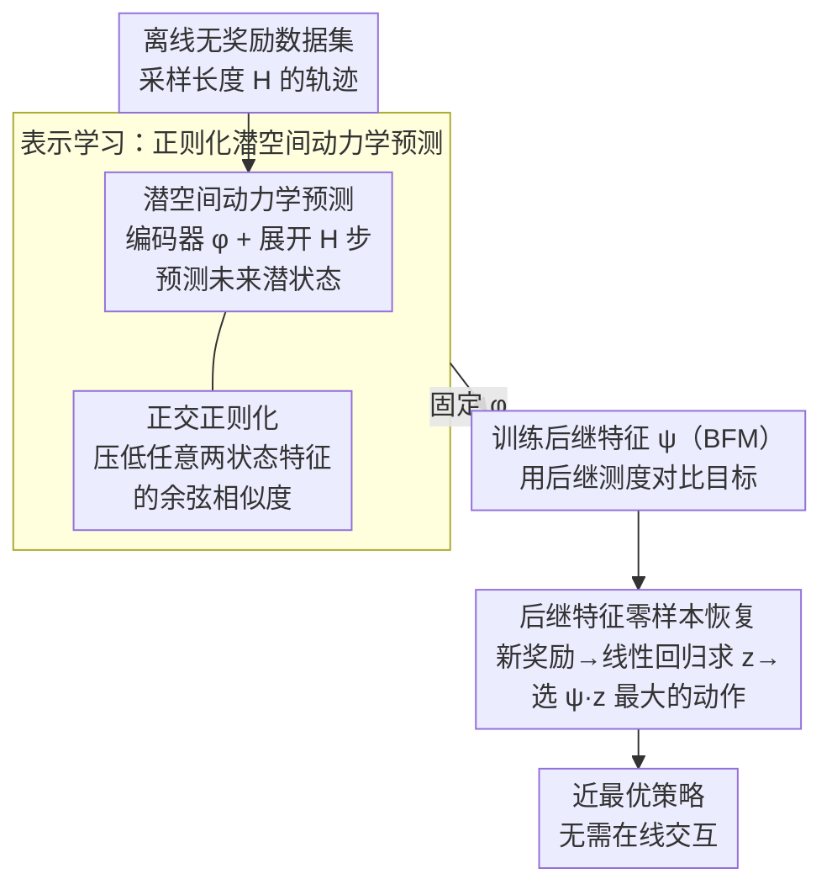

# Regularized Latent Dynamics Prediction is a Strong Baseline for Behavioral Foundation Models

**会议**: ICLR 2026  
**arXiv**: [2603.15857](https://arxiv.org/abs/2603.15857)  
**代码**: 无  
**领域**: 自监督  
**关键词**: 行为基础模型, 零样本RL, 潜空间动力学预测, 正交正则化, 状态特征学习

## 一句话总结
提出 Regularized Latent Dynamics Prediction (RLDP)，通过在自监督的潜空间下一状态预测目标上添加简单的正交正则化来维持特征多样性，在零样本 RL 中匹配甚至超越复杂的 SOTA 表示学习方法，特别是在低覆盖率场景下优势显著。

## 研究背景与动机
**行为基础模型 (Behavioral Foundation Models, BFMs)** 旨在训练出能适应任意未知奖励或任务的智能体。其核心思路是在离线数据集上预训练状态特征表示，使得在测试时针对新的奖励函数可以零样本（zero-shot）地恢复近最优策略——无需与环境进一步交互。

然而现有 BFM 方法面临一个根本限制：它们只能为那些在某些预先存在的状态特征的 **线性张成空间 (span)** 内的奖励函数产生近最优策略。换言之，状态特征的选择对 BFM 的表达力至关重要——特征必须足够多样化以覆盖尽可能多的奖励函数。为此，现有方法设计了各种复杂的表示学习目标（如 HILP 的多样化目标、FB 的前向-后向表示等），需要充足的数据集覆盖率来训练出有用的张成特征。

本文提出一个关键问题：**这些复杂的表示学习目标真的是零样本 RL 所必需的吗？** 作者发现，简单的自监督下一状态预测在潜空间中就可以学习有用的特征，但存在一个问题——这种目标训练时容易让特征向量趋于相似（增加特征相似度），从而降低 span 的维度。解决方案出人意料地简单：加一个正交正则化就够了。

## 方法详解

### 整体框架
RLDP 把零样本 RL 拆成两个阶段。第一阶段是表示学习：在离线无奖励数据集上训练状态编码器 $\phi$，用自监督的潜空间动力学预测让特征编码环境动力学，同时用一项正交正则化防止特征坍塌、维持张成空间（span）的多样性。第二阶段沿用标准的行为基础模型（BFM）机制：固定学好的 $\phi$，用后继测度（successor measure）对比目标训练后继特征（successor features）$\psi$；测试时面对任意新奖励，先线性回归求出任务向量 $z$，再用 $\psi$ 一步组合出近最优策略，全程不与环境交互。相比 FB、HILP 等动辄联合优化前向-后向模型、对比/多样性目标的复杂 BFM，RLDP 的表示学习目标只有动力学预测和正交正则两项，却把核心创新都压在第一阶段。

### 关键设计

**1. 潜空间动力学预测：用自监督信号学动力学相关特征**

现有 BFM 多用后继测度估计来学特征，但这要做 Bellman 回溯、依赖预设的策略类，在低覆盖率下容易因离分布动作产生错误泛化。RLDP 换一条与策略无关的路：从离线数据采一段长度 $H$ 的轨迹，编码器把初始状态映射到潜空间 $h_0=\phi(s_0)$，再用潜空间动力学模型 $g$ 与权重 $w$ 逐步展开 $h_{t+1}=g(h_t,a_t)^\top w$，训练目标是让展开的潜状态逼近真实状态的编码：

$$L_d=\mathbb{E}\Big[\textstyle\sum_{t=1}^{H}\lVert h_t-\bar\phi(s_t)\rVert^2\Big]$$

其中 $\bar\phi$ 是缓慢更新的目标编码器（停梯度）。这个目标逼特征编码动力学信息，但单独使用会退化——即便用了 BYOL 式的「停梯度 + 慢目标」技巧避免了彻底坍塌成常数，作者实测发现训练中不同状态的特征余弦相似度仍会持续上升（一种「温和坍塌」）；而特征 span 正是 BFM 能覆盖的奖励空间，相似度升高直接缩小了可求解的奖励类。

**2. 正交正则化：一项约束顶住特征坍塌**

针对上面的温和坍塌，RLDP 不重新设计目标，只加一项鼓励多样性的正交正则。先把所有状态特征投影到半径 $\sqrt d$ 的超球面 $\mathbb{S}^{d-1}=\{x:\lVert x\rVert_2=\sqrt d\}$ 上，再最小化任意两个状态特征的内积（即余弦相似度）：

$$L_r(\phi)=\mathbb{E}_{s,s'\sim\rho}\big[\phi(s)^\top\phi(s')\big]$$

它把不同状态的特征推向相互正交，直接顶住相似度上升、维持 span 的丰富度。最终目标就是两项加权相加 $L_{\text{RLDP}}=L_d+\lambda L_r$。这一项精确对症前一步的退化：动力学预测负责让特征「有动力学语义」，正交正则负责让特征「不坍塌」，二者缺一不可。值得注意的是正则系数不必精调——一个很小的 $\lambda\approx0.01$ 就足以阻止坍塌，几乎是一行代码的代价。

**3. 后继特征零样本恢复：把新奖励一步转成策略**

学好的 $\phi$ 固定后，RLDP 复用标准 BFM 机制：用后继测度对比目标训练后继特征 $\psi(s,a,z)$（只训 $\psi$、不动 $\phi$），它满足 $Q_z(s,a)=\psi(s,a,z)^\top z$。测试时给定任意新奖励 $r$，先把它近似写成特征的线性组合 $r(s)\approx\phi(s)^\top z$，闭式解一次线性回归即得任务向量 $z=(\phi\phi^\top)^{-1}\phi r$；再令策略选 $\arg\max_a\psi(s,a,z)^\top z$ 的动作，即可零样本恢复近最优策略，无需任何额外训练或在线交互。这也解释了为何特征 span 至关重要：能被零样本恢复的奖励，恰好是落在 $\phi$ 张成空间内的那些——这正是第一阶段拼命维持特征多样性的原因。

## 实验关键数据

### 主实验
在标准零样本 RL 基准上（如 ExORL 数据集上的连续控制任务），RLDP 与复杂 SOTA 方法的对比：

| 方法 | 复杂度 | 零样本性能 | 说明 |
|------|--------|-----------|------|
| FB (Forward-Backward) | 高 | SOTA级别 | 需要前向和后向模型 |
| HILP | 高 | SOTA级别 | 需要多层次目标 |
| ICM (纯动力学预测) | 低 | 较差 | 特征坍塌严重 |
| **RLDP** | **最低** | **匹配/超越 SOTA** | 仅动力学预测 + 正交正则化 |

### 低覆盖率实验
RLDP 相对于 SOTA 方法的关键优势在低数据覆盖率场景中更为突出：

| 覆盖率 | RLDP | FB | HILP |
|--------|------|----|------|
| 充足覆盖率 | 匹配 SOTA | 良好 | 良好 |
| 低覆盖率 | **仍然成功** | 性能下降 | 性能下降 |

### 消融实验

| 配置 | 关键指标 | 说明 |
|------|---------|------|
| 仅动力学预测（无正交正则化） | 性能差 | 特征坍塌，span 缩小 |
| 仅正交正则化（无动力学预测） | 性能差 | 特征无动力学语义 |
| 动力学 + 正交（RLDP） | 最优 | 二者缺一不可 |
| $\lambda$ 的影响 | 存在最优范围 | 过大抑制动力学学习，过小不能防止坍塌 |

### 关键发现
- 简单的自监督下一状态预测 + 正交正则化就能匹配甚至超越复杂的 SOTA 方法
- 纯动力学预测的核心问题是特征相似度增加导致 span 缩小——正交正则化精确解决这个问题
- 在低覆盖率场景下优势尤为明显：复杂方法依赖数据多样性来训练特征，RLDP 的正交约束提供了额外的结构保障
- 这一发现挑战了 "零样本 RL 需要复杂表示学习" 的普遍假设

## 亮点与洞察
- **极简但有效**: 在 BFM 领域充斥着越来越复杂的目标函数的趋势下，RLDP 以最小的修改（仅加一个正交正则化项）达到 SOTA，体现了 "strong baseline" 研究的价值
- **诊断性洞察深刻**: 准确识别了潜空间动力学预测的退化模式（特征相似度增加 → span 缩小），并设计了针对性解决方案
- **实用性突出**: 方法简单到可以直接一行代码实现正交正则化（$\|\Phi^T\Phi - I\|$），无需额外的网络结构或训练流程
- **低覆盖率优势**: 在实际应用中离线数据集的覆盖率往往有限，RLDP 在这些更现实的场景中依然表现良好

## 局限与展望
- 目前基于 successor features 的线性框架，对于需要非线性奖励解码的任务可能表现不佳
- 正交正则化在特征维度很高时可能引入过强的约束
- 仅在连续控制的 MuJoCo 等环境中验证，未涉及视觉观测或高维输入
- $\lambda$ 的选择仍需调参
- 动力学模型采用简单 MLP，更强的动力学建模（如 Transformer）可能进一步提升
- 零样本性能虽好但仍非最优，few-shot fine-tuning 机制有待探索

## 相关工作与启发
- **与 FB (Forward-Backward) 的关系**: FB 需要分别训练前向和后向模型，RLDP 仅需一个方向的动力学预测
- **与 HILP 的关系**: HILP 需要层次化的多样性目标和内在奖励设计，RLDP 用正交正则化一步到位
- **与 ICM/RND 的关系**: 这些经典的基于动力学的探索方法也用下一状态预测，但未解决特征 span 缩小的问题
- **启发**: 在表示学习中，特征多样性的维持往往比复杂的学习目标更重要；简单方法加上正确的归纳偏置可以走得很远

## 评分
- 新颖性: ⭐⭐⭐⭐
- 实验充分度: ⭐⭐⭐⭐
- 写作质量: ⭐⭐⭐⭐
- 价值: ⭐⭐⭐⭐⭐

<!-- RELATED:START -->

## 相关论文

- [\[ICML 2026\] NumLeak: Public Numeric Benchmarks as Latent Labels in Foundation Models](../../ICML2026/self_supervised/numleak_public_numeric_benchmarks_as_latent_labels_in_foundation_models.md)
- [\[ICML 2026\] FLAG: Foundation Model Representation with Latent Diffusion Alignment via Graph for Spatial Gene Expression Prediction](../../ICML2026/self_supervised/flag_foundation_model_representation_with_latent_diffusion_alignment_via_graph_f.md)
- [\[ICML 2025\] Beyond Sensor Data: Foundation Models of Behavioral Data from Wearables Improve Health Predictions](../../ICML2025/self_supervised/beyond_sensor_data_foundation_models_of_behavioral_data_from_wearables_improve_h.md)
- [\[AAAI 2026\] Robust Tabular Foundation Models](../../AAAI2026/self_supervised/robust_tabular_foundation_models.md)
- [\[ICLR 2026\] SNAP-UQ: Self-supervised Next-Activation Prediction for Single-Pass Uncertainty](snap-uq_self-supervised_next-activation_prediction_for_single-pass_uncertainty_i.md)

<!-- RELATED:END -->
