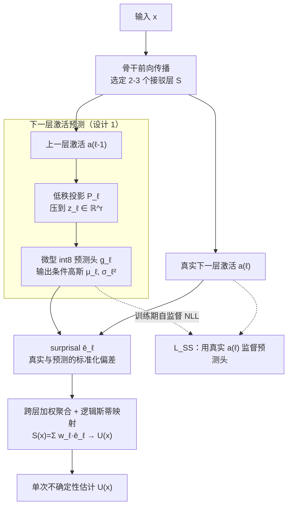

# SNAP-UQ: Self-supervised Next-Activation Prediction for Single-Pass Uncertainty

**会议**: ICLR 2026  
**arXiv**: [2508.12907](https://arxiv.org/abs/2508.12907)  
**代码**: 无  
**领域**: 自监督  
**关键词**: 不确定性估计, TinyML, 单次推理, 自监督, 微控制器部署, OOD 检测

## 一句话总结

SNAP-UQ 提出一种面向 TinyML 场景的单次前向传播不确定性估计方法：在骨干网络的选定层附加微型 int8 预测头，用自监督方式预测下一层的激活统计量，将实际激活与预测之间的偏差（"surprisal"）聚合为不确定性分数，无需额外前向传播、时序缓冲或集成，仅增加几十 KB 闪存即可在微控制器上实现可靠的分布偏移检测和故障检测。

## 研究背景与动机

TinyML 模型越来越多地部署在电池供电的微控制器（MCU）上，用于视觉和音频的私密低延迟感知。但部署后的输入分布不断变化——传感器漂移、光照和声学环境变化、分布内腐蚀（CID）和分布外（OOD）样本交替出现。现代神经网络在这些偏移下经常过度自信，即使在保留集上校准良好也是如此。

在 MCU 上解决不确定性估计面临严峻约束：
- **MC Dropout** 和 **Deep Ensembles** 需要多次前向传播，延迟和闪存成本成倍增加
- **Early-exit ensembles** 在推理时仍需额外分类头和内存带宽，且依赖 softmax 信号（在 CID 下脆弱）
- **事后校准**（Temperature Scaling）在分布偏移下通常失效
- **经典 OOD 检测器**（ODIN/G-ODIN）在超紧凑模型上迁移性差

关键洞察：层间动态比 softmax 置信度更早反映分布偏移——特征在类别后验扁平化之前就会相对于网络自身的变换变得非典型。

## 方法详解

### 整体框架

SNAP-UQ 想解决的是：TinyML 模型部署后输入分布漂移时 softmax 过度自信、而 MC Dropout/集成等可靠方案在微控制器上跑不起来。它的做法是在骨干网络的 2-3 个选定"接驳层"（taps）$\mathcal{S}$ 处各挂一个**微型 int8 预测头**：每个接驳层先把上一层激活做低秩投影，再让预测头吐出下一层激活的条件高斯参数，于是"网络认为下一层该长什么样"就有了。把真实激活与这个预测的标准化偏差当作该层的 surprisal 分数，跨层加权聚合成单一 SNAP 分数 $S(x)$，最后过一次轻量逻辑斯蒂映射得到不确定性 $U(x)$——全程只走一遍前向传播，无需多次推理、时序缓冲或集成。预测头是用骨干自己产生的下一层激活做自监督训练的，因此不需要任何额外标注。

### 关键设计

**1. 深度方向的下一层激活预测：用层间条件关系替代无条件类别统计**

传统单次 UQ（能量、Mahalanobis）依赖在某一层上拟合的无条件统计量，对偏移反应迟钝；SNAP-UQ 转而显式建模相邻层之间的映射 $a_{\ell-1} \mapsto a_\ell$。在每个接驳层 $\ell \in \mathcal{S}$，先用投影器 $P_\ell$ 把上一层激活压到低维 $z_\ell = P_\ell a_{\ell-1} \in \mathbb{R}^{r_\ell}$（$r_\ell \ll d_{\ell-1}$，故计算与存储都极省），再让预测头 $g_\ell$ 吐出一个对角高斯的参数 $(\mu_\ell, \log \sigma_\ell^2) = g_\ell(z_\ell)$，即"网络认为下一层激活应该长什么样"。当输入分布漂移时，真实激活会先于类别后验偏离这个自洽预测，因此该信号比 softmax 更早、更灵敏。若需要刻画通道间相关，可换成低秩加对角的协方差 $\Sigma_\ell = \text{diag}(\sigma_\ell^2) + B_\ell B_\ell^\top$，借 Woodbury 恒等式仍能高效求逆。

**2. 自监督训练目标：把预测头与骨干一起训，又不让它们打架**

预测头不需要任何额外标注——它的监督信号就是骨干自己产生的下一层激活，因此是纯自监督。辅助损失取对角高斯 NLL：$\mathcal{L}_{SS} = \frac{1}{|\mathcal{B}|}\sum_{x \in \mathcal{B}} \sum_{\ell \in \mathcal{S}} \frac{1}{2}[\|(a_\ell - \mu_\ell) \odot \sigma_\ell^{-1}\|^2 + \mathbf{1}^\top \log \sigma_\ell^2]$，与分类损失合成总目标 $\mathcal{L} = \mathcal{L}_{clf} + \lambda_{SS}\mathcal{L}_{SS} + \lambda_{reg}\mathcal{R}$，其中 $\lambda_{SS}$ 取得很小（$10^{-3}\sim10^{-2}$）以免干扰主任务。为防止方差塌缩成零（NLL 会被无限放大），用 softplus 加 $\epsilon^2$ 给 $\sigma_\ell^2$ 兜底，再加尺度正则 $\mathcal{R}_{var} = \sum_\ell \|\log \sigma_\ell^2\|_1$ 压住过度分散。对容量有限的小骨干，还可以 stop-grad 掉目标激活 $a_\ell$（detach 模式），避免预测头与骨干在同一组激活上梯度拔河。

**3. 单次 surprisal 聚合与映射：把多层偏差压成一个可校准的标量**

推理时每个接驳层算一个维度归一化的标准化误差 $\bar{e}_\ell(x) = \frac{1}{d_\ell}\|(a_\ell - \mu_\ell) \odot \sigma_\ell^{-1}\|^2$（除以 $d_\ell$ 是为了让高维层不至于主导总分），跨层加权求和得到 SNAP 分数 $S(x) = \sum_{\ell \in \mathcal{S}} w_\ell \bar{e}_\ell(x)$。层权重 $w_\ell$ 可取均匀或反方差加权 $w_\ell \propto 1/\hat{\text{Var}}[\bar{e}_\ell]$，让噪声大的层贡献更小。最后用一个逻辑斯蒂映射把 $S(x)$ 与可选的置信度代理 $m(x)$ 融成最终不确定性 $U(x) = \sigma(\beta_0 + \beta_1 S(x) + \beta_2 m(x))$；这三个映射参数离线一次性拟合，部署后不再需要任何在线标签。

**4. MCU 友好的整数实现：把整条路径塞进几十 KB 闪存**

为了真正跑在微控制器上，$P_\ell$、$W_\mu$、$W_\sigma$ 全部量化为 int8，并在最后 20% 的 epoch 插入伪量化做 QAT，使量化几乎无损。NLL 里 $\exp(-\frac{1}{2}\log\sigma^2)$ 这类指数运算被换成 256 项查找表（LUT），规避了 MCU 上昂贵的浮点指数。实测在 2 个接驳点、$r_\ell \in [32,128]$ 时，额外计算量不到骨干的 2%，闪存只多出几十 KB，且与 CMSIS-NN 兼容、无需任何时序缓冲。另外，损失对噪声敏感时还可换 Student-$t$ 或 Huberized 变体作为鲁棒替代。

## 实验关键数据

### 主实验——MCU 部署性能

| 平台/任务 | 方法 | Flash (KB) | Peak RAM (KB) | 延迟 (ms) | 能耗 (mJ) |
|-----------|------|-----------|--------------|----------|----------|
| Big-MCU/SpeechCmd | BASE | 220 | 84 | 60 | 2.1 |
| | EE-ens | 360 | 132 | 85 | 3.0 |
| | DEEP | 290 | 108 | 70 | 2.5 |
| | **SNAP-UQ** | **182** | **70** | **52** | **1.7** |
| Small-MCU/CIFAR-10 | BASE | 180 | 92 | 260 | 9.5 |
| | EE-ens | OOM | — | — | — |
| | DEEP | OOM | — | — | — |
| | **SNAP-UQ** | **158** | **85** | **178** | **6.4** |

### 故障检测

| 方法 | MNIST ID✓-ID× | SpeechCmd ID✓-ID× | CIFAR-10 ID✓-OOD | SpeechCmd ID✓-OOD |
|------|------|------|------|------|
| BASE | 0.75 | 0.90 | 0.90 | 0.88 |
| EE-ens | 0.85 | 0.90 | 0.90 | 0.90 |
| DEEP | 0.85 | 0.91 | 0.92 | 0.92 |
| **SNAP-UQ** | **0.90** | **0.94** | **0.92** | **0.94** |

### CID 流监控

| 方法 | MNIST-C AUPRC | 延迟(帧) | SpeechCmd-C AUPRC | 延迟(帧) |
|------|------|------|------|------|
| BASE | 0.54 | 42 | 0.52 | 67 |
| EE-ens | 0.63 | 31 | 0.59 | 55 |
| SNAP-UQ | **0.66** | **24** | **0.65** | **41** |

### 消融实验

| 配置 | AUPRC (CIFAR-10-C) | 延迟 (ms) |
|------|---------|------|
| P only, r=32 | 0.62 | 88 |
| M+P, r=64 | 0.70 | 83 |
| M+P, r=128 | 0.72 | 86 |
| M+P+early, r=64 | 0.71 | 90 |

### 关键发现

- **SNAP-UQ 在 Small-MCU 上是唯一可用的 UQ 方案**：EE-ens 和 DEEP 在 CIFAR-10/Small-MCU 都 OOM，SNAP-UQ 正常部署
- **深度 surprisal 比 softmax 信号更早反应偏移**：在流监测实验中，SNAP-UQ 的检测延迟比 EE-ens 短约 25-30%
- **INT8 量化几乎无损**：INT8 头部的 AUPRC 仅比 FP32 下降 0.01，但闪存减少 1.6-2.1 倍
- **两个接驳点最优**：mid+penultimate 组合一致提供最佳精度-延迟权衡，加入 early tap 反而因噪声降低效果

## 亮点与洞察

- 核心创新在于将"层间动态偏离度"作为不确定性信号——不同于传统基于 softmax/能量/Mahalanobis 的方法，SNAP-UQ 捕捉的是条件性、深度方向的信号
- 理论分析清晰优雅：Proposition 2.1 证明 SNAP 分数等价于深度方向负对数似然的仿射变换；Proposition 2.2 证明其等价于到条件均值的 Mahalanobis 距离；Proposition 2.3 证明对 BN 尺度变换的不变性
- 整个设计高度面向工程实际：int8 量化、LUT 避免指数运算、CMSIS-NN 兼容、无时序缓冲
- 与 ASH、ReAct 等激活整形方法的 head-to-head 对比（Appendix O）显示 SNAP-UQ 在 risk-at-coverage 和 AURC 上全面领先

## 局限与展望

- 部分固件会融合或省略中间激活，暴露接驳点可能需要运行时修改
- 对角协方差无法完整捕捉跨通道结构，极端扭曲下可能低估/高估 surprisal
- 性能对接驳层位置和投影器秩的选择敏感
- 可选的置信度混合和映射仍需小量标注开发集
- 仅在四个 benchmark 和两个 MCU 层级上评估，未覆盖更多模态和 tiny transformer 架构

## 相关工作与启发

- MC Dropout (Gal & Ghahramani, 2016) 和 Deep Ensembles (Lakshminarayanan et al., 2017) 是经典 UQ 方法但资源消耗过大
- 能量分数 (Liu et al., 2020) 和 Mahalanobis 检测 (Lee et al., 2018) 是单次方法但基于无条件统计量
- QUTE (Ghanathe & Wilton, 2024) 是 TinyML UQ 最近的工作但仍依赖 early-exit 架构
- 启发：这种"网络自身深度动态作为异常信号"的思路可推广到更大模型的在线监控

## 评分
- 新颖性: ⭐⭐⭐⭐⭐
- 实验充分度: ⭐⭐⭐⭐⭐
- 写作质量: ⭐⭐⭐⭐⭐
- 价值: ⭐⭐⭐⭐⭐

<!-- RELATED:START -->

## 相关论文

- [\[ICML 2026\] NITP: Next Implicit Token Prediction for LLM Pre-training](../../ICML2026/self_supervised/nitp_next_implicit_token_prediction_for_llm_pre-training.md)
- [\[ICLR 2026\] Soft Equivariance Regularization for Invariant Self-Supervised Learning](soft_equivariance_regularization_for_invariant_self-supervised_learning.md)
- [\[CVPR 2026\] TimeBridge: Self-Supervised Video Representation Learning via Start-End Joint Embedding and In-Between Frame Prediction](../../CVPR2026/self_supervised/timebridge_self-supervised_video_representation_learning_via_start-end_joint_emb.md)
- [\[ICLR 2026\] Why Prototypes Collapse: Diagnosing and Preventing Partial Collapse in Prototypical Self-Supervised Learning](why_prototypes_collapse_diagnosing_and_preventing_partial_collapse_in_prototypic.md)
- [\[ICLR 2026\] Regularized Latent Dynamics Prediction is a Strong Baseline for Behavioral Foundation Models](regularized_latent_dynamics_prediction_is_a_strong_baseline_for_behavioral_found.md)

<!-- RELATED:END -->
