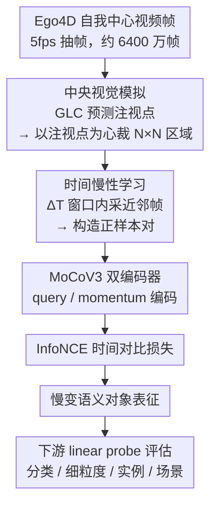

# Temporal Slowness in Central Vision Drives Semantic Object Learning

**会议**: ICLR2026  
**arXiv**: [2602.04462](https://arxiv.org/abs/2602.04462)  
**代码**: 无  
**领域**: 自监督  
**关键词**: central vision, temporal slowness, self-supervised learning, Ego4D, semantic representation

## 一句话总结
通过模拟人类中央视觉（注视点裁剪）和时间慢性原则（时间对比学习），在 Ego4D 数据上训练 SSL 模型，发现两者组合能有效提升语义对象表征——中央视觉强化前景提取，时间慢性在注视凝视期间蒸馏语义信息。

## 研究背景与动机

### 领域现状

**领域现状**：人类从自我中心视觉流中以极少监督获取语义对象表征，但 SSL 模型在人类视觉体验上训练时效果不佳。

**现有痛点**：现有 SSL 模型忽略了两个关键生物学过程：(1) 视网膜的中央高分辨率处理（中央视觉），(2) 时间上相近的输入获得相似表征（慢性原则）。

**核心矛盾**：全视野训练混合了前景和背景信息，且无法利用时间上的对象跟踪信息。

**本文目标** 研究中央视觉和时间慢性在语义对象表征形成中的作用。

**切入角度**：在 Ego4D（5个月视觉体验）上用注视点预测模型生成注视坐标，裁剪中央视野区域，训练时间对比 SSL 模型。

## 方法详解

### 整体框架

这篇工作要回答的问题是：把人类视觉的两个生物学约束——**只对视野中央做高分辨率处理**和**时间上相近的输入应得到相似表征**——搬进自监督学习（SSL）后，能不能让模型从类人的视觉经验里长出更好的语义对象表征。作者的做法不动模型架构，只改数据管线：先把 Ego4D 的自我中心视频按 5fps 抽帧，得到约 6400 万帧；对每一帧用注视点预测模型 GLC 估计人眼会看向哪里，据此以注视点为中心裁出一块 $N \times N$ 的中央区域作为模型输入；再在时间窗口 $\Delta T$ 内随机采一帧近邻作为正样本，喂给 MoCoV3 的 query／momentum 双编码器，用 InfoNCE 做时间对比。一句话概括：**"看哪里"由中央视觉决定，"什么算同一个东西"由时间慢性决定**，最终学到的慢变表征再用 linear probe 在分类、细粒度、实例、场景等下游任务上评估。

### 关键设计

**1. 中央视觉模拟：把训练焦点从整幅画面收缩到注视点周围**

全视野训练的毛病在于前景对象和背景场景被混在一起，模型学到的特征里掺了大量与对象语义无关的背景布局。本文不改网络，只在数据侧动手：用 GLC 模型（Lai et al., 2024，利用时空信息为每帧生成显著图）取最显著像素 $(x_g, y_g)$ 作为注视坐标，再以该坐标为中心裁出 $N \times N$ 区域作为实际输入，模拟视网膜中央凹的高分辨率处理（裁框越界时最小平移使其回到图内）。裁剪尺寸 $N$ 是核心超参：太小（如 112）会丢失对象信息，太大又退回全视野，实验里 224–336 是甜蜜点。它为什么有效，在 ImageNet-9 的前景／背景分析上看得最清楚——换掉背景准确率只掉 10%、换掉前景却掉 20%，说明模型把判别依据压到了前景对象上，这正是人类视觉处理的特征。

**2. 时间慢性学习：用时间邻居替代空间数据增强构造正对**

标准 SSL 靠裁剪、翻转、色彩抖动等空间增强生成同一图像的两个视角，但这与人类的学习方式相去甚远。本文遵循慢性原则（slowness principle，即时间上相邻的输入应映射到相似表征），把"造正对"的方式整个换掉：对锚点帧 $x_t$，在同一段视频、时间窗口 $\Delta T$ 内随机采一帧 $x_{t'}$ 当正样本，两帧拍的是同一场景的不同时刻。$\Delta T$ 等于在定义"多近才算同一对象"——窗口太大会把扫视（saccade）后切换的不同对象误当正对，太小则退化为静态增强；实验中 ResNet50 的最佳窗口是 $\Delta T=3$、ViT 是 $\Delta T=1$。作者进一步指出，真正起作用的是注视凝视（fixation，人眼停在同一处不动）期间的小窗口对比：这段时间里同一物体的不同视角、以及同场景共现物体之间的语义关联被持续呈现，从而被蒸馏进表征——这也解释了为什么模型不仅认得"是什么"，还学到了"常和什么一起出现"。

### 损失函数 / 训练策略

对比目标沿用 MoCoV3 的 InfoNCE。query 编码器 $f_q$ 算出锚点嵌入 $q_t = f_q(x_t)$，momentum 编码器 $f_k$ 算出近邻嵌入 $k_{t'} = f_k(x_{t'})$，对每个正对 $(q_t, k_{t'})$ 最小化：

$$\mathcal{L}_{q_t} = -\log \frac{\exp\bigl(\mathrm{sim}(q_t, k_{t'})/\tau\bigr)}{\sum_{i=0}^{K}\exp\bigl(\mathrm{sim}(q_t, k_i)/\tau\bigr)}$$

其中 $\mathrm{sim}$ 是余弦相似度，$\tau$ 为温度，$K$ 是同批次里 $f_k$ 输出的负样本。直觉上它拉近时间相邻视角、推远批内其他视角；momentum 编码器参数按指数滑动平均更新 $\theta_k \leftarrow m\theta_k + (1-m)\theta_q$。训练上一个值得注意的细节是：模型只在 6400 万帧上跑**单个 epoch** 就接近饱和，再训一轮仅约 +0.5%——因为 Ego4D 在 5fps 下相邻帧高度冗余，慢性信号在海量近似重复的帧里被反复呈现，一次遍历已足够，这既省算力也反过来印证了数据本身的时间冗余性。

## 实验关键数据

### 主实验

| 方法 | ImageNet-1k | 细粒度平均 | 实例识别 |
|------|------------|-----------|---------|
| Frames Learning（全视野，无慢性） | 49.50 | 基线 | 基线 |
| **Bio-inspired**（中央+慢性） | **49.58** | **提升** | **提升** |

### 关键发现
- 中央视觉强化前景对象特征提取（vs 背景）
- 注视凝视期间的时间慢性蒸馏更广泛的语义信息（类别、上下文共现）
- 模型与人类语义判断更一致（CKA 分析）
- 两者互补：中央视觉提供"什么"，慢性提供"语义关联"

## 消融实验与深入分析

| 消融/分析 | 发现 |
|-----------|------|
| 裁剪尺寸 $N$ | 224-336 为甜蜜点；N=112 过小丢失信息；全帧对场景有利但对象变差 |
| 时间窗口 $\Delta T$ | ResNet50 最佳 $\Delta T=3$，ViT 最佳 $\Delta T=1$ |
| 前景 vs 背景分析 | 中央视觉降低了背景特征的重要性（ImageNet-9 实验验证） |
| 注视凝视 vs 扫视 | 凝视期间（小时间窗口）的时间对比学习蒸馏最丰富的语义信息 |
| 物体共现 CKA | 生物启发模型与 GloVe 共现嵌入的 CKA 对齐度更高 |
| 训练 epoch | 单 epoch 接近饱和（第二 epoch 仅+0.5%），因 Ego4D 在 5fps 下高度冗余 |

### ImageNet-9 前景/背景分析

| 模型 | 正常准确率 | 去背景准确率变化 | 去前景准确率变化 |
|------|-----------|----------------|----------------|
| Frames Learning (全帧) | 75% | -15% | -5% |
| **Bio-inspired** (中央+慢性) | **80%** | **-10%** | **-20%** |

→ 说明中央视觉使模型更依赖前景对象而非背景——与人类视觉处理一致

### 语义维度表现（ResNet50）

| 语义维度 | Frames Learning | Bio-inspired | 提升 |
|----------|----------------|-------------|------|
| 类别识别平均 | 45.65 | **46.94** | +1.29 |
| 细粒度识别平均 | 33.84 | **38.42** | **+4.58** |
| 实例识别平均 | 59.03 | **67.00** | **+7.97** |
| 场景识别 Places365 | **43.02** | 42.95 | -0.07 |

## 亮点与洞察
- **跨学科融合**——将计算神经科学的"时间慢性原则"和"中央视觉"概念与 SSL 结合，用计算实验验证神经科学假说
- **中央视觉和时间慢性的互补性**：中央视觉提供"看什么"（强化前景对象特征），时间慢性提供"怎么关联"（同一物体不同视角、同场景共现物体）
- **对"场景识别变差"的解释**：全视野包含更多背景/空间布局信息，有利于场景识别；中央视觉裁掉了这些信息
- **对嵌入式 AI 的启发**：机器人的视觉处理可以模仿人类——仅高分辨率处理注视点周围区域，大幅降低计算量
- **注视凝视期间的语义蒸馏**是一个精彩发现——说明人类的"看"不仅是采集信息，停留不动时也在利用时间一致性学习不变表征

## 局限与展望
- 绝对性能提升幅度不大（类别识别仅+1.29%），更多价值在于科学理解而非工程提升
- 注视点预测模型（GLC）引入误差——真实人类注视数据仅 45 小时，其余 3600+ 小时依赖预测
- 主要使用 ResNet50 和 ViT-B/16，更大模型（如 ViT-L）上的验证缺失
- 单 epoch 训练在 Ego4D 上接近饱和——但这可能是数据冗余导致，而非方法的固有特性
- 未与其他自我中心 SSL 方法（如 EgoVLP、VC-1）直接比较

## 相关工作与启发
- **vs R3M (Nair et al.)**：R3M 在 Ego4D 上学习慢变表征用于机器人任务，但使用全视野；本文加入中央视觉裁剪进一步提升对象特征
- **vs DINO/MoCo**：标准 SSL 方法依赖数据增强（裁剪/翻转/色彩变换），本文用时间邻居替代空间增强——更贴近生物学习
- **vs Orhan et al. (2024) 自我中心 SSL**：他们在全视野上训练，未考虑中央视觉的特殊作用
- **vs VIP (Ma et al.)**：VIP 在 Ego4D 上学习视频预测表征，注重时间进度；本文注重时间慢性，角度不同
- **启发**：中央视觉+时间慢性的组合可以作为视觉基础模型预训练的数据处理策略——不需改模型架构，只需改数据采样

## 评分
- 新颖性: ⭐⭐⭐⭐ 生物学启发+SSL 的创新结合，具有科学价值
- 实验充分度: ⭐⭐⭐⭐ 多维度分析（分类、细粒度、实例、场景、共现）
- 写作质量: ⭐⭐⭐⭐ 逻辑清晰，实验设计有针对性
- 价值: ⭐⭐⭐⭐ 对理解人类视觉学习有科学贡献，对嵌入式 AI 有实践启发

<!-- RELATED:START -->

## 相关论文

- [\[CVPR 2026\] Temporal Imbalance of Positive and Negative Supervision in Class-Incremental Learning](../../CVPR2026/self_supervised/temporal_imbalance_of_positive_and_negative_supervision_in_class-incremental_lea.md)
- [\[NeurIPS 2025\] Contrastive Representations for Temporal Reasoning](../../NeurIPS2025/self_supervised/contrastive_representations_for_temporal_reasoning.md)
- [\[CVPR 2025\] UniSTD: Towards Unified Spatio-Temporal Learning Across Diverse Disciplines](../../CVPR2025/self_supervised/unistd_towards_unified_spatio-temporal_learning_across_diverse_disciplines.md)
- [\[CVPR 2026\] Towards Stable Self-Supervised Object Representations in Unconstrained Egocentric Video](../../CVPR2026/self_supervised/towards_stable_self-supervised_object_representations_in_unconstrained_egocentri.md)
- [\[CVPR 2026\] Finding Distributed Object-Centric Properties in Self-Supervised Transformers](../../CVPR2026/self_supervised/finding_distributed_object-centric_properties_in_self-supervised_transformers.md)

<!-- RELATED:END -->
