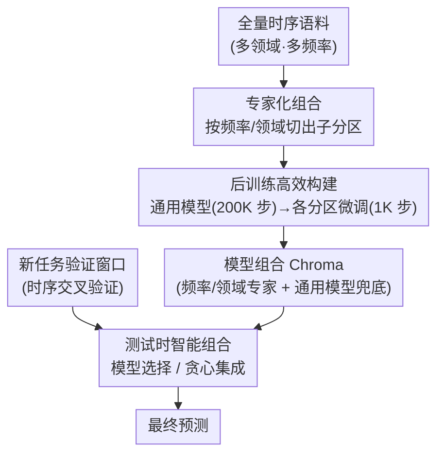

# Test-Time Efficient Pretrained Model Portfolios for Time Series Forecasting

**会议**: ICLR 2026  
**arXiv**: [2510.06419](https://arxiv.org/abs/2510.06419)  
**代码**: 无  
**领域**: 时间序列 / 基础模型  
**关键词**: 模型组合, 专家组合, 测试时选择, 时序基础模型, Chronos-Bolt

## 一句话总结

提出 Chroma——小型预训练时序模型组合（portfolio）框架：从通用模型通过后训练（post-training）产出频率/领域专家（训练加速 10×），测试时通过模型选择或贪心集成组合，4M 参数的 portfolio 在 Chronos Benchmark II 上匹配 205M-500M 参数的大型单体模型性能，同时推理计算远低于 test-time fine-tuning。

## 研究背景与动机

**领域现状**：时序基础模型（Chronos、TimesFM、Moirai）沿用"更大更好"的 scaling 思路——扩大模型参数（10M-500M）和训练数据来提升零样本预测能力。但大模型训练和推理成本高，限制实际部署。

**现有痛点**：

1. 单体大模型对所有域/频率一视同仁 → 但不同域（能源/零售/天气）和频率（分钟/小时/月度）的时序特性差异巨大
2. "更大更好"的边际收益递减 → 从 Mini(9M) 到 Base(205M) 的提升有限
3. 测试时利用额外计算的方式仅有 fine-tuning → 成本高、梯度更新慢
4. NLP/CV 中已被验证有效的模型组合（ensemble/selection）策略尚未被引入时序基础模型

**核心矛盾**：基础模型的泛化误差中，bias（偏差）远大于 variance（方差） → 传统集成的 variance reduction 效果有限 → 需要通过专家化降低特定子域的 bias，再通过智能组合实现整体 bias reduction。

**本文方案**：与其训练一个巨大的通用模型，不如训练多个小的专家模型 → 测试时根据验证集表现智能选择/组合。

## 方法详解

### 整体框架

Chroma 想回答一个问题：时序基础模型一定要"越大越好"吗？它的答案是用一组小专家替代一个大通用模型。训练阶段先在全量语料上训一个通用模型，再按元数据把数据切成若干子分区、在每片上短暂微调出对应的小专家，连同通用模型一起凑成模型组合（portfolio）；测试阶段拿到新任务后，在验证窗口上评估组合里每个模型，挑出最合适的单个专家、或把几个专家加权拼起来再去预测。整套实现都建在 Chronos-Bolt（T5 encoder-decoder）之上，单个模型只有 1M 到 9M 参数，所以即使组合多个专家，测试时激活的有效参数也远小于 200M+ 的单体大模型。

### 关键设计

**1. 专家化组合：用数据多样性而非随机种子换取专家差异**

集成要奏效得靠成员间的多样性，但传统集成只能靠不同随机种子训练同构模型来制造多样性，这种多样性只降方差。Chroma 转而按元数据切分训练数据，让每个专家天然擅长一类信号。切分有两个维度：按**频率**（hourly / daily / weekly / monthly / subhour）捕捉时间尺度差异，按**领域**（energy / retail / transport / weather / web 等）捕捉应用域差异；每个专家只在自己那一片数据上训练，组合里再额外保留一个在全量数据上训的同尺寸通用模型兜底。实验里按频率切分稳定优于按领域切分——WQL 低约 4%、MASE 低约 5%，这与 TTM 等先前工作一致，原因是频率直接决定了序列的周期与采样尺度，比抽象的应用域更能划出彼此分离的子分布。

**2. 后训练高效构建：先训通用模型再短微调，把组合成本压到约 1/10**

如果每个专家都从零训 200K 步，养 $N$ 个专家的总成本就是 $200\text{K} \times N$ 步，专家越多越吃不消，频率/领域里数据稀少的分区（如年度采样）从零训还容易训不动。Chroma 改成两阶段：先花 200K 步训一个通用模型，再把它在每个数据分区上各微调 1K 步得到对应专家。这样总成本降到 $200\text{K} + 1\text{K} \times N$ 步，每个专家的微调只占通用模型训练量的 0.5%，专家数较多时加速比约为

$$\frac{200\text{K} \times N}{200\text{K} + 1\text{K} \times N} \approx 10\times$$

关键是这种后训练得到的专家在准确率上与从零训练的专家没有显著差异、scaling 行为甚至更好，所以这 10× 的加速几乎是白赚的；论文也指出在模型更大（NLP 里上千亿参数）的场景里，从零训每个专家根本不现实，后训练才是可扩展的路子。

**3. 测试时智能组合：用验证集挑专家，而不是无脑平均**

拿到一个未见过的新任务时，Chroma 用时序交叉验证从训练集尾部留出一个验证窗口，让组合里每个模型都在上面预测，再据此组合，给出两种用法：**模型选择**直接选验证损失最低的单个专家，开销约 $N+1$ 次前向传播；**贪心集成**用 Caruana et al. (2004) 的集成选择算法在验证窗口上迭代挑模型并定权重，得到加权预测 $\hat{y}_{\text{ens}} = \sum_{m=1}^M w_m \cdot \hat{y}_m$，平均只选约 2.5 个模型、开销约 $N+2.5$ 次前向传播。这里"按验证表现筛"是关键：直接对 portfolio 做简单平均或性能加权平均反而比单个通用模型还差（相对 WQL 回升约 +0.19~+0.24），因为预训练模型的误差由 bias 主导，盲目平均消不掉系统性偏差，只有筛掉不合适的专家才能真正降低 bias。

## 实验与结果

### 主实验：Chronos Benchmark II 上的性能

| 模型 | 参数量 | BM2 相对 WQL ↓ |
|------|:---:|:---:|
| Seasonal Naive | - | 1.000 |
| Auto ETS | - | 0.892 |
| Chronos-Bolt Mini (9M) | 9M | 0.835 |
| Moirai-1.1 Large | 311M | ~0.82 |
| Chronos-Bolt Base | 205M | ~0.80 |
| TimesFM-2.0 | 500M | ~0.79 |
| **Chroma 4M (freq, best)** | **4M** | **~0.81** |
| **Chroma tiny (freq, ens.)** | **9M** | **~0.80** |

Chroma 以 4M 活跃参数即可匹配 200M+ 参数的大型单体模型性能。

### 消融实验：Portfolio 设计选择

| 方法 | WQL (相对 1m 通用模型) |
|------|:---:|
| 单个通用模型 (1m) | 1.000 |
| 通用模型集成 × 5 | 0.987 |
| 领域专家 - 选择 | 0.963 |
| 领域专家 - 集成 | 0.957 |
| **频率专家 - 选择** | **0.918** |
| **频率专家 - 集成** | **0.926** |

关键洞察：

1. **通用模型集成几乎无效**（0.987 vs 1.000）→ variance reduction 无用，因为 bias 主导
2. **频率专家 > 领域专家**（频率约 4% 优势）
3. **模型选择与集成差异不大** → 选择的计算效率更高

### Scaling 行为分析

| 模型规模 | 单通用模型 WQL | Chroma (freq best) WQL |
|---------|:---:|:---:|
| 1M | 1.000 | 0.918 |
| 2M | 0.977 | 0.916 |
| 4M | 0.960 | 0.880 |
| 9M (tiny) | 0.958 | 0.909 |

Portfolio 遵循与单体模型类似的 scaling 规律（log-log 拟合），说明方法可外推到更大模型规模。

### 测试时计算效率

| 方法 | 测试时 GFLOPs (相对) | 相对 WQL 提升 |
|------|:---:|:---:|
| Zero-shot 通用模型 | 1× | 基准 |
| Chroma (选择) | ~7× | -8.2% |
| Chroma (集成) | ~9× | -7.4% |
| Fine-tuning 1K steps | ~80× | -6.5% |

Chroma 的测试时计算远低于 fine-tuning（约 1/10），但获得了相当甚至更优的性能提升 → 在准确率-计算效率的 Pareto 前沿上表现优异。

### Bias-Variance 分析

在合成数据上对 10 个独立训练的通用模型估计 bias 和 variance：

| 模型规模 | Bias | Variance | Bias/Variance 比率 |
|---------|:---:|:---:|:---:|
| 1M | 65.3 | 10.1 | 6.5× |
| 2M | 49.0 | 12.3 | 4.0× |
| 4M | 22.0 | 6.4 | 3.4× |
| 9M | 20.1 | 8.4 | 2.4× |

Bias 在所有规模上都远大于 variance → 传统集成的 variance reduction 策略对预训练模型无效 → Chroma 的优势来自通过专家化降低特定子域 bias + 智能选择。

## 论文评价

### 优点

1. **洞察深刻**：bias-variance 分析清晰解释了为什么通用模型集成无效而专家 portfolio 有效
2. **极其实用**：后训练策略将 portfolio 构建成本降至通用模型的 ~1/10
3. **评估全面**：BM2 + GIFT-Eval 两个大型基准、scaling 分析、计算效率分析、消融实验
4. **可解释性好**：专家激活热力图显示了哪些专家被选中 → 与任务元数据一致

### 不足

1. 仅在 Chronos-Bolt（encoder-decoder T5）架构上验证 → 其他架构（decoder-only、Mamba）的适用性未知
2. 分区方式人工设计（频率/领域）→ 未探索自动学习分区策略
3. 最大模型仅 9M 参数 → 到 100M+ 级别的 scaling 行为未验证
4. 测试时仍需多次前向传播 → 在实时低延迟场景下可能受限

### 评分

⭐⭐⭐⭐

Chroma 提供了一个优雅而实用的替代方案来对抗时序基础模型的"越大越好"范式。核心贡献不在于方法的复杂性，而在于 bias-variance 分析带来的洞察——预训练模型的误差由 bias 主导，因此需要通过专家化而非随机集成来改善。4M 参数匹配 200M+ 模型的结果证明了"多个小专家 > 一个大通用"的策略在时序领域的有效性。后训练 10× 加速和测试时 10× 节省的计算效率使其在实际部署中极具吸引力。

<!-- RELATED:START -->

## 相关论文

- [\[ICLR 2026\] Fly-CL: A Fly-Inspired Framework for Enhancing Efficient Decorrelation and Reduced Training Time in Pre-trained Model-based Continual Representation Learning](fly-cl_a_fly-inspired_framework_for_enhancing_efficient_decorrelation_and_reduce.md)
- [\[ICLR 2026\] Adaptive Test-Time Training for Predicting Need for Invasive Mechanical Ventilation in Multi-Center Cohorts](adaptive_test-time_training_for_predicting_need_for_invasive_mechanical_ventilat.md)
- [\[ICML 2025\] Test-Time Canonicalization by Foundation Models for Robust Perception](../../ICML2025/self_supervised/test-time_canonicalization_by_foundation_models_for_robust_perception.md)
- [\[ICML 2026\] Mitigating Label Shift in Tabular In-Context Learning via Test-Time Posterior Adjustment](../../ICML2026/self_supervised/mitigating_label_shift_in_tabular_in-context_learning_via_test-time_posterior_ad.md)
- [\[CVPR 2026\] Re-Depth Anything: Test-Time Depth Refinement via Self-Supervised Re-lighting](../../CVPR2026/self_supervised/redepth_anything_test-time_depth_refinement_via_self-supervised_re-lighting.md)

<!-- RELATED:END -->
