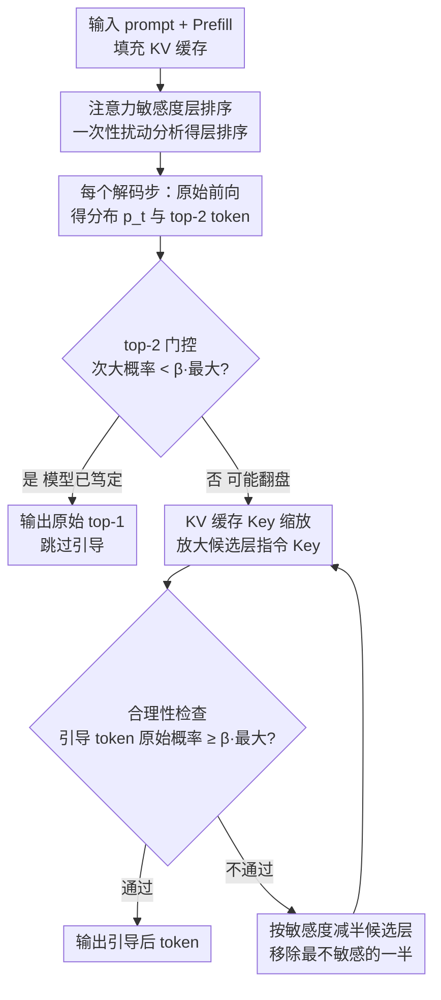

# Enhancing Instruction Following of LLMs via Activation Steering with Dynamic Rejection

**会议**: ICLR 2026  
**arXiv**: [2603.06745](https://arxiv.org/abs/2603.06745)  
**代码**: [有](https://github.com/mjk0618/directer)  
**领域**: 信号/通信  
**关键词**: 激活引导, 指令遵循, KV缓存缩放, 动态拒绝, 过度引导缓解  

## 一句话总结

提出 Directer（Dynamic Rejection Steering），通过在每个解码步动态调节 KV 缓存引导强度并引入合理性约束，显著提升 LLM 指令遵循能力，同时避免过度引导导致的文本质量下降。

## 研究背景与动机

LLM 在指令微调后仍难以完美遵循复杂用户指令。激活引导（Activation Steering）技术通过修改模型内部表示来增强指令遵循，但现有方法存在**过度引导（oversteering）**风险——过度强调指令会降低任务准确性和生成质量。

现有方法的核心问题：

**静态引导强度**：PASTA 和 SpotLight 等方法依赖手动调参的固定超参数，无法适应每个解码步最优引导强度的动态变化

**高预计算成本**：PASTA 需要数百到数千个验证样本做 attention head 的网格搜索，预计算成本接近训练级别

**计算开销大**：SpotLight 在每个解码步需要额外的 softmax 操作，有效地使延迟翻倍

**质量-遵循权衡**：增强指令遵循往往以牺牲任务正确性和文本质量为代价

## 方法详解

### 整体框架

Directer 是一个纯推理时模块，它不去预先调好一个固定的引导强度，而是在每个解码步实时判断"这一步该引导多强"。整体流程是：prompt 完成 prefill 后，先做一次性的注意力敏感度层排序，给所有层排出"谁的引导效果强"的顺序；随后逐步解码，每一步先用一个 top-2 门控廉价判断"这步值不值得引导"，若值得就放大指令 token 在 KV 缓存里的 Key 向量来强化注意，再用合理性检查比对引导前后的输出分布，一旦引导得太狠就按敏感度从低到高逐层收回，直到引导结果"既改了选择又不离谱"为止。

### 关键设计

**1. KV 缓存 Key 缩放：用一次乘法把"注意指令"写进缓存**

激活引导的目标是让模型更关注指令，但直接改 logits 或注意力分数要么需要额外 softmax、要么和 FlashAttention 不兼容。Directer 选择直接对落在指令 token 区间 $\mathcal{I}$、且属于候选层集合 $\mathcal{L}$ 的 Key 向量乘上一个缩放因子 $\alpha$：

$$\mathbf{k'}^{(l)}_i = \begin{cases} \alpha \cdot \mathbf{k}^{(l)}_i, & \text{if } i \in \mathcal{I} \text{ and } l \in \mathcal{L} \\ \mathbf{k}^{(l)}_i, & \text{otherwise} \end{cases}$$

之所以缩放 Key 而不是 Value，是因为 Key 进入注意力打分后还要过一次 softmax，放大效果会被自然归一化、不会失控，因而无需任何额外计算就能放大指令 token 的注意力权重；而且这只是改 KV 缓存里的数值，天然兼容 FlashAttention。缩放因子取 $\alpha=100$，但实测在 $10^1 \sim 10^5$ 这五个数量级内性能几乎不变，等于把这个超参数从调参清单里抹掉了。

**2. 合理性引导解码：每步比对原始分布，引导过头就逐层收回**

静态引导最大的隐患是过度引导（oversteering）——为了遵循格式而牺牲了答案正确性。Directer 在每个解码步先做一次标准前向得到原始分布 $p_t$，再对候选层 $\mathcal{L}_{\text{cand}}$ 施加 Key 缩放得到引导分布 $\tilde{p}_t$，然后检查引导后选出的 token 在原始分布里的概率是否仍然够高：$p_{t,\tilde{i}^*_t} \geq \beta \cdot p_{t,i^*_t}$（阈值 $\beta=0.5$）。这个条件的含义是"引导可以改变模型的选择，但被选中的 token 在没引导时也不能太离谱"。一旦不满足，就把候选层数减半、优先移除敏感度最低的那一半层，再重新引导比对，如此渐进收回直到通过或候选层清空（此时退回原始分布）。这样引导强度就随每一步的把握程度自适应伸缩，既保留了格式遵循又守住了正确性，$\beta$ 在全取值范围内都优于无引导基线。

**3. top-2 门控：先看一眼就知道这步要不要引导**

上面那套循环若每步都跑会很贵。Directer 利用原始分布 top-2 token 的概率做一次廉价预判：若次大 token 的概率已经满足 $p_{t,i^{**}_t} < \beta \cdot p_{t,i^*_t}$，说明模型本来就非常笃定、任何引导都不可能让别的 token 翻盘（除非引导后 top-1 仍是原 top-1），于是直接跳过整个引导尝试。绝大多数解码步都落在这种"高置信"情形，门控因此能砍掉大量无谓计算，让整体吞吐量只比零样本基线低约 16%、比每步都做 softmax 的 SpotLight 快 2 倍以上。

**4. 注意力敏感度层排序：用一次扰动传播决定先收哪些层**

渐进收回需要知道"哪些层引导效果弱、可以先丢"。Directer 在 prompt prefill 之后做一次性分析：对每一层 $\ell$ 单独施加引导，观测它对所有层 $j$ 隐状态的扰动，拆成施加层自身的直接效应与扩散到其它层的传播效应两部分相加：

$$D_j(\ell) = \underbrace{(\text{dist}(\mathbf{H}^{(j)}_{\text{pre}}, \mathbf{H}^{(j,\ell)}_{\text{post}}) - \text{dist}(\mathbf{H}^{(j)}_{\text{pre}}, \mathbf{H}^{(j)}_{\text{post}}))}_{\text{直接效应}} + \underbrace{(\text{dist}(\mathbf{H}^{(j,\ell)}_{\text{pre}}, \mathbf{H}^{(j)}_{\text{post}}) - \text{dist}(\mathbf{H}^{(j)}_{\text{pre}}, \mathbf{H}^{(j)}_{\text{post}}))}_{\text{传播效应}}$$

把一层对全网的扰动求平均得到 $\text{Sensitivity}(\ell) = \frac{1}{L}\sum_{j=1}^{L} D_j(\ell)$，据此从高到低排序。这份排序只算一次，却贯穿后续每个解码步的渐进收回——消融显示把它反转（优先收敏感度高的层）或换成随机层引导都会明显掉点，说明"按敏感度收层"确实抓住了引导的关键。

### 损失函数 / 训练策略

Directer 是纯推理时方法，不引入任何训练或额外数据集，整套机制只剩两个超参数：缩放因子 $\alpha=100$（在 $10^1 \sim 10^5$ 内稳定）与合理性阈值 $\beta=0.5$（全范围优于无引导）。所有任务共用这一套配置，无需任务特定调参，真正做到即插即用。

## 实验关键数据

### 主实验

| 方法 | IFEval P.Acc / I.Acc | LIFBench List/OD/MD | GSM8K-Format F.Acc/T.Acc | 平均 |
|------|---------------------|---------------------|--------------------------|------|
| Zero-shot | 73.5 / 81.5 | 63.4 / 68.6 / 40.9 | 79.2 / 82.7 | 70.0 |
| PASTA* | 76.5 / 83.4 | 61.8 / 66.0 / 47.8 | 98.9 / 62.7 | 71.0 |
| SpotLight* | 76.3 / 83.6 | 61.4 / 70.8 / 38.8 | 95.4 / 78.7 | 72.1 |
| **Directer** | **78.8 / 84.8** | **64.4 / 70.0 / 51.7** | **99.1 / 86.9** | **76.5** |

| 模型规模 | Zero-shot | PASTA* | SpotLight* | Directer |
|----------|-----------|--------|------------|----------|
| Llama-3.2-1B | 61.3 | 59.7 | 60.6 | **61.6** |
| Qwen-2.5-3B | 63.9 | 65.2 | 62.8 | **67.1** |
| Qwen-2.5-7B | 72.4 | 73.0 | 74.9 | **74.4** |
| Qwen-2.5-14B | 81.6 | 80.1 | 81.7 | **83.5** |

### 消融实验

| 变体 | 准确率 |
|------|--------|
| Zero-shot | 77.5 |
| **Directer (完整)** | **81.8** |
| + 排序反转 | 79.0 |
| + 随机层引导 | 80.2±0.7 |
| + 随机 token 引导 | 79.2±1.1 |

### 关键发现

1. **过度引导问题严重**：PASTA 原始设置导致 GSM8K 任务准确率从 82.7% 暴跌至 48.1%，Directer 保持 86.9%
2. **动态优于静态**：固定引导强度中，低强度（ST1/ST2）略有提升但高强度急剧下降，Directer 自适应调节全面超越
3. **合理性约束具有通用性**：作为安全门应用于 PASTA/SpotLight 也能显著改善其过度引导问题
4. **推理效率可控**：吞吐量仅比零射基线低约 16%，比 SpotLight 快 2 倍以上，内存开销可忽略
5. **生成质量与任务保真度最优**：LLM 评审的任务保真度达 ≈92%，文本质量与无干预基线持平

## 亮点与洞察

1. **问题定义精准**：将过度引导识别为激活引导方法的核心瓶颈，而非简单地追求更强的引导
2. **设计极为优雅**：合理性检查 + 渐进减半 + 敏感度排序三者环环相扣，形成自适应闭环
3. **近乎零调参**：α 在 5 个数量级范围稳定，β 全范围优于基线，真正实现即插即用
4. **KV 缓存操作兼容 FlashAttention**：这是注意力级别干预方法不具备的实际优势

## 局限与展望

1. 需要明确的指令区间标注（instruction span），自动化识别指令边界的能力有待探索
2. 层排序基于单次 prefill 分析，对于多轮对话中指令动态变化的场景可能需要更新
3. 实验主要在 Llama 和 Qwen 系列上验证，对 Mixture-of-Experts 等架构的适用性未知
4. 当前仅验证了 greedy decoding，与 sampling 策略的兼容性有待验证

## 相关工作与启发

- **与 PASTA 的关系**：PASTA 通过抑制非指令 token 的注意力分数来实现引导，但需要大量验证样本做 head profiling，且静态配置易过度引导；Directer 无需额外数据集且动态调节
- **与 SpotLight 的关系**：SpotLight 通过 post-softmax logit biasing 维持指令 token 的目标注意力比例，计算量大；Directer 通过 KV 缓存操作实现更高效的引导
- **启发**：合理性引导解码的框架可推广到其他需要平衡干预强度的场景（如安全对齐、风格控制）

## 评分

- 新颖性: ⭐⭐⭐⭐ — 动态拒绝引导机制和注意力敏感度排序均为新颖贡献
- 实验充分度: ⭐⭐⭐⭐⭐ — 多基准、多模型、多消融、效率分析、生成质量评估面面俱到
- 写作质量: ⭐⭐⭐⭐ — 逻辑清晰，公式推导严谨
- 价值: ⭐⭐⭐⭐ — 即插即用的推理时增强模块，实用性强

<!-- RELATED:START -->

## 相关论文

- [\[CVPR 2026\] AcTTA: Rethinking Test-Time Adaptation via Dynamic Activation](../../CVPR2026/signal_comm/actta_rethinking_test-time_adaptation_via_dynamic_activation.md)
- [\[NeurIPS 2025\] Angular Steering: Behavior Control via Rotation in Activation Space](../../NeurIPS2025/signal_comm/angular_steering_behavior_control_via_rotation_in_activation_space.md)
- [\[CVPR 2026\] MERLIN: Building Low-SNR Robust Multimodal LLMs for Electromagnetic Signals](../../CVPR2026/signal_comm/merlin_building_low-snr_robust_multimodal_llms_for_electromagnetic_signals.md)
- [\[ICML 2025\] Fourier Position Embedding: Enhancing Attention's Periodic Extension for Length Generalization](../../ICML2025/signal_comm/fourier_position_embedding_enhancing_attentions_periodic_extension_for_length_ge.md)
- [\[ACL 2025\] WirelessMathBench: A Mathematical Modeling Benchmark for LLMs in Wireless Communications](../../ACL2025/signal_comm/wirelessmathbench_a_mathematical_modeling_benchmark_for_llms_in_wireless_communi.md)

<!-- RELATED:END -->
