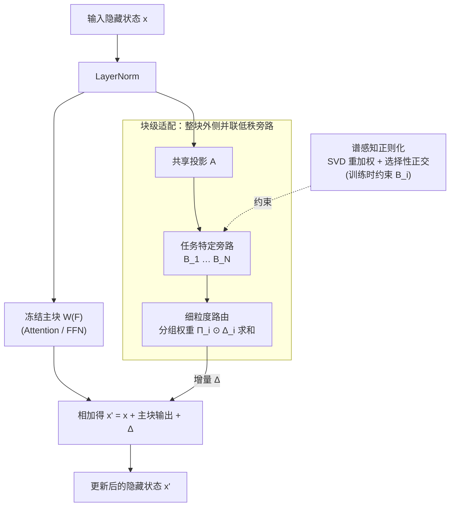

# Scalable Multi-Task Low-Rank Model Adaptation

**会议**: ICLR 2026  
**arXiv**: [2603.01526](https://arxiv.org/abs/2603.01526)  
**代码**: [GitHub](https://github.com/doem97/ICLR26_mtLoRA)  
**领域**: 社会计算  
**关键词**: LoRA, multi-task learning, spectral-aware regularization, block-level adaptation, fine-grained routing

## 一句话总结

系统分析多任务 LoRA 在任务数量增大时崩溃的根因（均匀正则化破坏共享知识 + 组件级 LoRA 放大梯度冲突），提出 mtLoRA：谱感知正则化 + 块级适配 + 细粒度路由，在 15-25 个任务上平均超越 SOTA 2.3%，同时减少 47% 参数和 24% 训练时间。

## 研究背景与动机

1. LoRA 在单任务适配中表现优异，但现实部署常需用一个模型同时处理大量任务（15-25+），此时多任务 LoRA 会出现灾难性崩溃——DOTA 从 5 任务的 88.2% 骤降到 15 任务的 2.0%。
2. 崩溃表现为两种不对齐：**参数不对齐**（不同 LoRA 模块的权重更新方向相互冲突，即梯度对抗）和 **表示不对齐**（各 LoRA 模块的输出特征发散）。
3. 现有两类方法各自失效：正则化方法（Task Arithmetic、TIES-Merging）强行让任务正交，路由方法（MoLE、HydraLoRA）动态挑选专家，但都没能在任务数变大时守住性能。
4. 关键发现是正则化与路由之间存在 **根本权衡**——增强正则化能减少冲突，却同时损害路由效果（routing entropy 从 2.6 升至 2.7），二者达到 Pareto 前沿后便无法再进。
5. 根因分析揭示两点：(1) 跨任务共享的知识集中在高奇异值分量（top-20% 分量贡献了 89% 的跨任务对齐），而均匀正则化把这些共享知识也一并破坏了；(2) 组件级（$W_q, W_v$）LoRA 让梯度穿过 Attention 内部放大冲突，把适配抬到块级可减少 76% 冲突。

## 方法详解

### 整体框架

mtLoRA 沿用 HydraLoRA 的非对称底座（一个共享投影 $A$ 配多个任务特定的 $B_i$），但在三个层面同时下手化解多任务崩溃：用谱感知正则化保护共享知识、把适配从组件级抬到块级以斩断梯度对抗、再用细粒度路由让不同特征维度各取所需的 LoRA 组合。三者分别对应根因分析揭示的"正则化破坏共享、组件级放大冲突、标量路由表达力不足"三个痛点。前向时，输入经 LayerNorm 后兵分两路：冻结主块照常计算，旁路则在块级外侧用共享 $A$ 投影、多个任务特定 $B_i$ 分别变换、再由细粒度路由加权组合出低秩增量 $\Delta$，最后与主块输出相加；谱感知正则化作为训练时的损失约束作用在 $B_i$ 上。

### 关键设计

**1. 谱感知正则化：只去噪低奇异值，放过承载共享知识的高奇异值**

均匀正则化之所以伤害多任务性能，是因为它把所有方向一视同仁地推向正交，而根因分析发现跨任务共享的知识恰恰集中在高奇异值分量（top-20% 分量贡献了 89% 的跨任务对齐）。mtLoRA 的做法是先对每个 $B_i$ 做 SVD 拿到奇异值谱 $\{\sigma_k\}$，再用权重函数 $w(\sigma) = \exp(-\sigma/\bar{\sigma})$ 构造重加权矩阵 $B'_i$，把正交约束写成 $\mathcal{L}_{spectral} = \lambda \sum_{i<j} \|(B'_i)^T B'_j\|_F^2$。这个指数权重是连续自适应的：当 $\sigma \ll \bar{\sigma}$ 时权重趋近 1，低奇异值方向被强制正交化、起到去噪作用；当 $\sigma \gg \bar{\sigma}$ 时权重趋近 0，高奇异值方向几乎不受惩罚，跨任务共享的主方向得以保留，因此无需人工设定奇异值阈值。实验证实这种选择性确实生效——低奇异值分量被抑制约 3 倍（-6.0%），而高奇异值分量几乎不动（-2.0%）。

**2. 块级适配：把 LoRA 从注意力组件挪到整块旁路，斩断 Softmax 引发的跨 token 竞争**

传统做法把 LoRA 插在 $W_q, W_v$ 等组件上，梯度会穿过 Attention 内部的 Softmax 反传，从而制造跨 token 的耦合——增大 "bank"→"money" 的注意力会自动压低 "bank"→"river"，这种竞争在任务一多时被急剧放大。mtLoRA 改为在整个 Attention/FFN 块外侧并联一条更新路径 $x' = x + W^{(F)}(\text{LN}(x)) + \Delta(\text{LN}(x))$，让 LoRA 的增量 $\Delta$ 与主块内部的非线性解耦。因为更新不再经过 Softmax 归一化，跨 token 的此消彼长被消除，根因分析量化出梯度冲突减少 76%；同时块级路径合并了原本分散在多个组件上的低秩矩阵，参数量反而减少约 50%，是效率与效果双赢的一步。

**3. 细粒度路由：给每个 LoRA 分维度的路由向量，而非一个标量门控**

标量路由假设一个 LoRA 对当前输入"要么用要么不用"，但不同特征子空间往往偏好不同的专家——"创造力"维度更需要 brainstorming LoRA，"事实性"维度更需要 QA LoRA，单一标量无法表达这种异质性。mtLoRA 让路由器为每个 LoRA 输出一个分组权重向量 $\Pi_i \in \mathbb{R}^g$（把隐藏维度切成 $g$ 组），最终组合为 $\sum_{i=1}^N \Pi_i(x) \odot \Delta_i(x)$，即分组逐元素相乘后求和。路由器本身是一个 2 层 MLP，输入为平均池化的隐藏状态，输出 $N \times g$ 维权重并 softmax 归一化。$g$ 越大粒度越细：消融中 $g$ 从 1 增到 32，平均分数从 38.5 升到 39.9。

### 损失函数 / 训练策略

总体目标把任务损失、谱感知正交损失与负载均衡损失加权相加：

$$\mathcal{L} = \mathcal{L}_{task} + \lambda_1 \mathcal{L}_{spectral} + \lambda_2 \mathcal{L}_{balance}$$

其中 $\mathcal{L}_{spectral}$ 因为要做 SVD，每个 epoch 只计算一次以摊薄开销；$\mathcal{L}_{balance}$ 是防止路由崩溃（所有样本都挤向少数专家）的负载均衡项。两个正则项分别对应"保护共享知识"和"维持路由多样性"，与根因分析揭示的正则化-路由权衡一一对应。

## 实验关键数据

### 主实验

15-25 任务大规模多任务评估：

| 方法 | 参数量 | DOTA(15) | iNat2018(25) | Dolly-15k(16) | BBH(27) | 平均 |
|------|--------|----------|-------------|--------------|---------|------|
| HydraLoRA | 75.5M (1.11%) | 89.0 | 78.3 | 41.6 | 35.5 | 61.1 |
| **mtLoRA** | **39.8M (0.59%)** | **91.0** | **81.5** | **44.5** | **38.5** | **63.9** |

### 消融实验

各组件贡献（基于 HydraLoRA 基线）：

| 组件组合 | 参数量 | 训练时间 | DOTA | BBH | 平均 |
|----------|--------|---------|------|-----|------|
| 基线 HydraLoRA | 75.5M | 1.00x | 89.0 | 35.5 | 61.1 |
| +Block-Level | 37.7M | 0.67x | 91.2 | 37.9 | 63.2 |
| +Block+Spectral | 37.7M | 0.70x | 91.7 | 38.4 | 63.8 |
| +Block+Fine-grained | 39.8M | 0.69x | 89.9 | 38.2 | 63.1 |
| 全部 (mtLoRA) | 39.8M | 0.76x | 91.0 | 38.5 | 63.9 |

路由粒度消融：

| 策略 | 分组 $g$ | Dolly-15k | BBH | 平均 |
|------|---------|-----------|-----|------|
| 标量路由 | 1 | 41.6 | 35.5 | 38.5 |
| 细粒度 | 2 | 41.6 | 37.0 | 39.3 |
| 细粒度 | 32 | **42.0** | **37.7** | **39.9** |

### 关键发现

1. 多任务 LoRA 崩溃极为严重：DOTA 5→15 任务从 88.2% 骤降到 2.0%，iNat 1→100 从 87.0% 降到 0.3%
2. 块级适配贡献最大（+2.1%），同时减少 50% 参数——是效率和效果双赢的设计
3. 谱感知正则化 + 细粒度路由合计额外贡献 +0.7%，在 NLP 任务上尤为显著（+2.9%）
4. mtLoRA 在所有难度任务上都一致提升：Easy +1.6%, Medium +3.5%, Hard +0.4%
5. 均匀正则化 + 动态路由达到 Pareto 前沿后无法继续提升，mtLoRA 通过谱感知打破了这一权衡

## 亮点与洞察

1. **首次系统分析多任务 LoRA 扩展性失败的根因**：揭示共享知识集中在高 SV、均匀正则化破坏共享知识的机制
2. **块级适配的简洁优势**：仅通过提升 LoRA 的放置层级（从组件到块），就同时减少 76% 梯度冲突和 50% 参数
3. **效率-效果 Pareto 改进**：+2.8% 性能提升伴随 47% 参数减少和 24% 训练时间节省
4. **谱感知权重函数设计巧妙**：$w(\sigma) = \exp(-\sigma/\bar{\sigma})$ 连续自适应，无需手动设定 SV 阈值
5. 视觉 + NLP 双域验证，证明方法的通用性

## 局限与展望

1. 块级 LoRA 直接绕过了注意力层内部非线性，可能在需要细粒度注意力调整的任务上表现有限
2. 实验基于固定 rank=16 的 LoRA，不同 rank 下的表现缺乏探讨
3. 细粒度路由引入的额外参数（$g=32$ 时 +1.93%）在更大规模模型上的开销需要评估
4. 谱感知正则化每 epoch 需要做一次 SVD，任务数和模型规模大时可能成为瓶颈
5. 评估指标以 accuracy 为主，缺乏对生成质量（如 BLEU、ROUGE）的全面评估

## 相关工作与启发

- **HydraLoRA**（Tian et al., 2024）：非对称结构的先驱（共享 A、多任务 B），mtLoRA 在此基础上扩展
- **MoLE**（Wu et al., 2024）：Top-K 路由 + 均衡损失，但未解决正则化-路由权衡
- **AlphaEdit / SPHERE**（Fang et al., 2025）：在知识编辑中使用类似的"保护主方向"思路
- 启发：谱感知正则化思路可推广到 LoRA 合并（model merging）和持续学习场景

## 评分

- **新颖性**: ⭐⭐⭐⭐ 三个设计各有创新，谱感知正则化的洞察尤为出色，但块级适配的灵感来源较为自然
- **实验充分度**: ⭐⭐⭐⭐⭐ 四个大规模基准（15-25 任务）、充分消融、视觉+NLP 双域、效率分析一应俱全
- **写作质量**: ⭐⭐⭐⭐ Figure 1 的三个 motivating observations 可视化清晰有说服力，整体结构好
- **价值**: ⭐⭐⭐⭐⭐ 首次使多任务 LoRA 在 15+ 任务上可用，实际部署价值极高，开源代码可直接使用

<!-- RELATED:START -->

## 相关论文

- [\[ICLR 2026\] Adaptive Debiasing Tsallis Entropy for Test-Time Adaptation](adaptive_debiasing_tsallis_entropy_for_test-time_adaptation.md)
- [\[ICLR 2026\] BiasFreeBench: a Benchmark for Mitigating Bias in Large Language Model Responses](biasfreebench_a_benchmark_for_mitigating_bias_in_large_language_model_responses.md)
- [\[ACL 2026\] Synthia: Scalable Grounded Persona Generation from Social Media Data](../../ACL2026/social_computing/synthia_scalable_grounded_persona_generation_from_social_media_data.md)
- [\[CVPR 2025\] As Language Models Scale, Low-order Linear Depth Dynamics Emerge](../../CVPR2025/social_computing/as_language_models_scale_low-order_linear_depth_dynamics_emerge.md)
- [\[ICLR 2026\] Functional Embeddings Enable Aggregation of Multi-Area SEEG Data for Robust BCI](functional_embeddings_enable_aggregation_of_multi-area_seeg_data_for_robust_bci.md)

<!-- RELATED:END -->
