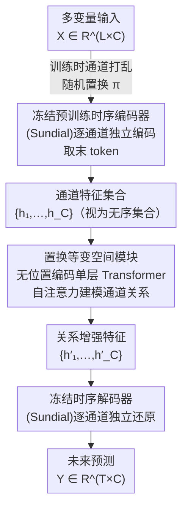

# CPiRi: Channel Permutation-Invariant Relational Interaction for Multivariate Time Series Forecasting

**会议**: ICLR 2026  
**arXiv**: [2601.20318](https://arxiv.org/abs/2601.20318)  
**代码**: [https://github.com/JasonStraka/CPiRi](https://github.com/JasonStraka/CPiRi)  
**领域**: 时间序列  
**关键词**: 多变量时间序列预测, 通道置换不变性, 时空解耦, 基础模型, 通道交互

## 一句话总结
提出 CPiRi 框架，通过冻结预训练时序编码器 + 可训练置换等变空间模块 + 通道打乱训练策略，在不牺牲跨通道建模能力的前提下实现通道排序不变性（CPI），在多个交通基准上达到 SOTA。

## 研究背景与动机

1. **领域现状**：多变量时间序列预测（MTSF）分为两大范式——通道依赖（CD）模型学习跨通道特征，通道独立（CI）模型独立处理每个通道。
2. **现有痛点**：CD 模型（如 Informer、Crossformer）实际上在记忆通道的固定位置顺序，而非学习语义关系。一旦推理时通道被重排或新增，性能会灾难性崩溃（Informer 在 PEMS-08 上误差暴增 >400%）。CI 模型虽然天然对通道顺序免疫，但完全忽略跨通道依赖，限制了预测性能。
3. **核心矛盾**：CD 模型捕获交互但缺乏鲁棒性，CI 模型保证鲁棒性但放弃了关系推理——两者无法兼得。
4. **本文要解决什么**：如何在建模跨通道关系的同时，保持通道排列不变性（CPI），使模型能部署在通道动态变化的真实场景中？
5. **切入角度**：作者观察到 CI 和 CD 的优势是互补的——如果将时序特征提取与空间关系建模彻底解耦，就可以分别继承两者的优势。再通过训练时通道打乱，强制空间模块学习基于内容而非位置的关系。
6. **核心 idea 一句话**：用冻结的基础模型做时序编码（CI 优势），用置换等变的 Transformer 空间模块学跨通道关系（CD 优势），通道打乱训练策略强制内容驱动的关系推理。

## 方法详解

### 整体框架
CPiRi 要解决的是一个两难：通道依赖（CD）模型能建模跨通道关系却把"通道在第几位"当特征记死、一旦重排就崩，通道独立（CI）模型对通道顺序免疫却完全放弃了关系推理。它的破局思路是把"时序特征提取"和"跨通道关系建模"彻底解耦成串行三段。输入 $\mathcal{X} \in \mathbb{R}^{L \times C}$（$L$ 个时间步、$C$ 个通道），先由一个**冻结的 Sundial 预训练编码器**逐通道独立抽取时序特征——逐通道处理天生继承 CI 的顺序免疫；中间插一个**可训练的置换等变空间模块**，把各通道特征当无序集合做自注意力，学内容驱动的跨通道关系——补回 CD 的交互能力；最后由**冻结的 Sundial 解码器**逐通道独立还原出未来 $T$ 步预测 $\mathcal{Y} \in \mathbb{R}^{T \times C}$。整个流程只有中段那块小模块参与训练，且训练时对通道做随机打乱，逼它学到与排序无关的关系。

### 关键设计

**1. 冻结的预训练时序编码器：把 CI 的鲁棒性和大模型先验一次拿下**

CD 模型的脆弱根源在于时序提取和跨通道建模纠缠在一起，一旦联合训练就容易把"通道在第几位"当成特征记下来。CPiRi 干脆把时序提取交给一个冻结的 Sundial 基础模型编码器，对每个通道独立编码出特征向量 $\mathbf{h}_i \in \mathbb{R}^D$（取序列末 token 而非均值池化，消融里末 token 把 PEMS-08 的 WAPE 从 12.42% 压到 9.43%）。逐通道独立处理天生对通道顺序免疫，继承了 CI 的噪声免疫优势；而冻结大规模预训练权重一方面把海量数据上学到的时序先验迁移过来缓解 MTSF 数据稀缺，另一方面避免在小数据集上过拟合——消融显示编码器若解冻反训会掉到 10.80%，若换成随机初始化更是灾难性崩到 52.29%，证明这两点缺一不可。

**2. 置换等变空间模块：用无位置编码的自注意力把跨通道关系做成内容驱动**

拿到所有通道特征后，CPiRi 把 $\{\mathbf{h}_1, \ldots, \mathbf{h}_C\}$ 当成一个**无序集合**喂进单层 Transformer encoder block，靠自注意力建模通道两两关系。关键是不加任何位置编码，于是整个模块严格满足置换等变：$f(\mathbf{h}_{\pi(1)}, \ldots, \mathbf{h}_{\pi(C)}) = (f(\mathcal{H})_{\pi(1)}, \ldots, f(\mathcal{H})_{\pi(C)})$，输入怎么排，输出就对应地怎么排，关系只能从特征内容里读出来而非从通道位置背出来。因为注意力只在 $C$ 个通道之间做，复杂度是 $O(C^2)$，远低于 iTransformer 把时间和通道拼在一起的 $O((T \times C)^2)$，这也是它能扩到 8600 通道的原因。

**3. 通道打乱训练策略：用随机排列正则化堵死所有位置捷径**

自注意力虽然结构上等变，但随机初始化和梯度噪声仍可能让模型偷偷学到微弱的位置依赖。CPiRi 在每个训练 batch 对输入和目标同步施加随机通道排列 $\pi \leftarrow \Pi_C$，把目标改写成 $\min_\theta \mathbb{E}_{(\mathcal{X},\mathcal{Y})\sim\mathcal{D},\pi\sim\Pi_C}[\mathcal{L}(f_\theta(\mathcal{X}_\pi), \mathcal{Y}_\pi)]$。任何依赖固定排序的非等变成分在绝大多数排列下都会吃高损失，优化自然把参数推向真正等变的解。这相当于元学习里对"任务分布"采样——模型训练时就见遍了所有排列，学到的是排列无关的关系推理元技能；消融显示去掉打乱后 WAPE 掉 0.65%，但更重要的是这一步把 100% 通道打乱下的性能波动从 Informer 的 >400% 压到 <0.25%。

### 损失函数 / 训练策略
训练用标准 MSE/MAE 损失，回看与预测窗口均设 $L = T = 336$；只更新中段空间模块的参数，编码器和解码器全程冻结。空间模块 dropout 调到 0.3 以鼓励稀疏的通道关系，每个 batch 都重新采一个通道排列，等效于元学习中持续刷新的任务分布。

## 实验关键数据

### 主实验
在 5 个交通数据集上与 CI 和 CD 模型对比，CPiRi 在 4/5 数据集上达到 SOTA：

| 数据集 | 指标 | CPiRi | iTransformer | STID | PatchTST (CI) | 提升 |
|--------|------|-------|-------------|------|--------------|------|
| PEMS-BAY | WAPE | **3.90%** | 4.21% | 3.91% | 4.87% | vs iT: -7.4% |
| PEMS-04 | WAPE | **11.67%** | 12.99% | 12.43% | 15.54% | vs STID: -6.1% |
| PEMS-08 | WAPE | **9.43%** | 10.70% | 10.90% | 12.37% | vs iT: -11.9% |
| SD | WAPE | **12.25%** | 12.45% | 12.51% | 13.41% | vs iT: -1.6% |
| Electricity | WAPE | **9.90%** | 10.67% | 10.65% | 10.68% | vs STID: -7.0% |

### 消融实验

| 配置 | PEMS-08 WAPE | 说明 |
|------|-------------|------|
| CPiRi (完整) | 9.43% | 完整模型 |
| w/o 时空解耦 (encoder 不冻结) | 10.80% | 掉 1.37%，过拟合 |
| w/o 打乱策略 | 10.08% | 掉 0.65%，丧失 CPI |
| w/o 预训练权重 | 52.29% | 灾难性崩溃 |
| 3 层 encoder from scratch | 11.17% | 明显不如冻结预训练 |
| 冻结 Chronos-2 encoder | 13.16% | Chronos 短期预测设计，不适配 |
| w/o 空间模块 | 22.69% | 退化为 CI，大幅下降 |
| 均值池化替代末 token | 12.42% | 末 token 优于平均聚合 |

### 关键发现
- **通道打乱鲁棒性**：CPiRi 在 100% 通道打乱下 WAPE 仅变化 <0.25%，而 Informer 暴增 >400%，STID 暴增 >235%
- **归纳泛化**：仅用 25% 通道训练，在全部通道上测试，准确率仅下降约 2%，训练时间减少 70%
- **大规模可扩展**：在 CA 数据集（8600 通道）上，CPiRi 推理仅 0.41s/样本、8GB 显存，Timer-XL 需 75.68GB

## 亮点与洞察
- **时空彻底解耦的设计哲学**非常巧妙：冻结编码器既迁移了预训练先验又天然保证了 CI 属性，而空间模块只需聚焦于关系学习这一个任务。这种模块化设计使得两个子问题（时序建模和通道交互）可以独立优化
- **通道打乱作为正则化**本质上是一种元学习思想——让模型在训练时就见过所有可能的排列，学到的关系推理能力是排列无关的。这个 trick 可迁移到任何需要集合输入的场景（如点云处理、图节点分类）
- **CPI 诊断测试**本身就是一个有价值的贡献——用它可以快速暴露现有 CD 模型的位置记忆缺陷

## 局限性 / 可改进方向
- METR-LA 上未达 SOTA，因为 STID/Crossformer 利用了外生节假日特征——CPiRi 目前只处理纯序列数据，缺乏外生变量接口
- 高度依赖 Sundial 预训练基础模型的质量——换用 Chronos-2 编码器性能明显下降，说明框架对编码器选择敏感
- 空间模块目前只有单层 Transformer block，对于超大规模通道（>8000）的复杂关系可能建模不足
- 未探索动态图结构学习——当前自注意力隐式学习全连接关系，但许多真实场景中通道关系是稀疏的

## 相关工作与启发
- **vs iTransformer**: iTransformer 在每层内做时空联合注意力，复杂度 $O((T \times C)^2)$，虽然也是 CPI 的但代价高；CPiRi 通过解耦把空间注意力降到 $O(C^2)$
- **vs PatchTST**: PatchTST 是 CI 模型的代表，天然 CPI 但完全忽略跨通道关系；CPiRi 在继承其鲁棒性的同时增加了关系建模
- **vs STID**: STID 用固定 spatial ID embedding，本质是记忆位置；CPiRi 用内容驱动的动态关系

## 评分
- 新颖性: ⭐⭐⭐⭐ 时空解耦+通道打乱的组合思路新颖，但单个组件（冻结编码器、自注意力等变性）并非全新
- 实验充分度: ⭐⭐⭐⭐⭐ 5 个基准 + 大规模扩展 + 渐进打乱 + 部分通道训练 + 详细消融，非常全面
- 写作质量: ⭐⭐⭐⭐⭐ 理论分析清晰（等变性证明），实验设计系统性强，CPI 诊断测试是亮点
- 价值: ⭐⭐⭐⭐ 解决了一个实际部署中的重要问题（传感器动态变化），且方案简洁高效

<!-- RELATED:START -->

## 相关论文

- [\[ICLR 2026\] Relational Transformer: Toward Zero-Shot Foundation Models for Relational Data](relational_transformer_toward_zero-shot_foundation_models_for_relational_data.md)
- [\[ICLR 2026\] T1: One-to-One Channel-Head Binding for Multivariate Time-Series Imputation](t1_one-to-one_channel-head_binding_for_multivariate_time-series_imputation.md)
- [\[ICML 2025\] Channel Normalization for Time Series Channel Identification](../../ICML2025/time_series/channel_normalization_for_time_series_channel_identification.md)
- [\[ICLR 2026\] Towards Generalizable PDE Dynamics Forecasting via Physics-Guided Invariant Learning](towards_generalizable_pde_dynamics_forecasting_via_physics-guided_invariant_lear.md)
- [\[ICLR 2026\] Routing Channel-Patch Dependencies in Time Series Forecasting with Graph Spectral Decomposition](routing_channel-patch_dependencies_in_time_series_forecasting_with_graph_spectra.md)

<!-- RELATED:END -->
