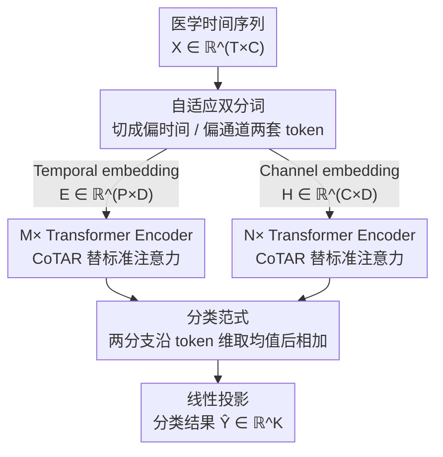

# Decentralized Attention Fails Centralized Signals: Rethinking Transformers for Medical Time Series

**会议**: ICLR 2026 Oral  
**arXiv**: [2602.18473](https://arxiv.org/abs/2602.18473)  
**代码**: [https://github.com/Levi-Ackman/TeCh](https://github.com/Levi-Ackman/TeCh)  
**领域**: 时间序列  
**关键词**: 医学时间序列, Transformer, 通道依赖, 核心Token, 线性复杂度

## 一句话总结
提出 TeCh 框架，核心是用 CoTAR（Core Token Aggregation-Redistribution）模块替代 Transformer 中的标准注意力来建模医学时间序列的通道依赖——通过引入全局"核心 token"充当代理，先聚合所有通道信息再重分配回每个通道，复杂度从 $O(n^2)$ 降至 $O(n)$，在 APAVA 数据集上精度 86.86%（超 Medformer 12.13%），内存仅 33%、推理时间仅 20%。

## 研究背景与动机

**领域现状**：医学时间序列（EEG/ECG）分析需要同时建模两种关键模式——时间依赖（单通道内的时间动态）和通道依赖（多通道间的交互）。近年 Transformer 在时间依赖建模上表现优异（Medformer、PatchTST 等），但通道依赖建模仍是短板。

**现有痛点**：Transformer 的标准注意力是"去中心化"的——每个 token 与所有其他 token 直接交互（peer-to-peer），但医学信号本质上是"中心化"的：EEG 由丘脑-皮质回路集中控制、ECG 由窦房结统一协调。这种结构性不匹配导致注意力机制倾向于稀释中枢驱动的主模式。

**核心矛盾**：问题不在于注意力不够强大，而在于其去中心化架构与中心化信号之间存在根本性的结构不匹配。当每个通道都可以被噪声通道直接影响时，集中协调的信号模式会被淹没。

**本文目标**（a）设计一种匹配中心化信号结构的通道交互机制；（b）将计算复杂度从二次降至线性；（c）自适应处理不同数据集中时间/通道依赖的不同重要性。

**切入角度**：受分布式系统中星型架构启发——传统 P2P 通信低效，设立中央服务器聚合和分发信息更高效可靠。类比到医学信号：设一个"核心 token"代理所有通道间的通信。

**核心 idea**：用全局核心 token 代理替代 peer-to-peer 注意力——所有通道先聚合到核心 token，再由核心 token 重分配回每个通道，模拟中枢系统的信号传播模式。

## 方法详解

### 整体框架
TeCh 想解决的是：医学信号本质由中枢统一驱动，可标准注意力却把每个通道当成平等节点彼此乱串，结果把噪声通道也直接灌进了主模式。它的破法是把"通道之间怎么通信"这件事整个换掉。输入是一段医学时间序列 $X \in \mathbb{R}^{T \times C}$（$T$ 个时间步、$C$ 个通道），先经**自适应双分词**切成两套 token——一套侧重时间、一套侧重通道，分别送进 $M$ 个和 $N$ 个 Transformer Encoder。这些 Encoder 的骨架不变，唯独把标准注意力换成 **CoTAR** 模块。最后**分类范式**把两个分支的输出在通道维度取均值后相加，再过一个线性层投影成分类结果 $\hat{Y} \in \mathbb{R}^K$。$M$、$N$ 都是可调的，把其中一个设为 0 就等于直接砍掉对应分支，这给了模型按数据特性伸缩的余地。

### 关键设计

**1. 自适应双分词：同时备齐偏时间和偏通道两套表示，按数据集自己挑**

医学数据里时间依赖和通道依赖的相对重要性差别很大，单一分词方式必然在某些数据集上吃亏，这个设计就是为了把两种视角都备齐。Temporal embedding 把连续 $L$ 个时间步跨所有通道展平后再嵌入，得到 $E \in \mathbb{R}^{P \times D}$（$P = \lceil T/L \rceil$），更擅长抓时间动态；Channel embedding 则把每个通道的整条时间序列整体嵌入成 $H \in \mathbb{R}^{C \times D}$，保留单通道的完整语义，更擅长抓通道间交互。

之所以两套都要，是因为偏好确实因数据而异：TDBrain 几乎只靠时间依赖（单 Temporal 分支就到 93.21%），PTB 几乎只靠通道依赖（单 Channel 分支就到 85.96%），而 APAVA 两者缺一不可（Dual 比任一单分支高出 11% 以上）。靠调节 $M$、$N$ 的比例，模型就能自适应地贴合不同数据集的结构。

**2. CoTAR：用一个全局核心 token 当"中央服务器"，替掉 peer-to-peer 注意力**

这是全篇的核心，针对的痛点正是标准注意力的去中心化结构——$QK^T$ 让每个 token 和所有 token 直接交互，一个噪声通道可以毫无阻拦地污染其他所有通道。CoTAR（Core Token Aggregation-Redistribution，核心 token 聚合-重分配）借用分布式系统里的星型拓扑思路：不让通道两两直连，而是设一个核心 token 充当中转站，所有通信都得先汇总到它、再由它分发回去。它直接替换掉上面两套分词送进 Encoder 后的标准注意力层。

具体分两步。聚合阶段：给定输入 $O \in \mathbb{R}^{S \times D}$，先用 MLP 投影成 $\tilde{O} \in \mathbb{R}^{S \times D_c}$，沿 token 维度做 Softmax 得到一组权重 $O_w$，再加权求和把所有 token 压成单个核心 token $\tilde{C_o} \in \mathbb{R}^{D_c}$——这一步相当于"全体通道先把信息上交给中枢"。重分配阶段：把核心 token Repeat 回每个 token 位置，与原始 $O$ 拼接后过另一个 MLP，输出 $A \in \mathbb{R}^{S \times D}$——相当于"中枢再把整合后的全局状态广播回每个通道"。整个过程只有矩阵-向量乘法，没有 $S \times S$ 的注意力矩阵，复杂度因此从 $O(S^2)$ 降到 $O(S)$。

这样换来的好处不止是省算力：噪声通道现在只能先进核心 token、再间接影响别人，中枢这一层天然起到了缓冲，所以 CoTAR 对加噪比标准注意力鲁棒得多。

**3. 分类范式：两分支表示直接相加再投影，融合不引入额外参数**

最后要把两条分支经 CoTAR Encoder 处理后的信息合到一起出结果。Temporal 分支输出 $O_{te}$ 沿 token 维度取均值得 $\tilde{O}_{te}$，Channel 分支同样得到 $\tilde{O}_{ch}$，两者相加后过线性层：

$$\hat{Y} = (\tilde{O}_{te} + \tilde{O}_{ch})W_y + b_y$$

选最朴素的加法融合是有意为之——它不带任何新参数，又允许在 $M=0$ 或 $N=0$ 时干净地退化成单分支，刚好和上面双分词的"按数据集伸缩"配套。

### 损失函数 / 训练策略
- 采用 Subject-Independent 协议：按受试者划分训练/验证/测试集，确保泛化到未见患者
- 5 个随机种子取均值和标准差
- 以验证集 F1 score 最优保存模型

## 实验关键数据

### 主实验

| 数据集 | 任务 | TeCh Acc | Medformer Acc | Avg 提升 |
|--------|------|---------|-------------|---------|
| APAVA (EEG, 2类) | 阿尔茨海默诊断 | **86.86±1.09** | 78.74±0.64 | +9.59% |
| TDBrain (EEG, 2类) | 帕金森诊断 | **93.21±0.61** | 89.62±0.81 | +4.26% |
| ADFTD (EEG, 3类) | 痴呆分类 | **54.54±0.70** | 53.27±1.54 | ~持平 |
| PTB (ECG, 2类) | 心梗诊断 | **85.96±2.52** | 83.50±2.01 | +5.92% |
| PTB-XL (ECG, 5类) | 心脏疾病分类 | **73.53±0.07** | 72.87±0.23 | +0.67% |
| FLAAP (HAR, 10类) | 人体活动识别 | **80.60±0.30** | 76.44±0.64 | +3.81% |
| UCI-HAR (HAR, 6类) | 人体活动识别 | **94.15±0.96** | 89.62±0.81 | +3.41% |

效率对比（APAVA, batch=128）：TeCh 仅用 Medformer **33% 内存**和 **20% 推理时间**。

### 消融实验

**双分词消融（Table 4）**：

| 配置 | APAVA Acc | APAVA F1 | TDBrain Acc | PTB Acc |
|------|----------|---------|------------|--------|
| w/o（无分词） | 50.68 | 50.13 | 53.79 | 72.62 |
| Temporal only | 55.93 | 53.71 | **93.21** | 74.74 |
| Channel only | 75.68 | 73.54 | 67.58 | **85.96** |
| Dual（完整） | **86.86** | **86.30** | 89.79 | 84.15 |

**CoTAR 消融（Table 5）**：

| 配置 | APAVA Acc | APAVA F1 | TDBrain Acc | UCI-HAR Acc |
|------|----------|---------|------------|------------|
| w/o CoTAR | 83.31 | 81.99 | 92.69 | 92.40 |
| Attention替代 | 83.42 | 82.09 | 90.40 | 93.13 |
| CoTAR（完整） | **86.86** | **86.30** | **93.21** | **94.15** |

### 关键发现
- **CoTAR 比标准注意力一致性更好**：在所有 5 个数据集上 CoTAR 均优于 Attention，且标准差更低（整体 0.86 vs 0.96，降低 10.42%），说明中心化结构更稳定
- **Dual 分词在 APAVA 上提升巨大**（+31% Acc vs Temporal only），说明脑电数据同时依赖时间和通道模式，单一分词会丢失关键信息
- **不同数据集偏好不同分词**：TDBrain 偏好 Temporal（93.21%），PTB 偏好 Channel（85.96%），验证了自适应设计的必要性
- **噪声鲁棒性实验**：在 PTB 末通道逐步加入高斯噪声（$\beta$ 从 0 到 20），注意力的 F1 急剧下降，CoTAR 下降缓慢——因为去中心化结构让噪声直接传播，而中心化结构的核心 token 起到了缓冲作用

## 亮点与洞察
- **结构性不匹配的深刻洞察**：不是"注意力不够好"，而是其去中心化 peer-to-peer 架构根本不适合中心化组织的生理信号。这个观察可以推广到任何具有中心化源的信号（如 fMRI、传感器网络）
- **CoTAR 的"星型代理"设计极其优雅**：仅用 MLP + Softmax 加权求和 + Repeat 拼接，就实现了从二次到线性的复杂度降低，同时精度还大幅提升。这个设计思路可以迁移到任何需要高效全局交互的场景
- **核心 token 的可解释性**：t-SNE 可视化显示核心 token 在时间和通道空间中都占据中心位置，且类别可分——它学到了类似"全局生理状态摘要"的表示，这与大脑全局工作空间理论和心脏起搏器同步机制高度吻合

## 局限与展望
- 核心 token 维度 $D_c$ 是固定超参数，对不同数据集可能需要调优，缺乏自适应确定 $D_c$ 的机制
- 仅在分类任务上验证，未涉及预测/异常检测等其他 MedTS 任务
- ADFTD 三分类上仅与 Medformer 持平（54.54 vs 53.27），在高类别不平衡场景下的表现需进一步验证
- 双分支的 $M$/$N$ 需要手动调节，可以考虑 NAS 或自适应门控

## 相关工作与启发
- **vs Medformer**：同样关注 MedTS 通道依赖，但 Medformer 仍用标准注意力，TeCh 替换为 CoTAR 后精度更高且效率大幅提升
- **vs iTransformer**：iTransformer 提出 Channel embedding（整体通道嵌入），TeCh 在此基础上加入核心 token 代理和双分词设计
- **vs PatchTST**：PatchTST 只做 Temporal embedding，缺乏通道交互建模

## 评分
- 新颖性: ⭐⭐⭐⭐⭐ 从信号组织结构的角度重新审视注意力机制，洞察深刻
- 实验充分度: ⭐⭐⭐⭐ 5 个 MedTS + 2 个 HAR 数据集，消融/效率/噪声鲁棒性/可视化全面
- 写作质量: ⭐⭐⭐⭐⭐ 问题定义精准，类比直观（去中心化 vs 中心化），故事讲得好
- 价值: ⭐⭐⭐⭐⭐ 医学时间序列通道建模的新范式，CoTAR 可推广到其他中心化信号

<!-- RELATED:START -->

## 相关论文

- [\[ICLR 2026\] Relational Feature Caching for Accelerating Diffusion Transformers](relational_feature_caching_for_accelerating_diffusion_transformers.md)
- [\[NeurIPS 2025\] BubbleFormer: Forecasting Boiling with Transformers](../../NeurIPS2025/time_series/bubbleformer_forecasting_boiling_with_transformers.md)
- [\[ACL 2026\] Test of Time: Rethinking Temporal Signal of Benchmark Contamination](../../ACL2026/time_series/test_of_time_rethinking_temporal_signal_of_benchmark_contamination.md)
- [\[NeurIPS 2025\] Wavelet Canonical Coherence for Nonstationary Signals](../../NeurIPS2025/time_series/wavelet_canonical_coherence_for_nonstationary_signals.md)
- [\[NeurIPS 2025\] MIRA: Medical Time Series Foundation Model for Real-World Health Data](../../NeurIPS2025/time_series/mira_medical_time_series_foundation_model_for_real-world_health_data.md)

<!-- RELATED:END -->
