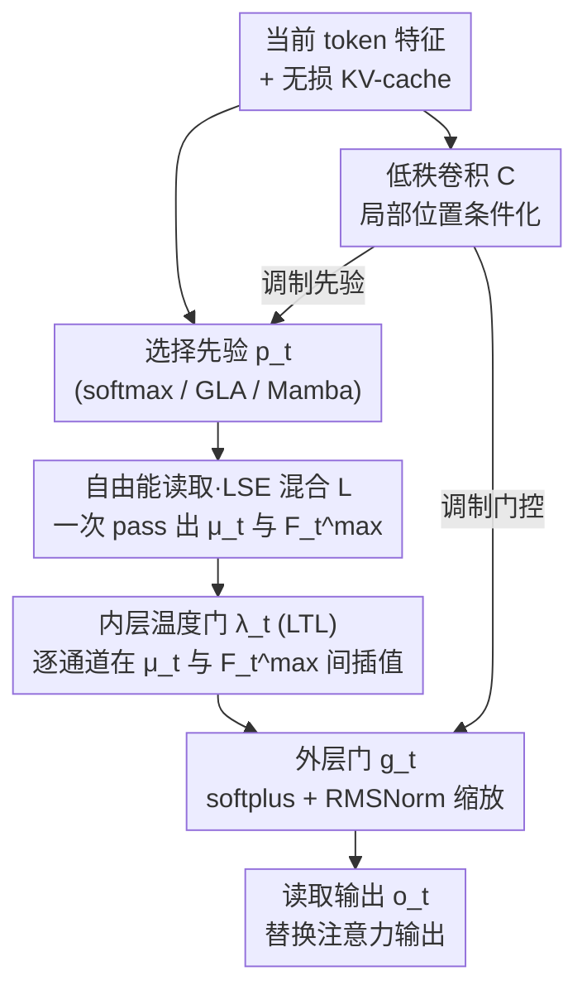

# Free Energy Mixer

**会议**: ICLR 2026  
**arXiv**: [2602.07160](https://arxiv.org/abs/2602.07160)  
**代码**: 有（论文中链接）  
**领域**: 时间序列 / LLM效率  
**关键词**: 注意力机制, 自由能, 通道级选择, log-sum-exp, 即插即用

## 一句话总结
提出 Free Energy Mixer (FEM)，通过将注意力的值读取重新定义为自由能（log-sum-exp）优化问题，实现了逐通道的值感知后验选择，克服了标准注意力"无损存储但有损读取"的固有瓶颈，可即插即用替换 softmax/线性注意力/RNN/SSM，在 NLP、视觉和时间序列任务上一致提升。

## 研究背景与动机

**领域现状**：Transformer 中的注意力机制通过 KV-cache 无损存储所有历史信息，然后用概率权重的凸组合读取值——这是一种"无损存储但有损处理"的模式。现有改进方向包括稀疏注意力、低秩投影、核化注意力、线性 RNN/SSM 等。

**现有痛点**：标准注意力的读取操作对所有值维度使用相同的权重（$\mathbf{o}_t = \sum_i \alpha_{t,i} \mathbf{v}_i$），输出必然落在值向量的凸包内。这意味着**逐通道的索引选择不可实现**——即使不同通道需要从不同的历史位置检索信息，单个注意力头也无法做到。

**核心矛盾**：$H$ 个注意力头最多提供 $t^H$ 种头级 argmax 模式，远少于实现逐通道自由选择所需的 $t^D$ 种模式（当 $H \ll D$）。增加头数会缩减每头宽度，叠加更多层也无法恢复第一次凸混合后丢失的通道级索引信息。

**本文目标**：如何在不改变渐近复杂度的前提下，为注意力机制增添逐通道、值感知的选择能力？

**切入角度**：将值读取视为一个信息约束下的选择问题——给定先验分布 $p_t$（来自 Q/K），对每个通道 $j$ 寻找使期望效用最大化的后验分布 $q$，同时约束与先验的 KL 散度。这个变分问题的解恰好是 log-sum-exp 形式。

**核心 idea**：用自由能（log-sum-exp）替换注意力的线性读取，为每个值通道引入独立的值感知后验选择，在不增加渐近复杂度的前提下从平均读取平滑过渡到逐通道硬选择。

## 方法详解

### 整体框架
FEM 不是一套新注意力，而是一个**即插即用的"读取层"**：拿任意已有机制（softmax 注意力、GLA、Mamba、AFT）算出的选择先验 $p_t$ 当输入，把原本"用 $p_t$ 对值做一次凸平均"的读取，换成逐通道、值感知的自由能读取，再原样替换掉 Transformer block 里的注意力输出，其余部分（MLP、embedding）一律不动，渐近复杂度也与原机制保持一致。

整条读取链路自上而下是：先验 $p_t$ 进来后，先由一支**低秩卷积（C）**注入局部位置信息、同时调制先验与后面的门控；核心的**自由能读取 / LSE 混合（L）**在一次 pass 里同时算出均值分支 $\mu_t$ 和高温分支 $F_t^{\max}$；**内层温度门 $\lambda_t$（线性化温度学习 LTL，T）**逐通道在这两支之间插值，决定"读得多硬"；最后**外层门 $g_t$（G）**缩放输出幅度，得到替换注意力的最终读取 $\mathbf{o}_t$。

### 关键设计

**1. 自由能读取：把"平均值"读取换成"逐通道可调硬度"的选择**

标准注意力的读取是 $\mu_{t,j} = \sum_i p_t(i) v_{i,j}$，所有通道共用同一组权重 $p_t$，输出被锁死在值向量的凸包内。FEM 把每个值通道 $j$ 的读取单独写成一个约束优化问题：在与先验 $p_t$ 的 KL 散度不超过预算 $B_{t,j}$ 的前提下，最大化期望效用 $\max_{q} \mathbb{E}_{i \sim q}[v_{i,j}]$。引入 Lagrange 乘子 $\beta_{t,j}$ 后，最优后验是 $q_{t,\beta}^{(j)}(i) \propto p_t(i) \exp(\beta v_{i,j})$，对应的目标值就是自由能（log-sum-exp 形式）：

$$\mathcal{F}_{t,j}(\beta) = \frac{1}{\beta} \log \sum_i p_t(i) \exp(\beta v_{i,j})$$

逆温度 $\beta$ 充当"硬度旋钮"：$\beta \to 0$ 退化回标准均值读取，$\beta \to \infty$ 收敛到 argmax 硬选择，中间是从平均到选择的连续谱。它有效是因为自由能可以分解为 $\mathcal{F}_{t,j}(\beta) = \mathbb{E}_{p_t}[v_{i,j}] + \frac{1}{\beta} \text{KL}(p_t \| q^{(\beta)})$——读取值始终不低于期望均值，提升幅度恰好由 KL 散度量化。关键是每个通道有自己的 $\beta_{t,j}$ 和后验 $q^{(j)}$，因此不同通道能从不同历史位置独立检索，绕开了"单头单组权重"造成的凸包约束。

**2. 线性化温度学习（LTL）：让逐通道温度可学，又不破坏一次 pass 的并行性**

理想情况下每个 $(\text{step}, \text{channel})$ 都要一个独立的 $\beta$，但直接对 $\beta$ 求解会破坏并行计算。LTL 的做法是固定一个最大逆温度 $\beta_{\max}$，只算两条分支——基线均值 $\mu_t$ 和高温自由能 $F_t^{\max}$——再用一个可学习门 $\lambda_t \in [0,1]^D$ 在两者之间逐通道插值：

$$\tilde{F}_t(\lambda_t) = (1-\lambda_t) \odot \mu_t + \lambda_t \odot F_t^{\max}$$

这两条分支可以在同一次 pass 里算完（把 $[v_{i,j}, e^{\beta_{\max} v_{i,j}}]$ 拼起来一起混合），所以渐近复杂度和先验完全一致。之所以能用两点插值替代逐通道求 $\beta$，是因为论文用中间值定理证明了 $\lambda \mapsto \beta^*$ 是严格单调映射：优化 $\lambda$ 等价于优化背后那个隐藏的逐通道温度 $\beta^*$，连续谱被压缩到两点之间而不损失表达力。

**3. 双层门控：内门控管"选多硬"，外门控管"读多强"**

最终读取由内外两层门控共同决定：

$$\mathbf{o}_t = \mathbf{g}_t \odot \big[(1-\lambda_t) \odot \mu_t + \lambda_t \odot F_t^{\max}\big]$$

内层就是上面的温度门 $\lambda_t$，控制从平均到硬选择的程度；外层门 $\mathbf{g}_t$（用 softplus + RMSNorm 参数化）缩放最终输出幅度。外门控并非简单乘个标量——它等价于在自由能上施加指数缩放 $[\sum_i p_t(i) \exp(\beta^* v_{i,j})]^{g_{t,j}}$，进一步扩大了可表达的读取空间。当 $\lambda = 0, g = 1$ 时整个模块精确退化为标准注意力，保证了 FEM 是严格的超集。

**4. 低秩卷积局部条件化（模块 C）：用极轻的局部卷积给选择先验和门控注入位置敏感性**

借鉴 Mamba/DeltaNet 的局部卷积思路，FEM 用一个自适应低秩卷积提取局部、位置敏感的特征，去调制选择先验 $p_t$ 和 FEM 的门控。它用的是简单时间衰减核，支持 $O(1)$ 的 streaming 更新，总成本只有 $O(TH_c)$（其中 $H_c = d/16 \ll D$），几乎不增加预算。这一项补上了纯自由能读取缺少的局部位置信息，让模块在 Compress、Selective Copy 这类对位置敏感的任务上更稳。

### 损失函数 / 训练策略
- FEM 本身不引入额外损失，使用下游任务的标准损失（语言建模用交叉熵，时序用 MSE 等）
- 参数预算策略 (i)：$d = D/2$, $r = 4$，保持与标准注意力相同的 $4D^2$ 参数量
- 所有实验中 FEM 直接替换注意力，不改变其他超参数

## 实验关键数据

### MAD 合成基准 — 注意力机制诊断

| 模型 | Compress | Fuzzy Recall | In-Ctx Recall | Memorize | Selective Copy | 平均 |
|------|----------|-------------|--------------|----------|---------------|------|
| Transformer (SMAttn) | 44.3 | 24.5 | 99.9 | 85.7 | 95.1 | 74.7 |
| DiffTransformer | 42.9 | 39.0 | 99.9 | 83.7 | 95.8 | 76.4 |
| GatedDeltaNet | 45.0 | 29.8 | 99.9 | 80.2 | 94.3 | 74.9 |
| **FEM-SM** | **53.1** | **43.1** | 99.9 | **85.9** | **99.3** | **80.2** |
| **FEM-GLA** | 53.0 | 19.1 | 99.9 | 86.3 | 99.0 | 74.9 |

### 消融实验（MAD 平均分）

| 配置 | 平均 | 说明 |
|------|------|------|
| SMAttn (基线) | 74.7 | 标准 Transformer |
| +C (低秩卷积) | 76.3 | +1.6，局部条件化 |
| +C,L (LSE) | **78.8** | +2.5，**最大跳跃**，LSE 是核心 |
| +C,L,T (温度) | 79.4 | +0.6，温度微调 |
| +C,L,T,G (完整 FEM) | **80.2** | +0.8，外门控锦上添花 |

### 语言建模（1.3B 参数，100B tokens）

| 模型 | Open LLM Avg Rank↓ | Top1 数↑ |
|------|-------------------|----------|
| Transformer | 4.56 | 1 |
| **FEM-SM** | **2.06** | **9** |
| GLA | 5.63 | 0 |
| **FEM-GLA** | 3.88 | 1 |

### 时间序列预测（MSE）

| 数据集 | FEM-SM | iTransformer | PatchTST | DLinear |
|--------|--------|-------------|----------|---------|
| Weather | **0.222** | 0.232 | 0.221 | 0.233 |
| ETTh1 | 0.419 | 0.454 | **0.413** | 0.422 |
| ETTm1 | **0.341** | 0.373 | 0.346 | 0.347 |
| ETTm2 | **0.242** | 0.265 | 0.247 | 0.252 |

### 关键发现
- **LSE 混合（L）是核心组件**：在 MAD 基准上贡献最大的性能跳跃（+2.5 分），直接验证了自由能读取对 Compress & Recall 任务的关键作用
- **FEM 可以将线性时间方法（GLA、Mamba）提升到接近最新 attention 变体的水平**，缩小了线性和二次复杂度模型之间的差距
- **计算效率可控**：完整 FEM-SM 的训练延迟 0.041s vs 标准 Transformer 0.027s，吞吐量 104K vs 154K tokens/s——约 30% 开销
- 在语言建模 1.3B 规模上，FEM-SM 在 16 个评测中拿到 9 个最佳，平均排名 2.06（vs Transformer 4.56）

## 亮点与洞察
- **"无损存储但有损读取"问题的精准诊断**极其深刻：文章从几何角度（凸包约束）和信息论角度（$t^H$ vs $t^D$ 容量）严格证明了标准注意力的根本局限性，并系统分析了为什么"更多头/更深层/逐维度 QK/更丰富的混合器"都无法解决这个问题
- **自由能变分框架**的数学优雅性：将值读取定义为 KL 约束下的效用最大化，自然导出 log-sum-exp 形式，温度参数对应 KL 预算的 Lagrange 乘子。这个框架统一了从平均值到 argmax 的连续谱
- **即插即用 + 先验无关**的设计使 FEM 适用面极广：softmax attention、GLA、Mamba、AFT 都能用，且保持原有渐近复杂度不变。这是一个罕见的"免费午餐"式改进
- **LTL 的巧妙设计**：通过证明 $\lambda \mapsto \beta^*$ 的单调性，把动态温度的连续谱压缩到两点插值，只需一次 forward pass

## 局限与展望
- 缺乏大规模语言模型（>10B）和超长上下文（>128K）的验证——作者坦承计算资源有限
- 没有定制 CUDA kernel，当前实现的 30% 额外开销在工程上可以优化，但论文未提供
- FEM 的值空间维度减半（$d = D/2$），虽然总参数量匹配，但值的表达能力是否有损？未见深入分析
- 在时间序列预测上优势不如在 NLP 和合成基准上显著——ETTh1/ETTh2 上不如 PatchTST

## 相关工作与启发
- **vs Differential Transformer**: DiffTrans 通过差分机制消除注意力噪声，但仍在凸包内操作；FEM 突破了凸包约束
- **vs Mamba/SSM**: SSM 用固定大小状态存储历史，本质上是有损存储；FEM 保持无损存储（KV-cache）上做无损读取
- **vs GatedDeltaNet/DeltaNet**: 这些线性 RNN 用 delta rule 更新状态；FEM 可以叠加在它们上面（FEM-GLA/Mamba），且效果显著提升
- 这篇论文的理论框架非常适合作为注意力机制改进方向的 baseline 和分析工具

## 评分
- 新颖性: ⭐⭐⭐⭐⭐ 对注意力有损读取问题的诊断和自由能解决方案都是原创性很强的贡献
- 实验充分度: ⭐⭐⭐⭐ 合成 + NLP + 视觉 + 时序四个领域覆盖广，但缺少超大规模验证
- 写作质量: ⭐⭐⭐⭐⭐ 理论分析极其严谨，从问题定义到解决方案的逻辑链条完整
- 价值: ⭐⭐⭐⭐⭐ 即插即用的通用机制改进，理论和实践价值都很高，可能影响未来注意力机制设计方向

<!-- RELATED:START -->

## 相关论文

- [\[NeurIPS 2025\] xLSTM-Mixer: Multivariate Time Series Forecasting by Mixing via Scalar Memories](../../NeurIPS2025/time_series/xlstm-mixer_multivariate_time_series_forecasting_by_mixing_via_scalar_memories.md)
- [\[NeurIPS 2025\] Neural Stochastic Flows: Solver-Free Modelling and Inference for SDE Solutions](../../NeurIPS2025/time_series/neural_stochastic_flows_solver-free_modelling_and_inference_for_sde_solutions.md)
- [\[CVPR 2026\] SATTC: Structure-Aware Label-Free Test-Time Calibration for Cross-Subject EEG-to-Image Retrieval](../../CVPR2026/time_series/sattc_structure-aware_label-free_test-time_calibration_for_cross-subject_eeg-to-.md)
- [\[ICML 2025\] VisionTS: Visual Masked Autoencoders Are Free-Lunch Zero-Shot Time Series Forecasters](../../ICML2025/time_series/visionts_visual_masked_autoencoders_are_free-lunch_zero-shot_time_series_forecas.md)
- [\[ICLR 2026\] Routing Channel-Patch Dependencies in Time Series Forecasting with Graph Spectral Decomposition](routing_channel-patch_dependencies_in_time_series_forecasting_with_graph_spectra.md)

<!-- RELATED:END -->
