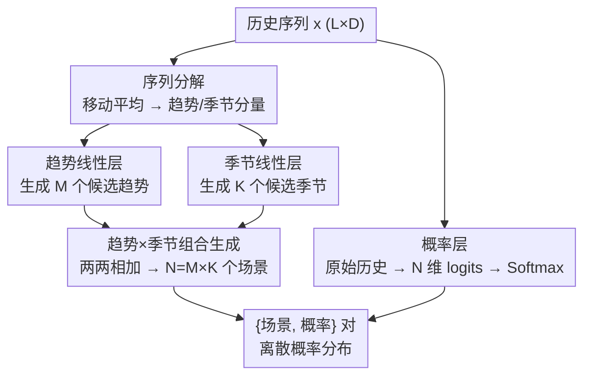

# From Samples to Scenarios: A New Paradigm for Probabilistic Forecasting

**会议**: ICLR 2026  
**arXiv**: [2509.19975](https://arxiv.org/abs/2509.19975)  
**代码**: [GitHub](https://github.com/Fifthky/TimePrism)  
**领域**: 时间序列  
**关键词**: probabilistic forecasting, time series, scenario generation, discrete probability, linear model

## 一句话总结
提出 Probabilistic Scenarios 范式，用模型直接输出有限个 {场景, 概率} 对取代采样，并用仅含三层平行线性层的 TimePrism 在5个基准数据集上取得9/10 SOTA。

## 研究背景与动机
**领域现状**: 概率时间序列预测是不确定性决策的基础，主流方法分为参数分布模型、生成模型（扩散）和结构化概率模型（流/copula），均依赖采样来表示预测分布。

**现有痛点**: 采样范式存在三大固有缺陷——(i) **概率缺失**：生成的轨迹没有对应概率值；(ii) **覆盖不足**：有限样本难以捕获低概率高影响的尾部事件；(iii) **推理开销**：生成多样本的计算成本随样本数线性增长。

**核心矛盾**: 高质量概率预测需要大量样本来充分近似分布，但大量采样又导致计算不可承受，且采样本身不提供显式概率。

**本文目标**: 设计一种不依赖采样的概率预测范式，单次前向传播即可输出完整的离散概率分布。

**切入角度**: 将学习目标从"近似连续概率空间"简化为"学习有限场景集上的概率分布"，类似 VQ-VAE 的思路但直接作用于输出轨迹空间。

**核心 idea**: 用一个简单线性模型直接生成 $N$ 个未来场景及其概率，彻底绕开采样。

## 方法详解

### 整体框架
这篇论文要解决采样范式的三宗罪——轨迹没有概率、有限样本覆盖不到尾部事件、采样数越多算力越贵。它的解法是把概率预测重新定义为一次性输出函数 $f(\mathbf{x}) = (\mathcal{Y}_{\text{pred}}, \mathbf{p})$：输入历史 $\mathbf{x}$，直接吐出 $N$ 个完整未来场景 $\mathcal{Y}_{\text{pred}} = \{\mathbf{y}_n\}_{n=1}^N$ 和满足 $\sum p_n = 1$ 的概率向量 $\mathbf{p}$，单次前向就给出一个离散概率分布，整条链路里没有任何采样。

落地这一范式的 TimePrism 只用三个平行线性层，分三股流走完整个 pipeline：先把历史用移动平均拆成趋势分量和季节分量；趋势线性层和季节线性层各自生成一组候选分量，两两相加笛卡尔积出全部 $N$ 个场景；与此并行，第三个线性层直接吃原始未分解历史，输出每个场景的概率。三股流在末端汇合成 $\{$场景, 概率$\}$ 对。

### 关键设计

**1. 序列分解：把场景生成拆成低维子问题**

若直接让一个线性层吐出 $N$ 个长度为 $H$ 的场景，参数量随 $N$ 线性膨胀，且模型要在高维输出空间里硬记多样性。TimePrism 先用移动平均把输入历史 $\mathbf{x} \in \mathbb{R}^{L \times D}$ 分解为趋势分量 $\mathbf{x}_{\text{trend}}$ 和季节分量 $\mathbf{x}_{\text{season}}$，让趋势与周期波动各自在更平滑、更易拟合的子空间里被建模，为后续的组合式生成铺好基础。

**2. 趋势×季节组合生成：用 $\mathcal{O}(\sqrt{N})$ 参数撑起 $N$ 个场景**

趋势线性层从 $\mathbf{x}_{\text{trend}}$ 生成 $M$ 个候选趋势预测，季节线性层从 $\mathbf{x}_{\text{season}}$ 生成 $K$ 个候选季节预测，再两两相加得到全部场景 $\mathcal{Y}_{\text{pred}} = \{\mathbf{y}_{t,m} + \mathbf{y}_{s,k} \mid m \in [M], k \in [K]\}$，于是 $N = M \times K$。关键收益是参数只需支撑 $M+K$ 个分量却能笛卡尔积出 $M\times K$ 个场景，当 $M\approx K$ 时复杂度落在 $\mathcal{O}(\sqrt{N})$，远低于直接生成的 $\mathcal{O}(N)$；同时这种结构天然解耦了"趋势走向"与"周期形态"两类不确定性，让有限场景能更经济地铺开覆盖面。

**3. 概率层：给每个场景配一个可学习的权重**

光有场景还不够，范式的另一半是显式概率。第三个线性层不吃分解后的分量，而是以原始未分解历史为输入，输出 $N$ 维 logits $\boldsymbol{\pi}$，经 Softmax 归一化为概率向量 $\mathbf{p}$。用原始历史而非分量作为概率层输入，是因为"哪个场景更可能发生"取决于完整的历史模式而非单一趋势或季节信号，这样概率分配才能与场景保真度互补，共同构成一个真正的离散分布。

### 损失函数 / 训练策略
训练同时优化"场景准不准"和"概率配得对不对"，总损失为 $\mathcal{L}_{\text{Prism}} = \mathcal{L}_{\text{recon}} + \lambda \cdot \mathcal{L}_{\text{prob}}$（取 $\lambda=1$）。重建项采用胜者通吃（WTA）策略：先找出与真值最近的胜者场景 $n^* = \arg\min_n \|\mathbf{y}_{gt} - \mathbf{y}_n\|_2^2$，只对它计算 MSE，从而鼓励不同场景头各自专精于一种未来形态而非全部坍缩到均值。概率项则用交叉熵 $\mathcal{L}_{\text{prob}} = -\log \frac{\exp(\pi_{n^*})}{\sum_j \exp(\pi_j)}$ 把最高概率推给胜者，使概率层学会识别哪类场景更常出现。由于硬 WTA 会让早期未被选中的场景头得不到梯度而"饿死"，实际训练改用 relaxed WTA，给非胜者场景也分配少量梯度以稳定收敛。

## 实验关键数据

### 主实验
5个基准数据集 (Electricity, Exchange, Solar, Traffic, Wikipedia) 上的 Weighted CRPS：

| 模型 | Elec. | Exch. | Sol. | Traf. | Wiki. |
|------|-------|-------|------|-------|-------|
| TimeGrad | 0.232 | 0.845 | 0.241 | 0.162 | 0.517 |
| TACTiS-2 | 0.299 | 0.648 | 0.236 | 0.257 | 0.484 |
| TimeMCL | 0.370 | 1.12 | 0.290 | 0.262 | 0.640 |
| **TimePrism** | **0.133** | **0.468** | **0.085** | **0.111** | **0.506** |

Distortion 指标上 TimePrism 在全部5个数据集上均取得 SOTA。

### 消融实验
场景数 $N$ 影响实验 (Solar 数据集):

| N | CRPS | Distortion | FLOPs(相对) |
|---|------|------------|-------------|
| 1 | 0.199 | 0.266 | 1.0x |
| 16 | 0.137 | 0.307 | 4.2x |
| 256 | 0.093 | 0.158 | 19.9x |
| 625 | 0.085 | 0.101 | 34.8x |
| 1024 | 0.082 | 0.092 | 48.3x |

$N=625$ 时性能收益趋于饱和。

### 关键发现
- TimePrism 推理 FLOPs 恒定（$5.1 \times 10^5$），不随样本数增长，而 TimeGrad 100样本需 $1.9 \times 10^{10}$ FLOPs
- 可视化显示 TimePrism 能以高概率捕获常见高峰场景，同时以低概率识别罕见低峰场景，而采样模型无法区分两者
- 组合架构 ($N = M \times K$) 使参数增长在 $\mathcal{O}(\sqrt{N})$ 到 $\mathcal{O}(N)$ 之间

## 亮点与洞察
- **范式创新**: 从"采样近似连续分布"到"直接生成离散场景+概率"的根本性转变，概念简洁而有效
- **极简架构验证**: 仅用3个平行线性层（无非线性激活）即达 SOTA，证明范式本身的强大潜力
- **统一评估框架**: 提出 Weighted CRPS 和 Distortion 两个互补指标，并为两种范式分别给出公平可比的计算公式
- **效率优势**: 单次前向传播，推理成本比最强基线低1-5个数量级

## 局限与展望
- 线性模型对极高维度或无明显趋势/季节模式的序列可能不适用
- 固定输入/输出长度，缺乏变长序列的灵活性
- 多变量建模采用 weight-sharing 策略，跨变量关系建模较简单
- 最优场景数 $N$ 依赖数据复杂度，目前需手动设定
- WTA 损失可能导致部分场景头在训练早期被忽略（“赢家通吃”效应），relaxed WTA 只是部分缓解
- 未在 GIFT-Eval 等更大规模基准上验证
- 缺少对不同预测长度（horizon）的敏感度分析

## 相关工作与启发
- 与 TimeMCL 对比：TimeMCL 也输出离散场景但不直接建模概率，CRPS 不如 SOTA；本文通过概率层统一场景保真度和概率匹配
- 与 VQ-VAE 的概念类比：将离散化直接应用于输出轨迹空间而非潜在空间
- 与 TACTiS-2 对比：TACTiS-2 能计算概率密度但仍需采样获取轨迹，本文直接输出离散场景
- 与 TimeGrad 对比：扩散模型需迭代采样，100样本的 FLOPs 是 TimePrism 的 $10^4$ 倍
- 未来可将此范式接入 Transformer、Diffusion 等强力骨干，解锁更强的多变量建模能力
- 自适应场景数机制也是有价值的未来方向

## 评分
- 新颖性: ⭐⭐⭐⭐⭐ 概率预测范式的根本性创新，从采样转向离散场景概率
- 实验充分度: ⭐⭐⭐⭐ 5个数据集+多基线+消融+可视化，但仅限时间序列领域
- 写作质量: ⭐⭐⭐⭐⭐ 动机清晰，从问题到方案的逻辑链完整
- 价值: ⭐⭐⭐⭐⭐ 为概率预测开辟新方向，极简模型即达SOTA具有极强说服力

<!-- RELATED:START -->

## 相关论文

- [\[ICML 2026\] Beyond Extrapolation: Knowledge Utilization Paradigm with Bidirectional Inspiration for Time Series Forecasting](../../ICML2026/time_series/beyond_extrapolation_knowledge_utilization_paradigm_with_bidirectional_inspirati.md)
- [\[AAAI 2026\] Scaling LLM Speculative Decoding: Non-Autoregressive Forecasting in Large-Batch Scenarios](../../AAAI2026/time_series/scaling_llm_speculative_decoding_non-autoregressive_forecasting_in_large-batch_s.md)
- [\[ICML 2026\] U-Cast: A Surprisingly Simple and Efficient Frontier Probabilistic AI Weather Forecasting](../../ICML2026/time_series/u-cast_a_surprisingly_simple_and_efficient_frontier_probabilistic_ai_weather_for.md)
- [\[AAAI 2026\] ProbFM: Probabilistic Time Series Foundation Model with Uncertainty Decomposition](../../AAAI2026/time_series/probfm_probabilistic_time_series_foundation_model_with_uncertainty_decomposition.md)
- [\[ICML 2026\] Parametric Prior Mapping Framework for Non-stationary Probabilistic Time Series Forecasting](../../ICML2026/time_series/parametric_prior_mapping_framework_for_non-stationary_probabilistic_time_series_.md)

<!-- RELATED:END -->
