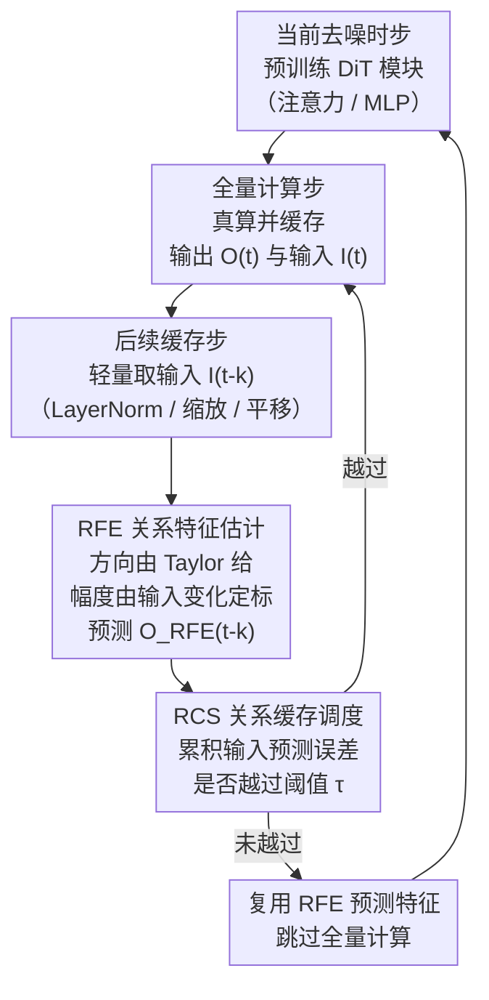

# Relational Feature Caching for Accelerating Diffusion Transformers

**会议**: ICLR 2026  
**arXiv**: [2602.19506](https://arxiv.org/abs/2602.19506)  
**代码**: [项目页面](https://cvlab.yonsei.ac.kr/projects/RFC)  
**领域**: 扩散模型/推理加速  
**关键词**: 特征缓存, DiT加速, 输入输出关系, 动态调度, 预测精度

## 一句话总结
提出关系特征缓存（RFC）框架，通过利用DiT模块输入-输出特征之间的强相关性来增强缓存特征预测的精度，包括从输入变化估计输出变化幅度的RFE和用输入误差代理判断是否需要全量计算的RCS，在图像和视频生成任务上显著优于现有的基于时间外推的缓存方法。

## 研究背景与动机
- **领域现状**: 扩散Transformer（DiT）在文本生成图像、视频等任务中表现优越，但推理代价极高——需要在大量去噪时步上执行昂贵的前向传播。特征缓存方法利用相邻时步特征高度相似的特点，在某些时步进行全量计算并缓存输出，后续时步直接复用或预测缓存特征，以此跳过冗余计算。
- **现有痛点**: (1) 早期缓存方法（FORA、DeepCache）直接复用缓存特征不做调整，误差随时步累积，大缓存间隔时生成质量下降严重；(2) 近期基于预测的方法（FasterCache用线性外推、TaylorSeer用Taylor展开）假设特征沿时间平滑演化，但实际上**输出特征的变化幅度在时步间高度不规则**，纯时间外推导致显著的预测误差；(3) 固定均匀的缓存间隔schedule不考虑不同时步间误差的差异，效率次优。
- **核心矛盾**: 基于时间外推的缓存方法难以捕捉输出特征变化的不规则性，而直接测量输出误差又需要进行昂贵的全量计算。
- **本文目标**: 如何在不增加显著计算开销的情况下，更准确地预测缓存特征并动态决定何时需要全量计算。
- **切入角度**: 作者通过详细的特征分析发现了一个关键事实——**同一模块的输入特征变化和输出特征变化高度相关**，而获取输入特征只需要轻量操作（LayerNorm、缩放、平移），几乎"免费"。
- **核心idea**: 利用输入-输出关系来增强特征预测：(1) 用输入变化的幅度来估计输出变化的幅度（RFE）；(2) 用输入预测误差来估计输出预测误差，动态触发全量计算（RCS）。

## 方法详解

### 整体框架
扩散 Transformer（DiT）每个去噪时步都要跑一遍昂贵的前向，特征缓存的思路是只在少数"全量计算步"真算、其余"缓存步"复用或预测缓存特征。但已有方法只靠时间外推（FORA 直接复用、TaylorSeer 用 Taylor 展开）来推断缓存步的输出，而 DiT 输出特征的变化幅度在时步间高度不规则，外推不准、误差累积。关系特征缓存（Relational Feature Caching, RFC）的破局点是一个几乎免费的线索——**同一模块的输入特征变化与输出特征变化高度相关**，而拿到输入特征只需 LayerNorm、缩放、平移等轻量操作。

整套流程绕着这条线索转：在全量计算步缓存该步的输出 $O(t)$ 和输入 $I(t)$；进入后续缓存步时，关系特征估计（Relational Feature Estimation, RFE）用当前输入相对缓存的变化去校正 Taylor 对输出的预测；与此同时，关系缓存调度（Relational Cache Scheduling, RCS）盯着输入预测误差的累积，一旦越过阈值就回头重新触发一次全量计算、刷新缓存。两个组件都只额外读取输入特征，不引入任何训练。

### 关键设计

**1. RFE 关系特征估计：用输入变化的幅度补救 Taylor 外推丢失的"变化量级"**

纯时间外推之所以会预测不准，是因为 DiT 输出特征的变化幅度在时步间高度不规则，而 Taylor 展开假设它平滑演化。RFE 的破解办法来自一个稳定的观察量：输出变化与输入变化的比值 $s_k(t-k) = \frac{\|\Delta_k O(t-k)\|_2}{\|\Delta_k I(t-k)\|_2}$ 在不同时步间几乎是常数，实测相对标准差只有约 2%。论文还给出了局部线性的理论支撑（Proposition 1）：若输入到输出的映射在局部可近似为线性 $O = AI + b$，且输入变化方向在两次全量计算的区间 $1 \leq k \leq N$ 内保持不变，则 $s_k(t-k) = \|A\,u_k(t-k)\|_2$ 就是一个与 $k$ 无关的常数；而这两条假设在扩散模型里都站得住——相邻时步特征变化很小（支持局部线性），已有研究也表明特征变化方向在时步间相当稳定。

于是 RFE 把预测拆成方向和幅度两部分：方向仍由 Taylor 展开给出，幅度则改由输入变化来定标——用最近两次全量计算间得到的比值 $s_N(t)$ 近似 $s_k(t-k)$，从而 $\|\Delta_k O(t-k)\| \approx s_N(t)\,\|\Delta_k I(t-k)\|_2$。最终的缓存步输出预测为

$$O_{\text{RFE}}(t-k) = O(t) + \big(s_N(t)\|\Delta_k I(t-k)\|_2\big) \cdot g\!\left(\sum_{i=1}^{m}\frac{k^i}{i!}\frac{\Delta_N^i O(t)}{N^i}\right),$$

其中 $g(\cdot)$ 是 L2 归一化函数，把 Taylor 项压成单位方向向量，幅度全部由前面那个标量负责。这样做之所以有效，是因为输入特征本来就要算（且代价极低），用它来锚定"这一步到底变了多少"，比硬靠时间外推外推幅度可靠得多。

**2. RCS 关系缓存调度：用输入预测误差作代理，动态决定何时再做一次全量计算**

RFE 再准也有残差，且误差随时步波动，固定均匀的缓存间隔 $N$ 因此是次优的。理想的调度应该在"输出预测误差大"时才花钱做全量计算，但输出误差恰恰要全量计算才能测到，形成鸡生蛋的死循环。RCS 绕开它的办法是改测输入侧的预测误差——作者发现输入误差与输出误差的趋势高度一致（Fig. 2b）。具体地，定义归一化的输入预测误差 $\mathcal{E}_I(t-k) = \frac{\|E_I(t-k)\|_1}{\|I(t-k)\|_1}$，其中 $E_I(t-k) = I(t-k) - I_{\text{Taylor}}(t-k)$ 是输入特征真实值与其 Taylor 预测值之差；当累积误差越过阈值 $\sum_{j=1}^{k} \mathcal{E}_I(t-j) > \tau$ 时就触发一次全量计算并刷新缓存。阈值 $\tau$ 直接调节质量-效率的权衡。更省的是，监控只需挂在第一个模块上而非全部模块（Table 6 验证了这一选择足够），调度的额外开销可以忽略。

### 损失函数 / 训练策略
RFC 是一个**无需训练**的推理加速框架，不做任何额外训练或微调，直接套在预训练 DiT 的推理阶段上。唯一需要设定的就是 RCS 的阈值 $\tau$，实验中通过调 $\tau$ 让全量计算次数（NFC）与对比方法对齐以保证公平；Taylor 展开阶数 $m$ 一般取 1 或 2。

## 实验关键数据

### 主实验

**类别条件图像生成 (DiT-XL/2, ImageNet)**:

| 方法 | NFC | FLOPs(T) | FID↓ | sFID↓ | FID2FC↓ | sFID2FC↓ |
|------|-----|----------|------|-------|---------|----------|
| Full-Compute | 50 | 23.74 | 2.32 | 4.32 | - | - |
| TaylorSeer (N=4) | 14 | 6.66 | 2.55 | 5.30 | 0.44 | 2.17 |
| **RFC (m=2)** | 14.01 | 6.67 | **2.52** | **4.60** | **0.30** | **1.33** |
| TaylorSeer (N=7) | 8 | 3.82 | 3.46 | 6.97 | 1.30 | 5.61 |
| **RFC (m=2)** | 8.02 | 3.83 | **3.12** | **5.07** | **0.81** | **3.10** |
| TaylorSeer (N=9) | 7 | 3.35 | 4.90 | 7.92 | 2.33 | 7.35 |
| **RFC (m=2)** | 7.04 | 3.37 | **3.40** | **5.21** | **1.03** | **3.66** |

**文本到图像生成 (FLUX.1 dev, DrawBench)**:

| 方法 | NFC | FLOPs(T) | PSNR↑ | SSIM↑ | LPIPS↓ | IR↑ |
|------|-----|----------|-------|-------|--------|-----|
| Full-Compute | 50 | 2813.50 | - | - | - | 0.9655 |
| TaylorSeer (N=4,m=2) | 14 | 788.59 | 19.77 | 0.771 | 0.318 | 0.941 |
| **RFC (m=2)** | 13.80 | 777.44 | **20.35** | **0.793** | **0.295** | **0.950** |
| TaylorSeer (N=9,m=2) | 8 | 451.10 | 16.55 | 0.656 | 0.533 | 0.800 |
| **RFC (m=2)** | 8.03 | 452.91 | **16.92** | **0.694** | **0.471** | **0.919** |

**文本到视频生成 (HunyuanVideo, VBench)**:

| 方法 | NFC | FLOPs(T) | PSNR↑ | SSIM↑ | LPIPS↓ | VBench↑ |
|------|-----|----------|-------|-------|--------|---------|
| Full-Compute | 50 | 7520.00 | - | - | - | 81.40 |
| TaylorSeer (N=6,m=1) | 9 | 1359.19 | 15.53 | 0.461 | 0.245 | 79.52 |
| **RFC (m=1)** | 8.96 | 1354.65 | **18.54** | **0.635** | **0.133** | **80.83** |
| TaylorSeer (N=8,m=1) | 7 | 1058.45 | 15.20 | 0.441 | 0.262 | 79.59 |
| **RFC (m=1)** | 7.09 | 1072.65 | **18.25** | **0.616** | **0.144** | **80.49** |

### 消融实验

**组件消融 (DiT-XL/2, m=1)**:

| 方法 | NFC | FID↓ | sFID↓ | FID2FC↓ | sFID2FC↓ |
|------|-----|------|-------|---------|----------|
| TaylorSeer | 14 | 2.65 | 5.60 | 0.57 | 2.77 |
| +RFE | 14 | 2.52 | 5.18 | 0.43 | 2.02 |
| +RCS | 14 | 2.52 | 4.76 | 0.36 | 1.88 |
| **RFC (RFE+RCS)** | 14 | **2.51** | **4.66** | **0.31** | **1.41** |
| TaylorSeer | 11 | 2.87 | 5.85 | 0.73 | 3.53 |
| +RFE | 11 | 2.69 | 5.22 | 0.55 | 2.55 |
| +RCS | 11 | 2.77 | 5.21 | 0.62 | 3.09 |
| **RFC (RFE+RCS)** | 11 | **2.71** | **4.88** | **0.51** | **2.30** |

**RFE vs 其他幅度估计策略 (NFC=14)**:

| 方法 | FID2FC↓ | sFID2FC↓ |
|------|---------|----------|
| Linear (FasterCache) | 0.73 | 3.40 |
| w(t)=0.8 | 0.73 | 3.36 |
| w(t)=1.0 (TaylorSeer) | 0.57 | 2.77 |
| w(t)=1.2 | 0.52 | 2.51 |
| **RFE** | **0.43** | **2.02** |

### 关键发现
- RFC在所有计算预算下都优于现有方法，且**计算越受限优势越大**：例如在N=9时RFC用3.37 TFLOPs超过TaylorSeer在N=6时用4.76 TFLOPs的sFID表现。
- 在视频生成任务上提升尤为显著：RFC将PSNR从15.53提升到18.54（+3 dB），LPIPS从0.245降至0.133（几乎减半），同时VBench分数也从79.52提升到80.83，接近全量计算的81.40。
- RFE和RCS是互补的：单独使用各自都能优于TaylorSeer，组合后进一步提升。
- $s_k(t-k)$ 比值的相对标准差仅约2%，验证了输入-输出关系的稳定性。
- 只需监控第一个模块的输入误差即可完成RCS调度，不需要监控所有模块。

## 亮点与洞察
- **核心洞察深刻而简洁**：输出变化不规则但与输入变化高度相关→用输入估计输出，这一观察既有实验支持又有理论证明。把Taylor展开分解为"方向"和"幅度"两部分分别处理，方向用Taylor、幅度用输入-输出关系，是一个非常优雅的解耦设计。
- **零训练开销的即插即用方法**：RFC不需要任何训练或微调，可以直接应用于任意预训练DiT模型。输入特征的获取只需LayerNorm等轻量操作，额外计算开销可忽略不计。这使得RFC在实际部署中非常友好。
- **RCS动态调度的proxy思想巧妙**：用输入误差代理输出误差来触发全量计算，规避了"测量输出误差需要全量计算"的矛盾，而且只需监控第一个模块就足够了，开销极小。

## 局限与展望
- **单一标量比值的表达力有限**: $s_k(t-k)$ 是一个全局标量，对所有token/位置使用同一个比值。实际上不同空间位置的输入-输出关系可能不同，细粒度的（如per-token或per-channel）比值可能进一步提升精度。
- **阈值 $\tau$ 需要手动调整**: RCS的阈值是一个需要根据模型和任务调整的超参数。论文中通过匹配NFC来设置，但实际使用中如何自动选择最优阈值仍是开放问题。
- **对非Transformer架构的扩展**：RFC的理论分析和实验都集中在DiT架构上，对于U-Net等其他扩散模型架构的适用性尚未验证。
- **更高阶Taylor展开的优势有限**：从实验看m=1到m=2的提升相对有限，说明瓶颈可能不在Taylor展开阶数，而在变化幅度估计的准确性上——RFC已经在这方面取得了显著改善。

## 相关工作与启发
- **vs TaylorSeer**: TaylorSeer用高阶Taylor展开预测特征变化，但完全依赖时间外推，无法适应输出变化幅度的不规则性。RFC在Taylor预测的**方向**基础上，用输入-输出关系校正**幅度**，在相同计算预算下全面超越TaylorSeer。
- **vs FORA**: FORA直接复用缓存特征不做任何调整，在大缓存间隔时性能急剧下降（N=7时FID从2.32飙升至12.63）。RFC通过精确预测和动态调度，即使在NFC=7时FID也仅为3.40。
- **vs FasterCache/GOC**: 线性外推方法用固定或线性变化的缩放系数 $w(t)$，无法适应每个时步的实际变化幅度。RFC的 $s_N(t)$ 从实际的输入变化动态计算，表达力更强。
- **vs TeaCache**: TeaCache也利用输入特征触发全量计算，但只比较当前输入与缓存输入的距离，且需要额外的校准步骤。RFC的RCS使用输入**预测误差**而非简单距离，对forecasting-based方法更适用，且无需校准。

## 评分
- 新颖性: ⭐⭐⭐⭐ 输入-输出关系用于校正缓存预测的思路简洁而有效，方向-幅度解耦设计巧妙，理论与实验支撑充分。
- 实验充分度: ⭐⭐⭐⭐⭐ 覆盖类别条件生成（DiT-XL/2）、文本到图像（FLUX.1 dev）、文本到视频（HunyuanVideo）三个任务，多种指标，消融实验详尽，比较对象全面。
- 写作质量: ⭐⭐⭐⭐ 论文结构清晰、分析详实，从观察到理论到方法到实验层层递进。图表直观地展示了核心发现。
- 价值: ⭐⭐⭐⭐ 作为无需训练的即插即用加速方法，RFC在保持生成质量的同时实现约5-6倍计算节省，对DiT的实际部署有重要价值。在视频生成场景下提升尤为突出。

<!-- RELATED:START -->

## 相关论文

- [\[ICLR 2026\] Relational Transformer: Toward Zero-Shot Foundation Models for Relational Data](relational_transformer_toward_zero-shot_foundation_models_for_relational_data.md)
- [\[NeurIPS 2025\] Diffusion Transformers as Open-World Spatiotemporal Foundation Models](../../NeurIPS2025/time_series/diffusion_transformers_as_open-world_spatiotemporal_foundation_models.md)
- [\[ICLR 2026\] Online Time Series Prediction Using Feature Adjustment](online_time_series_prediction_using_feature_adjustment.md)
- [\[ICLR 2026\] CPiRi: Channel Permutation-Invariant Relational Interaction for Multivariate Time Series Forecasting](cpiri_channel_permutation-invariant_relational_interaction_for_multivariate_time_se.md)
- [\[ICLR 2026\] Dissecting Chronos: Sparse Autoencoders Reveal Causal Feature Hierarchies in Time Series Foundation Models](dissecting_chronos_sparse_autoencoders_reveal_causal_feature_hierarchies_in_time.md)

<!-- RELATED:END -->
