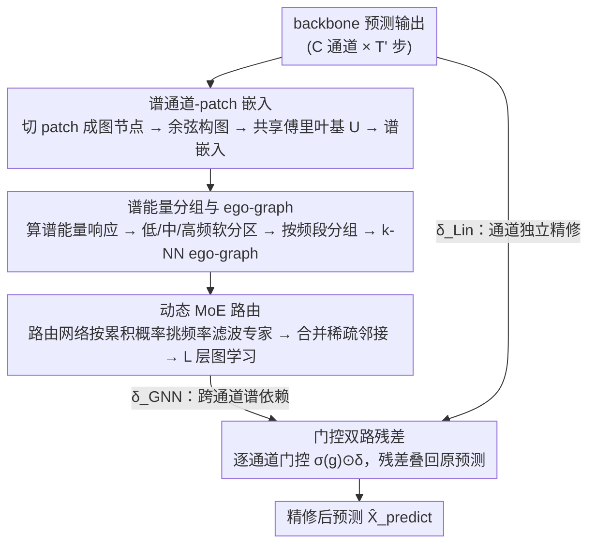

# Routing Channel-Patch Dependencies in Time Series Forecasting with Graph Spectral Decomposition

**会议**: ICLR 2026  
**arXiv**: [2603.13702](https://arxiv.org/abs/2603.13702)  
**代码**: [GitHub](https://github.com/Clearloveyuan/xCPD)  
**领域**: 时间序列预测  
**关键词**: 通道依赖, 图谱分解, 频率感知, MoE路由, 即插即用

## 一句话总结

提出 xCPD 即插即用插件，将多变量时间序列的建模单元从"通道"细化到"通道-patch"，通过共享图傅里叶基做谱嵌入→按频率能量响应分组为低/中/高频段→动态 MoE 路由自适应选择频率特定滤波专家，可无缝集成到 CI/CD 任何现有模型上一致提升长短期预测性能，并支持零样本迁移。

## 研究背景与动机

**领域现状**：多变量时序预测（MTSF）是 AI 核心任务，广泛应用于交通、金融、能源、气象等领域。近年来围绕模型架构（Linear/CNN/Transformer/MLP/GNN）和通道策略（CI/CD/CP）两条主线推进，通道策略已成为性能瓶颈。

**三大通道范式的局限**：(1) CI（Channel-Independent）如 DLinear/PatchTST，每通道独立建模，鲁棒但完全忽略通道间关系；(2) CD（Channel-Dependent）如 TSMixer/TimesNet，聚合所有通道，可能引入无关信息导致过平滑；(3) CP（Channel-Partiality）如 DUET/CCM/TimeFilter，试图平衡二者但仍有根本性不足。

**CP 方法的粗粒度瓶颈**：现有 CP 方法在通道级操作（整个通道作为关系单元），无法建模 patch 级别的局部交互。例如通道 A 在段 T₁ 呈光滑季节性趋势、在段 T₂ 出现尖锐异常，但通道级模型只生成一个平均权重，无法区分两段应有的不同交互模式。

**频率耦合问题**：CD/CP 模型在时域计算注意力权重，低频趋势、中频波动、高频噪声混在同一嵌入中。两通道间的高注意力分数可能同时反映有意义的低频季节依赖和无关的高频噪声关联，模型无法区分→产生虚假相关。

**核心切入角度**：将建模单位从"通道"细化到"通道-patch"（patch 作为图节点），在图谱域（而非时域）做依赖建模→按频率能量分组→MoE 按频段路由不同滤波专家→实现频率解耦的细粒度通道-patch 依赖建模。

**实际价值**：xCPD 设计为后处理插件（post-processing plugin），不需要重训练基础模型，线性计算复杂度，可直接嵌入现有预测 pipeline，适合大规模实时场景。

## 方法详解

### 整体框架

xCPD 是挂在任意预测模型之后的后处理插件，接收 backbone 的预测输出 $\hat{X}^{\text{model}} \in \mathbb{R}^{C \times T'}$，输出精修后的 $\hat{X}^{\text{predict}}$。它把每个通道切成 patch、让每个"通道-patch"成为图节点，先用一组共享的图傅里叶基把节点投到谱域（谱通道-patch 嵌入），再按谱能量把节点分进低/中/高频三组、构建 ego-graph（谱能量分组），最后用动态 MoE 给每个节点的局部子图挑选频率专属的滤波专家做图学习（动态 MoE 路由），并以门控双路残差的方式把跨通道谱依赖与通道独立精修一起叠回原预测。

### 关键设计

**1. 谱通道-patch 嵌入：把建模单元从通道细化到通道-patch，并搬到统一谱域**

现有 CP 方法以整条通道为关系单元，无法刻画同一通道前后两段的不同交互；而在时域算注意力又会把低频趋势、中频波动、高频噪声搅在一起产生虚假相关。xCPD 先把 $\hat{X}^{\text{model}}$ 切成 $N=\lceil T'/P\rceil$ 个不重叠 patch、线性映射到 $d$ 维得到 $X^{\text{emb}}\in\mathbb{R}^{n\times d}$（$n=C\times N$ 个节点），再用对尺度不变的余弦相似度构图 $A_{ij}^t=\cos(X_i^{\text{emb},t},X_j^{\text{emb},t})$、取归一化拉普拉斯 $L=I-D^{-1/2}AD^{-1/2}$。关键在于：若每个 batch 各自做特征分解，得到的傅里叶基彼此不可比；因此 xCPD 从平均拉普拉斯学一组**共享图傅里叶基** $U$，把所有时间步统一投到同一谱坐标系，谱嵌入 $X^{\text{spc}}=U^\top X^{\text{emb}}$。Theorem 4.1 给出近似界 $\|U^t-UR^t\|_F\le C\|L^t-L_{\text{avg}}\|_F$，保证共享基与各 batch 真实基只差一个可控旋转。

**2. 谱能量分组与 ego-graph：让同频段的节点才相互传消息**

投到谱域后，需要判断每个节点主要"响应"哪段频率。xCPD 定义谱能量响应 $S_{i,j}=\|U_{i,j}\cdot X_{j,:}^{\text{spc}}\|_2^2$ 量化节点 $i$ 在频率 $j$ 上的能量，Theorem 4.2 保证能量守恒 $\sum_j S_{i,j}=\|X_{i,:}^{\text{emb}}\|_2^2$，即谱域不丢信息。两个可学习边界 $\tau_1,\tau_2$ 用 sigmoid 软分区把频率切成低/中/高三段、给出权重 $\alpha_j^{\text{low/mid/high}}$，再按各段累积能量经 softmax 把节点分到能量最大的频段组——边界可学习因而能自适应不同数据的频率结构。分组后对每个节点用 $k$-NN 取邻居构建 ego-graph，只保留与中心节点相关、且同频段的连边，从而避免平滑趋势节点和高频噪声节点混在一起做交互。

**3. 动态 MoE 路由：按输入逐节点挑选可变数量的频率滤波专家**

三个频率 filter 分别从低/中/高频谱分量构建候选邻接矩阵，对应捕获平滑趋势、局部波动、突变异常。路由网络给出带噪声的打分 $\psi(x_i)=\text{Linear}_c(x_i)+\epsilon\cdot\text{Softplus}(\text{Linear}_n(x_i))$，随后不走固定 top-K，而是按累积概率阈值挑选**最少**数量的专家使其累积概率 $\ge\tau$（式 7），于是平滑段可能只用低频专家、突变段会额外调入高频专家。被选中专家的边集按式 (8) 合并成稀疏邻接矩阵，再过 $L$ 层图学习（式 9–10）聚合邻域。为防专家坍缩，训练额外加入熵损失 $\mathcal{L}_{\text{Entropy}}$ 和负载平衡损失 $\mathcal{L}_{\text{Balance}}$。

**4. 门控双路残差：既用跨通道谱依赖，又保住通道独立精修，且安全无损**

xCPD 同时走两条修正路：GNN 路 $\delta_{\text{GNN}}=W_{\text{proj}}H^{(L)}$ 注入跨变量的谱依赖，Linear 路 $\delta_{\text{Lin}}=f_{\text{lin}}(\hat{X}^{\text{model}})$ 保留通道独立（CI 风格）的精修。两路各配一组逐通道门控 $g_{\text{GNN}},g_{\text{Lin}}\in\mathbb{R}^C$，最终输出 $\hat{X}^{\text{predict}}=\hat{X}^{\text{model}}+\sigma(g_{\text{GNN}})\odot\delta_{\text{GNN}}+\sigma(g_{\text{Lin}})\odot\delta_{\text{Lin}}$。这样设计的好处是：当门值趋近零，插件退化为原 backbone 预测，因此对任何基础模型都是"只可能更好、不会更差"；逐通道门控又允许不同变量选择不同的跨通道依赖程度。总损失为 $\mathcal{L}=\mathcal{L}_{\text{MSE}}+\mu\mathcal{L}_{\text{Entropy}}+\beta\mathcal{L}_{\text{Balance}}$。

## 实验关键数据

### 表1：长期预测主实验（9 数据集，4 backbone，MSE↓）

| 设置 | TSMixer → +xCPD | DLinear → +xCPD | PatchTST → +xCPD | TimesNet → +xCPD |
|------|:---:|:---:|:---:|:---:|
| ETTh1 avg | 0.412 → **0.401** | 0.456 → **0.445** | 0.469 → **0.455** | 0.458 → **0.447** |
| Weather avg | 0.234 → **0.221** | 0.265 → **0.253** | 0.259 → **0.248** | 0.259 → **0.249** |
| Electricity avg | 0.167 → **0.158** | 0.212 → **0.197** | 0.205 → **0.194** | 0.192 → **0.175** |
| Traffic avg | 0.408 → **0.394** | 0.625 → **0.606** | 0.482 → **0.467** | 0.620 → **0.558** |

xCPD 在 144 个实验设定中几乎全面提升，高维数据集（Electricity 321变量、Traffic 862变量）提升最显著。

### 表2：与 LIFT、CCM 基线对比（TSMixer/DLinear backbone）

| 数据集 | TSMixer+LIFT | TSMixer+CCM | TSMixer+**xCPD** | DLinear+LIFT | DLinear+CCM | DLinear+**xCPD** |
|--------|:---:|:---:|:---:|:---:|:---:|:---:|
| ETTh2 | 0.351 | 0.351 | **0.345** | 0.553 | 0.552 | **0.507** |
| Weather | 0.231 | 0.225 | **0.221** | 0.262 | 0.262 | **0.253** |
| Traffic | 0.405 | 0.396 | **0.394** | 0.620 | 0.614 | **0.606** |

在所有 9 个数据集上 xCPD 均优于 LIFT 和 CCM。

### 表3：通用设定下与5种CP基线对比

| 数据集+架构 | +PRReg | +LIFT | +PCD | +CCM | +**xCPD** |
|------------|:---:|:---:|:---:|:---:|:---:|
| ETTm1 Transformer | 0.349 | 0.356 | 0.404 | 0.300 | **0.289** |
| Exchange Linear | 0.048 | 0.050 | — | 0.045 | **0.042** |
| Weather Transformer | 0.180 | 0.178 | 0.198 | 0.164 | **0.161** |

xCPD 在所有 10 个设定中取得最优。

## 关键发现

1. **高维数据获益最多**：通道数越多（Electricity 321 变量、Traffic 862 变量），xCPD 提升越显著——谱域频率解耦在高维场景中更有效地抑制无关通道噪声。
2. **CI 模型从 xCPD 获益更大**：零样本实验中 CI 模型（DLinear 12.0%、PatchTST 15.2%）的提升显著高于 CD 模型（TSMixer 6.7%、TimesNet 11.1%），说明 xCPD 为 CI 模型注入了所缺乏的跨通道交互能力。
3. **长预测窗口优势更大**：在零样本设定中，性能增益随预测窗口增长而增大，表明频率知识迁移对长程依赖更为有效。
4. **线性计算复杂度**：时间复杂度 $\mathcal{O}(nkd + Lnkd)$、空间复杂度 $\mathcal{O}(nd + nk)$，仅带来 9%–11% 的训练时间开销，远低于 CCM 的二次复杂度。
5. **消融实验**：移除共享傅里叶基、频率分区、节点分组、滤波器中任一组件均导致性能下降；将 DyMoE 替换为 Top-K/Random-K/RegionTop-K/TimeFilter 也均不如完整 xCPD，验证了各组件的必要性。

## 亮点与洞察

- **图谱域做依赖建模**：xCPD 是首个完全在图谱域（而非时域）建模通道交互的方法。在谱域中低/中/高频分量天然解耦，避免了时域注意力中频率耦合导致的虚假相关——这是区别于 LIFT/CCM/PCD/TimeFilter 等所有先前 CP 方法的核心创新。
- **通道→通道-patch 的粒度提升**：同一通道的不同时间段可能与不同通道有不同的交互模式，patch 级别建模首次捕获了这种段级异质性。
- **DyMoE 动态专家分配**：不同于固定 Top-K，DyMoE 按累积概率阈值自适应选择 1–3 个专家，使平滑段走低频专家、突变段走高频专家→输入感知的精细化建模。
- **可视化验证理论**：Figure 3 展示了谱能量与时域模式的对应——低频能量高的节点确实对应平滑趋势、高频能量高的节点对应快速波动，验证了 Theorem 4.2 的能量守恒保证。
- **即插即用+零样本迁移**：作为后处理插件无需重训 backbone，且学到的频率滤波知识可跨数据集迁移（零样本 48 个设定全面提升）。

## 局限性

1. **零样本迁移仅覆盖 ETT 系列**：跨域迁移（如 Weather→Traffic）未被验证，频率结构差异大的域间迁移效果存疑。
2. **图构建的二次成本**：虽然整体线性复杂度，但余弦相似度邻接矩阵计算仍为 $O(n^2d)$，当通道数和 patch 数同时很大时可能成为瓶颈。
3. **频率分三组的先验假设**：固定分为低/中/高三个频段，对于某些数据可能需要更细或更粗的分区，缺乏自适应确定分组数的机制。
4. **仅验证长短期预测任务**：未在其他时序任务（分类、异常检测、缺失值填补）上验证通用性。
5. **共享图傅里叶基的近似误差**：Theorem 4.1 中近似界依赖于 $L_{\text{avg}}$ 的特征间隙，当数据分布剧烈变化时间隙可能很小→近似质量下降。

## 相关工作对比

| 维度 | xCPD (本文) | CCM (Chen et al., NeurIPS 2024) | TimeFilter (Hu et al., 2025) |
|------|------------|------|------|
| 建模粒度 | **通道-patch 级** | 通道级（通道聚类） | patch 级但时域 |
| 建模域 | **图谱域** | 时域 | 时域 |
| 自适应性 | **频率特定 MoE 路由** | 基于相似度的聚类 | 时空注意力滤波 |
| 频率解耦 | ✓ 谱能量分组 | ✗ 频率耦合 | ✗ 频率耦合 |
| 插件性 | ✓ 后处理，不需重训 | ✓ 但二次复杂度 | 需集成到特定架构 |
| 零样本 | ✓ 频率知识可迁移 | 未验证 | 未验证 |

## 评分

- **新颖性**: ⭐⭐⭐⭐ 谱域通道-patch依赖建模+DyMoE是新视角，三个维度（粒度/域/自适应）同时创新
- **实验充分度**: ⭐⭐⭐⭐⭐ 9数据集×4 backbone×144设定＋短期/零样本/效率/消融/可视化，极为全面
- **写作质量**: ⭐⭐⭐⭐ 方法描述清晰，理论推导严谨（两个定理），图表丰富
- **价值**: ⭐⭐⭐⭐ 作为通用即插即用插件对时序预测社区有直接实用价值，线性复杂度适合部署

<!-- RELATED:START -->

## 相关论文

- [\[ICLR 2026\] CPiRi: Channel Permutation-Invariant Relational Interaction for Multivariate Time Series Forecasting](cpiri_channel_permutation-invariant_relational_interaction_for_multivariate_time_se.md)
- [\[ICLR 2026\] TimeSliver: Symbolic-Linear Decomposition for Explainable Time Series Classification](timesliver_symbolic-linear_decomposition_for_explainable_time_series_classificat.md)
- [\[ICLR 2026\] T1: One-to-One Channel-Head Binding for Multivariate Time-Series Imputation](t1_one-to-one_channel-head_binding_for_multivariate_time-series_imputation.md)
- [\[ICML 2025\] Channel Normalization for Time Series Channel Identification](../../ICML2025/time_series/channel_normalization_for_time_series_channel_identification.md)
- [\[AAAI 2026\] Sonnet: Spectral Operator Neural Network for Multivariable Time Series Forecasting](../../AAAI2026/time_series/sonnet_spectral_operator_neural_network_for_multivariable_time_series_forecastin.md)

<!-- RELATED:END -->
