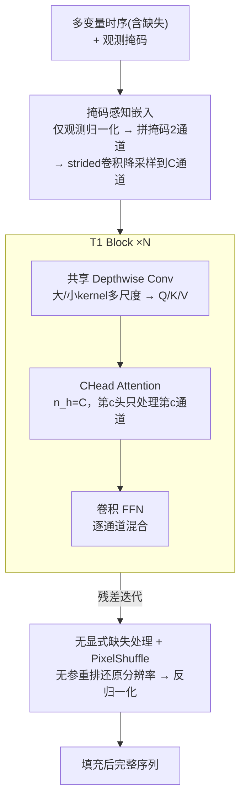

# T1: One-to-One Channel-Head Binding for Multivariate Time-Series Imputation

**会议**: ICLR 2026  
**arXiv**: [2602.21043](https://arxiv.org/abs/2602.21043)  
**代码**: [GitHub](https://github.com/Oppenheimerdinger/T1)  
**领域**: 时间序列/缺失值填充  
**关键词**: 时序填充, CNN-Transformer混合, 通道-头绑定, 选择性信息传递, 缺失模式泛化

## 一句话总结

提出T1——CNN-Transformer混合架构，核心创新是Channel-Head Binding（CHead Attention）：共享Depthwise Conv为每个变量提取C种时序特征（趋势/周期/突变等），然后将每个CNN通道与一个注意力头一对一绑定，使跨变量信息传递在特征级别独立进行。当缺失导致某通道无法提取有效模式时，对应注意力头自动降权，实现无需显式设计的自适应缺失处理。在11个基准数据集上MSE平均降低46%，70%极端缺失下优势更大。

## 研究背景与动机

**领域现状**：多变量时序填充需要同时完成两项任务——(1)从稀疏观测中提取时序模式；(2)跨变量传递互补信息以辅助重建。这两项任务高度耦合：时序特征被缺失污染后，跨变量传递会放大误差；而朴素的跨变量传递又无法区分哪些变量在当前缺失模式下是可靠的。

**现有方法的四种架构范式及其局限**：

| 架构范式 | 代表方法 | 时序建模 | 跨变量建模 | 核心缺陷 |
|---------|---------|---------|----------|---------|
| 时间轴tokenization | SAITS, PatchTST | ✓ 注意力建模长程依赖 | ✗ 所有变量混在同一token | 缺失值直接污染token表示→污染传播到所有计算 |
| 变量轴tokenization | iTransformer | △ 整个序列压缩为单token | ✓ 纯变量间注意力 | 丧失特征级选择性，所有时序模式被强制融合 |
| 双轴tokenization | ImputeFormer, CSDI | ✓ 时间轴注意力 | ✓ 变量轴注意力 | 缺失在两轴间形成"断裂路径"，中间表示不可靠 |
| 时序CNN | ModernTCN, TimesNet | ✓ 多尺度卷积高效提取 | △ 仅静态pointwise mixing | 跨变量信息传递能力有限且无法适应缺失模式 |

**核心观察**：CNN擅长从稀疏观测中提取时序特征（卷积本身对局部缺失天然鲁棒），Transformer擅长动态建模变量间关系。关键问题是如何让两者"正确对接"——朴素拼接会导致CNN提取的多通道特征在注意力层被混合，使得被缺失污染的通道连累可靠通道。

**核心idea**：建立CNN通道与注意力头之间的一对一绑定，让每个注意力头只处理一种特征的跨变量传递，实现特征级别的选择性信息通道。

## 方法详解

### 整体框架

T1要解决的是多变量时序填充里"提时序特征"和"跨变量传信息"互相干扰的难题：缺失会污染时序特征，被污染的特征再去跨变量传递就会放大误差。它的破局思路是分工——让CNN从稀疏观测里鲁棒地提取时序特征、让Transformer做动态的跨变量信息传递，再用"CNN通道与注意力头一对一绑定"把两者在**特征级**精确对接，从而把被缺失污染的通道隔离开。

整条流水线分三段。输入的多变量序列先进**掩码感知嵌入**：每个变量只用观测位置做归一化、与观测掩码拼成2通道、经strided卷积降采样为$C$通道隐表示。隐表示再经$N$个堆叠的**T1 Block**循环处理，每个Block依次做"**共享 Depthwise Conv**提多尺度时序特征 → **CHead Attention**按通道做跨变量传递 → 卷积FFN逐通道混合"。最后由**无显式缺失处理 + PixelShuffle**重建段用无参数的1D PixelShuffle还原时间分辨率、反归一化输出完整序列。

### 关键设计

**1. 共享 Depthwise Conv：为按通道做跨变量注意力提供语义对齐**

朴素地把CNN提取的多通道特征concat进注意力，会让不同通道在头内混合、语义错位，后续按通道传递就失去意义。T1的每个Block第一步改用**所有变量共享权重**的Depthwise Conv，为每个变量的每个通道独立提取时序特征，并以大、小两种kernel并行做多尺度分析生成Q/K/V：

$$Q_{m,c} = \text{DWConv}_{\text{large},Q}(Z_{m,c}) + \text{DWConv}_{\text{small},Q}(Z_{m,c})$$

共享权重保证第$c$个通道在所有变量上提取的是**同一类型**的时序模式（例如第3个通道总是捕捉周期性），于是不同变量的第$c$个通道天然语义对齐——这正是下一步按通道做跨变量注意力能成立的前提。

**2. CHead Attention：通道-头一对一绑定实现选择性信息传递**

这是T1的核心创新，也是回答"如何让缺失污染的通道不连累可靠通道"的关键。传统多头注意力每个头处理混合特征的子空间；T1令注意力头数$n_h = C$恰好等于CNN通道数，第$c$个头**只**处理所有变量的第$c$个通道：

$$O_c = \text{Softmax}\!\left(\frac{Q_c K_c^T}{\sqrt{L}}\right) V_c, \quad Q_c, K_c, V_c \in \mathbb{R}^{M \times L}$$

各头输出拼接后再过pointwise conv、LayerNorm与残差连接。由于每条信息通道只传递一种特征，当某个变量的第$c$个通道因缺失提取不到有效模式时，该通道特征自然偏弱，对应注意力头便给它低权重，污染被锁在单一通道内而不会扩散到其他特征。这种特征级隔离让"选择性信息传递"无需任何显式缺失处理就自动发生。

**3. 掩码感知嵌入 + 无显式缺失处理：用结构而非规则应对缺失**

显式的mask attention或缺失率条件都依赖对缺失模式的先验假设，换一种缺失方式就可能失效。T1只在embedding层把信息交代清楚：对每个变量$x^{(m)}$先做**仅从观测位置**（$\Omega_{m,t}=1$）估计均值方差的instance normalization，再把归一化序列与观测掩码拼成2通道输入$[x_{\text{norm}}^{(m)}; \Omega^{(m)}] \in \mathbb{R}^{2 \times T}$，经$C$个滤波器的strided 1D Conv降采样到$z^{(m)} \in \mathbb{R}^{C \times L}$并叠加可学习变量编码$E_{\text{var}}^{(m)}$。此后整个网络不再对缺失位置做任何特殊处理，全靠CHead Attention的自适应降权来兜底。重建端则用1D PixelShuffle（无参数，从$\mathbb{R}^{M \times C \times L}$重排为$\mathbb{R}^{M \times (C/r) \times (L \cdot r)}$，$r=T/L$）还原分辨率，避开转置卷积的棋盘格伪影。这种"结构性"方案不绑定任何缺失先验，因此对点缺失、block缺失和自然缺失都能泛化。

### 损失函数 / 训练策略

T1以随机掩码自监督训练：训练时统一对输入施加40%的随机缺失并在被遮位置上回归重建。得益于不依赖缺失先验的结构设计，模型在40%缺失下训练后可直接泛化到10%–70%等不同缺失率而无需重训，且所有11个数据集共用同一套超参，无需逐数据集调参。

## 实验关键数据

### 点缺失场景：9个基准数据集（4种缺失率平均）

| 数据集 | T1 (MSE) | PatchTST | ModernTCN | iTransformer | TimeMixer++ | ImputeFormer | SAITS |
|-------|----------|----------|-----------|-------------|------------|-------------|-------|
| ETTh1 | **0.049** | 0.082 | 0.083 | 0.129 | 0.132 | 0.223 | 0.092 |
| ETTh2 | **0.036** | 0.049 | 0.051 | 0.064 | 0.068 | 0.429 | 0.275 |
| ETTm1 | **0.022** | 0.038 | 0.040 | 0.063 | 0.052 | 0.086 | 0.051 |
| ETTm2 | **0.017** | 0.024 | 0.026 | 0.032 | 0.030 | 0.151 | 0.103 |
| Weather | **0.029** | 0.037 | 0.038 | 0.090 | 0.034 | 0.042 | 0.034 |
| PEMS03 | **0.021** | 0.038 | 0.056 | 0.048 | 0.044 | 0.080 | 0.060 |
| Exchange | **0.002** | 0.003 | 0.009 | 0.004 | 0.002 | 0.031 | 0.180 |
| Illness | **0.038** | 0.130 | 0.260 | 0.205 | 0.238 | 0.636 | 0.614 |
| Electricity | **0.043** | 0.089 | 0.121 | 0.090 | 0.071 | 0.076 | 0.152 |
| **平均** | **0.027** | 0.050 | 0.070 | 0.079 | 0.075 | 0.210 | 0.176 |

T1平均MSE 0.027，比第二名PatchTST (0.050) 降低**46%**，比专用填充器PSW-I (0.062) 降低**56%**。

### 不同缺失率下的鲁棒性（9数据集平均）

| 测试缺失率 | T1 | PatchTST | ModernTCN | iTransformer | PSW-I |
|-----------|-----|----------|-----------|-------------|-------|
| 10% | **0.017** | 0.040 | 0.063 | 0.057 | 0.048 |
| 30% | **0.021** | 0.038 | 0.048 | 0.061 | 0.058 |
| 50% | **0.027** | 0.048 | 0.059 | 0.076 | 0.068 |
| 70% | **0.049** | 0.092 | 0.135 | 0.128 | 0.093 |

70%极端缺失下T1的MSE (0.049) 仅为PatchTST (0.092) 的一半，说明CHead Attention的选择性机制在高缺失率下价值最大。模型训练时使用40%缺失率，测试时直接泛化到其他缺失率无需重训练。

### Block缺失场景（模拟传感器故障）

测试时组合5%点缺失 + 0.15%概率的24-96步连续block缺失。T1平均MSE 0.026，比PatchTST (0.050) 降低**48%**。在Illness数据集上优势最大：T1=0.037 vs PatchTST=0.125。

### 自然缺失数据集

- **PhysioNet2012**（ICU数据，~80%固有缺失+额外人工缺失）：T1平均MSE 0.075，比第二名DLinear (0.097) 降低**23%**。在总缺失率高达94%时仍保持合理性能（MSE=0.106）。
- **AQI36**（空气质量，15-30%自然缺失）：T1 MSE 0.226，比PatchTST (0.262) 降低**13%**。

### 消融实验

| 组件 | 替代方案 | 平均MSE | 性能下降 |
|------|---------|--------|---------|
| **T1完整模型** | — | **0.033** | — |
| 跨变量机制 | Pointwise Conv替代注意力 | 0.037 | +12.91% |
| 跨变量机制 | 完全移除 | 0.051 | +56.16% |
| 通道-头绑定 | 8通道/头 | 0.035 | +7.45% |
| 通道-头绑定 | 16通道/头 | 0.038 | +16.86% |
| 通道-头绑定 | 32通道/头 | 0.037 | +14.57% |
| Embedding | 移除掩码通道 | 0.034 | +3.64% |
| 重建方法 | 线性上采样替代PixelShuffle | 0.034 | +3.19% |

几个关键发现：(1) 完全移除跨变量建模导致56%性能下降→跨变量信息对填充至关重要；(2) 用静态Conv替代注意力仍有13%下降→动态选择性比固定模式重要；(3) 一对一绑定(128通道/头)显著优于8/16/32通道分组→特征级粒度的隔离是关键；(4) 有趣的是16通道/头比32通道/头更差→存在非单调关系，过粗的分组反而引入有害的特征混合。

### 表示分析

**逐层缺失响应**：在ETTh1上固定其他变量40%缺失，将目标变量缺失率从10%增加到70%。第一层注意力权重下降46%（0.195→0.105），最后一层仅下降6%（0.165→0.155）。这说明浅层执行"粗略重建"，使深层可获取更完整的信息。

**通道级模式依赖**：对目标变量分别遮蔽峰值区域vs非峰值区域、高方差区域vs低方差区域（各30%）。不同遮蔽模式产生截然不同的注意力响应——遮蔽高方差区域使注意力降低10.4%，遮蔽低方差区域降低7.5%。这证实CHead Attention的调制取决于**哪些时序模式仍可观测**，而非简单的缺失比例。

## 亮点与洞察

- **"通道-头绑定"是连接CNN与Transformer的优雅接口**：传统做法是CNN提特征→concat/add→送入Transformer，特征在注意力层被混合。T1通过$n_h=C$的约束，让每个注意力头成为一条"纯净的信息管道"，只传递一种特征。这个设计几乎零额外开销但带来本质性的改进。

- **"无显式缺失处理"的哲学**：不做mask attention、不做缺失位置的特殊对待、不加缺失率条件。整个架构的结构本身就天然处理缺失——CNN通道对缺失区域提取弱特征，注意力自动降权。这种"结构性解决方案"比"显式处理"更优雅也更鲁棒。

- **46%的MSE降低在成熟问题上非常罕见**。时序填充已有大量方法，如此大的改进说明之前的方法在架构选择上存在根本性的妥协——要么时序建模好但跨变量差（CNN），要么跨变量好但时序被污染（Transformer）。T1找到了正确的分工点。

- **统一超参的实用价值**：所有11个数据集使用相同配置，无需per-dataset调参。这在实际部署中极大降低使用门槛，暗示架构本身的归纳偏置足够好。

## 局限与展望

- 序列长度固定为96，未验证长序列（如1000+步）的可扩展性，PixelShuffle的上采样比例$r=T/L$在超长序列下可能需要调整
- 训练采用简单的随机掩码自监督，未探索更高级的掩码策略（如课程学习式递增缺失率）
- CHead Attention的注意力矩阵大小为$M \times M$（变量数×变量数），当变量数极多（如数千传感器）时可能需要稀疏化
- 未与扩散模型（CSDI/SSSD）在生成质量和多样性上做深入对比——扩散模型能生成多个可能的填充结果，T1只给出点估计

## 相关工作与启发

- **vs ModernTCN**：T1直接使用ModernTCN的DWConv设计做时序特征提取，但将其静态pointwise mixing替换为动态CHead Attention→这一改动贡献了56%中的大部分性能提升
- **vs iTransformer**：同样用变量轴注意力，但iTransformer将整个序列压缩为单token丧失特征级选择性，T1通过CHead Attention保持C个独立的信息通道
- **vs ImputeFormer**：双轴注意力理论上覆盖全面，但缺失在两轴间形成"信息断裂"，T1通过让CNN先在时间轴做鲁棒特征提取避免了这个问题
- **启发**：通道-头绑定的思路可能适用于其他需要"可靠性感知的跨维度信息传递"的场景，如多传感器融合、多模态学习中某模态缺失的情况

## 评分

- 新颖性: ⭐⭐⭐⭐⭐ CHead Attention概念精巧，一对一绑定的约束简单但效果本质性
- 实验充分度: ⭐⭐⭐⭐⭐ 11数据集×3种缺失场景×4种缺失率+自然缺失+消融+表示分析
- 写作质量: ⭐⭐⭐⭐⭐ 动机逻辑链完整，四种范式的对比图直观，消融设计有洞察力
- 价值: ⭐⭐⭐⭐⭐ 46%MSE降低是时序填充领域的突破性贡献，统一超参极具实用性

<!-- RELATED:START -->

## 相关论文

- [\[ICLR 2026\] CPiRi: Channel Permutation-Invariant Relational Interaction for Multivariate Time Series Forecasting](cpiri_channel_permutation-invariant_relational_interaction_for_multivariate_time_se.md)
- [\[NeurIPS 2025\] Channel Matters: Estimating Channel Influence for Multivariate Time Series](../../NeurIPS2025/time_series/channel_matters_estimating_channel_influence_for_multivariate_time_series.md)
- [\[ICLR 2026\] Routing Channel-Patch Dependencies in Time Series Forecasting with Graph Spectral Decomposition](routing_channel-patch_dependencies_in_time_series_forecasting_with_graph_spectra.md)
- [\[ICML 2026\] HELIX: Hybrid Encoding with Learnable Identity and Cross-dimensional Synthesis for Time Series Imputation](../../ICML2026/time_series/helix_hybrid_encoding_with_learnable_identity_and_cross-dimensional_synthesis_fo.md)
- [\[ICLR 2026\] Towards Robust Real-World Multivariate Time Series Forecasting: A Unified Framework](towards_robust_real-world_multivariate_time_series_forecasting_a_unified_framewo.md)

<!-- RELATED:END -->
