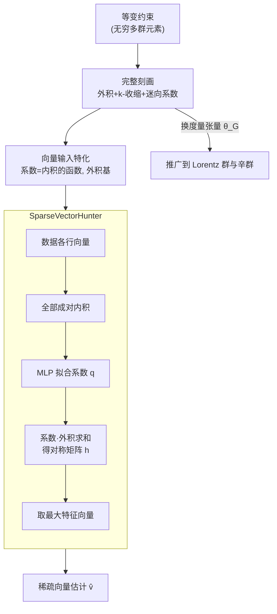

# Tensor learning with orthogonal, Lorentz, and symplectic symmetries

**会议**: ICLR 2026  
**arXiv**: [2406.01552](https://arxiv.org/abs/2406.01552)  
**代码**: [https://github.com/WilsonGregory/TensorPolynomials](https://github.com/WilsonGregory/TensorPolynomials)  
**领域**: 时间序列  
**关键词**: 等变学习, 张量函数, 正交群, Lorentz群, 辛群, 稀疏向量恢复

## 一句话总结

本文给出了关于正交群 $O(d)$、不定正交群（含 Lorentz 群）和辛群 $Sp(d)$ 对张量对角作用下的等变多项式函数的完整参数化刻画，并将其应用于设计可学习的稀疏向量恢复算法，在多种数据生成假设下超越了已有的 sum-of-squares 谱方法。

## 研究背景与动机

在机器学习中引入对称性约束已成为主流趋势——图神经网络、几何深度学习和 AI for Science 领域都在利用等变/不变结构来改善泛化性和采样效率。现有工作（如 Villar et al. NeurIPS 2021）已经研究了向量输入到张量输出的 $O(d)$-等变函数构造，但还没有统一处理高阶张量输入、不同奇偶性以及更广泛李群（如 Lorentz 群和辛群）的理论框架。

稀疏向量恢复（planted sparse vector problem）是理论计算机科学中被广泛研究的问题。Hopkins et al. (2016) 和 Mao & Wein (2022) 提出了基于 sum-of-squares 的谱方法来恢复稀疏向量，但这些方法仅在特定假设（如恒等协方差矩阵）下有理论保证。现实场景中的数据分布更加多样化，需要更灵活的算法。

本文的核心动机：能否从理论出发构建等变机器学习模型，使之既尊重底层对称性、又能通过数据学习到比手工设计更好的算法？

## 方法详解

### 整体框架

本文走的是一条"先把数学讲透、再让数据学算法"的路线。第一步在理论上给出一类等变多项式函数的**完整参数化**：把任意 $O(d)$、不定正交群（含 Lorentz 群）或辛群 $Sp(d)$ 在张量上对角作用下保持等变的函数，都写成有限个"构建块"的线性组合，这些构建块就是输入张量的外积再做收缩、加上固定的度量张量。第二步把这套参数化落到向量输入的最常用情形，发现组合系数只依赖输入向量两两之间的内积——于是用一个 MLP 去拟合系数，网络结构本身就天然等变。第三步把同一套配方搭成可学习的等变网络 SparseVectorHunter 去解稀疏向量恢复（planted sparse vector）问题：以数据各行向量为输入、构造一个对称矩阵、取其主特征向量当估计，让网络在数据上学出比手工 sum-of-squares 谱方法更好的算法。

### 关键设计

**1. $O(d)$-等变张量多项式的完整刻画：把抽象的等变约束变成可枚举的构建块**

"等变"是一个施加在无穷多群元素上的约束，没法直接写进网络。Theorem 1 证明任意从若干张量输入到张量输出的 $O(d)$-等变多项式函数 $f$，都可以写成输入张量的张量积再做 $k$-收缩的线性组合，而组合系数张量 $c$ 必须是 $O(d)$-迷向（isotropic）张量。Lemma 1 进一步把"迷向张量"这个抽象空间彻底说清：它们全部由 Kronecker delta $\delta$ 和 Levi-Civita 符号 $\epsilon$ 张量积、置换得到。于是构造等变模型不再需要碰运气，而是有了一份有限的、可枚举的基底清单——这正是框架图里"完整刻画"那一步。

**2. 向量输入的可编程特化：把刻画压缩成"内积 + 外积"**

Theorem 1 虽完整但仍偏抽象，难以直接落地。Corollary 1 把输入限制为向量（1-张量）这一最常用情形，给出极简表达：输出 rank-$k'$ 张量等于若干 Kronecker delta 与输入向量外积的各种置换排列的线性组合，而每一项的系数 $q_{t,\sigma,J}$ 只依赖输入向量两两之间的内积 $\langle v_i, v_j\rangle$ 这一组标量不变量。这一步至关重要——系数既然只是内积的函数，就可以直接用一个 MLP 去逼近（Remark 1：把多项式系数放宽成可学习的连续函数，由 Stone-Weierstrass 定理仍能逼近任意连续等变函数）。这样"满足等变性"完全由网络结构保证，无论 MLP 怎么训练，整体输出都天然等变。

**3. 推广到 Lorentz 群与辛群：只换度量张量**

把结论从 $O(d)$ 搬到保持不定双线性形式的群（不定正交群 $O(s,d-s)$，含相对论里的 Lorentz 群）和保持反对称形式的辛群 $Sp(d)$，难点是这些群非紧、不能直接对 Haar 测度积分。作者用复化（complexification）配合在 Zariski 稠密紧子群上做 Haar 平均的技巧绕过非紧性，得到 Theorem 2 与 Corollary 2/3。最终改动非常干净：把欧氏内积换成该群保持的内积 $\langle\cdot,\cdot\rangle_G$，把 Kronecker delta 换成对应群的度量张量 $\theta_G$（$O(s,d-s)$ 用 $I_{s,d-s}$、$Sp(d)$ 用辛形式 $J_d$），整套构建块照旧。这就是框架图里从"完整刻画"分出去、只改度量张量的那条支线。

**4. SparseVectorHunter（SVH）：用等变参数化拼出可学习的谱估计器**

前三个设计给出了理论配方，这个设计把它落成解稀疏向量恢复的具体网络，对齐经典谱方法"构造一个矩阵再取主特征向量"的算法骨架，只是把手工矩阵换成可学习的等变矩阵。如框架图中的 SVH 流程：网络以数据矩阵的各行向量 $a_i$ 为输入，按 Corollary 1 学一个 $d\times d$ 对称矩阵 $h$——$h$ 由所有输入行向量的对称外积 $a_i\otimes a_j$ 线性组合而成，每个组合系数由一个以全部向量对内积为输入的 MLP 给出；再取 $h$ 的最大特征值对应的特征向量作为稀疏向量估计 $\hat v$。论文还给了轻量变体 **SVH-Diag**：只保留对角项 $a_i\otimes a_i$，于是系数只依赖各向量自身的范数平方 $\|a_\ell\|^2$，参数大幅减少；当数据协方差本身是对角结构时，这种与数据结构匹配的归纳偏置反而比全模型更准。

### 损失函数 / 训练策略

训练直接优化预测向量与真实稀疏向量的对齐度，损失取 $1 - \langle \hat{v}, v_0 \rangle^2$（内积平方的补，越小越对齐）。数据划分为训练集 5000、验证集与测试集各 500；用 Adam 优化、批量大小 100、学习率按 $0.999/\text{epoch}$ 指数衰减，验证误差连续 20 个 epoch 不改善则 early stopping。规模上，SVH 约 99K 参数、SVH-Diag 约 59K，而非等变基线 BL 高达约 1.33M——等变模型用不到十分之一的参数量取胜。全部实验在单张 RTX 6000 Ada GPU 上约 18 小时跑完。

## 实验关键数据

### 主实验

实验设置：$n=100$, $d=5$, $\epsilon=0.25$，四种稀疏向量采样方式（AR, BG, CBG, BR）× 三种协方差矩阵（Identity, Diagonal, Random）。评估指标为 $\langle v_0, \hat{v} \rangle^2$（越接近 1 越好）。

| 采样方式 | 协方差 | SOS-I | SOS-II | BL | SVH-Diag | SVH |
|---------|--------|-------|--------|------|----------|-----|
| BR | Random | 0.526 | 0.526 | 0.923 | 0.437 | **0.957** |
| BR | Diagonal | 0.334 | 0.334 | 0.864 | **0.588** | 0.903 |
| BR | Identity | 0.524 | 0.524 | 0.845 | 0.317 | **0.889** |
| CBG | Random | 0.412 | 0.412 | 0.239 | 0.372 | **0.935** |
| A/R | Random | 0.610 | 0.610 | 0.241 | 0.493 | **0.938** |
| BG | Identity | **0.962** | **0.962** | 0.196 | 0.908 | 0.342 |

### 消融实验

| 配置 | 关键表现 | 说明 |
|------|---------|------|
| SVH (全内积) | Random 协方差最优 | 利用全部成对信息优势 |
| SVH-Diag (仅范数) | Diagonal 协方差最优 | 参数更少，匹配数据结构时表现佳 |
| BL (非等变) | 训练集过拟合严重 | 1.33M 参数但泛化差 |
| SOS-I / SOS-II | Identity 协方差最优 | 有理论保证的手工设计方法 |

### 关键发现

- **等变性大幅改善泛化**：非等变基线 BL 在训练集上常常达到最好的拟合，但测试集表现远不如等变模型，生动验证了"对称性改善泛化"的理论预测
- **学习方法在无理论保证区域优于 SOS**：在非恒等协方差（对角、随机）的场景，SVH/SVH-Diag显著超越 SOS 方法，这些场景目前没有理论分析
- **格局分明**：SVH 在 Random 协方差下最优，SVH-Diag 在 Diagonal 下最优，SOS 在 Identity 下最优；唯一例外是 Bernoulli-Rademacher 采样，SVH 全面胜出

## 亮点与洞察

- 非常优雅的理论-实践结合范例：先建立数学刻画，再导出可计算的架构
- Corollary 1 将高度抽象的等变函数参数化变得可实际编程——系数仅依赖标量不变量（内积），通过 MLP 学习
- 与 neural algorithmic reasoning 理念一致：ML 模型结构对齐已知算法策略
- 推广到 Lorentz 和辛群的路径非常清晰：只需替换度量张量和双线性形式
- 实验规模虽小（$n=100, d=5$），但足以揭示等变性的价值

## 局限与展望

- 实验仅在小规模设定（$n=100, d=5$）验证，未测试更大规模
- 输入为高阶张量或混合奇偶性时，实现效率会下降
- 未处理输入张量之间额外的排列不变性（如 $S_n$-不变性），这与图同构问题相关
- SVH 模型中每对向量 $(i,j)$ 都有独立的系数函数，可扩展性有限
- 缺乏与其他等变架构（如 EGNN、SE(3)-Transformers）的对比

## 相关工作与启发

- Villar et al. (2021) "Scalars are universal" 是直接前置工作，本文将其从向量推广到张量
- Hopkins et al. (2016) sum-of-squares 方法提供了基线算法
- 与 Kunisky, Moore & Wein 的 tensor cumulants 工作形成互补：后者侧重对称张量
- Stone-Weierstrass 定理保证了多项式等变函数可以逼近连续等变函数
- 启发：这种"理论驱动架构设计"的思路可应用于更多物理/数学对称性问题

## 评分
- 新颖性: ⭐⭐⭐⭐
- 实验充分度: ⭐⭐⭐
- 写作质量: ⭐⭐⭐⭐⭐
- 价值: ⭐⭐⭐⭐

<!-- RELATED:START -->

## 相关论文

- [\[ICLR 2026\] Towards Generalizable PDE Dynamics Forecasting via Physics-Guided Invariant Learning](towards_generalizable_pde_dynamics_forecasting_via_physics-guided_invariant_lear.md)
- [\[ICLR 2026\] GTM: A General Time-series Model for Enhanced Representation Learning](gtm_a_general_time-series_model_for_enhanced_representation_learning_of_time-series.md)
- [\[ICLR 2026\] FeDaL: Federated Dataset Learning for General Time Series Foundation Models](fedal_federated_dataset_learning_for_general_time_series_foundation_models.md)
- [\[ICLR 2026\] Uni-NTFM: A Unified Foundation Model for EEG Signal Representation Learning](uni-ntfm_a_unified_foundation_model_for_eeg_signal_representation_learning.md)
- [\[ICLR 2026\] Learning Recursive Multi-Scale Representations for Irregular Multivariate Time Series Forecasting](learning_recursive_multi-scale_representations_for_irregular_multivariate_time_s.md)

<!-- RELATED:END -->
