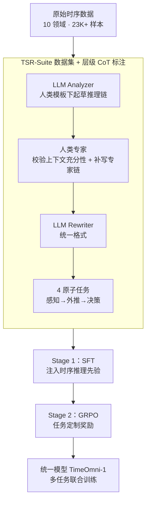

# TimeOmni-1: Incentivizing Complex Reasoning with Time Series in Large Language Models

**会议**: ICLR 2026  
**arXiv**: [2509.24803](https://arxiv.org/abs/2509.24803)  
**代码**: [GitHub](https://github.com/AntonGuan/TimeOmni-1)  
**领域**: 人体理解/时间序列  
**关键词**: 时间序列推理, LLM, 强化学习, 多任务联合训练, 因果发现

## 一句话总结

TimeOmni-1 提出了首个统一的时间序列推理模型，通过 TSR-Suite（首个推理导向的时序数据集套件）和两阶段训练（SFT注入时序先验 + RL精炼推理），在多项时间序列推理任务上显著超越 GPT-4.1。

## 研究背景与动机

时间序列理解正从基础模式分析向高级推理转变，但存在两大瓶颈：

**高质量数据匮乏**: 现有的时间序列QA数据集（如 Time-MQA）停留在表面问答层面，存在严重问题——(a) 问题过于简单，推理模型与非推理模型差距极小；(b) 上下文不充分，缺少关键信息导致模型被迫猜测而非推理

**缺乏可行的推理路径**: 尚不清楚哪些任务真正需要时间序列推理能力，现有方法局限于窄任务（如 TimeMaster 对6个数据集训练6个模型），无法跨任务迁移

作者提出两个核心**设计原则**：
- **原则1 — QA必须奖励推理**: 推理模型应显著优于非推理模型 $\bar{S}(M_{RM}) \gg \bar{S}(M_{NRM})$
- **原则2 — 上下文必须充分**: 提供足够的时间序列输入 $X$ 和辅助上下文 $C$，避免歧义

## 方法详解

### 整体框架

TimeOmni-1 把"让 LLM 真正会推理时间序列"拆成两个互补的环节：先用 TSR-Suite 这套推理导向的数据集，把感知、外推、决策三类时序能力以人类引导的推理链（CoT）形式喂给模型——这些推理链由"LLM 起草 → 人类专家校验 → LLM 规范化"的层级标注流程产出；再用两阶段课程学习把这些先验固化下来——Stage 1 用监督微调（SFT）让模型"知道该怎么想"，Stage 2 用带任务定制奖励的 GRPO 让模型"想得更准"，且全程把四个任务放进同一个模型联合训练，最终收敛成统一的 TimeOmni-1。

### 关键设计

**1. TSR-Suite：把"必须推理"和"上下文充分"写进数据集本身**

现有时序 QA 数据集（如 Time-MQA）问题太浅、上下文太少，推理模型相比非推理模型几乎没有优势，模型只能靠猜。TSR-Suite 把两条设计原则直接固化进数据：一是推理模型应显著优于非推理模型 $\bar{S}(M_{RM}) \gg \bar{S}(M_{NRM})$，二是提供足够的时序输入 $X$ 与辅助上下文 $C$ 以避免歧义。围绕这两条，它构建了 4 个原子任务，恰好覆盖"感知→外推→决策"三层能力：感知层有 Task 1 场景理解（单序列归因）和 Task 2 因果发现（多序列因果关系），外推层是 Task 3 事件感知预测（在事件扰动下推断未来趋势），决策层是 Task 4 决策制定（整合前两类能力做行动选择）。整套数据含 23K+ 样本、跨越 10 个领域，其中 2.3K 由人类引导精心策划。这条链路本身就编码了"先理解、再预测、再行动"的认知逻辑，给模型铺出一条真正可走的推理路径。

**2. 层级 CoT 标注流程：用人机协作压低推理链的噪声与成本**

高质量推理链既不能全靠人写（太贵）也不能全靠 LLM 生成（容易错），TimeOmni-1 用三步分工来填这个数据缺口：先由 LLM Analyzer 在人类引导模板下生成初版推理链（Step-1 CoT），再由人类专家逐条校验上下文是否充分、并专门为 LLM 出错的案例撰写专家推理链（Step-2 CoT），最后由 LLM Rewriter 把专家推理链规范化成统一格式。人类引导模板是其中的关键——GPT-4.1 在因果发现上零样本只有 28.7%，套上人类引导模板后直接跳到 71.1%，说明模板提供的不是答案、而是推理的脚手架。

**3. 任务定制的 RL 奖励：离散任务和序列任务各走各的打分方式**

四个任务的输出形态差异很大，用同一种奖励会失真，因此 Stage 2 的 GRPO 按任务类型拆开打分。所有任务先过一道格式奖励 $\mathcal{R}_{format}$，强制模型输出 `<think></think><answer></answer>` 结构；离散任务（Task 1、2、4）用精确匹配的准确率奖励 $\mathcal{R}_{discrete} \in \{0,1\}$；序列预测任务（Task 3）则拆成两部分——预测序列长度正确给计数奖励 $\mathcal{R}_{count}=0.1$，再叠加一个把 MAE 经指数衰减映射后的归一化奖励，让"长度对不对"和"数值准不准"被分别激励。

**4. 多任务联合训练：让三类能力在同一个模型里互相补益**

以往窄任务方法（如 TimeMaster 对 6 个数据集训 6 个模型）无法跨任务迁移。TimeOmni-1 把全部任务塞进单一模型联合训练，并用两组渐进实验证明了正向迁移：一是渐进能力迁移——即便完全不直接训练决策任务、仅靠感知+外推训练，决策准确率就从 25.5% 升到 31.3%，说明前置能力会自发外溢到决策；二是渐进能力补充——逐步把前置任务加入联合训练，决策准确率从 40.9% 进一步升到 47.9%。这两条共同支撑了"训练一次、跨任务复用"的范式。

### 损失函数 / 训练策略

Stage 1 用标准 SFT 交叉熵损失在人类引导的 CoT 数据上微调，把时序推理先验注入模型。Stage 2 改用 GRPO（Group Relative Policy Optimization），奖励按任务类型组合：离散任务取 $R = \mathcal{R}_{format} + \mathcal{R}_{discrete}$，序列预测任务取 $R = \mathcal{R}_{format} + \mathcal{R}_{count} + \text{exp-decay}(\text{MAE})$。

## 实验关键数据

### 主实验

**四个任务的 ID/OOD 测试（ACC %，Task 3 为 MAE↓）:**

| 方法 | 场景理解(ID) | 因果发现(ID) | 事件预测(ID/MAE) | 决策(ID) |
|------|------------|------------|----------------|---------|
| GPT-4.1 | 85.5 | 28.7 | 13.79 | 25.5 |
| Qwen2.5-7B | 48.5 | 21.6 | 23.28 | 25.5 |
| Time-R1 | 30.9 | 30.2 | 17.61 | 27.8 |
| **TimeOmni-1** | **90.7** | **69.3** | **14.30** | **47.9** |

TimeOmni-1 在因果发现上超越 GPT-4.1 达 40.6%（ID），决策任务超越 22.4%。

### 消融实验

| 配置 | 因果发现(ID) | 决策(ID) | 说明 |
|------|------------|---------|------|
| Base model | 21.6 | 25.5 | LLM 缺乏时序先验 |
| ANS-SFT (答案监督) | 30.5 | 51.0 | 仅拟合答案分布，无推理 |
| CoT-SFT (Stage 1) | 67.7 | 40.9 | 推理链注入显著提升因果发现 |
| CoT-SFT+RL (Stage 2) | 69.3 | 47.9 | RL 精炼进一步提升 |
| 单任务训练(CoT-SFT+RL) | 67.5 | 40.9 | 联合训练优于单任务 |

### 关键发现

- **LLM 天然缺乏时序推理先验**: 基础模型因果发现仅21.6%（接近随机33.3%），单独RL无法建立此能力
- **人类引导模板至关重要**: GPT-4.1 零样本因果发现28.7%，使用人类引导模板后升至71.1%
- **联合训练产生互益**: 跨任务联合训练在所有任务上优于单任务训练，支持"训练一次、跨任务使用"范式
- **通用推理能力未退化**: TimeOmni-1 在 DROP、GPQA、ReClor 等通用推理基准上平均准确率比基础模型提升16.5%
- **SR(有效响应率)**: TimeOmni-1 在所有任务上 SR≥93.8%，远优于现有时序专用模型（如 ChatTS 在事件预测上 SR=0%）

## 亮点与洞察

1. **对时序推理任务的系统化定义**: 首次明确提出"推理必要性"和"上下文充分性"两个设计原则，构建了真正需要推理的任务体系
2. **感知→外推→决策的渐进能力路径**: 体现了"先理解再预测再行动"的认知逻辑，任务设计有深度
3. **两阶段训练的互补关系**: SFT 负责"知道该怎么想"，RL 负责"想得更准"——缺一不可
4. **跨任务正向迁移的实证**: 通过精心设计的渐进实验，证明了时序推理的三大能力存在内在联系

## 局限与展望

1. **数据规模有限**: TSR-Suite 仅23K样本（其中人工标注2.3K），与通用NLP数据集相比较小
2. **任务类型集中**: 4个任务以分类和预测为主，缺少如异常检测、趋势解释等更多样的推理任务
3. **OOD泛化仍有差距**: 事件预测任务 OOD MAE 为145.53（ID为14.30），跨域泛化仍需提升
4. **基础模型限制**: 仅基于 Qwen2.5-7B 验证，未探索更大模型的 scaling 行为
5. **推理链质量依赖人类模板**: 数据构建高度依赖人类引导模板，扩展性受限

## 相关工作与启发

- **Time-R1** 是最接近的时序推理模型，但局限于经典预测，TimeOmni-1 扩展至多任务推理
- **DeepSeek-R1** 证明了 RL 可以提升推理能力，TimeOmni-1 将这一范式引入时序领域
- **Time-MQA** 数据集虽大但任务过简单且上下文不足，TSR-Suite 针对性改进
- 对**时间序列智能**领域有重要启发：通用时序模型需要注入推理先验而非仅仅模式拟合

## 评分

- **新颖性**: ⭐⭐⭐⭐⭐ 首次系统构建时序推理任务体系 + 首个统一时序推理模型
- **实验充分度**: ⭐⭐⭐⭐⭐ 四任务ID/OOD评测 + 渐进实验 + 消融 + 通用能力评估，非常全面
- **写作质量**: ⭐⭐⭐⭐ 结构清晰，设计原则驱动，但部分图表信息密度过高
- **价值**: ⭐⭐⭐⭐⭐ 开辟了时间序列推理的新方向，数据+模型+代码全部开源

<!-- RELATED:START -->

## 相关论文

- [\[ICLR 2026\] Reasoning on Time-Series for Financial Technical Analysis](reasoning_on_time-series_for_financial_technical_analysis.md)
- [\[NeurIPS 2025\] PlanU: Large Language Model Reasoning through Planning under Uncertainty](../../NeurIPS2025/time_series/planu_large_language_model_reasoning_through_planning_under_uncertainty.md)
- [\[ICML 2026\] TimeOmni-VL: Unified Models for Time Series Understanding and Generation](../../ICML2026/time_series/timeomni-vl_unified_models_for_time_series_understanding_and_generation.md)
- [\[ICLR 2026\] Unlocking the Value of Text: Event-Driven Reasoning and Multi-Level Alignment for Time Series Forecasting](unlocking_the_value_of_text_event-driven_reasoning_and_multi-level_alignment_for.md)
- [\[ICML 2026\] Adaptive Time Series Reasoning via Segment Selection](../../ICML2026/time_series/adaptive_time_series_reasoning_via_segment_selection.md)

<!-- RELATED:END -->
