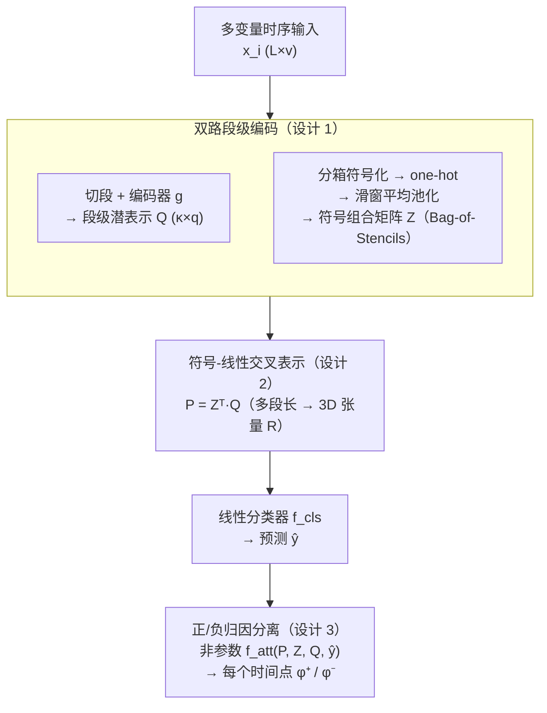

# TimeSliver: Symbolic-Linear Decomposition for Explainable Time Series Classification

**会议**: ICLR 2026  
**arXiv**: [2601.21289](https://arxiv.org/abs/2601.21289)  
**代码**: [GitHub](https://github.com/pandeyakash23/TimeSliver)  
**领域**: 时间序列/可解释性  
**关键词**: 时间归因, 符号抽象, 线性组合, 可解释分类, 正负归因

## 一句话总结
提出TimeSliver——可解释性驱动的深度学习框架,联合利用原始时序数据和符号抽象(分箱)构建保持原始时间结构的表示,每个元素线性编码对应时间段对最终预测的贡献→赋予每个时间点正/负归因分数,在7个数据集上时间归因准确率超越其他方法11%,同时在26个UEA基准上预测性能持平SOTA。

## 研究背景与动机

**领域现状**：深度模型（CNN/LSTM/Transformer）在时序分类上有很强的性能，但本身不可解释。而在医疗、金融、法律这类高风险应用里，"为什么这么判"和"判得对不对"同等重要。

**现有痛点**：(1) 事后解释（DeepLift、Integrated Gradients、SHAP）对基准状态敏感、假设特征独立、且把各时间点当成独立处理而忽略时序依赖，跨数据集难以泛化；(2) 用 Transformer 的注意力权重当归因并不忠实——近期研究表明注意力不能可靠反映时间重要性；(3) 基于多示例学习（MIL）的归因方法尚未扩展到多变量时序，对比也有限；(4) 几乎所有方法只给单一标量重要性，无法区分某段是"把预测推向预测类"还是"推离预测类"。

**切入角度**：与其在黑盒外面套近似工具，不如设计一个**内生可解释**的架构——让表示层做线性组合，使每个时间段对预测的贡献可以直接、闭式地算出来，从而既不依赖事后方法、也能区分正/负归因。

## 方法详解

### 整体框架

TimeSliver 把可解释性写进架构本身，而不是事后再拿一套近似工具去解释一个黑盒。给一条多变量时序 $\mathbf{x}_i\in\mathbb{R}^{L\times v}$，它先把序列切成与原始时间位置对齐的若干段，沿两条路并行编码：一路用编码器 $g(\cdot;\theta_q)$ 得到**段级潜表示** $\bm{Q}$，保留每段的连续数值特征；另一路把序列**分箱（binning）符号化**后做滑窗平均池化，得到**符号组合矩阵** $\bm{Z}$（论文称之为 Bag-of-Stencils）。随后第三步把两者做一次**线性交叉** $\bm{P}=\bm{Z}^{\top}\bm{Q}$，得到一个长度无关、聚合了全局判别信息的表示，直接喂给线性分类器 $f_{cls}$ 出预测 $\hat{y}$。因为从 $\bm{P}$ 到 $\hat{y}$ 全程线性，每个时间段对预测的贡献都能闭式拆出来——非参数函数 $f_{att}(\bm{P},\bm{Z},\bm{Q},\hat{y})$ 再据此给每个时间点读出带符号的正/负归因分数 $\{\phi_k^{+},\phi_k^{-}\}$，无需任何事后近似。

### 关键设计

**1. 双路段级编码：潜表示 $\bm{Q}$ 与符号组合 $\bm{Z}$ 互补**

单靠原始信号会把高频噪声当成信号，单靠符号抽象又会丢掉精细的数值结构，TimeSliver 让两路各司其职、且都对齐到同一组时间段。第一路把序列切成长度 $m$ 的连续段，每段过编码器 $g(\cdot;\theta_q)$ 得到段级潜表示 $\bm{Q}\in\mathbb{R}^{\kappa\times q}$（$\kappa$ 为段数），保留"第 $k$ 段对应原始哪段时间"的对应关系，使归因能落回具体时间点。第二路先对每个变量独立分箱成 $n$ 个符号、做 one-hot 并按变量拼接得到 $\bm{\mathcal{O}}\in\mathbb{R}^{L\times(n\cdot v)}$，再用滑窗平均池化得到符号组合矩阵 $\bm{Z}\in\mathbb{R}^{\kappa\times(n\cdot v)}$——它的每一行就是某段内各符号出现的归一化频率。分箱是一次有损压缩，抹掉无关数值抖动、只留模式级结构，等于给模型"先看形状再看细节"的归纳偏置；按变量分别编码而非共享符号空间，则避免了多变量间的语义混淆。

**2. 符号-线性交叉表示：用 $\bm{P}=\bm{Z}^{\top}\bm{Q}$ 把"可解释"变成架构保证**

事后解释之所以不忠实，根源在于真实模型高度非线性，任何梯度或扰动都只是局部近似。TimeSliver 不做逐元素相乘，而是把两路做一次**矩阵交叉**：

$$\bm{P}=\bm{Z}^{\top}\bm{Q}\in\mathbb{R}^{(n\cdot v)\times q},\qquad P_{ij}=\sum_{k}Z_{ki}\,Q_{kj}$$

每个 $P_{ij}$ 都是所有时间段按"符号出现频率"加权后的潜特征求和——符号没出现的段被压低、频繁出现的段被放大（论文把 $\bm{Z}$ 的每行当成一张"模板/stencil"去调制 $\bm{Q}$）。这样 $\bm{P}$ 既捕捉了跨段的全局判别交互，尺寸又只取决于 $(n\cdot v)\times q$、与序列长度 $L$ 无关，因此参数更少。把 $\bm{P}$（可对多个段长 $\{m_1,\dots\}$ 堆成 3D 张量 $\bm{\mathcal{R}}$）送进线性分类器 $f_{cls}$ 得 $\hat{y}$；全程线性意味着"某段贡献多少"在数学上严格成立，归因不再依赖任何人为选定的基准状态，天然规避了 DeepLift/IntGrad 对基准敏感、SHAP 假设特征独立的老问题。

**3. 正/负归因分离：区分"推向"与"推离"预测类**

多数方法只给一个标量重要性，无法回答"这一段到底支持还是反对当前判断"。由于整条 $\bm{P}\!\to\!\hat{y}$ 的通路是线性的，TimeSliver 用一个**非参数**函数直接读出每个时间点的带符号贡献：

$$\{\phi_k^{+},\phi_k^{-}\}_{k=1}^{L}=f_{att}(\bm{P},\bm{Z},\bm{Q},\hat{y})$$

$\phi_k^{+}$ 量化第 $k$ 个时间点把预测**推向**预测类的程度，$\phi_k^{-}$ 量化把预测**推离**的程度。$f_{att}$ 复用训练好的 $\bm{P},\bm{Z},\bm{Q}$ 与分类 logits，不引入新参数、无需再训练或近似。区分正负让解释从"哪里重要"升级到"哪里支持、哪里反对"，在医疗、故障诊断这类需要完整决策图景的场景里信息量明显更高。

下表对比 TimeSliver 与事后方法在归因机制上的根本差异：

| 特性 | 事后方法 | **TimeSliver** |
|------|---------|---------------|
| 归因来源 | 梯度/perturbation | 架构内生 |
| 基准依赖 | 是 | 否 |
| 正/负归因 | 不区分 | **区分** |
| 忠实性 | 存疑 | **保证(线性)** |

## 实验关键数据

### 时间归因质量（7 个数据集，12 基线）

| 方法 | 归因准确率 | 说明 |
|------|----------|------|
| DeepLift | 基线 | 事后 |
| IntGrad | 中 | 事后 |
| Grad-CAM | 低 | 不适合时序 |
| SHAP | 中 | 慢 |
| Attention | 低(不忠实) | 内在 |
| **TimeSliver** | **+11%** | 内生线性 |

跨 4 个合成 + 3 个真实应用（音频、睡眠分期、机器故障诊断），TimeSliver 在识别正/负影响时间段上一致领先，平均比次优方法高约 11%；更换分箱策略（SAX / ABBA / SFA）后归因质量基本不变（合成集 AUPRC 0.94，仍约高 10%），说明符号-线性组合的可解释性不依赖某种特定离散化方式。

### 预测性能（26 个 UEA 基准）

| 方法 | 平均准确率 | 可解释性 |
|------|----------|---------|
| SOTA(各种) | 最好 | 无 |
| **TimeSliver** | **-2%(追平)** | **强** |

在 26 个多变量 UEA 任务上，TimeSliver 的预测准确率落在 SOTA 的 2% 以内，说明把"可解释"写进线性架构并没有牺牲分类能力。

### 关键发现
- 线性组合不损失预测能力→可解释性和性能不矛盾
- 正/负归因→揭示哪些时间段"支持"vs"反对"预测→比单一归因更丰富
- 符号抽象→帮助忽略无关波动→关注结构模式
- 跨域一致→音频/睡眠/故障诊断都work

## 亮点与洞察
- **"线性=可解释的保证"**：不是用复杂方法近似归因→而是用线性架构保证归因精确→设计层面解决问题。
- **"正+负归因"的信息量**：知道某时间段"支持预测"还不够→还知道"反对预测"的时间段→为决策提供完整图景。
- **符号抽象的优雅**：分箱看似简单→但压缩了不必要细节→让模型关注结构模式而非数值→类似人类的时序理解方式。
- **预测-可解释性的帕累托前沿**：TimeSliver在两个轴上都好→不是牺牲一个换另一个。

## 评分
- 新颖性: ⭐⭐⭐⭐ 符号-线性分解的架构创新
- 实验充分度: ⭐⭐⭐⭐⭐ 7归因数据集+26UEA基准+12基线
- 写作质量: ⭐⭐⭐⭐ 可解释性概念清晰
- 价值: ⭐⭐⭐⭐ 对可解释时间序列分析有重要贡献

<!-- RELATED:START -->

## 相关论文

- [\[AAAI 2026\] Counterfactual Explainable AI (XAI) Method for Deep Learning-Based Multivariate Time Series Classification](../../AAAI2026/time_series/counterfactual_explainable_ai_xai_method_for_deep_learning-based_multivariate_ti.md)
- [\[ICLR 2026\] Routing Channel-Patch Dependencies in Time Series Forecasting with Graph Spectral Decomposition](routing_channel-patch_dependencies_in_time_series_forecasting_with_graph_spectra.md)
- [\[ICLR 2026\] Weight-Space Linear Recurrent Neural Networks](weight-space_linear_recurrent_neural_networks.md)
- [\[AAAI 2026\] ProbFM: Probabilistic Time Series Foundation Model with Uncertainty Decomposition](../../AAAI2026/time_series/probfm_probabilistic_time_series_foundation_model_with_uncertainty_decomposition.md)
- [\[AAAI 2026\] A Unified Shape-Aware Foundation Model for Time Series Classification](../../AAAI2026/time_series/a_unified_shape-aware_foundation_model_for_time_series_class.md)

<!-- RELATED:END -->
