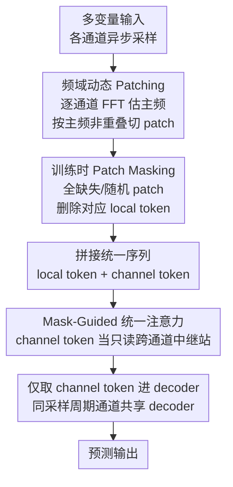

# Towards Robust Real-World Multivariate Time Series Forecasting: A Unified Framework

**会议**: ICLR 2026  
**arXiv**: [2506.08660](https://arxiv.org/abs/2506.08660)  
**代码**: 有  
**领域**: 时间序列 / 鲁棒预测  
**关键词**: multivariate time series, asynchronous sampling, block-wise missingness, channel dependency, ChannelTokenFormer

## 一句话总结

提出ChannelTokenFormer（CTF），一个统一的Transformer框架同时解决真实世界多变量时序预测的三大挑战：(1) 通道间复杂依赖——channel token跨通道注意力；(2) 各通道异步采样——频域动态patching保持原始分辨率；(3) 测试时块缺失——训练时patch masking模拟+推理时直接移除全缺失patch，在ETT/SolarWind/Weather/EPA/CHS等6个数据集上全面SOTA。

## 研究背景与动机

**领域现状**：多变量时序预测是工业监控、能源系统、医疗健康等领域的核心任务。现有模型大多假设通道同步采样、完整观测，与真实世界数据特性严重不符。

**现有痛点**：
    - **通道依赖 vs 独立**：CI设计（PatchTST等）鲁棒但丢失跨通道信息；CD设计（CrossGNN等）利用相关性但对分布偏移敏感——两者此消彼长
    - **异步采样普遍存在**：不同传感器物理特性不同→采样周期不同（温度1小时、压力15分钟）→大多方法假设同步对齐→插值引入信号失真
    - **块缺失(block-wise missingness)**：传感器故障/通信中断→长时间连续缺失→naive插值在动态信号上不可靠→需跨通道推断
    - **无现有方法同时处理三者**：CD方法忽略异步和缺失，CI方法丢失依赖，irregular方法不处理块缺失

**核心矛盾**：真实场景中三大挑战同时存在且相互耦合，分别解决单个挑战的方法组合起来效果不佳。

**本文目标** 设计一个统一架构，同时处理通道依赖、异步采样和块缺失，无需插值预处理。

**切入角度**：Channel token作为通道级紧凑表示，天然可以聚合不同长度的local token序列（处理异步）、在通道间交互（捕获依赖）、跳过缺失patch（处理缺失）——一个设计解决三个问题。

**核心 idea**：将channel token从单纯的通道摘要token重新定义为异步-缺失-依赖三位一体的全局注意力锚点。

## 方法详解

### 整体框架

CTF 要在一个 Transformer 里同时扛住异步采样、块缺失和跨通道依赖这三件原本得各自处理的事，核心办法是把每个通道压成一个 channel token，让它充当通道间的"信息锚点"。整条 pipeline 这样转：先对每个通道单独做 FFT 找出它的主频，据此确定该通道的 patch 长度并做非重叠切分，于是采样越密的通道切出越多的 local token、越疏的越少——通道间 token 数量天然不等；训练时再随机删掉一部分 patch、测试时删掉全缺失的 patch，让注意力直接跳过这些空位。每个通道再额外配一组 learnable channel token，把它和该通道的 local token 拼进一条统一序列，过一层 mask-guided self-attention，让通道内的时序建模和通道间的依赖捕获在同一次注意力里完成。最后只把 channel token 送进 decoder 出预测。相同 patch 长度的通道共享 projection 层，相同采样周期的通道共享 decoder。

### 关键设计

**1. 频域动态 Patching：用各通道自己的主频切 patch，不靠插值对齐异步采样**

异步采样是真实数据的常态——温度传感器 1 小时一采、压力 15 分钟一采，多数方法靠插值把它们对齐到同一时间网格，但插值在动态信号上会注入并不存在的"假数据"。CTF 索性不对齐：对每个通道做 FFT 估出它的主导周期 $T_i$，就以 $T_i$ 为 patch 长度做非重叠切分。采样周期为 $s_i$ 的通道，在输入窗口长度 $L$ 下只有 $L_i = \lfloor L/s_i \rfloor$ 个有效采样点，因此切出的 local token 数量本就因通道而异。这样每个通道都保留自己的原始分辨率，既不上采样也不下采样，不等长度的 token 序列最后由 channel token 统一聚合，问题被推给了 channel token 而非插值。

**2. 训练时 Patch Masking：用随机丢 patch 提前演练测试时的块缺失**

传感器故障或通信中断会造成长时间连续缺失（block-wise missingness），传统做法 zero-fill 或插值都会把无效信号继续往下传。CTF 的应对是训练时就随机移除一部分通道的 patch（受 PatchDropout 启发），全为零的 patch 直接删掉对应的 local token，注意力就自然跳过这些位置。这等于让模型在训练阶段反复练习"少了几块 patch 该怎么靠别的通道补"。到了测试时遇到真实缺失 block，同样把全缺失的 patch 移除，模型就依赖可用通道的 channel token 去推断缺失通道——全程不往网络里喂任何缺失位置的假值，既不引入错误信息，随机丢弃本身又起到隐式正则化、抑制过拟合的作用。

**3. Mask-Guided Unified Attention：用一张掩码让 channel token 当只读的跨通道中继站**

通道内时序建模和跨通道依赖捕获通常要分两步做，CTF 把它们塞进一次注意力，靠精心设计的掩码区分谁能看谁。所有通道的 local token 和 channel token 先拼成统一序列

$$\mathbf{X} = [\mathbf{T}^{(1)};\mathbf{C}^{(1)};\dots;\mathbf{T}^{(N)};\mathbf{C}^{(N)}] \in \mathbb{R}^{\mathcal{T} \times d}$$

再做带掩码的 self-attention

$$\mathbf{X}_\text{out} = \mathbf{X} + \text{softmax}\!\left(\frac{QK^\top}{\sqrt{d}} + \mathbf{M}\right)V$$

掩码 $\mathbf{M}$ 立了三条规矩：local token 只能 attend 同通道的其他 local token（纯时序建模，看不到 channel token）；channel token 能 attend 自己通道的 local token 以及其他通道的 channel token（既聚合本通道信息又和别的通道交互）；channel token 不 attend 自己（避免自我强化）。这本质是一种读写分离——channel token 是只读聚合器，local token 看不到它，信息只能单向汇入，于是 channel token 自然成了通道之间唯一的信息中继站，跨通道依赖全压在这一层 token 交互里。

### 损失函数 / 训练策略

训练和评估都用 Channel-aggregated 的误差，各通道只在自己的有效采样点上算误差再跨通道平均。损失为 Channel-aggregated MSE：

$$\mathcal{L}_\text{total} = \frac{1}{N}\sum_{i=1}^{N}\frac{1}{H_i}\sum_{j=1}^{H_i}\left(y_j^{(i)} - \hat{y}_j^{(i)}\right)^2$$

其中 $H_i = \lfloor H/s_i \rfloor$ 是通道 $i$ 在预测窗口里的预测点数；评估对应地用 CMSE 与 CMAE。每个通道分配的 channel token 数量按数据集调优，对应其通道间相关结构：高相关用 1 个（Weather/CHS），中等异质用 2 个（ETT1/SolarWind），强异质用 3 个（EPA）。

## 实验关键数据

### 主实验：异步通道预测（Case 1, CMSE↓ averaged over all prediction lengths）

| 数据集 | **CTF** | TimeFilter | DUET | TimeXer | iTransformer | PatchTST | DLinear | Hi-Patch |
|--------|---------|-----------|------|---------|-------------|---------|--------|---------|
| ETT1 | **0.399** | 0.412 | 0.424 | 0.422 | 0.435 | 0.411 | 0.425 | 0.448 |
| ETT2 | **0.377** | 0.383 | 0.388 | 0.380 | 0.396 | 0.390 | 0.455 | 0.397 |
| SolarWind | **0.403** | 0.404 | 0.438 | 0.424 | 0.470 | 0.417 | 0.421 | 0.431 |
| Weather | 0.275 | **0.273** | 0.309 | 0.300 | 0.313 | 0.275 | 0.287 | 0.301 |
| EPA | **0.776** | 0.863 | 0.782 | 0.886 | 0.882 | 0.854 | 1.047 | 0.808 |
| CHS | **0.285** | 0.304 | 0.307 | 0.298 | 0.305 | 0.315 | 0.351 | 0.301 |

### 消融实验：块缺失场景（SolarWind, 异步+块缺失, CMSE↓）

| 缺失比例 | **CTF** | TimeFilter | TimeXer | iTransformer | PatchTST | BiTGraph |
|---------|---------|-----------|---------|-------------|---------|---------|
| m=0.125 | **0.409** | 0.430 | 0.427 | 0.475 | 0.426 | 0.426 |
| m=0.250 | **0.429** | 0.444 | 0.442 | 0.496 | 0.456 | 0.444 |
| m=0.375 | **0.452** | 0.471 | 0.462 | 0.539 | 0.515 | 0.467 |
| m=0.500 | **0.475** | 0.522 | 0.514 | 0.606 | 0.593 | 0.495 |

### 组件消融（SolarWind, m=0.375）

| 配置 | CMSE | CMAE | 说明 |
|------|------|------|------|
| Full CTF | **0.452** | **0.508** | 完整模型 |
| w/o Channel Dependence | 0.474 | 0.521 | 去掉跨通道attention→+4.9% |
| w/o Dynamic patching | 0.494 | 0.536 | 固定patch→+9.3% |
| w/o Patch masking | 0.458 | 0.508 | 去掉训练时masking→+1.3% |

### 关键发现

- **三合一统一的必要性**：去掉任一组件都影响性能，dynamic patching影响最大（+9.3%），channel dependence次之（+4.9%）
- **缺失比例越高CTF优势越大**：m=0.5时CTF vs iTransformer: 0.475 vs 0.606 (21.6%提升)，说明掩码引导比零填充+插值在高缺失率下优势显著
- **不插值的哲学成立**：CTF保持原始分辨率直接建模，在EPA数据集上比需要插值的方法好10-35%
- **Channel token数量因数据集而异**：高相关通道用1个token（Weather/CHS），中等异质用2个（ETT1/SolarWind），强异质用3个（EPA）
- **真实工业数据验证**：LNG货物处理系统（CHS）数据上CTF达到0.285 CMSE，优于所有基线

## 亮点与洞察

- **Channel token的多重身份**：跨通道依赖中继站 + 异步长度归一化器 + 缺失信息推断锚点——一个设计解决三个问题，设计的统一性令人印象深刻
- **"不插值"的诚实方法论**：插值在看似解决问题的同时引入了假数据，在动态信号上尤其有害——直接mask+推断是更honest的方法
- **工业可部署性**：真实LNG工业数据验证说明框架不只是学术基准上的改进，有实际部署潜力
- **Mask-guided attention的优雅**：不修改标准Transformer架构，仅通过attention mask矩阵实现复杂的token交互控制

## 局限与展望

- 统一attention在token总数上是$O(\mathcal{T}^2)$——对通道数很大的场景（如上千传感器）可能计算昂贵
- Channel token数量需要per-dataset调优，缺乏自适应确定机制
- 频域动态patching依赖FFT检测主频，对非平稳信号可能不适用
- 未验证concept drift场景下的鲁棒性
- 仅考虑固定但不同的采样周期，未处理真正irregular（事件驱动）的采样

## 相关工作与启发

- **vs iTransformer (Liu et al., 2024c)**：也用channel token但假设同步采样且无缺失处理——CTF扩展到异步+缺失场景
- **vs TimeXer (Wang et al., 2024e)**：也用auxiliary token但被zero-fill测试缺失鲁棒性——CTF通过mask-guided attention显式处理
- **vs PatchTST (Nie et al., 2023)**：CI设计天然处理不同长度但丢失跨通道信息——CTF在CI的灵活性上加入CD的丰富性
- **vs BiTGraph (Chen et al., 2024b)**：集成缺失处理但假设同步采样——CTF同时处理异步+缺失
- **vs Hi-Patch (Luo et al., 2025)**：针对高度稀疏的irregular设置，关注点对点跨通道关系——不适合本文的结构化多源异步场景

## 评分

- 新颖性: ⭐⭐⭐⭐⭐ 首个同时统一处理通道依赖+异步采样+块缺失三大挑战的框架，channel token的重新定义具有概念创新
- 实验充分度: ⭐⭐⭐⭐⭐ 6个数据集（含真实工业LNG）+ 两种case设置 + 详尽消融 + channel token数量分析 + 多基线对比（12个方法）
- 写作质量: ⭐⭐⭐⭐ 问题定义清晰，设计motivation充分，但符号较重
- 价值: ⭐⭐⭐⭐⭐ 对真实世界时序预测有直接工业价值，统一框架的思路可启发其他多模态异质数据融合任务

<!-- RELATED:START -->

## 相关论文

- [\[ICLR 2026\] Delta-XAI: A Unified Framework for Explaining Prediction Changes in Online Time Series Monitoring](delta-xai_a_unified_framework_for_explaining_prediction_changes_in_online_time_s.md)
- [\[NeurIPS 2025\] MIRA: Medical Time Series Foundation Model for Real-World Health Data](../../NeurIPS2025/time_series/mira_medical_time_series_foundation_model_for_real-world_health_data.md)
- [\[ICLR 2026\] CPiRi: Channel Permutation-Invariant Relational Interaction for Multivariate Time Series Forecasting](cpiri_channel_permutation-invariant_relational_interaction_for_multivariate_time_se.md)
- [\[ICLR 2026\] Learning Recursive Multi-Scale Representations for Irregular Multivariate Time Series Forecasting](learning_recursive_multi-scale_representations_for_irregular_multivariate_time_s.md)
- [\[NeurIPS 2025\] AERO: A Redirection-Based Optimization Framework Inspired by Judo for Robust Probabilistic Forecasting](../../NeurIPS2025/time_series/aero_a_redirection-based_optimization_framework_inspired_by_judo_for_robust_prob.md)

<!-- RELATED:END -->
