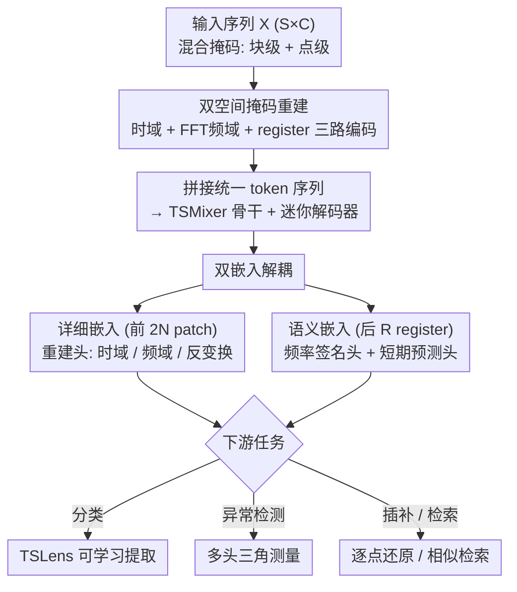

# TSPulse: Tiny Pre-Trained Models with Disentangled Representations for Rapid Time Series

**会议**: ICLR 2026  
**arXiv**: [2505.13033](https://arxiv.org/abs/2505.13033)  
**代码**: [https://huggingface.co/ibm-granite/granite-timeseries-tspulse-r1](https://huggingface.co/ibm-granite/granite-timeseries-tspulse-r1)  
**领域**: Time Series  
**关键词**: Time Series Pre-trained Model, Disentangled Representations, Dual-Space Reconstruction, Anomaly Detection, Tiny Model

## 一句话总结

提出 TSPulse，仅 1M 参数的超轻量时间序列预训练模型，通过双空间掩码重建和双嵌入解耦策略，在分类（+5-16%）、异常检测（+20%）、插补（+50%）和相似性检索（+25%）四大任务上超越 10-100 倍大的模型。

## 研究背景与动机

时间序列分析涵盖预测、异常检测、插补、分类和检索等多种下游任务。近年来，借鉴 NLP 和 CV 的成功，时间序列社区开始探索大规模预训练模型：

**专用模型**：TimesFM、Chronos、Moirai 专注于预测任务

**通用模型**：Moment、UniTS 扩展到分类、异常检测和插补

**跨域模型**：Time-LLM、GPT4TS 尝试将 LLM 适配到时间序列

核心问题：**现有预训练模型参数量巨大**（数百M到数十亿），导致部署和微调成本高昂。TTM 证明 1-5M 参数的紧凑模型可在预测任务上提供竞争性性能，但仅限于预测。

研究空白：**能否构建一个 ~1M 参数的预训练模型，同时在多种非预测诊断任务上达到 SOTA？**

## 方法详解

### 整体框架

TSPulse 想用 1M 量级的参数同时把分类、异常检测、插补、相似性检索这四类"诊断型"任务都做好，而不是只服务预测。它建立在 TSMixer 这一全 MLP 的轻量骨干上：一段输入 $\mathbf{X} \in \mathbb{R}^{S \times C}$ 先被混合掩码，再分时域、频域、register 三路编码、拼成统一 token 序列，过 TSMixer 骨干和一个迷你解码器后，token 被显式拆成两组——前段保留细粒度细节、后段编码全局语义。预训练阶段，这两组嵌入分别接重建头和高层任务头，被各自的目标"逼"成互补且解耦的表示；到了下游，分类用一个可学习提取器 TSLens 取代池化、异常检测用多头三角测量复用预训练好的多个重建头，都不需要重新训练骨干。整套设计的关键在于：让表示在不同空间（时/频）互补、在不同粒度（细节/语义）解耦，下游就能按任务各取所需。

### 关键设计

**1. 双空间掩码重建：让时域和频域互相补盲，并用混合掩码贴合真实缺失**

时间序列里有些模式天然适合在时域观察（突刺、毛刺），另一些则在频域才显眼（周期性、整体节律），只在单一空间重建会系统性漏掉一类信号。TSPulse 同时重建时域和频域的掩码输入：时域被掩码的信号 $\mathbf{X}_m$ 直接送入 FFT 得到频域表示 $\mathbf{X}^f_m$。这里有个巧思——它**不在频域显式打掩码**，而是让时域掩码经 FFT 自然传播到频域，避免了频谱上难以定义"局部缺失"的问题。时域、频域再加一条 register 路径编码后拼成统一序列 $\mathbf{Input}_E = [\mathbf{Time}_E; \mathbf{FFT}_E; \mathbf{Reg}_E] \in \mathbb{R}^{C \times K \times D}$，骨干在一个序列里同时看到两种视角，重建任一空间都能从另一空间借力。

掩码本身的形态也很关键。传统块掩码假设整段连续缺失，但真实缺失往往零散、点级、不规则，纯块掩码训出来的模型一遇这种场景就崩。TSPulse 改用**混合掩码**：同时掩掉完整 patch 和散落的点级位置。实现上掩码 token $\mathbf{M} \in \mathbb{R}^{1 \times pl}$ 定义在原始 patch 级别而非嵌入空间，从而支持灵活的部分掩码。消融显示去掉混合预训练后，模型在混合掩码评估下性能暴降 79%——预训练阶段就见过这种缺失形态，是零样本插补能力的前提。

**2. 双嵌入解耦：把细节和语义分开存放**

不同下游任务对信息粒度需求不一致——插补要逐点的细粒度还原，分类只关心全局语义，混在同一组嵌入里会互相牵制。TSPulse 把 token 拆成两组并用不同目标"逼"它们解耦：前 $2N$ 个 patch embedding 作为**详细嵌入**，负责全信号重建、保留时域与频域的细粒度模式；后 $R$ 个 register embedding 作为**语义嵌入**，专门编码全局特征。语义嵌入不靠逐点重建监督，而是接两个高层任务——频率签名预测 $\mathcal{L}_{prob} = \text{CE}(\mathbf{X}^f_{prob}, \mathbf{Y}^f_{prob})$（对数幅值谱的 softmax 分布）和短期预测 $\mathcal{L}_{future} = \text{MSE}(\mathbf{X}_{future}, \mathbf{Y}_{future})$。这样分类时直接取语义嵌入、插补时直接取详细嵌入，下游可按任务挑最合适的那一半表示；敏感性分析也证实语义嵌入对噪声、幅值变化、时间偏移鲁棒，只对频率和形状敏感。

**3. TSLens：用可学习的方式替代分类池化**

标准做法是对 token 直接做平均或最大池化再喂分类头，但这等于一视同仁地对待所有局部和全局特征，丢掉了"哪些 patch 更有判别力"的信息。TSLens 是分类微调时插入的可学习提取器：双嵌入（骨干输出 $\mathbf{Backbone}_E \in \mathbb{R}^{C \times (2N+R) \times D}$）先过一个用预训练权重初始化、并开启通道混合的迷你解码器，再降维投影、flatten，最后接线性分类头。它能动态聚焦局部和全局表示中信息量最大的部分。消融里把它换回 avg-pool 掉 11%、换回 max-pool 掉 16%，差距相当可观，说明"学出来的特征加权"确实强过固定池化。

**4. 多头三角测量异常检测：三个视角交叉定位异常**

不同类型的异常会在不同重建目标上暴露——突刺在时域偏差大、周期性破坏在频域偏差大、趋势漂移体现在短期预测偏差上，单一重建头难以兼顾。TSPulse 直接复用预训练好的三个头来打分：$\text{Head}_{time}$ 看时域重建偏差抓突刺，$\text{Head}_{fft}$ 看频域重建偏差抓周期性异常，$\text{Head}_{future}$ 看短期预测偏差抓趋势异常。融合上既可用 $\text{Head}_{ensemble}$ 取各头最大值，也可用 $\text{Head}_{triang.}$ 在一个很小的验证集上选最佳头。这是首个在单一轻量框架里统一多空间输出做三角测量的预训练模型，也正因如此它的零样本异常检测能反超在目标数据上训练过的模型。

### 损失函数 / 训练策略

预训练联合最小化一组多目标加权损失：时域重建 $\mathcal{L}_{time1} = \text{MSE}(\mathbf{X}, \mathbf{Y})$（仅算掩码位置）、从 FFT 空间反变换回来的时域重建 $\mathcal{L}_{time2} = \text{MSE}(\mathbf{X}, \mathbf{Y}')$、频域重建 $\mathcal{L}_{fft} = \text{MSE}(\mathbf{X}^f, \mathbf{Y}^f)$、频率签名 $\mathcal{L}_{prob} = \text{CE}(\mathbf{X}^f_{prob}, \mathbf{Y}^f_{prob})$，以及短期预测 $\mathcal{L}_{future} = \text{MSE}(\mathbf{X}_{future}, \mathbf{Y}_{future})$。任务特化通过重新加权各损失头的优先级实现——异常检测保留全部头，分类则强调时域头与频率签名头。

训练上还有一个工程要点：预训练用单变量（channel-independent）模式以保证通用性，但微调时常需打开通道混合（channel-mixing）来捕捉变量间关系。新增的混合层若随机初始化，会在已训好的层之间引入突变激活、造成梯度不稳定，因此 TSPulse 让这些层以**恒等权重**起步（初始时通道混合是恒等映射、对预训练表示零扰动），再平滑学出真正有用的跨通道交互——消融显示去掉这一恒等初始化分类掉 9%。整个预训练用约 1B 时序样本、8×A100 GPU 一天即可完成。

## 实验关键数据

### 异常检测（TSB-AD 榜单，Figure 4）

| 方法 | 单变量 VUS-PR | 多变量 VUS-PR |
|------|-------------|-------------|
| Sub-PCA (之前SOTA) | 0.42 | - |
| CNN (之前SOTA) | - | 0.31* |
| MOMENT (ZS) | 0.38 | - |
| **TSPulse (ZS)** | **0.48** (+14%) | **0.36** (+16%) |
| **TSPulse (FT)** | **0.52** (+24%) | **0.36** (+26%*) |

*TSPulse 同时位列 TSB-AD 单变量和多变量排行榜第一

### 分类（UEA 29 数据集，Figure 5）

| 方法 | 参数量 | 平均准确率 |
|------|--------|----------|
| VQShape | ~37M | 0.701 |
| MOMENT | ~110M | 0.675 |
| UniTS | ~10M | 0.634 |
| **TSPulse** | **~1M** | **0.733** (+5-16%) |

### 插补（6个LTSF基准，Figure 6 - 混合掩码）

| 方法 | 设置 | 平均 MSE↓ |
|------|------|----------|
| MOMENT | ZS | 0.276 |
| UniTS (PMT) | PMT | 0.170 |
| **TSPulse** | **ZS** | **0.074** (+56-73%) |
| TimesNet | FT | 0.080 |
| **TSPulse** | **FT** | **0.039** (+49-51%) |

### 消融实验（Table 1）

**分类消融**:

| 变体 | 准确率 | 下降 |
|------|--------|------|
| TSPulse (完整) | 0.747 | - |
| w/o Short Embedding | 0.689 | -8% |
| w/o Long Embedding | 0.681 | -10% |
| w/o Masking | 0.691 | -8% |
| w/o CM Identity Init | 0.685 | -9% |
| w/o TSLens (Avg-Pool) | 0.675 | -11% |
| w/o TSLens (Max-Pool) | 0.645 | -16% |
| w/o Dual-space | 0.696 | -7% |

### 效率对比（Table 23）

| 模型 | 参数(M) | GPU推理(ms) | CPU推理(s) | 内存(GB) |
|------|---------|------------|-----------|---------|
| **TSPulse** | **1.06** | **7.16** | **0.06** | **0.39** |
| MOMENT(small) | 35.34 (33×) | 32.57 (5×) | 2.74 (46×) | 0.56 |
| MOMENT(large) | 341.24 (322×) | 405.42 (57×) | 21.98 (366×) | 2.30 |
| Chronos(tiny) | 8.39 (8×) | 39.81 (6×) | 66.15 (1103×) | 2.91 |

### 关键发现

1. **1M 参数击败 10-100 倍大的模型**：模型大小不是唯一决定因素，架构设计同样重要
2. **双空间学习至关重要**：去除频域分支导致分类下降 7%，插补下降 8%
3. **混合掩码预训练是插补性能的关键**：纯块掩码在混合掩码评估下暴降 79%
4. **TSLens 显著优于标准池化**：-11% (avg-pool) 和 -16% (max-pool) 的下降证明了学习注意力的价值
5. **Register token 的语义嵌入对失真鲁棒**：对噪声、幅值变化、时间偏移不敏感，对频率和形状敏感

## 亮点与洞察

- **"小而美"的哲学**：1M 参数就够了，关键在于精巧的架构设计（双空间、双嵌入、多头三角测量）
- **解耦表示的价值**：细粒度嵌入 vs 语义嵌入的分离使不同任务可以选择最适合的表示
- **多头三角测量的巧妙之处**：不同重建头天然擅长不同类型的异常，融合胜过单一视角
- **零样本即超越训练模型**：TSPulse 的零样本异常检测超越了所有在目标数据上训练的模型
- **CPU友好**：0.06秒的CPU推理时间使得GPU-free部署成为可能
- **IBM Granite 系列**：开源在 HuggingFace 上，实用性强

## 局限与展望

1. 目前未涉及预测任务（forecasting），但紧凑模型在预测上的能力已由 TTM 验证
2. 预训练数据主要覆盖特定领域（能源、交通等），其他领域的迁移性能有待验证
3. 单变量预训练 + 多变量微调的两阶段设计可能不是最优的
4. 增量学习能力缺失：无法在不遗忘旧知识的情况下持续更新
5. 少样本分类能力有待探索
6. 跨模态融合（如时间序列+文本）是有前景的未来方向

## 相关工作与启发

- **TTM (Tiny Time Mixers)**：紧凑时间序列预训练模型的先驱，但仅限预测任务
- **MOMENT**：通用时间序列基础模型，T5-encoder 架构，参数量 35-341M
- **Chronos**：T5-style 编解码器，专注预测，0.06-709M 参数
- **UniTS**：prompt-tuned 多任务模型
- **TSMixer**：TSPulse 的骨干网络，MLP-Mixer 范式替代 Transformer
- **启发**：紧凑模型 + 任务特化预训练 + 精巧的后处理组件 = 高效且强大的基础模型设计范式

## 评分

- 新颖性: ⭐⭐⭐⭐⭐ （双空间双嵌入解耦 + 多头三角测量 + 混合掩码，多项创新组合）
- 实验充分度: ⭐⭐⭐⭐⭐ （75+数据集，4大任务，全面消融，效率分析，嵌入敏感性分析）
- 写作质量: ⭐⭐⭐⭐ （内容详尽，逻辑清晰，附录极其丰富）
- 价值: ⭐⭐⭐⭐⭐ （1M参数超越100倍大模型，开源可用，对部署友好）

<!-- RELATED:START -->

## 相关论文

- [\[ICLR 2026\] SwiftTS: A Swift Selection Framework for Time Series Pre-trained Models via Multi-task Meta-Learning](swiftts_a_swift_selection_framework_for_time_series_pre-trained_models_via_multi.md)
- [\[ICLR 2026\] Learning Recursive Multi-Scale Representations for Irregular Multivariate Time Series Forecasting](learning_recursive_multi-scale_representations_for_irregular_multivariate_time_s.md)
- [\[ICLR 2026\] FeDaL: Federated Dataset Learning for General Time Series Foundation Models](fedal_federated_dataset_learning_for_general_time_series_foundation_models.md)
- [\[ICLR 2026\] TimeOmni-1: Incentivizing Complex Reasoning with Time Series in Large Language Models](timeomni-1_incentivizing_complex_reasoning_with_time_series_in_large_language_mo.md)
- [\[ICLR 2026\] Adapt Data to Model: Adaptive Transformation Optimization for Domain-shared Time Series Foundation Models](adapt_data_to_model_adaptive_transformation_optimization_for_domain-shared_time_.md)

<!-- RELATED:END -->
