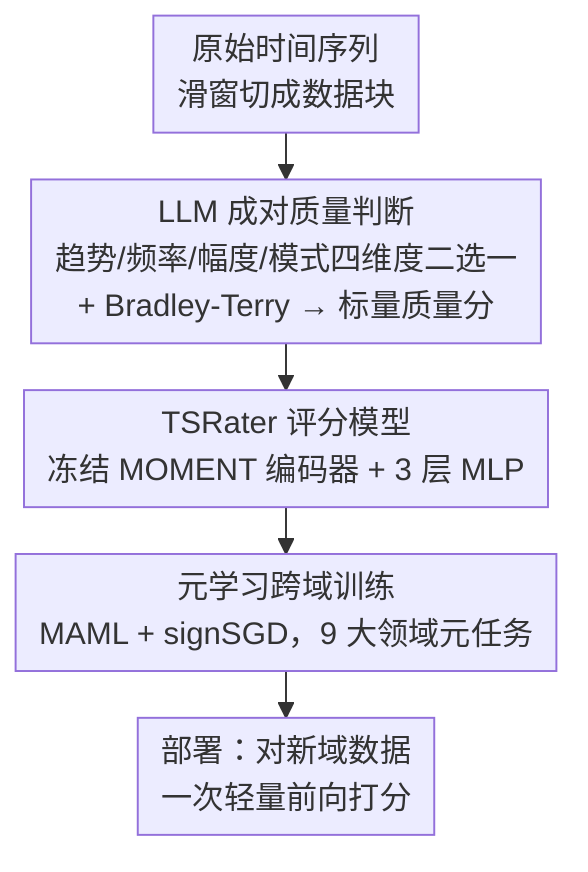

# TSRating: Rating Quality of Diverse Time Series Data by Meta-learning from LLM Judgment

**会议**: ICLR 2026  
**arXiv**: [2506.01290](https://arxiv.org/abs/2506.01290)  
**代码**: [https://github.com/clsr1008/TSRating](https://github.com/clsr1008/TSRating)  
**领域**: 时间序列  
**关键词**: 时间序列质量评估, LLM判断, 元学习, 数据选择, Bradley-Terry模型

## 一句话总结

TSRating 利用 LLM 的先验知识从趋势、频率、幅度、模式四个维度成对评判时间序列数据块的质量，再通过 Bradley-Terry 模型转换为标量分数，并用元学习训练跨域泛化的 TSRater 模型，实现高效、准确的时间序列数据质量评估。

## 研究背景与动机

**领域现状**：高质量时间序列数据对模型性能至关重要。现有数据质量评估方法主要基于影响函数（Influence Function）和 Shapley 值，虽然在单一领域内表现不错，但计算代价高（Hessian 计算或指数级组合开销），且忽略了实际时间序列数据来自多样化领域的事实。

**现有痛点**：影响函数需要计算密集的 Hessian 和梯度操作，Shapley 值面临指数级计算成本。更关键的是，这些方法通常只在单一领域内有效，面对跨域的多样化时间序列数据时泛化性差。

**核心矛盾**：需要一种既能跨域泛化、又计算高效的时间序列质量评估方法。传统方法在估计保真度和计算效率之间难以两全。

**本文目标**：(1) 验证 LLM 是否能理解和判断多样化时间序列的质量；(2) 训练一个轻量级的评分模型 TSRater，替代昂贵的 LLM 推理；(3) 通过元学习实现跨域泛化。

**切入角度**：LLM 在文本质量评估中已展现出色能力（如 Qurating、Ask-LLM），其预训练期间积累的丰富知识可能也涵盖了时间序列数据的理解。作者验证了 LLM 确实能以 92-99% 的准确率区分时间序列的趋势、频率、幅度和模式质量。

**核心 idea**：用 LLM 做"老师"成对比较时间序列数据块质量，用 Bradley-Terry 模型把比较结果转成标量分数，再用元学习训练一个轻量 TSRater 在新域上高效推理。

## 方法详解

### 整体框架

TSRating 想解决的是：怎么在不靠昂贵影响函数、又能跨域泛化的前提下，给海量时间序列数据打质量分。整条流水线分两段。前半段是"造标注"：把原始时间序列滑窗切成数据块，让 LLM 按趋势、频率、幅度、模式四个维度成对比较哪个块更好，再用 Bradley-Terry 模型把这些成对偏好拟合成标量分数，作为监督信号。后半段是"学评分器"：用这批 LLM 打出来的分训练一个轻量的 TSRater，并通过元学习让它在 9 大领域间快速迁移；部署时不再调用 LLM，直接用 TSRater 对新数据快速评分。等于先用 LLM 当一次性的"老师"造数据，再把它的判断力蒸馏进一个便宜的学生模型。

### 关键设计

**1. LLM 成对质量判断：把"打分"换成 LLM 更擅长的"二选一"**

传统方法之所以贵，是因为它们想直接估每个样本对模型的边际贡献。这里换了个思路：质量本身难以绝对量化，但"两个块谁更好"对 LLM 来说是稳定可答的问题。作者为趋势、频率、幅度、模式各设计一套 prompt 模板，对每对数据块 $B_i$、$B_j$ 让 LLM 判断孰优，多次采样得到置信度 $p_{i \succ j}$。为了消掉 LLM 的位置偏差，会把两个块的前后位置交换再判一次取平均；多变量序列则逐通道判断后平均。光有成对偏好还不能当监督信号，于是用 Bradley-Terry 模型 $p_{i \succ j} = \sigma(s(B_i) - s(B_j))$，通过极大似然把一堆成对比较反解成每个块的标量分数 $s(\cdot)$。成对比较比让 LLM 直接打 0-100 分更稳定，Bradley-Terry 又给了从偏好到标量这一步理论支撑。

**2. TSRater 评分模型：把 LLM 的判断蒸馏成一次轻量前向**

LLM 成对判断准是准，但每评一个块都要跑一遍推理，规模化打分成本撑不住。TSRater 就是用来摊销这笔开销的学生模型：冻结一个预训练好的 MOMENT 编码器（约 109M 参数）抽时间序列特征，上面接一个 3 层 MLP（隐藏维 256，带 LayerNorm、ReLU 和残差连接）把嵌入映射成标量质量分。训练时用 binary cross-entropy 损失 $\mathcal{L}_\theta$ 去对齐第一步 LLM 给出的成对偏好。训练一次之后，给大批新数据打分就只剩一次轻量前向，单次评估成本几乎可以忽略，这正是它相对反复调用 LLM 或 Shapley 估值的优势所在。

**3. 元学习跨域训练：让评分器在没见过的域上也能立刻上手**

时间序列来自电力、交通、气象等差异很大的领域，直接在一个域上训出来的 TSRater 换域就掉点。作者用 MAML 式的元学习来解决：从 Time-300B 语料里挑出 9 大领域共 22 个数据子集构成元任务，每个 episode 采样一个任务，在 support set 上做 inner-loop 更新，在 query set 上算损失来更新元参数，目标为

$$\min_\theta \sum_{\mathcal{T}_i} \mathcal{L}^{query}_{\mathcal{T}_i}\big(\theta - \alpha \cdot \text{sign}(\nabla_\theta \mathcal{L}^{support}_{\mathcal{T}_i}(\theta))\big)$$

关键的工程选择是 inner-loop 用 signSGD（只取梯度符号）而非标准梯度。标准 MAML 在外层求导时要穿过 inner-loop 的更新，带来二阶导（超梯度），signSGD 把这一步换成符号操作后就绕开了高阶导计算，元训练成本大幅下降，而性能基本持平。训出来的 TSRater 只需极少几步微调就能适配新域。

### 损失函数 / 训练策略

TSRater 用 binary cross-entropy 损失对齐 Bradley-Terry 拟合出的成对偏好；元学习阶段 inner-loop 用 signSGD、外层用标准梯度下降。四个质量维度各训练一个独立的 TSRater，部署时把四个维度的归一化分数融合，得到最终的质量评估。

## 实验关键数据

### 主实验

| 数据集 (长期预测 RMSE) | Random | DataShapley | KNNShapley | TimeInf | TSRating |
|----------------------|--------|-------------|------------|---------|----------|
| Electricity (Linear) | 1.601 | 1.580 | 1.325 | 1.391 | **1.390** |
| Weather (Linear) | 0.665 | 0.638 | 0.625 | 0.616 | **0.611** |
| Traffic (Linear) | 0.979 | 0.956 | 0.696 | **0.609** | 0.683 |
| ExRate (Linear) | 0.356 | 0.323 | 0.290 | 0.272 | 0.275 |

TSRating 在多数设置下超越或匹配基于 Shapley 值和影响函数的方法。

### 消融实验

| 配置 | 效果 |
|------|------|
| LLM 合成验证 | 趋势/频率/幅度/模式准确率: 94.5%/92.25%/98.75%/95.75% |
| 去除元学习 | 跨域泛化性能显著下降 |
| 去除 signSGD | 训练时间增加但性能相当 |
| 数据剪枝实验 | 移除 TSRating 选出的高质量样本后模型性能显著下降 |

### 关键发现

- LLM 在合成数据上的质量判断准确率高达 92-99%，验证了 LLM 理解时间序列质量的能力
- TSRating 在时间序列基础模型的微调场景中也有效：在高质量子集上微调显著提升泛化性能
- 元学习使 TSRater 能以极少的微调步数适应新域，验证了跨域泛化能力

## 亮点与洞察

- **LLM 作为时间序列质量裁判**的思路非常新颖——绕过了传统方法的计算瓶颈，将问题转化为 LLM 擅长的成对比较任务
- **四维度评判标准**（趋势、频率、幅度、模式）设计合理，覆盖了时间序列的核心特性，且有经典文献支撑
- **signSGD 替代标准梯度**用于元学习的 inner-loop 是一个实用的工程技巧，可迁移到其他元学习场景中降低计算成本

## 局限与展望

- LLM 判断的可靠性取决于 prompt 设计和 LLM 本身的能力，对极端或罕见的时间序列模式可能判断不准
- 四个评判维度是否全面覆盖了所有领域的质量特征有待商榷（如异常值密度、信噪比等未纳入）
- TSRater 依赖冻结的 MOMENT 编码器，编码器的领域覆盖范围直接影响跨域表现
- 实验中选取 top 50% 数据训练——不同任务的最优比例可能不同

## 相关工作与启发

- **vs TimeInf (Zhang et al., 2024)**: TimeInf 用时间感知的影响函数，计算更精确但成本高且限于单域；TSRating 用 LLM+元学习实现跨域泛化
- **vs DataShapley/KNNShapley**: Shapley 方法理论完备但计算指数级增长，TSRating 训练后推理成本几乎为零
- **vs Qurating (Wettig et al., 2024)**: Qurating 用 LLM 评估文本质量，TSRating 将该思路首次拓展到时间序列领域

## 评分

- 新颖性: ⭐⭐⭐⭐ 首次将 LLM 判断应用于时间序列质量评估，思路新颖
- 实验充分度: ⭐⭐⭐⭐ 11个数据集、3个任务类型、多种基线比较，实验充分
- 写作质量: ⭐⭐⭐⭐ 方法描述清晰，框架图直观
- 价值: ⭐⭐⭐⭐ 为时间序列数据管理提供了新范式，有实际应用价值

<!-- RELATED:START -->

## 相关论文

- [\[ICLR 2026\] Rating Quality of Diverse Time Series Data by Meta-learning from LLM Judgment](rating_quality_of_diverse_time_series_data_by_meta-learning_from_llm_judgment.md)
- [\[ICLR 2026\] SwiftTS: A Swift Selection Framework for Time Series Pre-trained Models via Multi-task Meta-Learning](swiftts_a_swift_selection_framework_for_time_series_pre-trained_models_via_multi.md)
- [\[ICLR 2026\] Adapt Data to Model: Adaptive Transformation Optimization for Domain-shared Time Series Foundation Models](adapt_data_to_model_adaptive_transformation_optimization_for_domain-shared_time_.md)
- [\[ICLR 2026\] GTM: A General Time-series Model for Enhanced Representation Learning](gtm_a_general_time-series_model_for_enhanced_representation_learning_of_time-series.md)
- [\[ICLR 2026\] HiVid: LLM-Guided Video Saliency For Content-Aware VOD And Live Streaming](hivid_llm-guided_video_saliency_for_content-aware_vod_and_live_streaming.md)

<!-- RELATED:END -->
