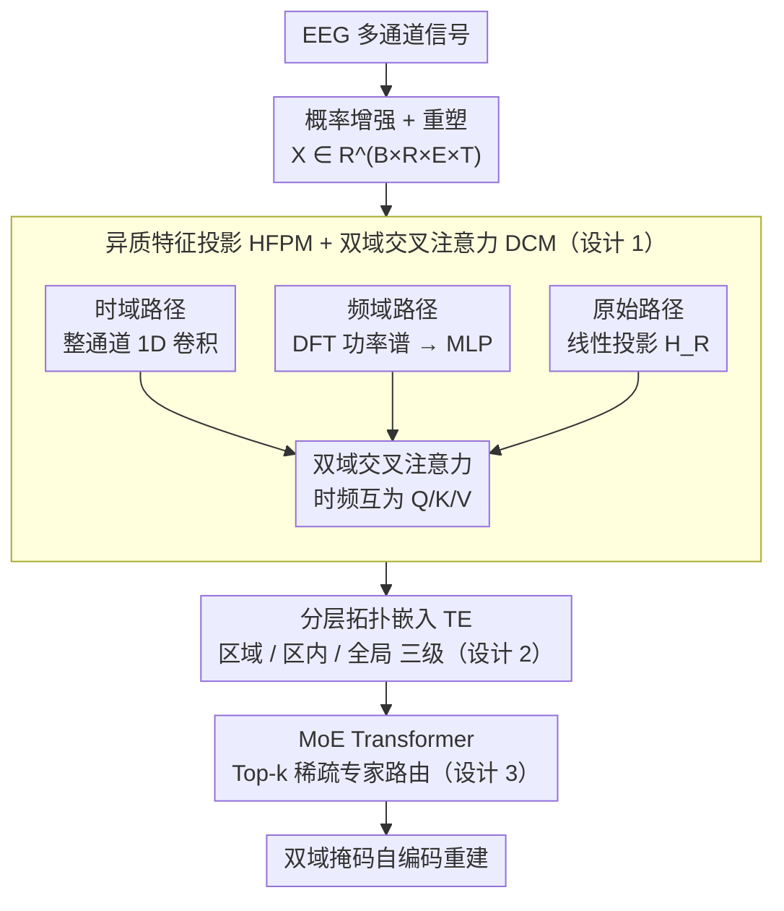

# Uni-NTFM: A Unified Foundation Model for EEG Signal Representation Learning

**会议**: ICLR 2026  
**arXiv**: [2509.24222](https://arxiv.org/abs/2509.24222)  
**代码**: [https://anonymous.4open.science/r/Uni-NTFM-0924](https://anonymous.4open.science/r/Uni-NTFM-0924)  
**领域**: 时间序列  
**关键词**: EEG, 基础模型, 神经拓扑, 混合专家, 自监督学习, 脑机接口

## 一句话总结

Uni-NTFM 从神经科学第一性原理出发，设计异质特征投影（HFPM）解耦时频编码、分层拓扑嵌入（TE）统一异构电极配置、MoE Transformer 实现功能模块化与稀疏编码，在 28000 小时 EEG 数据上预训练 1.9B 参数模型，9 个下游任务上的线性探测和微调均达到 SOTA。

## 研究背景与动机

**领域现状**：EEG 基础模型是近两年的活跃方向，LaBraM、EEGPT、CBraMod 等模型尝试将 NLP/CV 的预训练范式迁移到 EEG 领域，通过大规模自监督学习获取通用表示。

**现有痛点**：现有 EEG 基础模型存在三个根本性架构缺陷：

1. **时频编码耦合**：标准架构将信息作为单一同质流处理，忽略了大脑对时域瞬态事件（如棘波、K-complex）和频域稳态节律（如 alpha、beta 波）采用解耦编码机制的事实。强制将两者混合编码导致波形形态和谱结构互相干扰
2. **电极配置不统一**：不同数据集使用不同的传感器布局（临床 19 通道 10-20 系统 vs 高密度 64 通道 10-10 系统），标准 Transformer 的 1D 位置编码将电极视为简单序列，丢弃了皮层表面的几何结构，阻碍跨数据集迁移
3. **缺乏功能模块化**：生物神经网络通过功能模块化和稀疏编码实现高效处理（如 V1 区响应视觉、布罗卡区响应语言），而标准 dense Transformer 对每个输入激活所有参数，处理高度异质的 EEG 信号时容易产生任务干扰

**核心 idea**：模型架构应与生物神经机制对齐——解耦编码、拓扑感知、模块化稀疏处理，而非简单移植 CV/NLP 架构。

## 方法详解

### 整体框架

Uni-NTFM 把一段 EEG 处理成与神经机制对齐的四步流水线：先用 HFPM 把每个电极的时间序列解耦成时域、频域、原始三路特征，再由 DCM 做双域交叉注意力把时频表示融合，接着叠加分层拓扑嵌入注入皮层空间先验，最后送入 MoE Transformer 做稀疏专家路由的高层语义编码。输入数据先经高斯噪声、通道丢弃、随机时移等概率增强，并重塑为 $X \in \mathbb{R}^{B \times R \times E \times T}$（$R$ 为预定义脑区数，$E$ 为每区最大电极数，$T$ 为时间长度），整个模型以双域掩码自编码重建为预训练目标。

### 关键设计

**1. 异质特征投影（HFPM）+ 双域交叉注意力（DCM）：把时频信息解耦再对齐融合**

大脑对时域瞬态事件（棘波、K-complex）和频域稳态节律（alpha、beta 波）本就采用不同的编码机制，若强行混在一条同质流里两者会互相干扰，所以 HFPM 拆出三条并行路径。时域路径不像主流做法那样沿时间轴切 patch，而是把每个电极的完整序列 $x_i \in \mathbb{R}^T$ 当作一个整体 token，用多层 1D 卷积编码器 $\Phi_T$ 抓局部波形与非平稳事件，得到 $h_{i,T} \in \mathbb{R}^D$；这种"整通道编码"保留了信号的连续性和多时间尺度结构。频域路径对信号做 DFT 算功率谱密度，参数化成 $N_b$ 个核心频带的均值功率向量 $P_b \in \mathbb{R}^{N_b}$，再经 MLP $\Phi_F$ 投影成 $h_{i,F} \in \mathbb{R}^D$；原始路径则用标准线性投影保留完整信息 $H_R$，作为自监督重建的 ground truth 参考。三路特征解耦出来后由 DCM 重新对齐：时域特征作 Query 去探测频域的 Key/Value，频域特征再做对称的反向操作，$H'_T = \text{LN}(H_T + \text{CrossAttn}(Q\!=\!H_T, K\!=\!H_F, V\!=\!H_F))$，两者拼接经 FFN 生成融合特征 $H_{\text{fused}}$，既各自专注又显式建立时频耦合。

**2. 分层拓扑嵌入（Topological Embedding）：让模型按脑功能区而非通道索引泛化**

不同数据集的电极布局差异极大（临床 19 通道 10-20 系统 vs 高密度 64 通道 10-10 系统），标准 1D 位置编码把电极当简单序列，丢掉了皮层几何结构、也阻断了跨数据集迁移。这里把每个电极的空间身份拆成三级神经解剖语义：区域嵌入 $E_{\text{region}} \in \mathbb{R}^{5 \times D}$ 对应 Frontal（执行功能）、Central（感觉运动）、Temporal（听觉/记忆）、Parietal（空间注意力）、Occipital（视觉处理）五个功能区；区内嵌入 $E_{\text{intra}}$ 编码同区内电极的相对方位（如 C3 与 C1 在运动皮层上相邻）；全局绝对嵌入 $E_{\text{abs}}$ 为 IFCN 标准电极分配唯一全局标识。三者与融合/原始特征叠加成最终空间表示 $H_{\text{in}}^{(i)} = H_{\text{fused}}^{(i)} + H_R^{(i)} + E_{\text{region}}[x_{\text{region}}^{(i)}] + E_{\text{intra}}[x_{\text{intra}}^{(i)}] + E_{\text{abs}}[x_{\text{abs}}^{(i)}]$。由于泛化锚定在功能区层级而非具体通道，19 通道和 64 通道的数据能无缝在同一模型里训练和迁移，这正是解决跨电极配置迁移的关键。

**3. MoE Transformer 与稀疏路由：用功能模块化避免异质信号互相干扰**

标准 dense Transformer 对每个输入都激活全部参数，处理运动节律、病理放电、认知事件这类高度异质的 EEG 信号时容易产生任务干扰，而生物神经网络靠功能模块化和稀疏编码高效工作。于是把每层 dense FFN 换成稀疏激活的 MoE：门控网络 $g(h_i) = h_i W_g$ 为每个 token 算出对 $N_e$ 个专家的路由 logit，再用 Top-k 门控只激活其中一个专家子集，让不同信号模式落到专门的子网络上；自注意力层用 RoPE 编码电极的相对空间顺序。为防止所有 token 都挤向少数专家造成路由坍塌，额外加负载均衡辅助损失 $L_{\text{aux}} = \alpha \cdot N_e \sum_j f_j \cdot \bar{p}_j$。这样既能把参数堆到 1.9B，又因稀疏激活保持计算量可控。

### 损失函数 / 训练策略

预训练目标是双域掩码自编码：随机掩码的 token 被替换成可学习的 $e_{[\text{MASK}]}$，模型同时重建时域和频域特征，总损失把两域重建项与负载均衡项加权相加，$L_{\text{total}} = \lambda_T L_{\text{time}} + \lambda_F L_{\text{freq}} + \lambda_{\text{aux}} L_{\text{aux}}$。预训练语料来自 9 个公开数据集、17000+ 被试、约 28000 小时录制，覆盖静息态、情绪诱发、认知分类、BCI 范式和临床录制。模型放出 Tiny (57M)、Small (427M)、Middle (912M)、Large (1.9B) 四个规模，均在 NVIDIA A100-80G GPU 上以 PyTorch 2.3.1 + CUDA 11.8 训练。

## 实验关键数据

### 主实验：9 任务微调性能对比

在 9 个不同下游 EEG 任务上，与传统任务特定方法（7种）和预训练基础模型（LaBraM、CBraMod、BIOT、CSBrain 等）全面对比。下表为微调后 Uni-NTFM$_\text{large}$ 的代表性结果：

| 任务 (数据集) | 类别数 | 核心指标 | Uni-NTFM | 最强基线 | 基线来源 |
|---|---|---|---|---|---|
| 异常检测 (TUAB) | 2 | Bal. Acc. | **81.97** | 81.72 | CSBrain |
| 事件分类 (TUEV) | 6 | Bal. Acc. | **69.91** | 69.03 | CSBrain |
| 情绪识别 (SEED) | 3 | Bal. Acc. | **73.37** | 73.18 | LaBraM |
| 脑龄分类 (TDBrain) | 2 | Bal. Acc. | **83.69** | 82.81 | CBraMod |
| 痴呆检测 (ADFTD) | 3 | Bal. Acc. | 76.61 | **77.63** | BIOT |
| 运动想象 (BCIC-IV-2a) | 4 | Bal. Acc. | 56.08 | **56.57** | CSBrain |
| 认知负荷 (Workload) | 2 | Bal. Acc. | 66.44 | **66.55** | BIOT |
| 睡眠分期 (HMC) | 5 | Kappa | **68.32** | 68.18 | CSBrain |
| EEG 减慢检测 (TUSL) | 3 | Bal. Acc. | 78.44 | **85.71** | CSBrain |

在线性探测（冻结权重仅训练线性头）设定下，Uni-NTFM$_\text{large}$ 在 TUAB 达到 Bal. Acc. 78.44（超过多数传统方法的微调结果），TUEV 上 Cohen's Kappa 66.11，SEED 上 Bal. Acc. 73.14，展示了预训练表示的高质量。

### 消融实验（TUAB + TUEV）

在 Uni-NTFM$_\text{tiny}$ 上逐步累加模块，验证每个组件的贡献：

| 编号 | HFPM | DCM | TE | MoE | TUAB AUROC | TUEV Weighted F1 |
|---|---|---|---|---|---|---|
| A1 (baseline) | ✗ | ✗ | ✗ | ✗ | 71.16 | 73.66 |
| A2 | ✓ | ✗ | ✗ | ✗ | 78.05 (+6.89) | 76.69 |
| A3 | ✓ | ✓ | ✗ | ✗ | 79.76 | 78.72 |
| A6 | ✗ | ✗ | ✓ | ✓ | 80.03 | 78.94 |
| A7 | ✓ | ✗ | ✓ | ✓ | 81.10 | 80.81 |
| A9 | ✓ | ✓ | ✓ | ✗ | 81.40 | 79.39 |
| A10 (完整) | ✓ | ✓ | ✓ | ✓ | **83.25** (+12.09) | **81.74** (+8.08) |

### 关键发现

- **HFPM 是最关键的单组件改进**：单独加入 HFPM 使 TUAB AUROC 从 71.16 提升到 78.05（+6.89），证明时频解耦编码的核心价值
- **MoE 的协同增益**：MoE 单独加入时增益有限（+7.46），但与其他组件结合后贡献显著放大（完整模型 vs 无 MoE 的 A9：83.25 vs 81.40），表明 MoE 需要高质量的多域特征才能发挥模块化路由优势
- **Scaling Law 成立**：从 57M → 1.9B，四个规模版本性能单调递增，线性探测下 TUAB Bal. Acc. 从 71.36 → 78.44，TUEV Kappa 从 60.11 → 66.11
- **线性探测已超传统微调**：仅冻结权重加线性头的 Uni-NTFM$_\text{large}$（TUAB Bal. Acc. 78.44）已超过多数传统方法的微调结果（SPaRCNet 77.49、EEGNet 77.12），证明预训练表示质量
- **TUSL 上弱于 CSBrain**：在 EEG 减慢检测任务上 Uni-NTFM (78.44) 显著落后于 CSBrain (85.71)，说明通用表示在某些特殊任务上仍不及针对性设计

## 亮点与洞察

- **"整通道编码"的反直觉设计**：不切 patch，将每个电极的完整时间序列作为整体 token——这与 NLP/CV 的分块处理思路相反，但在 EEG 中更合理，因为保留了信号的连续特性和多尺度时频结构
- **分层拓扑嵌入优雅解决跨电极配置问题**：三级嵌入（区域 → 区内 → 全局）使模型按脑功能区泛化而非按通道索引记忆，19 通道和 64 通道的数据可以无缝在同一模型中训练和迁移
- **消融揭示清晰的组件层次**：HFPM > DCM ≈ TE > MoE（单独贡献），但完整组合的协同效应远超简单叠加
- **1.9B 参数的 EEG 模型**：MoE 架构使如此规模在 EEG 领域首次成为可能，且稀疏激活保证了计算量可控

## 局限与展望

- **TUSL 和 BCIC-IV-2a 上未达 SOTA**：分别落后 CSBrain 7.27 和 0.49，说明通用基础模型在某些需要精细时间分辨率或被试特异性的任务上仍有改进空间
- **CSBrain 结果不可复现**：论文标注 CSBrain 代码未开源，对比数据来自其论文，公平性存疑
- **仅报告 Linear Probing + Fine-tuning**：缺少 few-shot、zero-shot 等更精细的迁移学习评估
- **MoE 专家分化分析不足**：论文未展示不同专家是否真正学到了功能分化（如某专家专注运动节律、某专家处理病理放电），缺少路由可视化
- **预训练数据偏向临床录制**：TUEG 等临床数据占比大，可能导致在认知任务上表示偏差
- **部署成本**：1.9B 参数模型在实际 BCI 设备上的推理延迟和内存需求未讨论

## 相关工作与启发

- **vs LaBraM (Jiang et al., 2024)**：LaBraM 将 EEG 信号切 patch 做 MAE 预训练，无时频解耦和拓扑嵌入；Uni-NTFM 在 TUAB/SEED 等任务上全面超越（TUAB Bal. Acc. 81.97 vs 81.40，SEED 73.37 vs 73.18）
- **vs CBraMod (Wang et al., 2024)**：CBraMod 用 criss-cross 注意力建模空间交互但无显式拓扑结构；Uni-NTFM 在 TDBrain 上优势明显（83.69 vs 82.81）
- **vs BIOT (Yang et al., 2023)**：BIOT 为跨数据学习设计但无 MoE，在 ADFTD 和 Workload 上仍略强于 Uni-NTFM，暗示这两个任务的数据特性与 BIOT 的 dense 架构更匹配
- **vs CSBrain (Zhou et al., 2025)**：CSBrain 在 TUSL 上大幅领先（85.71 vs 78.44），但代码未开源且在 TDBrain 上无结果报告，对比公平性有限
- **启发**："生物机制对齐"的设计范式可推广到 MEG、fNIRS 等其他神经信号；分层空间嵌入的思路对多中心临床 EEG 的联邦学习有参考价值

## 评分

- 新颖性: ⭐⭐⭐⭐ 三模块设计各自有据可依，"整通道编码"和分层拓扑嵌入较新颖，但 MoE 替换 FFN 属常规操作
- 实验充分度: ⭐⭐⭐⭐⭐ 9 个下游任务、4 个模型规模、完整消融、7 种传统方法 + 4 种基础模型对比，覆盖极为全面
- 写作质量: ⭐⭐⭐⭐ 结构清晰，神经科学原理与架构设计的对应关系阐述到位，公式严谨
- 价值: ⭐⭐⭐⭐ 为 EEG 基础模型提供了"应与神经机制对齐"的设计原则，1.9B 规模标志 EEG FM 进入大模型时代

<!-- RELATED:START -->

## 相关论文

- [\[ICLR 2026\] GTM: A General Time-series Model for Enhanced Representation Learning](gtm_a_general_time-series_model_for_enhanced_representation_learning_of_time-series.md)
- [\[AAAI 2026\] A Unified Shape-Aware Foundation Model for Time Series Classification](../../AAAI2026/time_series/a_unified_shape-aware_foundation_model_for_time_series_class.md)
- [\[ICLR 2026\] Brain-Semantoks: Learning Semantic Tokens of Brain Dynamics with a Self-Distilled Foundation Model](brain-semantoks_learning_semantic_tokens_of_brain_dynamics_with_a_self-distilled.md)
- [\[ICLR 2026\] Adapt Data to Model: Adaptive Transformation Optimization for Domain-shared Time Series Foundation Models](adapt_data_to_model_adaptive_transformation_optimization_for_domain-shared_time_.md)
- [\[ICLR 2026\] FeDaL: Federated Dataset Learning for General Time Series Foundation Models](fedal_federated_dataset_learning_for_general_time_series_foundation_models.md)

<!-- RELATED:END -->
