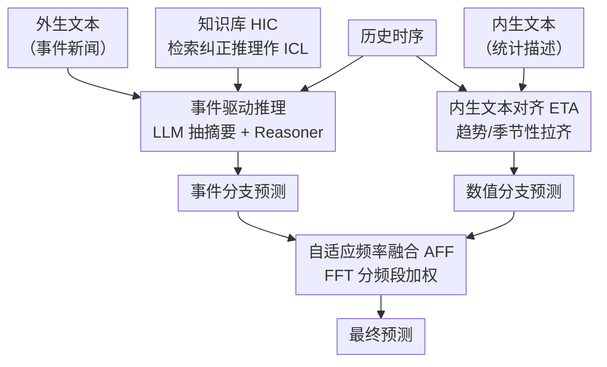

# Unlocking the Value of Text: Event-Driven Reasoning and Multi-Level Alignment for Time Series Forecasting

**会议**: ICLR 2026  
**arXiv**: [2603.15452](https://arxiv.org/abs/2603.15452)  
**领域**: 时间序列  
**关键词**: 多模态时间序列预测, 事件驱动推理, 文本对齐, 自适应频率融合, LLM推理

## 一句话总结

提出 VoT，一种通过事件驱动推理（利用 LLM 对外生文本进行结构化推理获取数值预测）和多层对齐（表征级内生文本对齐 + 预测级自适应频率融合）充分挖掘文本信息价值的多模态时间序列预测方法，在 10 个领域的真实数据集上全面超越现有方法。

## 研究背景与动机

现有时间序列预测方法大多仅依赖数值数据，但真实世界中突变事件（如 2008 金融危机、2020 COVID-19 导致的失业率飙升）难以仅从历史数值模式预测。文本信息可提供事件驱动的预测指导，但现有多模态方法面临两大挑战：

### 挑战 1：文本利用不充分

| 方法类型 | 问题 |
|---------|------|
| 内生文本方法（如 LLM-Mixer） | 使用统计摘要/数据描述，与时序信息大量重叠 |
| 外生文本方法（如 CMIN、DualTime） | 仅做表征级融合，难以挖掘深层语义 |
| **VoT（本文）** | **同时使用 LLM 推理 + 特征提取，支持内生 + 外生文本** |

### 挑战 2：模态对齐困难

文本描述事件驱动的突变，时序捕捉细微数值波动——两者存在显著模态鸿沟，简单融合难以实现互补。

## 方法详解

### 整体框架

VoT 想解决的是：真实世界里 2008 金融危机、2020 COVID 这类突变事件根本无法从历史数值规律外推，而文本恰恰记录了事件信号——可现有方法要么只把文本编码成向量做浅层表征融合、埋没了深层语义，要么内生文本与时序信息高度重叠、信息冗余。VoT 因此把文本的价值拆到两条互补分支上，再在频域汇合。事件驱动分支让推理型 LLM 读外生文本（事件新闻）、结合历史时序直接推理出数值预测，专门捕捉突变事件的冲击；数值分支把内生文本（统计描述）与时序表征对齐后做常规预测，负责细微波动。两条分支的输出最后做自适应频率融合，按频段决定该信文本还是该信数值，得到最终预测——文本由此既参与"理解事件"也参与"修正数值"。

### 关键设计

**1. 事件驱动推理：把 LLM 的推理能力而非只是表征接进预测**

现有外生文本方法只把文本编码成向量做表征融合，深层语义被埋没，突变事件的冲击预测不出来。VoT 改走推理路线，用三步流水线先把杂乱文本变成可推理的素材：LLM 依据数据描述生成结构化模板 $\mathcal{D}$，再用模板从原始外生文本里抽出与预测相关的摘要 $\mathcal{S}_i$，最后由 Reasoner 结合摘要与历史时序产出预测，$\hat{\mathbf{Y}}^{\text{event}}_i, \mathcal{R}_i = \text{Reasoner}(\mathcal{P}_{\text{reason}}, \mathcal{S}_i, \mathbf{X}_i)$，其中 $\mathcal{R}_i$ 是推理链。为了让推理不"裸跑"，作者设计了历史上下文学习（HIC）：训练时 Reasoner 先给预测、再对照真值反思出纠正推理 $\mathcal{C}_i$，把"摘要嵌入→纠正推理"成对存进知识库 $\mathcal{K} = \{(\text{Embed}(\mathcal{S}_i), \mathcal{C}_i)\}_{i=1}^M$；推理时检索与当前样本最相似的历史纠正推理 $\mathcal{C}_{\tilde{i}}$ 当作 ICL 示例，$\hat{\mathbf{Y}}^{\text{event}}_j = \text{Reasoner}(\mathcal{P}_{\text{ICL}}, \mathcal{C}_{\tilde{i}}, \mathcal{S}_j, \mathbf{X}_j)$。这样无需微调，就把过往"错在哪、怎么改"的经验注入当前推理，事件冲击的预测因此更准。

**2. 多层对齐：在表征级和预测级两次弥合文本与时序的模态鸿沟**

文本讲的是事件驱动的突变，时序记的是连续数值波动，直接拼接很难互补，VoT 因此在两个层面对齐。表征级是内生文本对齐（ETA）：用两组可学习查询 $\mathbf{Q}^{\text{tr}}, \mathbf{Q}^{\text{se}}$ 通过交叉注意力分别从文本表征里抽取趋势与季节性语义，再用分解对比学习在样本级把文本侧与时序侧的趋势、季节性分量逐一拉齐，避免内生文本与时序信息大量重叠。预测级是自适应频率融合（AFF）：先把两分支预测各自做 FFT 拆成低/中/高频分量 $\mathcal{F}^{\text{num}} = \text{FFT}(\hat{\mathbf{Y}}^{\text{num}})$、$\mathcal{F}^{\text{event}} = \text{FFT}(\hat{\mathbf{Y}}^{\text{event}})$，再用一组可学习权重 $w_*^b$ 按频段加权融合并反变换回时域，$\mathcal{F}_{\text{fused}} = \sum_* \sum_b w_*^b \mathcal{F}_*^b$，$\hat{\mathbf{Y}}_{\text{final}} = \text{iFFT}(\mathcal{F}_{\text{fused}})$。因为不同领域对文本和数值的依赖落在不同频段，按频段而非整体加权，模型才能在该信文本的频率多采纳事件分支、该信数值的频率多采纳数值分支。

### 损失函数 / 训练策略

整体目标由三项相加：时序预测损失、模态对齐损失、最终融合预测损失，$\mathcal{L}_{\text{total}} = \mathcal{L}_{\text{ts}} + \mathcal{L}_{\text{align}} + \mathcal{L}_{\text{final}}$，分别约束数值分支、ETA 的分解对比对齐和 AFF 融合后的输出。

## 实验关键数据

### 主实验：与时序方法和多模态方法对比（10 个领域平均）

| 方法 | Agriculture MSE | Climate MSE | Economy MSE | Health MSE | Weather MSE |
|------|----------------|-------------|-------------|------------|-------------|
| iTransformer | 0.220 | 1.135 | 0.222 | 1.519 | 1.231 |
| PatchTST | 0.228 | 1.184 | 0.210 | 1.432 | 1.145 |
| GPT4TS | 0.220 | 1.184 | 0.217 | 1.341 | - |
| TaTS | 0.215 | 1.180 | 0.215 | 1.356 | - |
| CALF | 0.250 | 1.286 | 0.207 | 1.491 | - |
| **VoT** | **0.209** | **1.078** | **0.201** | **1.205** | **0.968** |

### 完胜记录

- **VoT 在所有 10 个领域的 20 项指标（MSE+MAE）上全部排名第一**
- 对比纯时序方法取得一致提升（如 Health: 1.205 vs 1.432 PatchTST，-15.9%）
- 对比现有多模态方法同样全面领先（如 Climate: 1.078 vs 1.180 TaTS，-8.6%）

### 关键发现

1. **文本推理的有效性**：事件驱动推理分支能有效捕捉外部事件对时序的影响
2. **HIC 的价值**：历史纠正推理作为 ICL 示例显著提升推理准确性
3. **频率融合的必要性**：不同数据集对文本和数值信息的依赖在不同频段不同
4. **跨领域一致性**：在金融、气候、健康、交通等 10 个差异极大的领域上均有效

## 亮点与洞察

1. **首个结合 LLM 推理与特征提取的多模态时序预测方法**：不仅使用 LLM 提取表征，更利用其推理能力生成数值预测
2. **HIC 的创新设计**：在训练时保存"错误→纠正"对，推理时检索相似纠正作为 ICL 指导，无需微调即可增强推理
3. **频域融合的精妙**：不同频段分别学习文本与数值的权重，适应不同领域特性
4. **双分支互补架构**：事件驱动分支处理突变，数值分支处理常规波动，AFF 实现最优组合

## 局限性

1. LLM 推理（Reasoner）和知识库构建增加了显著的计算和延迟开销
2. 依赖外生文本的可用性和质量，缺少文本的领域可能退化为纯时序模型
3. HIC 检索质量受知识库大小和多样性限制
4. 频率分频策略的超参数选择可能因领域而异
5. 未考虑文本时间对齐的噪声和延迟问题

## 评分 ⭐⭐⭐⭐⭐

方法设计全面精巧，在 10 个领域 20 项指标上全面第一实属罕见。将 LLM 的推理能力真正引入时序预测，HIC 和 AFF 的设计都很有新意。唯一遗憾是计算开销较大，实际部署需权衡。

<!-- RELATED:START -->

## 相关论文

- [\[ICML 2026\] PATRA: Pattern-Aware Alignment and Balanced Reasoning for Time Series Question Answering](../../ICML2026/time_series/patra_pattern-aware_alignment_and_balanced_reasoning_for_time_series_question_an.md)
- [\[ICLR 2026\] Learning Recursive Multi-Scale Representations for Irregular Multivariate Time Series Forecasting](learning_recursive_multi-scale_representations_for_irregular_multivariate_time_s.md)
- [\[ICLR 2026\] TimeOmni-1: Incentivizing Complex Reasoning with Time Series in Large Language Models](timeomni-1_incentivizing_complex_reasoning_with_time_series_in_large_language_mo.md)
- [\[ICLR 2026\] Reasoning on Time-Series for Financial Technical Analysis](reasoning_on_time-series_for_financial_technical_analysis.md)
- [\[AAAI 2026\] Revitalizing Canonical Pre-Alignment for Irregular Multivariate Time Series Forecasting](../../AAAI2026/time_series/revitalizing_canonical_pre-alignment_for_irregular_multivariate_time_series_fore.md)

<!-- RELATED:END -->
