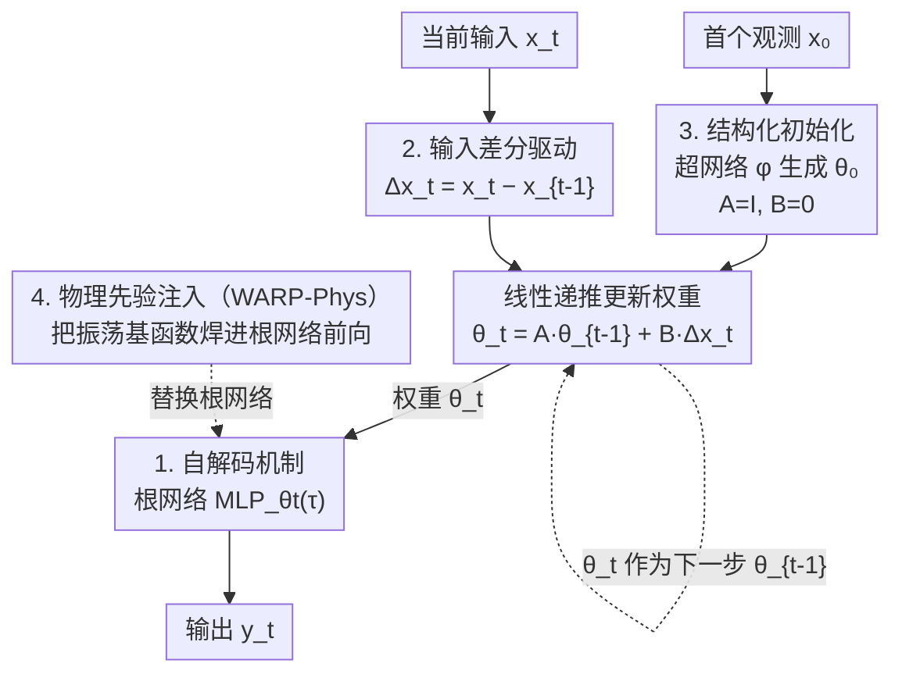

# Weight-Space Linear Recurrent Neural Networks

**会议**: ICLR 2026  
**arXiv**: [2506.01153](https://arxiv.org/abs/2506.01153)  
**领域**: 时间序列  
**关键词**: 权重空间学习, 线性RNN, 自适应预测, 动力系统重建, 无梯度适应

## 一句话总结

提出 WARP（Weight-space Adaptive Recurrent Prediction），将线性 RNN 的隐状态显式参数化为辅助 MLP 的权重和偏置，利用输入差分驱动线性递推来更新权重，结合非线性解码实现高效序列建模，在分类、预测和动力系统重建等任务上达到 SOTA。

## 研究背景与动机

深度序列模型面临两大根本性限制：

**泛化能力不足**：无法在训练分布之外可靠工作，需要梯度下降进行适应

**难以注入领域先验**：前向传播过程中无法融入物理约束等领域知识

同时，两大新兴范式各有优势但尚未结合：

| 范式 | 优势 | 局限 |
|------|------|------|
| **权重空间学习** | 将神经网络权重作为数据点处理 | 仅用于输入/输出，未作为中间表征 |
| **线性 RNN** (S4, Mamba) | 硬件高效、可并行化训练 | 表达能力受限，信息压缩不足 |

**核心洞察**：线性 RNN 缺乏非线性导致表达力不足，但将非线性重新引入又牺牲了训练效率。WARP 通过将隐状态定义为 MLP 权重，在保持线性递推效率的同时引入解码时的非线性。

## 方法详解

### 整体框架

WARP 的全名是 Weight-space Adaptive Recurrent Prediction，它把一个线性 RNN 的隐状态 $\theta_t$ 直接定义为一个辅助 MLP（称作"根网络"）的展平权重向量，每一步用输入差分驱动一次线性递推来更新这套权重，再让这套权重自己去解码出输出。整个模型的核心就两条式子：状态更新 $\theta_t = A\theta_{t-1} + B\Delta\mathbf{x}_t$，输出解码 $\mathbf{y}_t = \text{MLP}_{\theta_t}(\tau)$。其中 $\theta_t \in \mathbb{R}^{D_\theta}$ 是根网络权重，$\Delta\mathbf{x}_t = \mathbf{x}_t - \mathbf{x}_{t-1}$ 是输入差分，$A \in \mathbb{R}^{D_\theta \times D_\theta}$ 和 $B \in \mathbb{R}^{D_\theta \times D_x}$ 是状态转移与输入转移矩阵，$\tau$ 是查询坐标（归一化像素位置、时间步等）。这样既保留了线性递推可并行、硬件友好的训练效率，又把非线性集中放到解码这一步补回来。下图给出一个时间步内数据如何从输入流到输出，以及权重沿时间轴的递推回环：

### 关键设计

**1. 自解码机制：用一套权重同时当隐状态和解码器，省掉额外解码网络**

WARP 的隐状态 $\theta_t$ 不是抽象的特征向量，而是一组真实可用的网络权重——它既是递推过程中携带历史信息的状态，又直接作为 $\text{MLP}_{\theta_t}(\tau)$ 的参数去生成当前输出，等于"自己解码自己"。传统序列模型需要在循环主干之外再挂一个解码头，把隐状态映射回观测空间；WARP 让隐状态本身就是那个解码头，因此根本不需要单独的解码器网络，参数量大幅压缩。同时由于解码是经过一个非线性 MLP 完成的，线性递推丢失的表达能力又在这一步被补了回来，避免了纯线性 RNN 信息压缩不足的问题。

**2. 输入差分驱动：用变化量而非绝对输入更新权重，天然支持无梯度持续适应**

递推式里驱动项用的是输入差分 $\Delta\mathbf{x}_t$ 而不是原始输入 $\mathbf{x}_t$，这个设计受大脑对信号变化（而非绝对强度）更敏感的启发。它带来一个很自然的性质：当输入变化缓慢时 $\Delta\mathbf{x}_t$ 很小，权重更新量也成比例地减小，系统趋于稳定；只有输入显著变化时权重才大幅调整。本质上模型学到的是"如何把输入的变化翻译成对自身权重的修改"，这相当于在前向传播过程中不断对根网络做无梯度的在线适应——不需要反向传播，运行时就能根据新观测调整解码行为，因而天然支持持续学习和测试时适应。

**3. 结构化初始化：让递推开局像残差连接、又不发散**

矩阵的初始化对训练稳定性至关重要。$A$ 初始化为单位矩阵 $I$，使递推在训练早期退化为 $\theta_t \approx \theta_{t-1} + B\Delta\mathbf{x}_t$，相当于一条恒等残差连接，权重沿时间轴平滑传递、梯度流动顺畅；$B$ 初始化为零矩阵 $\mathbf{0}$，保证早期权重更新量为零，$\theta_t$ 不会在训练初期发散。初始状态 $\theta_0 = \phi(\mathbf{x}_0)$ 则由一个超网络 $\phi$ 从首个观测直接生成，让模型一开始就处在与输入相关的合理权重附近，而非随机起点。

**4. 物理先验注入（WARP-Phys）：把领域公式直接焊进根网络的前向传播**

由于根网络的前向传播是显式可改写的，WARP 提供了一条注入领域知识的通道：把根网络的前向计算整体替换成已知的物理形式，例如让查询坐标经过 $\tau \mapsto \sin(2\pi\tau + \hat{\varphi})$ 这样的振荡基函数，再由递推去学习其参数。这相当于把"输出应当符合某类动力学"的先验硬性写进了模型结构，而不是寄希望于数据去拟合出来。在动力系统重建任务上，这种注入让性能相比标准 WARP 提升超过 10 倍，因为模型不再需要从零学习物理规律的函数形式。

### 损失函数 / 训练策略

训练时 WARP 支持两种等价的展开方式：**卷积模式**把线性递推沿时间展开成一个卷积核 $K$，从而像 S4 那样并行处理整段序列、加速训练；**循环模式**则逐步递推，并区分自回归（用自己上一步输出作输入）与非自回归两种设置以适配不同任务。监督信号按任务选取，回归任务用逐步均方误差

$$\mathcal{L}_{\text{MSE}} = \frac{1}{T}\sum_{t=0}^{T-1}\|\mathbf{y}_t - \hat{\mathbf{y}}_t\|_2^2$$

概率预测改用负对数似然（NLL），分类任务则用类别交叉熵（CCE）。

## 实验关键数据

### 图像补全（MNIST, L=300 上下文像素）

| 模型 | MSE ↓ | BPD ↓ |
|------|-------|-------|
| GRU | 0.054 | 0.573 |
| LSTM | 0.057 | 0.611 |
| S4 | 0.049 | 0.520 |
| **WARP** | **0.042** | **0.516** |

### 交通流预测（PEMS08）

| 模型 | MAE ↓ | RMSE ↓ |
|------|-------|--------|
| STIDGCN (GNN-SOTA) | 13.45 | 23.28 |
| D2STGNN | 14.35 | 24.18 |
| **WARP** | **6.59** | **10.10** |

WARP 在不使用图结构的情况下，MAE 降低超过 50%，大幅超越使用空间信息的 GNN 模型。

### 动力系统重建

| 数据集 | GRU MSE | LSTM MSE | Transformer MSE | WARP MSE | WARP-Phys MSE |
|--------|---------|----------|-----------------|----------|---------------|
| MSD | 1.43 | 1.46 | 0.34 | 0.94 | **0.03** |
| MSD-Zero | 0.55 | 0.57 | 0.48 | **0.32** | **0.04** |
| LV | 5.83 | 6.18 | 11.27 | **4.72** | — |
| SINE* | 4.90 | 9.48 | 1728 | 2.77 | **0.62** |

WARP-Phys 在 MSD 上比 WARP 提升超过 **30 倍**（0.94 → 0.03）。

### 多变量时间序列分类（6 个 UEA 数据集）

WARP 在 6 个方法中 4 个数据集进入前三名，包括在 SCP2 和 Heartbeat 上达到 SOTA，在极长序列（EigenWorms, 17984 步）上表现出色。

## 亮点与洞察

1. **范式级创新**：首次将权重空间特征作为循环网络的中间隐状态表征，统一了权重空间学习和线性递推
2. **大脑启发的输入差分**：不处理绝对输入而处理变化量，天然支持持续学习和测试时适应
3. **无梯度适应**：快变权重 $\theta_t$ 通过线性递推更新（非梯度下降），实现高效的运行时适应
4. **物理先验注入的灵活性**：可将任意领域知识嵌入根网络前向传播，WARP-Phys 性能提升 10 倍以上
5. **惊人的 PEMS08 结果**：不使用图结构却将 MAE 降低 50%，挑战了 GNN 在交通预测中的主导地位

## 局限性

1. 状态转移矩阵 $A \in \mathbb{R}^{D_\theta \times D_\theta}$ 可能非常大，限制了根网络的规模
2. 物理先验注入（WARP-Phys）需要已知的领域公式，通用性受限
3. 输入差分假设等间隔采样，对不规则时间序列的处理未讨论
4. 分类实验中数据集数量有限（6 个），统计显著性可进一步加强
5. 与 Mamba、Griffin 等最新线性 RNN 的直接对比不够全面

## 评分 ⭐⭐⭐⭐⭐

极具创新性的范式级工作。将权重空间学习与线性递推优雅结合，在简洁的框架下实现了强大的表达能力和适应能力。PEMS08 上 50% 的 MAE 降低和 WARP-Phys 的 10x 提升都是令人印象深刻的结果。唯一的顾虑是状态转移矩阵的规模问题。

<!-- RELATED:START -->

## 相关论文

- [\[ICLR 2026\] Tuning the burn-in phase in training recurrent neural networks improves their performance](tuning_the_burn-in_phase_in_training_recurrent_neural_networks_improves_their_pe.md)
- [\[ICLR 2026\] TimeSliver: Symbolic-Linear Decomposition for Explainable Time Series Classification](timesliver_symbolic-linear_decomposition_for_explainable_time_series_classificat.md)
- [\[NeurIPS 2025\] Parallelization of Non-linear State-Space Models: Scaling Up Liquid-Resistance Liquid-Capacitance Networks for Efficient Sequence Modeling](../../NeurIPS2025/time_series/parallelization_of_non-linear_state-space_models_scaling_up_liquid-resistance_li.md)
- [\[ICML 2026\] FRACTAL: State Space Model with Fractional Recurrent Architecture for Computational Temporal Analysis of Long Sequences](../../ICML2026/time_series/fractal_ssm_with_fractional_recurrent_architecture_for_computational_temporal_an.md)
- [\[NeurIPS 2025\] Graph-based Neural Space Weather Forecasting](../../NeurIPS2025/time_series/graph-based_neural_space_weather_forecasting.md)

<!-- RELATED:END -->
