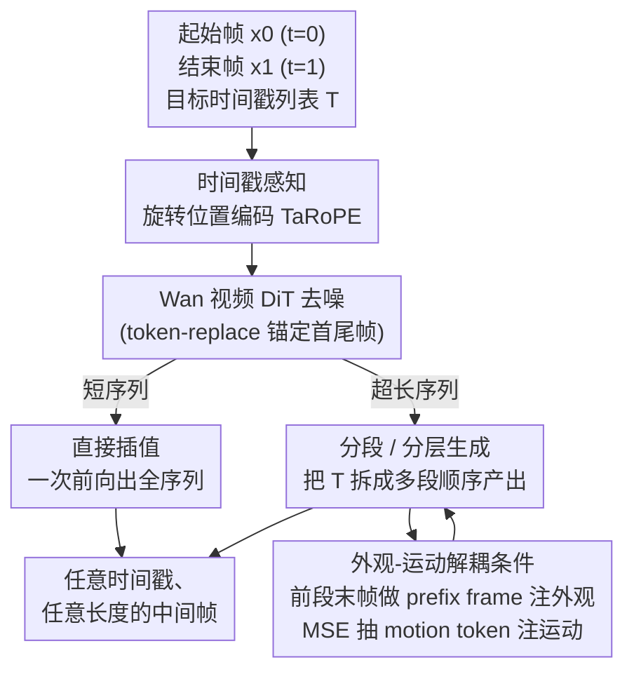

# Arbitrary Generative Video Interpolation

**会议**: ICLR 2026  
**arXiv**: [2510.00578](https://arxiv.org/abs/2510.00578)  
**代码**: [项目主页](https://mcg-nju.github.io/ArbInterp-Web/)  
**领域**: 视频理解 / 视频生成  
**关键词**: Video Frame Interpolation, Generative VFI, RoPE, Temporal Conditioning, Any-length Generation

## 一句话总结

ArbInterp 提出了一种支持任意时间戳、任意长度的生成式视频帧插值框架，通过时间戳感知旋转位置编码（TaRoPE）实现精准时间控制，并通过外观-运动解耦的条件注入策略实现长序列的无缝拼接。

## 研究背景与动机

视频帧插值（Video Frame Interpolation, VFI）是视频生成领域的基础任务，给定起始帧和结束帧，生成中间过渡帧。近年来，基于扩散模型的生成式 VFI 方法（如 DynamiCrafter、TRF、GI 等）展示了生成高质量中间帧的能力。

然而现有生成式 VFI 方法存在两个关键限制：

**固定插值数量**: 现有方法只能一次性生成固定数量的中间帧（如一次生成 7 帧或 15 帧），无法灵活调整生成帧率或总序列时长。例如，用户可能需要在两帧之间插 2 帧（2x），也可能需要插 31 帧（32x），现有方法难以统一处理。

**长序列不连贯**: 当需要大量插值帧时（如 32x 插值），直接生成长序列面临显存和质量问题。分段生成是自然的解决方案，但不同片段之间的时空连贯性难以保证，容易出现运动不自然、外观不一致等问题。

ArbInterp 的目标是构建一个统一的生成式 VFI 框架，同时解决"任意时间戳"和"任意长度"两个挑战。

## 方法详解

### 整体框架

ArbInterp 直接长在一个预训练视频扩散模型（Wan2.1-T2V-1.3B）之上，要解决的是：给定起始帧 $x_0$ 和结束帧 $x_1$，按用户指定的一串时间戳 $T=[0,t_1,\dots,t_n,1]$ 生成对应的中间帧，且时间戳数量、位置都可以任意。整条 pipeline 分两个尺度同时打通。单段内，把首尾帧的潜码用 token-replace 方式塞进去锚定边界，再用**时间戳感知旋转位置编码（TaRoPE）**把每一帧绑定到连续归一化时间戳 $t\in[0,1]$，于是 DiT 一次前向就能产出任意位置（哪怕非均匀）的中间帧。序列层面，因为 TaRoPE 把任意长度都归一到 $[0,1]$ 区间，超长插值可以拆成若干短段顺序（或分层）生成；段与段之间再用**外观-运动解耦条件**缝合，避免接缝处外观漂移和运动跳变。前者负责"任意时间戳"，后者负责"任意长度"，合起来让一个模型覆盖从 2x 到 32x 乃至更高的全部插值需求。

### 关键设计

**1. 时间戳感知旋转位置编码（TaRoPE）：让模型生成任意连续时间位置的帧**

DynamiCrafter 等方法把帧编号成离散整数索引 $0,1,2,\dots$ 喂给时间维 RoPE，模型只会依赖固定位置（如 16 帧训练时死盯着位置 0 和 15）的条件帧，结果只能产出等间距的固定帧——想单独要一帧 $t=0.3$ 的画面就无能为力。TaRoPE 抓住一个事实：在 DiT 里时间维 RoPE 是**唯一**让每帧潜码感知自身时序位置的部件，改它就能改帧的时间位置。具体做法是把 RoPE 旋转角里的离散索引换成连续时间戳——原始时间 RoPE 对第 $k$ 个潜码旋转 $\theta_k=k\,\theta_{\text{base}}$，TaRoPE 改用归一化时间戳 $t_k=\frac{k-1}{N-1}$ 当位置，旋转角变成 $t_k\,\theta_{\text{base}}$，首帧固定 $t=0$、尾帧固定 $t=1$。这样位置编码从"逐格跳跃"变成"沿时间轴连续滑动"，任意长度的视频都被归一到同一个 $[0,1]$ 连续运动场上建模，2x 和 32x 用的是同一套连续映射。它几乎不加参数，对预训练模型只需少量微调即可迁移到插值任务。

**2. 分段 / 分层推理：把任意长度拆成训练分布内的短段**

一次产出 31 帧（32x）这种长序列既撞显存、自注意力又是 $O(N^2)$、画质还随长度退化。既然 TaRoPE 把任意长度都映到 $[0,1]$，长插值就能拆成若干不超过训练上限的短段。论文给了三种自适应推理策略：短序列直接一次前向；长序列用**逐段插值**（把目标时间戳切成互不重叠的段顺序生成，实时性好，适合游戏等低延迟场景）或**分层插值**（先稀疏预测锚点帧、再在锚点间细化，更能统筹全局运动轨迹）。把长度 $N$ 拆成 $M$ 段后，自注意力复杂度从 $O(N^2)$ 降到 $O(N^2/M)$。这一步只解决"算得动"，段与段的接缝怎么不露痕迹交给下一个设计。

**3. 外观-运动解耦条件：让相邻段在外观和运动上都平滑接续**

生成模型的随机性会让相邻段的外观逐渐漂移、运动在接缝处突然跳变。最直接的做法是把前一段潜码整段拼进输入，但训练和推理开销都暴涨；只走 cross-attention 注入又会让外观一致性变弱。ArbInterp 把段间一致性拆成两条正交信号分别注入：**外观**上，仅取前一段的最后一帧当 prefix frame 放进输入，用极小代价保住视觉连续；**运动**上，用一个运动语义抽取器（Motion Semantic Extractor, MSE）从前一段的末 $N$ 帧抽出语义级 motion token——MSE 先用时序增强版 CLIP（把最后 $L$ 层改成带时间嵌入的时空全注意力）提取与文本语义对齐的时空特征，再用 Q-Former 压成固定数量的 motion token；同时对当前段的首尾帧也抽一份 in-clip motion token 对齐输入约束。两类 motion token 都经原有的 cross-attention（与文本 prompt 同一通道）注入，冻结 cross-attention 参数后 MSE 会自己学会抽出能控制视频运动的语义。外观管"长得像"、运动管"动得顺"，两路解耦后各自可控性都强过混在一起，也是长序列不累积可见退化的关键。

### 损失函数 / 训练策略

训练沿用 Wan 的流匹配（flow matching）目标 $L=\lVert v_n-u_\theta(z_n,n,y)\rVert^2$，其中 $v_n=\epsilon_n-z$、$y$ 为文本等条件。整体分三阶段：第一阶段全量微调 DiT，把生成模型迁到插值任务，输入含首尾帧、随机数量的待预测中间帧和一个可选 prefix frame；第二阶段冻结去噪网络、单独训练 MSE。训练用 OpenVid 中精选的 5 万段视频，在 8 张 96GB GPU 上微调约 2 万步即可；每次只预测 1–19 帧中间帧、首尾帧最大间隔 2 秒，配合 30–120fps 的数据让训练时间戳自然覆盖 $1/2$ 到 $1/240$，把"任意 $t$、任意长度"当成训练常态来学。

## 实验关键数据

### 评估基准

作者构建了两个综合性基准：

1. **MultiInterp Benchmark**: 多尺度帧插值评估（2x, 4x, 8x, 16x, 32x），测试模型在不同插值倍率下的泛化能力
2. **StreamInterp Benchmark**: 流式/长序列插值评估，测试分段生成时的时空连贯性

### 主实验

在 MultiInterpBench 的 2x 设置下（↓越低越好，↑越高越好）：

| 方法 | FID↓ | LPIPS↓ | CLIPimg↑ | VBench 总均分↑ |
|------|------|--------|----------|----------------|
| LDMVFI | 85.8 | 0.297 | 0.863 | 0.7928 |
| TRF | 108.5 | 0.435 | 0.879 | 0.7739 |
| GI | 90.8 | 0.496 | 0.893 | 0.7728 |
| DynamiCrafter | 83.6 | 0.249 | 0.877 | 0.7996 |
| ArbInterp-SVD | 59.1 | 0.152 | 0.902 | 0.8144 |
| **ArbInterp** | **44.9** | **0.076** | **0.913** | **0.8286** |

ArbInterp 在所有插值倍率（2x→32x）下都取得最优或次优，FID、LPIPS 等保真度指标领先尤为明显；即便换用 SVD 骨干（ArbInterp-SVD）也优于同骨干的 DynamiCrafter，说明增益主要来自 TaRoPE 与解耦条件，而非更强的底模。

### 消融实验

| 配置 | 关键指标 | 说明 |
|------|---------|------|
| w/o TaRoPE（固定位置编码） | 质量下降 | 无法适应不同倍率 |
| w/o 外观-运动解耦条件 | 段间不连贯 | 运动跳变、外观漂移 |
| 不同段长度 | 影响效率和质量权衡 | 较短段更灵活但可能累积误差 |

### 关键发现

1. **TaRoPE 的连续可控性**: 单一模型可以处理 2x 到 32x 的任意插值，无需针对每个倍率单独训练
2. **解耦条件的必要性**: 如果只用前一段末帧做条件（不区分外观和运动），长序列会出现渐进的质量退化
3. **从定量到定性的全面优势**: 在多个对比方法中，ArbInterp 不仅指标更好，视觉效果也更自然流畅

## 亮点与洞察

- **TaRoPE 方案优雅**: 将连续时间戳编码到 RoPE 中是一个简洁但有效的设计，几乎零额外参数即可实现任意时间戳控制。这个思路可以推广到其他需要连续化离散位置的生成任务。
- **解耦设计思想**: 外观一致性和运动连贯性是两个正交的需求，将它们解耦处理比混合处理更加可控。这种思路在视频编辑、视频续写等任务中也有借鉴意义。
- **实用性强**: 任意倍率 + 任意长度 = 一个模型适配所有帧插值需求，大幅降低部署复杂度。
- **基准构建**: MultiInterp 和 StreamInterp 两个 benchmark 的构建也是一个贡献，有助于后续工作的公平比较。

## 局限与展望

1. **依赖扩散模型的生成速度**: 生成式方法逐帧去噪的推理速度远慢于传统光流方法（如 RIFE、IFRNet），高倍率插值时的推理时间可能成为瓶颈
2. **分段累积误差**: 虽然有解耦条件策略，但超长序列（如 64x, 128x）下是否会出现渐进退化尚不确定
3. **场景多样性**: 从项目页面看，演示主要集中在驾驶和运动场景，复杂遮挡、场景切换等极端情况的表现未知
4. **与非生成式方法的对比**: 论文主要对比生成式 VFI 方法，与传统高效的光流 VFI 方法（RIFE 等）的全面定量对比会更有说服力
5. **训练数据需求**: 生成式模型通常需要大规模视频数据预训练，训练成本和数据来源值得关注

## 相关工作与启发

- **与 DynamiCrafter 的关系**: DynamiCrafter 是生成式 VFI 的代表方法之一，但受限于固定帧位置编码。ArbInterp 的 TaRoPE 直接解决了这个根本限制。
- **与 TRF、GI 的关系**: TRF（Time-Reversal Fusion）和 GI（Generative Interpolation）也尝试了生成式插值，但同样受固定长度约束。
- **RoPE 的时间维度扩展**: 原始 RoPE 在 LLM 中用于序列位置编码，ArbInterp 将其扩展到视频的时间维度并支持连续值，这种跨领域的技术迁移值得注意。
- **对视频生成的启发**: TaRoPE 和解耦条件策略不仅适用于帧插值，也可能对视频预测、视频续写等任务有帮助。

## 评分
- 新颖性: ⭐⭐⭐⭐
- 实验充分度: ⭐⭐⭐⭐
- 写作质量: ⭐⭐⭐⭐
- 价值: ⭐⭐⭐⭐

<!-- RELATED:START -->

## 相关论文

- [\[ICLR 2026\] DrivingGen: A Comprehensive Benchmark for Generative Video World Models in Autonomous Driving](drivinggen_a_comprehensive_benchmark_for_generative_video_world_models_in_autono.md)
- [\[ACL 2026\] TeachMaster: Generative Teaching via Code](../../ACL2026/video_generation/teachmaster_generative_teaching_via_code.md)
- [\[ICCV 2025\] MotionShot: Adaptive Motion Transfer across Arbitrary Objects for Text-to-Video Generation](../../ICCV2025/video_generation/motionshot_adaptive_motion_transfer_across_arbitrary_objects_for_text-to-video_g.md)
- [\[CVPR 2026\] Generative Neural Video Compression via Video Diffusion Prior](../../CVPR2026/video_generation/generative_neural_video_compression_via_video_diffusion_prior.md)
- [\[CVPR 2026\] PhysVid: Physics Aware Local Conditioning for Generative Video](../../CVPR2026/video_generation/physvid_physics_aware_local_conditioning_for_generative_video_models.md)

<!-- RELATED:END -->
