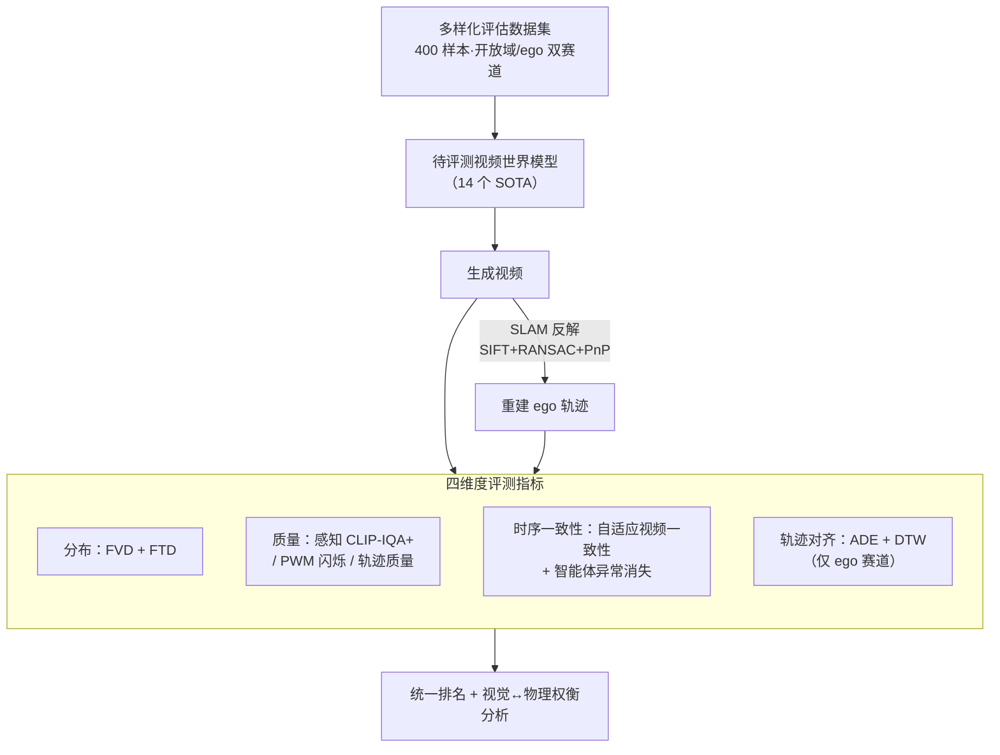

# DrivingGen: A Comprehensive Benchmark for Generative Video World Models in Autonomous Driving

**会议**: ICLR 2026  
**arXiv**: [2601.01528](https://arxiv.org/abs/2601.01528)  
**代码**: [https://drivinggen-bench.github.io/](https://drivinggen-bench.github.io/)  
**领域**: 自动驾驶 / 世界模型  
**关键词**: 视频世界模型, benchmark, 驾驶场景生成, 轨迹评估, 时序一致性

## 一句话总结
DrivingGen 提出首个面向自动驾驶视频世界模型的综合性基准，包含跨天气/地域/时间/复杂场景的多样化评估数据集和四维度评估指标体系（分布、质量、时序一致性、轨迹对齐），对 14 个 SOTA 模型的评测揭示了通用模型与驾驶专用模型之间的核心权衡。

## 研究背景与动机

**领域现状**：视频生成模型作为世界模型在自动驾驶领域快速发展，可用于未来场景预测、可扩展仿真和合成数据生成。通用模型（Kling、Sora 等）和驾驶专用模型（Vista、GEM 等）均在快速迭代。

**现有痛点**：当前评估存在四个重大缺陷：(a) 通用视频指标（FVD）忽略驾驶特有的成像问题（如 PWM 闪烁）；(b) 轨迹的物理合理性很少被量化；(c) 时序一致性评估忽略智能体级别的异常（如车辆突然消失）；(d) 轨迹可控性几乎未被评估。

**核心矛盾**：现有数据集严重偏向晴天/白天/单一城市场景（nuScenes >80% 晴天白天），无法评估模型在真实世界多样条件下的鲁棒性。缺少统一基准导致各方法的比较不公平。

**本文目标**：建立一个覆盖数据多样性、视觉质量、物理合理性、时序一致性和可控性的统一评估框架。

**切入角度**：同时从视觉视角和机器人视角评估——视频好看不够，底层轨迹还必须物理合理。

**核心 idea**：首个从视觉和机器人双视角对驾驶视频世界模型进行四维度全面评测的基准。

## 方法详解

### 整体框架
DrivingGen 要回答的问题是：怎样公平地衡量一个视频世界模型在驾驶场景下到底好不好。它把"评测"本身做成一条流水线——先用一个刻意做得多样的数据集喂给待评测模型生成视频，再从两个互补视角拆解这段视频：视觉视角直接看画面，机器人视角则先用经典 SLAM 管线（SIFT+RANSAC+PnP）从视频里反解出 ego 轨迹。视频与轨迹随后一起送进四个维度的指标——分布、质量、时序一致性、轨迹对齐（其中轨迹对齐仅在提供 ego 轨迹的赛道评测），共 11 个具体指标，最终对 14 个模型给出统一排名并分析其权衡。下面按"数据集 → 三个含新指标的维度"展开，轨迹对齐维度沿用 ADE/DTW 等标准量，不单列。

### 关键设计

**1. 多样化评估数据集：用稀有场景配比对抗"晴天白天偏倚"**

现有数据集 >80% 是晴天白天单一城市（nuScenes 即如此），模型在这种分布上看起来很强，但一遇到极端条件就露馅，评测因此严重偏倚。DrivingGen 反其道而行，刻意把晴天白天比例压到 <60%，显式塞进雪（13.1%）、雾（12.6%）、沙尘暴、洪水等极端天气，黎明/夜晚等多时段，北美/东亚/欧洲/中东/非洲等全球地理，以及密集交通、行人过马路、强行并线等复杂交互。数据集分成两个赛道服务不同目的：开放域赛道的数据来自互联网，专测对未见场景的泛化能力；ego-conditioned 赛道的数据来自 Zod、DrivingDojo、COVLA、nuPlan、WOMD 共 5 个开源驾驶数据集，并附带真实 ego 轨迹，专测轨迹可控性。每个样本含前视图像（视觉）+ Qwen 生成的场景描述（语言）+ 可选 ego 轨迹（动作）。规模定在 400 样本（每赛道 200），是在评测效率和场景覆盖度之间折中的结果。

**2. Fréchet Trajectory Distance (FTD)：把 FVD 的分布思想搬到轨迹空间**

这对应分布维度。只靠 FVD 评估视频外观是不够的——一段画面漂亮但轨迹违反物理的视频，在驾驶场景里恰恰是最危险的。FTD 借用 FVD 的分布距离思路，但作用对象从视频帧换成了轨迹：关键是要有一个能把轨迹映射到合适潜在空间的编码器，作者从运动预测领域借来 Motion Transformer (MTR) 的编码器，在该潜在空间上计算真实轨迹分布与生成轨迹分布之间的 Fréchet 距离。这是首次把 FVD 这套分布级评估迁移到轨迹评估上，让"物理合理性"也能像"视觉质量"一样被一个分布级指标量化；实验也显示 FTD 与 FVD 的排名并不一致，证明视觉分布和轨迹分布是两个独立维度。

**3. 质量维度：从"看着顺眼"补到"成像合格 + 轨迹可开"**

这对应质量维度，针对的痛点是通用感知质量分忽略了驾驶特有的成像与运动约束。DrivingGen 把质量拆成三块：感知质量沿用 CLIP-IQA+，用 CLIP 的视觉-语言表征给出与人类主观一致的打分；客观成像质量引入 IEEE Automotive P2020 标准里的 MMP (Modulation Mitigation Probability) 指标，专门量化 PWM (Pulse-Width Modulation) 引起的照明闪烁——这种闪烁会干扰真实感知与跟踪，却被通用视频指标完全无视；轨迹质量则是一个无参考的复合分，由三个子分聚合：舒适度分惩罚过大的纵向 jerk、横向加速度和 yaw-rate，运动分惩罚几乎不动的"伪静态"轨迹，曲率分惩罚之字形和不合理的急弯。三者合起来直接对准了可控性、规划和乘坐舒适度真正关心的属性。

**4. 时序一致性维度：自适应防 hack + 智能体异常消失**

这对应时序一致性维度，两个最关键的创新都在解决"以往一致性指标既好骗又看不到智能体级异常"。其一是自适应视频一致性：直接算帧间特征相似度有个漏洞——几乎不动的视频天然一致性极高，模型可以靠生成"伪静态"视频来 hack 这个分数；于是先用光流估计每帧运动量，再据此自适应下采样（运动小的视频采样更稀疏），让相邻采样帧之间的位移和正常/高速行驶可比，然后才在 DINOv3 特征上算相似度，静态视频不再占便宜。其二是智能体异常消失检测：车辆/行人凭空消失（既不在视野边缘、也没被遮挡就没了）是常见的非物理现象，却被以往评测忽略——DrivingGen 用 YOLOv10 检测、SAM2 跨帧跟踪，对每个消失的智能体取"最后可见帧 + 消失后首帧"等关键帧交给 VLM（Cosmos-Reason1）判断这次消失是否合理（离开视野/被遮挡 vs 凭空蒸发），报告"无异常消失"视频的比例。此外还在智能体裁剪框上算 DINOv3 外观一致性、在轨迹上算速度/加速度的时序稳定性，作为该维度的补充指标。

### 损失函数 / 训练策略
DrivingGen 本身是评测基准，不涉及模型训练。轨迹从生成视频中通过 SIFT+RANSAC+PnP 的经典 SLAM 管线提取。

## 实验关键数据

### 主实验
14 个模型在开放域赛道上的排名（按平均排名）：

| 模型 | 参数量 | FVD↓ | FTD↓ | 主观质量↑ | 客观质量↑ | 轨迹质量↑ | 视频一致性↑ | 智能体一致性↑ | Avg Rank |
|------|--------|------|------|----------|----------|----------|-----------|------------|----------|
| Kling 2.1 | - | 693.4 | 26.73 | 0.554 | 0.802 | 0.644 | 0.895 | 0.798 | **1** |
| Gen-3 Alpha | - | 801.0 | 93.50 | 0.546 | 0.838 | 0.654 | 0.890 | 0.817 | 2 |
| LTX-Video | 13B | 648.2 | 31.29 | 0.522 | 0.829 | 0.556 | 0.885 | 0.745 | 3 |
| Vista (驾驶专用) | 2.5B | 675.7 | 54.66 | 0.434 | **0.847** | 0.603 | 0.857 | 0.636 | 6 |
| VaViM (驾驶专用) | 1.2B | 1446.6 | 449.2 | 0.469 | **0.847** | 0.312 | **0.916** | 0.772 | 9 |

### 消融实验

| 评估维度 | 关键发现 |
|---------|---------|
| 通用 vs 驾驶专用模型 | 通用模型视觉质量高但物理一致性差；驾驶专用模型轨迹更真实但视觉质量落后 |
| 客观质量 (PWM flicker) | 驾驶专用模型在 IEEE P2020 标准上更好（更少闪烁），因训练数据含真实传感器特性 |
| 智能体消失 | 通用模型表现更好（更少异常消失），可能因训练数据规模更大、物体持久性更好 |
| 轨迹对齐 (Ego-conditioned) | Cosmos-Predict2 最好（ADE=22.38），说明物理引擎嵌入有助可控性 |

### 关键发现
- **核心权衡**：通用模型"看起来好但打破物理"，驾驶专用模型"物理对但看起来差"——两个方向尚未收敛
- Kling 2.1 在两个赛道上均排名第一，得益于商业级数据规模和训练资源
- FTD（轨迹分布距离）与 FVD（视频分布距离）排名不一致，证明视觉质量和轨迹质量是独立维度
- VaViM 虽然 FVD 最差，但智能体一致性和智能体消失指标最好，说明不同维度的评测确实揭示了不同特性

## 亮点与洞察
- **FTD 指标的提出填补了空白**：将 FID/FVD 的思想迁移到轨迹空间，用 MTR 编码器提取轨迹特征后计算 Fréchet 距离，为驾驶视频生成提供了物理层面的分布级评估。这个指标可以直接被后续工作复用。
- **自适应时序一致性防 hack 设计巧妙**：通过光流自适应下采样解决了静态视频获得虚高一致性分数的问题，这个 trick 适用于任何需要评估时序一致性的视频生成任务。
- **"四维评测"框架**提供了一个思维模板——任何生成式模型的评测都应该从分布、质量、一致性、可控性四个角度考虑，避免单一指标的误导。

## 局限与展望
- 400 样本的数据集规模对于统计置信度来说偏小
- 轨迹从生成视频中通过 SLAM 提取，引入额外噪声——理想情况应直接从模型获取轨迹
- 缺少下游任务评估（如用生成视频训练规划器后的闭环性能）
- 商业闭源模型（Kling、Gen-3）无法做公平的效率比较

## 相关工作与启发
- **vs VBench**: VBench 是通用视频评测，缺少轨迹评估和驾驶特定指标；DrivingGen 针对驾驶场景设计了完整评测体系
- **vs WorldScore (Duan et al., 2025)**: WorldScore 关注通用场景一致性，DrivingGen 增加了智能体级一致性、轨迹质量和可控性评估
- **vs DrivingDojo/Driverse**: 这些工作仅覆盖评测的部分维度，DrivingGen 是首个全面覆盖的基准

## 评分
- 新颖性: ⭐⭐⭐⭐ 评测体系设计新颖（FTD、自适应一致性、智能体消失检测），但作为基准论文缺乏方法创新
- 实验充分度: ⭐⭐⭐⭐⭐ 14 个模型的全面对比，包含商业和开源模型，不同赛道和维度
- 写作质量: ⭐⭐⭐⭐⭐ 问题分析清晰，指标设计有理有据，结果呈现系统化
- 价值: ⭐⭐⭐⭐⭐ 填补了驾驶视频世界模型评测的空白，揭示了"视觉好看≠物理合理"的关键洞察

<!-- RELATED:START -->

## 相关论文

- [\[CVPR 2026\] VABench: A Comprehensive Benchmark for Audio-Video Generation](../../CVPR2026/video_generation/vabench_a_comprehensive_benchmark_for_audio-video_generation.md)
- [\[CVPR 2026\] ActivityForensics: A Comprehensive Benchmark for Localizing Manipulated Activity in Videos](../../CVPR2026/video_generation/activityforensics_a_comprehensive_benchmark_for_localizing_manipulated_activity_.md)
- [\[CVPR 2026\] Inference-time Physics Alignment of Video Generative Models with Latent World Models](../../CVPR2026/video_generation/inference-time_physics_alignment_of_video_generative_models_with_latent_world_mo.md)
- [\[CVPR 2026\] RecEdit-Drive: 3D Reconstruction-Guided Spatiotemporal Video Editing for Autonomous Driving Scenes](../../CVPR2026/video_generation/recedit-drive_3d_reconstruction-guided_spatiotemporal_video_editing_for_autonomo.md)
- [\[ACL 2025\] VidCapBench: A Comprehensive Benchmark of Video Captioning for Controllable Text-to-Video Generation](../../ACL2025/video_generation/vidcapbench_a_comprehensive_benchmark_of_video_captioning_for_controllable_text-.md)

<!-- RELATED:END -->
