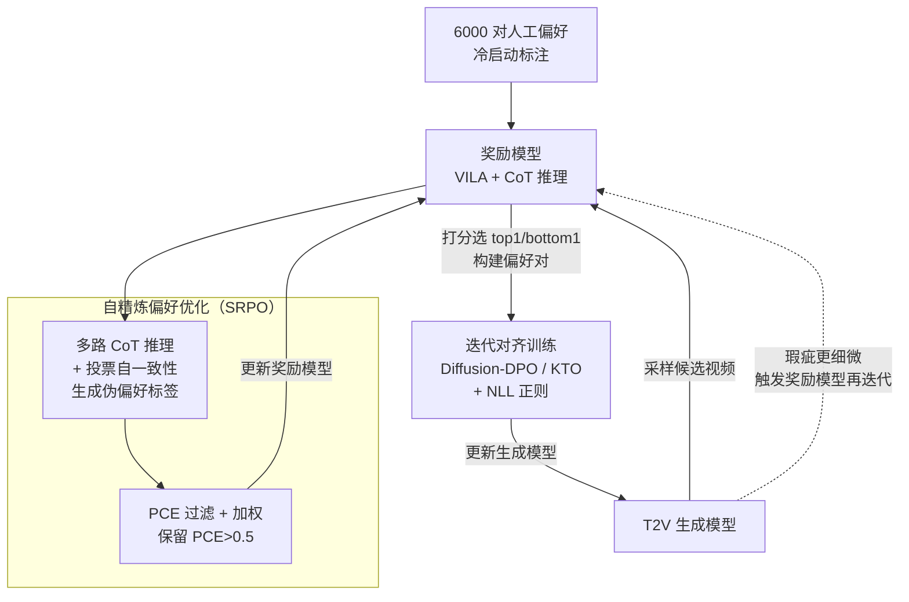

# Dual-IPO: Dual-Iterative Preference Optimization for Text-to-Video Generation

**会议**: ICLR 2026  
**arXiv**: [2502.02088](https://arxiv.org/abs/2502.02088)  
**代码**: [https://github.com/SAIS-FUXI/IPO](https://github.com/SAIS-FUXI/IPO)  
**领域**: 扩散模型 / 视频生成  
**关键词**: 偏好优化, 视频生成, 奖励模型, DPO, 迭代训练  

## 一句话总结

提出 Dual-IPO 框架，通过在奖励模型和视频生成模型之间进行多轮双向迭代优化，无需大量人工标注即可持续提升文本到视频生成的质量和人类偏好对齐，甚至让 2B 模型超越 5B 模型。

## 研究背景与动机

**视频生成模型的局限**：尽管 DiT 架构推动了视频生成的巨大进步，现有模型在主体一致性、运动流畅性和美学质量方面仍无法满足用户期望

**偏好学习的数据瓶颈**：DPO/KTO 等后训练方法需要大量人工标注的偏好数据，构建成本极高

**外部奖励模型的分布不匹配**：现有通用奖励模型（如 VideoScore、VideoAlign）在不同视频生成模型之间存在显著的分布偏移，导致奖励信号不可靠

**静态偏好数据的过拟合问题**：在固定离线偏好数据集上训练容易导致模型过拟合甚至崩溃

**奖励信号需要与模型共同演进**：随着训练进行，生成瑕疵变得更细微，固定奖励模型会产生偏差

**小规模模型的潜力未被充分挖掘**：通过有效的后训练策略，小模型理论上可以接近或超越更大模型的性能

## 方法详解

### 整体框架

Dual-IPO 要解决的核心矛盾是：偏好优化的天花板取决于奖励模型，而固定的外部奖励模型会随着生成质量提升越来越"跟不上"——早期还能挑出明显瑕疵，到后期瑕疵变细微就开始误判，把生成模型带偏。Dual-IPO 的做法是不把奖励模型当成静态裁判，而是让它和生成模型在多轮迭代里**互相喂养**：后训练被拆成两个交替推进的环节。第一个环节是**自精炼偏好优化（SRPO, Self-Refined Preference Optimization）**，用少量人工标注冷启动一个 VLM 奖励模型，之后让它自己生成伪偏好标签、自我打磨判别力；第二个环节是**迭代对齐训练**，用当前奖励模型的打分构建偏好对去优化文生视频（T2V）模型。每完成一轮，更强的生成模型会产出更细微的瑕疵，反过来逼奖励模型再走一轮 SRPO 继续进化，从而绕开固定离线奖励带来的分布漂移。

### 关键设计

**1. 自精炼偏好优化（SRPO）：让奖励模型在几乎零人工标注下自我进化**

通用奖励模型在不同生成模型间存在分布偏移、判别不可靠，单纯靠堆人工标注又太贵。SRPO 把奖励模型的精炼做成一个自迭代闭环：先用少量 Chain-of-Thought（CoT）标注冷启动，解锁 VLM 的结构化推理能力，把"哪个视频更好"拆成可解释的打分理由；再用投票式自一致性机制——对同一对样本走多条 CoT 推理路径、按答案频率聚合——自动生成稳定的伪偏好标签，压掉单条路径的随机噪声。关键是不盲信这些伪标签：作者用偏好确定性估计器（PCE, Preference Certainty Estimator）来过滤，它衡量优胜样本的隐式奖励超过数据集均值的概率 $\text{PCE}(y_w \mid x) = \mathbb{P}_\theta\!\left(R(y_w \mid x) > Q\right)$，其中隐式奖励借用 DPO 公式 $R(y\mid x) = \log \frac{\pi_\theta(y\mid x)}{\pi_{\text{ref}}(y\mid x)}$、$Q$ 是当前数据集的平均奖励，只保留 $\text{PCE} > 0.5$ 的高置信样本。最后 PCE 不只是过滤阈值，还被当作样本权重乘进训练目标 $\mathcal{L}_{\text{SRPO}}(\theta) = \mathbb{E}_{x,y_w,y_l}\!\left[\text{PCE}(y_w \mid x) \cdot \mathcal{L}_{\text{DPO}}(\theta)\right]$——越确信的偏好对贡献越大，越模糊的样本影响越小。这样仅需 6000 对人工偏好启动（每轮再自产约 20K 伪标签），既省掉大规模标注，又避免低质伪标签污染奖励模型，让它的判别力随训练稳步增强。

**2. 迭代对齐训练：用闭环反馈持续优化生成模型并抑制过拟合**

在固定离线偏好数据集上训练扩散模型容易过拟合甚至崩溃，而只做一次对齐又吃不满奖励模型的潜力。这一环节把生成模型和奖励模型串成闭环：每轮迭代先用当前 T2V 模型为每条 caption 采样多个候选（实现里 8 个），由奖励模型打分、取 top-1/bottom-1 组成偏好对（每轮约 100K 对），再据此更新生成模型；当检测到性能退化或损失异常时，自动触发一次 SRPO 去更新奖励模型。对齐目标同时支持成对偏好的 Diffusion-DPO 和逐点偏好的 Diffusion-KTO，适配不同标注格式。为抑制过拟合，DPO 损失额外加了两个负对数似然（NLL）正则项，一项作用在生成的优胜样本上、一项作用在真实视频上：$\mathcal{L}_{\text{total}}^{\text{DPO}} = \mathcal{L}_{\text{dpo}} + \lambda_1 \cdot \mathbb{E}_{\mathcal{D}^{\text{sample}}}[-\log p_\theta(y^w \mid x)] + \lambda_2 \cdot \mathbb{E}_{\mathcal{D}^{\text{real}}}[-\log p_\theta(y \mid x)]$。其中真实视频项（来自 VidGen-1M）相当于把生成分布往自然数据上拉，避免模型在自采样数据里越走越偏；逐点的 Diffusion-KTO 也用真实数据做同样的正则。

## 实验关键数据

| 模型 | Total Score | Quality Score | Semantic Score |
|------|-------------|---------------|----------------|
| CogVideoX-2B (基线) | 80.91 | 82.18 | 75.83 |
| CogVideoX-2B + IPO-3轮 | 82.74 | 83.92 | 78.00 |
| CogVideoX-5B (基线) | 81.61 | 82.75 | 77.04 |
| CogVideoX-5B + IPO-3轮 | 84.63 | 85.40 | 81.54 |
| Wan-1.3B (基线) | 84.26 | 85.30 | 80.09 |
| Wan-1.3B + IPO-3轮 | 86.28 | 86.38 | 85.87 |

| 奖励模型 | 人类偏好准确率 | VBench 提升 |
|----------|----------------|-------------|
| VideoScore | 63.58% | 80.87 (下降) |
| VideoAlign | 65.21% | 81.27 |
| VisionReward | 68.44% | 81.31 |
| **Ours** | **81.33%** | **81.54** |

**亮点结果**：2B CogVideoX 经过 Dual-IPO 后在 VBench 上超越 5B 基线（82.74 vs 81.61）；Wan-1.3B 经过 5 轮迭代达到 88.32，超越 Sora（84.28）。

## 亮点与洞察

1. **双迭代闭环设计**：奖励模型和生成模型互相促进，避免了静态奖励的分布漂移问题
2. **数据高效**：仅需 6000 对人工标注启动，远少于其他奖励模型的训练数据量
3. **灵活的偏好策略**：同时支持 DPO 和 KTO，适配不同数据格式
4. **跨架构泛化**：在 CogVideoX（cross-attention DiT）和 Wan（MMDiT）两种架构上均有效
5. **"小模型打败大模型"**：验证了后训练策略的巨大潜力

## 局限与展望

1. 训练成本仍然较高（128 GPU × 两周/轮），难以快速迭代
2. PCE 阈值的设定（0.5）缺乏理论依据，可能需要场景化调整
3. 奖励模型依赖 VLM（VILA 13B/40B），引入额外的计算和存储开销
4. 未探索更细粒度的质量维度（如物理合理性、因果一致性）
5. 迭代次数增多后性能增益递减，缺乏对收敛行为的深入分析

## 相关工作与启发

- **Diffusion-DPO**（Wallace et al.）：将 DPO 扩展到扩散模型，本文在此基础上加入迭代优化
- **InstructVideo**：提出时间衰减奖励，但增益有限；本文通过迭代可获得更大提升
- **RLHF for LLM**：借鉴 LLM 领域的打分 + 对齐范式，但创新性地引入了奖励模型的自我迭代
- 启发：奖励模型的质量是偏好优化的瓶颈，自训练范式或许可以推广到图像生成等更多领域

## 评分

- 新颖性: ⭐⭐⭐⭐ — 双迭代闭环设计和 PCE 机制具有创新性
- 实验充分度: ⭐⭐⭐⭐⭐ — 多架构、多尺度、多轮迭代消融实验非常充分
- 写作质量: ⭐⭐⭐⭐ — 结构清晰，公式推导完整
- 价值: ⭐⭐⭐⭐ — 对视频生成后训练有很强的实践指导意义

<!-- RELATED:START -->

## 相关论文

- [\[ICLR 2026\] JavisDiT++: Unified Modeling and Optimization for Joint Audio-Video Generation](javisdit_unified_modeling_and_optimization_for_joint_audio-video_generation.md)
- [\[ICML 2026\] LuVe: Latent-Cascaded Ultra-High-Resolution Video Generation with Dual Frequency Experts](../../ICML2026/video_generation/luve_latent-cascaded_ultra-high-resolution_video_generation_with_dual_frequency_.md)
- [\[ICCV 2025\] V.I.P.: Iterative Online Preference Distillation for Efficient Video Diffusion Models](../../ICCV2025/video_generation/vip_iterative_online_preference_distillation_for_efficient_video_diffusion_model.md)
- [\[ICCV 2025\] Dual-Expert Consistency Model for Efficient and High-Quality Video Generation](../../ICCV2025/video_generation/dual-expert_consistency_model_for_efficient_and_high-quality_video_generation.md)
- [\[NeurIPS 2025\] DenseDPO: Fine-Grained Temporal Preference Optimization for Video Diffusion Models](../../NeurIPS2025/video_generation/densedpo_finegrained_temporal_preference_optimization_for_vi.md)

<!-- RELATED:END -->
